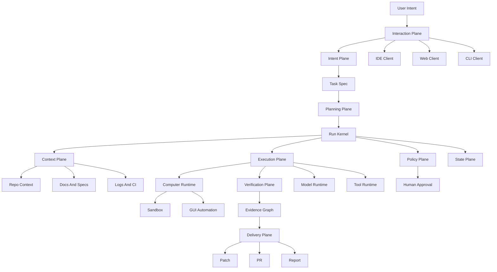

# Agentic Engineering OS 工程设计

## 1. 系统本质

这个系统不应该被定义成“多 IDE 控制器”，也不应该只是一个更大的 AI chat。它的终极形态应该更像一个面向工程任务的操作系统：

> Agentic Engineering OS：接收人的工程意图，把它转化为可调度、可审计、可恢复、可验证、可交付的任务执行系统。

这里的“操作系统”不是替代 Windows/Linux/macOS，而是像 OS 一样提供底层能力：

- 管理任务
- 管理资源
- 调度执行
- 控制权限
- 隔离环境
- 记录状态
- 处理失败
- 验证结果
- 交付产物

它真正要解决的是：

> 一个工程任务从提出、理解、执行、验证、审批、交付，到失败恢复，如何被系统化管理。

现在 IDE 里的 agentic workflow 把很多能力混在一起：

- Chat UI
- 上下文收集
- 模型规划
- 工具调用
- 文件修改
- terminal 执行
- diff 展示
- 人工确认
- 结果交付

短期看这些能力被 IDE 包住，所以我们会以为问题是“如何控制多个 IDE”。长期看，真正有价值的是中间的 workflow runtime。IDE 只是入口、展示层和部分能力提供者。

因此最终目标是：

- 任务可以从 IDE、CLI、Web、Chat、CI 进入。
- 系统能把自然语言任务变成结构化 `Run`。
- 每一步执行都有状态、事件、权限、上下文来源和输出证据。
- 失败后可以定位、重试、恢复，而不是重新开一轮 chat。
- 最后交付的是结构化 artifact，而不是一段不可追溯的回答。

一句话：把工程师每天隐式完成的工作流，显式建模成一个可执行、可观察、可恢复的系统。

## 2. 终局产品形态

终极体验不是“打开某个 IDE 再让 AI 帮忙”，而是：

```text
你表达目标
系统生成任务规格
系统规划和调度执行
系统收集上下文和证据
系统调用工具和 agent
系统验证结果
你只在关键节点审批
系统交付可追溯产物
```

例如用户说：

```text
帮我确认 Orion LSC m2b LEC regression 是否通过，并通知相关人。
```

系统应该完成：

- 找到正确 workspace、regression run、summary 和 log。
- 判断是否 all passed。
- 检查是否存在 warning、waived error、incomplete job、环境异常。
- 生成证据链。
- 生成英文汇报邮件。
- 等待用户确认。
- 发送、保存或复制交付内容。
- 保存这次任务的 run history、evidence 和 artifact。

普通 AI 助手是“你问一句，它答一句”。这个系统应该是“你交代目标，它管理完整执行周期”。

核心执行链路：

```text
Intent -> Spec -> Plan -> DAG -> Step -> ToolCall -> Observation -> Evidence -> Artifact -> Delivery
```

其中 `Spec` 和 `Evidence` 是这个系统区别于普通 agent 的关键。

## 3. 操作系统式分层

```text
Interaction Plane
IDE / CLI / Web / Slack / CI

Intent Plane
需求澄清、任务规格、成功标准、约束提取

Planning Plane
任务拆解、依赖图、执行策略、风险预估

Context Plane
代码、log、docs、issues、CI、memory、symbol graph、引用来源

Execution Plane
模型、工具、shell、browser、git、CI、workspace worker

Computer Runtime Layer
sandbox、desktop control、screen observation、GUI automation、trajectory capture

Policy Plane
权限、审批、sandbox、secret control、危险操作拦截

State Plane
event log、run state、step state、resume、replay、audit

Verification Plane
测试、lint、review、evidence check、artifact validation

Delivery Plane
patch、PR、email、ticket、report、release note

Evaluation Plane
成功率、失败原因、成本、耗时、人工介入点、改进反馈
```

## 4. 核心架构



## 5. Agentic Engineering OS 的内核能力

### 5.1 Task Kernel

管理所有工程任务的生命周期。任务不是 chat message，而是有目标、状态、步骤、证据、交付物和审批记录的系统对象。

### 5.2 Scheduler

决定任务执行顺序、并发度、资源占用和等待条件。未来多个 agent、多个 workspace、多个 regression 或 CI 任务并行时，必须有调度层。

### 5.3 Context Manager

管理代码、log、文档、issue、历史记忆、symbol graph、CI 输出。它负责把“可能相关的一切”变成“当前任务真正需要的上下文”。

### 5.4 Capability Runtime

统一调用 shell、git、IDE、browser、CI、Jira、email、CUA、sandbox 等能力。上层 workflow 不直接依赖具体工具。

### 5.5 Permission System

控制哪些操作可以自动执行，哪些需要审批，哪些必须禁止。它负责把 agent 的能力限制在安全边界内。

### 5.6 Sandbox Manager

危险任务、GUI 操作、未知脚本、批量修改、外部依赖测试应该优先在隔离环境里运行。`trycua/cua` 这类项目可以成为这一层的重要执行基座。

### 5.7 State Store

保存 run、step、tool call、approval、artifact、evidence。任务中断后可以 resume，失败后可以 replay 和 debug。

### 5.8 Evidence Graph

每个结论都必须能追溯到来源：哪个 log、哪个命令、哪个 commit、哪个测试、哪个人工审批、哪个文件片段。

### 5.9 Verifier Runtime

Agent 不能自己说完成就算完成。Verifier 负责测试、lint、review、log 检查、artifact validation 和证据一致性检查。

### 5.10 Artifact Manager

管理最终交付物：patch、PR、报告、邮件、ticket、测试结果、decision record。交付物应该独立于 chat history 长期存在。

### 5.11 Human Gate

人不应该全程盯着 agent，而是在关键节点介入：批准 patch、确认风险、选择方向、发送邮件、开 PR。

### 5.12 Learning And Evaluation Loop

记录任务成功率、失败原因、耗时、成本、人工介入点和用户修改，逐步形成个人或团队的工程偏好和工作流经验。

## 6. 五个核心内核

### 6.1 Run Kernel

Run Kernel 是系统大脑，负责管理一次任务的生命周期。

任务不是一句 prompt，而是一个 `Run`：

```typescript
type RunStatus =
  | "created"
  | "planning"
  | "waiting_context"
  | "running"
  | "waiting_approval"
  | "verifying"
  | "completed"
  | "failed";

type Run = {
  id: string;
  task: string;
  workspaceId: string;
  status: RunStatus;
  steps: Step[];
  events: RunEvent[];
  artifacts: Artifact[];
};
```

关键原则：所有事情都事件化。

- 模型生成了什么计划，记录为 event。
- 调用了什么工具，记录输入、输出、耗时、错误。
- 用户批准或拒绝了什么，记录审批事件。
- 生成了什么 diff、报告、邮件草稿，记录 artifact。

只有 event log 存在，系统才有恢复、审计、回放、debug 的基础。

### 6.2 Capability Runtime

Agent 不应该直接操作 IDE、shell、git、浏览器，而应该调用标准能力。

```typescript
type Capability = {
  name: string;
  permission: "read" | "write" | "dangerous";
  sideEffect: boolean;
  timeoutMs: number;
  inputSchema: unknown;
  outputSchema: unknown;
  execute(input: unknown, context: RunContext): Promise<unknown>;
};
```

第一批标准能力：

- `search_code`
- `read_file`
- `read_log`
- `run_command`
- `run_test`
- `get_git_status`
- `apply_patch`
- `show_diff`
- `open_file`
- `summarize_log`
- `create_email_draft`
- `request_approval`

这样 workflow 不知道底层是 Cursor、VS Code、shell、CI 还是云端 worker，它只知道自己要调用一个 capability。

### 6.3 Context Broker

很多 agentic workflow 失败，不是模型不够聪明，而是上下文错了。Context Broker 专门负责上下文选择。

它要做的事情：

- 根据任务判断需要 repo、log、docs、issue、CI 还是 terminal 输出。
- 从不同 adapter 取信息。
- 压缩成可控的 `ContextPack`。
- 保留引用来源，方便最后解释依据。
- 控制 token budget，避免无关内容污染模型。

```typescript
type ContextPack = {
  purpose: string;
  sources: {
    type: "file" | "log" | "command" | "doc" | "issue";
    uri: string;
    excerpt: string;
    relevance: number;
  }[];
};
```

专业的系统不能把“找上下文”当成 prompt 技巧，而要把它做成一层可观测、可调试的 broker。

### 6.4 Policy And Approval Engine

只要系统能执行命令、改代码、发邮件、开 PR，就必须有权限层。

每个 capability 都要声明风险等级：

- `read_file`：只读，默认允许。
- `search_code`：只读，默认允许。
- `run_test`：低风险写操作，可配置自动允许。
- `apply_patch`：写操作，需要确认。
- `delete_file`：危险操作，强制确认。
- `send_email`：外部副作用，必须人工批准。
- `git_push`：外部副作用，必须人工批准。

Control plane 和普通 agent 的区别在这里：它不只是会干活，还知道什么时候不能直接干。

### 6.5 Artifact System

最终交付物不能只是聊天文本，而应该是结构化 artifact：

- `PatchArtifact`
- `TestResultArtifact`
- `LogSummaryArtifact`
- `RegressionResultArtifact`
- `EmailDraftArtifact`
- `PRArtifact`
- `ReportArtifact`
- `DecisionRecordArtifact`

比如“Orion LSC m2b LEC regression 全部通过”这个场景，系统不应该只给一句英文邮件，而应该产出：

- `RegressionResultArtifact`：通过依据、log 来源、命令或报告来源。
- `EmailDraftArtifact`：给相关人的英文汇报邮件。
- `RunEvidenceArtifact`：这次结论引用了哪些证据。

这样交付物才可复用、可追溯、可审计。

## 7. Intent-to-Spec 是第一关键层

很多 agent 系统直接从 prompt 进入 action，这是不稳定的。专业工程系统应该先把模糊需求转成 `TaskSpec`。

```typescript
type TaskSpec = {
  goal: string;
  workspace: string;
  constraints: string[];
  allowedActions: string[];
  forbiddenActions: string[];
  successCriteria: string[];
  requiredEvidence: string[];
  approvalPoints: string[];
  expectedArtifacts: string[];
};
```

例如用户说：

```text
帮我确认 regression 是否通过，并通知相关人。
```

系统应该先形成规格：

- 目标：确认指定 regression 的完成状态和 pass/fail 结果。
- 成功标准：找到可信 summary 或 log，并确认所有 test passed。
- 必需证据：regression summary、时间戳、workspace 或 run id、失败数量。
- 禁止动作：未经批准不得发送邮件，不得删除或修改 log。
- 预期交付：结果摘要、英文邮件草稿、证据引用。
- 审批点：发送邮件前需要用户确认。

没有 `TaskSpec`，agent 很容易直接行动、跑偏、或者给出不可验证结论。

## 8. Evidence 是第二关键层

系统不能只输出“all passed”。它必须能说明：

- 结论来自哪个 log 或 summary。
- 哪个命令产生了这个结果。
- 什么时候产生的。
- 对应 workspace / git revision / regression id 是什么。
- 有没有 warning、waiver、incomplete job 被忽略。
- 是否通过 verifier 检查。

`Evidence Graph` 应该连接：

```text
Run -> Step -> ToolCall -> Observation -> Evidence -> Artifact -> Delivery
```

这样每个结论都能被复查，每个 artifact 都有来源。

## 9. 与 trycua/cua 的关系

`trycua/cua` 的定位是 open-source infrastructure for Computer-Use Agents。它提供 sandboxes、SDK、driver、benchmark，让 agent 能控制完整桌面系统，包括 macOS、Linux、Windows、Android。

它解决的是：

```text
Agent 怎么使用一台电脑
```

我们要解决的是：

```text
Agent 怎么可靠地完成一个工程工作流
```

两者不是竞争关系，而是上下层关系：

```text
CUA = Computer Runtime / Sandbox / GUI Automation / Trajectory Layer
Agentic Engineering OS = Engineering Task Kernel / Policy / State / Evidence / Verification / Delivery Layer
```

应该借鉴 `CUA` 的点：

- Sandbox-first：危险操作优先在隔离环境执行。
- Trajectory recording：agent 操作应该可回放，和 event log / evidence graph 对齐。
- Cross-OS abstraction：不要绑定某个 IDE 或 OS。
- Benchmark mindset：agentic workflow 需要评估集和成功率。
- Background operation：agent 执行不应该打断用户当前工作。

在我们的架构里，`CUA` 可以作为 `Computer Runtime Layer` 的一个 adapter：

```text
Run Kernel
  -> Capability Runtime
    -> CUA Adapter
      -> Sandbox / Desktop / GUI App / Screenshot / Mouse / Keyboard / Shell
```

也就是说，不要重做 `CUA`。应该把它作为底层 computer-use / sandbox / trajectory runtime，在它上面构建工程任务的 control plane、policy、evidence、verification 和 delivery。

## 10. 必须标准化的对象

第一批不要围绕 IDE 设计，而要围绕 workflow 设计：

- `Task`：用户想完成什么，包括目标、workspace、约束、成功标准。
- `TaskSpec`：从意图提炼出的可执行规格，包括允许动作、禁止动作、成功标准、证据要求和审批点。
- `Run`：一次任务执行实例，包括 plan、steps、状态、事件流、结果和 artifact。
- `Step`：可执行的最小动作，比如搜索代码、跑测试、改文件、请求确认。
- `RunEvent`：系统发生过什么，包括模型输出、工具调用、审批、错误、结果。
- `Capability`：系统能调用的标准能力，比如 `read_context`、`run_command`、`apply_patch`、`run_test`、`show_diff`。
- `Adapter`：把标准能力映射到真实工具，比如 IDE adapter、shell adapter、git adapter、browser adapter、CI adapter。
- `ContextPack`：给模型的一组经过筛选的上下文，而不是把整个 repo 塞进去。
- `Evidence`：支持某个结论的证据节点，包括来源、时间、命令、内容摘要和可信度。
- `Artifact`：交付物，比如 diff、log summary、PR、report、email draft。

## 11. IDE 里的功能如何迁移出来

现在 IDE 里的 agentic workflow 大概包含这些能力：读文件、搜索代码、跑 terminal、看 diagnostics、应用 patch、展示 diff、问用户确认、运行测试。

迁移方式不是“远程控制 IDE”，而是把它们变成标准能力：

- `open_file`：IDE adapter 实现，也可以由 Web UI 实现。
- `read_context`：repo index、LSP、semantic search 实现。
- `get_diagnostics`：LSP adapter 或 IDE extension 实现。
- `run_test`：shell/CI adapter 实现。
- `apply_patch`：workspace adapter 实现。
- `show_diff`：IDE/Web/Git adapter 都可以实现。
- `request_human_approval`：IDE、Web、Slack、CLI 都可以承载。

这样 IDE 不再是大脑，只是能力提供者和展示前端之一。

## 12. 分阶段实现

### Phase 1：Read-only Regression Evidence Demo

第一版不要先实现完整 `Local Workflow Daemon`，而是分成两个 gate：先用 deterministic static fixture runner 验证 Evidence / Verifier / Artifact 契约，再把同一套 schema 迁入本地 read-only runner。

#### Phase 1a：Static Fixture Contract

目标：在零 IDE、零 CUA、零 CI、零 SQLite daemon 的条件下，先证明系统能把固定 regression observation 变成可复查的 evidence、artifact 和 verifier verdict。

最小输入：

- 一个提交到仓库或研究 fixtures 目录中的固定 regression log fixture。
- 可选 `fixture_meta.json`：记录 fixture id、来源说明、hash、run id、时间戳和人工标注期望。
- 可选 `task_spec.fixture.json`：用模板化 TaskSpec 代替 LLM 生成，避免第一步被 Intent-to-Spec 不确定性拖住。

固定输出：

- `run.json`：记录 task、模板 TaskSpec、steps 和最终状态。
- `events.jsonl`：append-only 事件视图，每条至少包含 event id、step id、type、timestamp、causal refs。
- `evidence.json`：记录 log 片段、来源、line range、classification、confidence 和 evidence id。
- `regression_result.json`：只保存提取器的结构化候选结论，包括 passed/failed/incomplete/warning/unknown。
- `email_draft.md`：只允许引用 `regression_result.json` 和 evidence ids，不允许重新自由断言结果。
- `verifier_report.json`：唯一权威 verdict，记录 overall_status、checks、blocking failures、触发规则 id、引用的 evidence ids 和 fixture hash。

Phase 1a 验收：

- 所有 JSON artifact 通过版本化 schema validation。
- `verifier_report.json` 至少包含 `schema_validation`、`evidence_refs`、`classification_consistency`、`email_draft_uses_structured_facts` 四类 check。
- 至少覆盖 `all passed`、`failed`、`incomplete`、`warning/waiver`、`ambiguous` 五类 fixture；负例必须输出 `unknown`、`needs_human_check` 或 FAIL，不能伪造通过。
- Phase 1a 不引入 SQLite、daemon、真实 log adapter、Capability registry、CUA、Browser-use、E2B、Temporal 或 LangGraph。

Build vs Integrate：

- Build：Run/Event/Evidence/Artifact schema、fixture harness、rule-based verifier、`verifier_report.json` 契约。
- Integrate / Defer：JSON Schema 或等价校验库可直接使用成熟实现；SQLite、真实 adapter、workflow backend、computer runtime 和 LLM TaskSpec 生成全部后移。

#### Phase 1a 范围切线：反方评审后的最小可执行路径

Feasibility Critic 结论：Phase 1a 的第一个可执行切片不是 daemon、SQLite、CLI 产品入口或 LLM workflow，而是一个 deterministic fixture contract gate。它只需要证明同一批固定输入能稳定生成同一类 artifact，并且 verifier 能拒绝负例。

最小执行边界：

- 第一批 fixture 先用合成日志，不等待真实脱敏 regression log；真实脱敏样例只作为 Phase 1a 通过后的校准数据。
- 入口先是固定脚本或测试命令，不要求正式 CLI UX；CLI 进入 Phase 1b。
- 不引入 SQLite；`events.jsonl` 和磁盘 JSON artifact 足够证明 event/evidence/artifact 语义。
- 不引入 LLM；`task_spec.fixture.json` 使用模板化字段，邮件草稿只能从 `regression_result.json` 转述。
- 不实现 capability registry；Phase 1a 的 `read_log`、`extract_regression_result`、`write_artifact` 可以先作为 fixture harness 内部步骤。

建议的 research fixture layout（本轮只定义契约，不新增产品代码）：

```text
fixtures/regression/
  all_passed.log
  failed_tests.log
  incomplete_jobs.log
  passed_with_warning_or_waiver.log
  ambiguous_summary.log
  fixture_meta.json
  task_spec.fixture.json
  expected/
    verifier_report.expected.json
```

验收顺序固定为：

```text
schema validation
  -> extraction consistency
  -> evidence reference check
  -> verdict precedence rules
  -> email grounding check
  -> verifier_report overall_status
```

停止条件：

- 五类 fixture 中任一负例需要靠人工解释才能避免误判为 `passed`，先收缩规则表或 fixture 表达，不进入 Phase 1b。
- 如果邮件草稿生成阶段能绕过 `regression_result.json` 产生新结论，先修 verifier，不进入 runner/daemon。
- 如果 `lineRange` 无法稳定取得，v1 仍不新增复杂 locator；必须用 `fixture_hash` + exact `excerpt` 保证可复查。

#### Phase 1b：Local Read-only Runner

在 Phase 1a schema 和 verifier 绿灯后，再实现一个 read-only 证据闭环 demo：

- 输入：一个固定 regression summary/log 路径 + 用户目标。
- 流程：生成 `TaskSpec` -> 读取 log -> 提取 pass/fail/warning/incomplete -> 生成 Evidence list -> 规则验证 -> 生成英文邮件草稿 artifact。
- 输出：`run.json`、`events.jsonl`、`evidence.json`、`regression_result.json`、`email_draft.md`、`verifier_report.json`。

建议最小组件：

- `run.json` + append-only `events.jsonl` 文件输出；SQLite event store 只在 fixture gate 通过后进入下一步
- 极简 step runner
- `read_log` capability
- `extract_regression_result` capability
- `write_artifact` capability
- policy gate：禁止外部副作用，只允许读取和生成草稿
- rule verifier
- artifact writer

成功标准：不用依赖 IDE，也不用修改任何代码，就能证明“结论来自哪里、是否被验证、交付物引用了哪些证据”。

### Phase 2：Intent-to-Spec 和任务规格化

先不要让 agent 直接行动。每个自然语言任务先生成 `TaskSpec`：

- 目标
- workspace
- 约束
- 允许动作
- 禁止动作
- 成功标准
- 必需证据
- 审批点
- 预期 artifact

成功标准：同一个任务在执行前能被用户或系统审查，避免一上来就跑偏。

### Phase 3：能力接口标准化

定义统一 capability 接口：

```typescript
interface Capability<I, O> {
  name: string;
  permission: "read" | "write" | "dangerous";
  sideEffect: boolean;
  timeoutMs: number;
  inputSchema: unknown;
  outputSchema: unknown;
  execute(input: I, context: RunContext): Promise<O>;
}
```

目标 capability catalogue：

- `read_file`
- `search_code`
- `run_command`
- `get_git_status`
- `apply_patch`
- `run_test`
- `summarize_log`
- `request_approval`

Phase 1a 只把这三个名字实现为同进程 deterministic functions；Phase 1b+ 才评估是否升级为 capability：

- `read_log`
- `extract_regression_result`
- `write_artifact`

成功标准：Phase 1a 先用最小 read-only function 子集验证 contract 是否成立；fixture gate 通过后，workflow 才需要不知道底层是 IDE、shell 还是云端 worker，只调用标准 capability。

### Phase 4：Context Broker

把上下文收集从 prompt 里拆出来：

- repo 文件和 symbol 检索
- log 和 regression summary 检索
- docs 和 issue 检索
- terminal 和 CI 输出收集
- ContextPack 生成
- 引用来源保存

成功标准：模型拿到的是经过筛选、带来源、可解释的上下文，而不是一堆无关文件。

### Phase 5：Evidence List 和 MVP Verifier Runtime

MVP 不先实现完整图数据库或复杂 Evidence Graph，而是先实现 Evidence list：

- `LogEvidence`：来自 regression log 或 summary 的片段。
- `CommandEvidence`：来自命令输出的结果，MVP 可选。
- `HumanApprovalEvidence`：用户确认某个结论或发送动作。
- 每个 Artifact 都必须引用 evidence ids。
- 每个结论都必须经过 rule verifier 或 human verifier。

MVP verifier 只做三类检查：

- schema validation：artifact 和 evidence 字段完整。
- log rule check：能区分 `all passed`、`failed`、`incomplete`、`warning/waiver`、`unknown`。
- human approval：发送邮件或外部副作用前必须人工确认；MVP 只生成草稿，不实际发送。

成功标准：系统输出的结论能回答“你凭什么这么说”。

### Phase 6：状态、权限和恢复

加入真正的控制平面能力：

- 每个 run 都有状态机：`created`、`planning`、`waiting_context`、`running`、`waiting_approval`、`verifying`、`completed`、`failed`。
- 每个工具调用都有权限级别：只读、可写、危险操作。
- 每个 step 都有输入、输出、错误、超时和重试策略。
- 中断后可以 resume，而不是重新开始。
- 所有写操作和外部副作用都经过 approval gate。

成功标准：长任务失败后能知道卡在哪里，并能从中间恢复。

### Phase 7：Computer Runtime 和 CUA Adapter

把 GUI、桌面、VM、sandbox 这类能力作为底层执行基座，而不是系统核心：

- CUA 实际集成是 post-MVP；MVP 只定义 `computer.*` / `sandbox.*` / `trajectory.*` adapter contract。
- 研究 `CUA Sandbox`、`Cua Driver`、`CuaBot` 的能力边界。
- 抽象 `computer.screenshot`、`computer.click`、`computer.type`、`computer.run_shell`、`computer.record_trajectory`。
- 把 trajectory 归入 event log / evidence graph。
- 用 sandbox 隔离不可信操作。

成功标准：先明确 CUA 输出的是 observation / trajectory；是否可信、是否满足工程任务目标，由 OS 的 Evidence/Verifier 层判断。实际 GUI 操作不进入第一版。

### Phase 8：IDE Adapter

再把 IDE 接进来，而不是一开始绑定 IDE：

- IDE 注册自己当前 workspace。
- 暴露打开文件、当前文件、diagnostics、terminal、diff view 等能力。
- 控制平面可以把某个 run 的结果推回 IDE 展示。
- 用户可以在 IDE 里批准某一步，比如应用 patch 或运行危险命令。

成功标准：同一个 workflow 可以从 CLI 启动，在 IDE 里查看和批准，在 Web 里看历史。

### Phase 9：多 agent 和交付闭环

最后做多个 agent 的协作：

- Planner agent：拆任务和决定策略。
- Context agent：找上下文。
- Executor agent：调用工具和修改代码。
- Reviewer agent：检查 diff、测试和风险。
- Reporter agent：生成最终交付内容。

成功标准：系统不只是“回答问题”，而是能把一个开发任务推进到可交付状态。

## 13. 第一版应该证明什么

第一版只需要证明一个核心闭环：

```text
输入任务 -> 生成 TaskSpec -> 收集上下文 -> 生成计划 -> 调用工具 -> 观察结果 -> 建立证据 -> 验证 -> 交付 artifact
```

建议第一个 demo 任务选工程里真实高频场景：

- 分析 regression log 并总结失败原因。
- 找某个模块的相关代码和 owner 信息。
- 跑一个指定测试并根据结果给出下一步。
- 根据测试结果生成一封清晰的英文状态邮件。

这类任务足够真实，但不需要一开始解决复杂代码修改和 PR 自动化。

推荐第一个 demo：

```text
检查 m2b_lec_regr 是否通过，并生成英文汇报邮件。
```

期望流程：

```text
1. 创建 Run
2. 生成 regression 场景 TaskSpec
3. Planner 生成 steps
4. Phase 1a runner 调同进程 read_log / extract_regression_result / write_artifact functions
5. Evidence Builder 生成 Evidence list
6. Verifier 确认 all passed 是否有足够证据
7. Artifact System 生成 RegressionResultArtifact 和 EmailDraftArtifact
8. Human Approval 只确认草稿，不实际发送
```

这个 demo 能证明系统不是聊天壳，而是一个可追踪的工程 workflow。

### 13.1 MVP Verification Contract

MVP 名称：

```text
Read-only Regression Evidence Demo
```

输入：

- 一个固定 regression summary/log 路径。
- 一个用户目标，例如“确认 m2b_lec_regr 是否通过，并生成英文汇报邮件”。
- 可选 workspace/run metadata，例如日期、run id、owner。

最小输出：

- `run.json`：记录 task、TaskSpec、steps、events、状态。
- `events.jsonl`：append-only 记录每个 step、Phase 1a function call、verification result。
- `evidence.json`：记录 log 片段、来源路径、时间戳、提取结论、可信度。
- `regression_result.json`：结构化结果，包括 passed/failed/incomplete/warning/unknown。
- `email_draft.md`：英文邮件草稿，必须引用 `regression_result.json` 的结论，而不是重新自由生成。
- `verifier_report.json`：记录 rule id、status、message 和相关 evidence ids。

Phase 1a 最小同进程函数：

- `read_log`
- `extract_regression_result`
- `write_artifact`

最小 verifier：

- 能指出结论来自哪些 log 片段。
- 能区分 `all passed`、`failed`、`incomplete`、`warning/waiver`、`unknown`。
- 证据不足时必须输出 `unknown` 或 `needs_human_check`，不能编造结论。
- artifact 必须引用 evidence ids。
- `verifier_report.json` 必须包含 canonical `status`、`ruleResults[]`、`artifactChecks[]`、`blockingFailures[]`、`evidenceIds` 和 `fixtureHash`。
- 邮件草稿如果出现未被 `regression_result.json` 或 evidence ids 支撑的新结论，verifier 必须失败。

硬性验收：

- 如果 demo 不能比普通 chat 更可复查、更少幻觉、更容易复用，就暂停扩展 OS 层。
- MVP 不执行写代码、发邮件、开 PR、控制 IDE、控制桌面或运行危险命令。
- Phase 1a 必须先用 fixture 负例证明 verifier 能拒绝 `ambiguous`、`incomplete` 或证据不足的结论，然后才能进入 SQLite 或真实 log adapter。

### 13.2 Evidence / Verifier v1 Contract

本轮收敛决策：MVP 不再把 Evidence Graph 和 Verifier Runtime 留在概念层。第一版只自研最小 evidence 语义、artifact 引用规则和 verifier 规则表；JSON/schema 校验工具可以集成，但不能替代 OS 层的 evidence / artifact 语义。

第一版唯一执行路径：

```text
固定用户目标 + 固定 regression log 路径
  -> 模板化 TaskSpec
  -> read_log
  -> extract_regression_result
  -> write_artifact
  -> schema + rule verifier
  -> regression_result.json + evidence.json + email_draft.md
```

不在 Phase 1 出现的能力：

- `computer.*`
- `sandbox.*`
- `trajectory.*`
- GUI / desktop / browser automation
- repo 写入、git 操作、真实邮件发送
- 多 agent planner 或完整 durable workflow backend

#### TaskSpec v1 默认决策

`TaskSpec` v1 先用模板/表单化字段生成。LLM 可以生成草稿，但只有通过 schema 和规则校验后的 TaskSpec 才能进入执行。

最小字段：

```typescript
type RegressionTaskSpecV1 = {
  id: string;
  goal: string;
  inputLogPath: string;
  allowedActions: ["read_log", "extract_regression_result", "write_artifact"];
  forbiddenActions: string[];
  successCriteria: string[];
  requiredEvidence: string[];
  expectedArtifacts: ["evidence.json", "regression_result.json", "email_draft.md"];
  approvalPoints: ["send_email_requires_human_approval"];
};
```

默认禁止动作必须包含：

- 修改 repo 或 log。
- 执行外部副作用。
- 发送邮件。
- 调用 GUI / desktop / CUA / browser capability。
- 在证据不足时输出确定性 `all passed` 结论。

#### Evidence list v1

MVP 不实现完整图数据库，先实现 append-only `evidence.json`。最小 evidence 节点：

```typescript
type LogEvidenceV1 = {
  id: string;
  type: "log";
  sourcePath: string;
  lineRange?: [number, number];
  excerpt: string;
  observedAt: string;
  classification:
    | "all_passed_marker"
    | "failure_marker"
    | "incomplete_marker"
    | "warning_marker"
    | "waiver_marker"
    | "metadata"
    | "ambiguous";
  confidence: "high" | "medium" | "low";
};
```

`lineRange` 如果无法可靠取得，可以为空，但 `sourcePath`、`excerpt`、`classification` 和 `confidence` 必须存在。任何 artifact 的结论都必须引用至少一个 evidence id。

#### RegressionResultArtifact v1

```typescript
type RegressionResultArtifactV1 = {
  id: string;
  verdict:
    | "passed"
    | "failed"
    | "incomplete"
    | "warning_or_waiver"
    | "unknown"
    | "needs_human_check";
  summary: string;
  evidenceIds: string[];
  ruleResults: {
    ruleId: string;
    status: "passed" | "failed" | "not_applicable";
    evidenceIds: string[];
    message: string;
  }[];
  generatedAt: string;
};
```

`email_draft.md` 必须引用 `RegressionResultArtifactV1.id` 和相关 `evidenceIds`。邮件生成阶段不得重新判断 pass/fail；它只能把 `regression_result.json` 的结论转述为英文草稿。如果 verdict 是 `unknown` 或 `needs_human_check`，邮件草稿必须明确写成“cannot confirm yet / needs human check”，不得写成 all passed。

#### Verifier v1 规则表

| Rule | 输入 | 判定 | 禁止行为 |
| --- | --- | --- | --- |
| `schema.required_fields` | `TaskSpec`、`evidence.json`、`regression_result.json` | 必填字段齐全，枚举值合法 | 字段缺失时继续生成确定性邮件 |
| `evidence.required_for_verdict` | `regression_result.evidenceIds` | 每个 verdict 至少引用一个 matching evidence id | 无 evidence id 时输出 `passed` |
| `verdict.failed_precedence` | failure markers | 出现 failure marker 时 verdict 必须是 `failed` 或 `needs_human_check` | 把失败片段覆盖成 `passed` |
| `verdict.incomplete_precedence` | incomplete/running/missing summary markers | 未完成或 summary 缺失时 verdict 必须是 `incomplete`、`unknown` 或 `needs_human_check` | 把未完成任务写成 all passed |
| `verdict.warning_guard` | warning/waiver markers | 有 warning/waiver 时 verdict 必须是 `warning_or_waiver` 或 `needs_human_check` | 忽略 warning/waiver 后输出纯 `passed` |
| `verdict.passed_sufficiency` | all passed marker + absence of conflict markers | 只有明确 all-pass 且无冲突 evidence 时才能输出 `passed` | 单凭模型总结输出 `passed` |
| `artifact.email_grounding` | `email_draft.md`、`regression_result.json` | 邮件只转述结构化 verdict，并引用 artifact/evidence ids | 邮件阶段生成新的未引用结论 |

`unknown` 的默认触发条件：

- 没有明确 pass/fail/incomplete marker。
- evidence 之间互相冲突。
- 只有模型自然语言总结，没有原始 log excerpt。
- log 来源、时间或路径缺失到无法复查。

`needs_human_check` 的默认触发条件：

- 发现 warning/waiver，但规则无法判断是否可接受。
- 同时存在 pass marker 和 failure/incomplete marker。
- 用户目标、log 路径或 run metadata 不一致。
- verifier 发现 schema 合法但业务规则无法给出安全结论。

#### Fixture Gate

Phase 1a 合并前至少需要 5 个合成 fixture；真实脱敏 fixture 作为通过 gate 后的扩展验证：

| Fixture | 期望 verdict | 是否允许普通 all-passed 邮件 |
| --- | --- | --- |
| `all_passed.log` | `passed` | 是 |
| `failed_tests.log` | `failed` | 否 |
| `incomplete_jobs.log` | `incomplete` | 否 |
| `passed_with_warning_or_waiver.log` | `warning_or_waiver` 或 `needs_human_check` | 否 |
| `ambiguous_summary.log` | `unknown` 或 `needs_human_check` | 否 |

如果这些 fixture 不能稳定产出预期 artifact，暂停扩展 Local Workflow Daemon、CUA adapter 或多 agent planner。

### 13.3 MVP Feasibility Cutline

本轮反方评审后的收敛决策：Phase 1a 不是 daemon、不是 IDE/CUA adapter、也不是通用 workflow backend，而是一个可重复运行的静态 fixture runner。

Phase 1a 唯一验收链路：

```text
synthetic fixture logs
  -> template RegressionTaskSpecV1
  -> read_log
  -> rule-based extract_regression_result
  -> run.json + events.jsonl
  -> evidence.json + regression_result.json + email_draft.md
  -> verifier_report.json
```

Phase 1a 必须 Build：

- `RegressionTaskSpecV1` 模板和 schema。
- `LogEvidenceV1` / `RegressionResultArtifactV1` 的 JSON 输出。
- 规则解析器和 verifier 规则表。
- email grounding check。
- 5 个合成 fixture 的 golden verdict。

Phase 1a 明确不 Build：

- SQLite schema、daemon、HTTP API、scheduler、resume/replay UI。
- repo 修改、测试执行、git 操作、PR 创建或真实邮件发送。
- CUA、Browser-use、E2B、Dagger、Temporal、LangGraph 的实际集成。
- LLM 自由判断 pass/fail；如使用 LLM，只能生成候选摘要，最终 verdict 仍由规则 verifier 决定。

Build vs Integrate 决策：

- Build：MVP 的 evidence/artifact 语义、fixture runner、verifier rules 和 grounding contract。
- Integrate later：SQLite/Temporal/LangGraph durable runtime、CUA/browser/sandbox adapters、coding agents 和 CI providers。

扩展门槛：

- 5 个合成 fixture 全部稳定通过，并能输出可复查 evidence ids。
- `passed_with_warning_or_waiver.log` 和 `ambiguous_summary.log` 不得生成普通 all-passed 邮件。
- `email_draft.md` 不得产生任何未由 `regression_result.json` 支持的新结论。
- fixture gate 未通过前，不启动 Local Workflow Daemon、CUA Adapter 或多 agent planner 研究。

### 13.4 Fixture Runner MVP Operating Contract

本轮收敛决策：`Local Workflow Daemon MVP` 的第一步不做 daemon。Phase 1a 的可执行形态是一个 deterministic、offline、one-shot fixture runner，用最少工程量验证 Evidence/Verifier/Artifact 语义是否成立。

Phase 1a 入口：

```text
fixture-runner --fixture-dir <fixtures/regression> --out-dir <artifacts/runs>
```

入口约束：

- 只允许 `--fixture-dir` 和 `--out-dir` 两个必需参数；不做 watch mode、HTTP API、后台进程、配置中心或 workspace registry。
- 每次运行读取 fixture 目录下的所有 case，并在输出目录中为每个 case 生成独立 run folder。
- 不访问网络，不调用 GUI / browser / CUA，不修改 repo，不发送邮件，不创建 PR。
- LLM 不是 Phase 1a 依赖；如未来允许 LLM 生成候选摘要，默认关闭，最终 verdict 仍由规则 verifier 决定。

最小 fixture 目录：

```text
fixtures/regression/
  all_passed/
    input.log
    fixture.json
  failed_tests/
    input.log
    fixture.json
  incomplete_jobs/
    input.log
    fixture.json
  passed_with_warning_or_waiver/
    input.log
    fixture.json
  ambiguous_summary/
    input.log
    fixture.json
```

`fixture.json` 只保存验收所需信息：

```typescript
type RegressionFixtureV1 = {
  id: string;
  goal: string;
  inputLogFile: "input.log";
  expectedVerdict:
    | "passed"
    | "failed"
    | "incomplete"
    | "warning_or_waiver"
    | "unknown"
    | "needs_human_check";
  allowAllPassedEmail: boolean;
};
```

最小输出目录：

```text
artifacts/runs/<fixture-id>/
  run.json
  events.jsonl
  evidence.json
  regression_result.json
  email_draft.md
  verifier_report.json
```

`events.jsonl` v1 只需要支持复查，不需要支持 replay backend。每行最小字段：

```typescript
type RunEventV1 = {
  id: string;
  runId: string;
  fixtureId: string;
  type:
    | "run.created"
    | "task_spec.generated"
    | "capability.read_log.completed"
    | "capability.extract_regression_result.completed"
    | "artifact.write.completed"
    | "verifier.completed"
    | "run.completed"
    | "run.failed";
  status: "started" | "completed" | "failed";
  timestamp: string;
  inputRef?: string;
  outputRef?: string;
  evidenceIds?: string[];
  error?: string;
};
```

`verifier_report.json` v1 最小字段：

```typescript
type VerifierReportV1 = {
  id: string;
  runId: string;
  fixtureId: string;
  status: "passed" | "failed";
  generatedAt: string;
  fixtureHash: string;
  ruleResults: {
    ruleId: string;
    status: "passed" | "failed" | "not_applicable";
    message: string;
    evidenceIds: string[];
  }[];
  artifactChecks: {
    artifactId: string;
    artifactType: "regression_result" | "email_draft" | "evidence";
    status: "passed" | "failed";
    message: string;
  }[];
  blockingFailures: {
    ruleId: string;
    message: string;
    evidenceIds: string[];
  }[];
  summary: string;
};
```

Golden validation 不做完整 artifact snapshot 对比，避免把邮件措辞和 JSON 字段顺序变成脆弱约束。Phase 1a 只检查：

- `regression_result.json.verdict` 等于 `fixture.json.expectedVerdict`，或在允许集合内安全降级为 `needs_human_check`。
- 每个非 `unknown` verdict 至少引用一个 matching evidence id。
- `email_draft.md` 引用 `regression_result.json` 的 artifact id 或 verdict，并且不新增未被 evidence 支持的 pass/fail 结论。
- 当 `allowAllPassedEmail=false` 时，邮件不得写成普通 all-passed 汇报。
- `verifier_report.json.status` 能反映规则失败，而不是只记录运行成功。

规则 marker v1 先写成代码常量，不外置 YAML/JSON。只有当 5 个合成 fixture 通过后，且真实脱敏日志暴露出需要按项目配置 marker 的证据时，才设计外置规则表。

Build vs Integrate：

- Build：one-shot fixture runner、fixture schema、file event log、evidence/result/email/verifier artifacts、golden validation。
- Integrate later：SQLite/Temporal/LangGraph daemon backend、CUA/browser/sandbox adapters、真实 CI/log provider、LLM summarizer、observability UI。

### 13.5 Phase 1a Contract Alignment And Evidence Intake Gate

本轮计划维护结论：当前计划已经足够支持 Phase 1a 开始实现，继续增加 OS 愿景、adapter 设计或 workflow backend 文字不会提高 MVP 可执行性。材料性改进只来自消除 fixture runner 契约歧义，并规定下一轮必须由运行证据触发。

Phase 1a artifact 权威边界：

- `verifier_report.json` 是唯一验收事实源；它决定本次 run 是否通过 fixture gate，并记录失败规则、artifact check 和 evidence ids。
- `regression_result.json` 是业务候选结论；它可以说明 verdict，但不能覆盖 verifier 的失败结果。
- `run.json` 是 run 生命周期索引；它记录 task/spec/steps/status，但不重新判定 pass/fail。
- `events.jsonl` 是 append-only 审计轨迹；它服务复查，不承担 replay backend、scheduler 或 durable workflow 职责。

Phase 1a capability 形态：

- `read_log`、`extract_regression_result`、`write_artifact` 在 Phase 1a 只是 fixture runner 内部的 deterministic same-process functions。
- 不建立 capability registry、adapter plugin、HTTP API、watch mode、workspace registry 或 daemon 生命周期。
- 只有当 5 个 synthetic fixture 产生完整 artifact packet 且 verifier gate 通过后，才在 Phase 1b 评估是否把这些函数提升为正式 capability contract。

下一轮证据进入门槛：

```text
fixtures/regression/* -> artifacts/runs/* -> verifier_report.json summary
```

下一轮计划修改只接受以下证据输入：

- 5 个 synthetic fixture 的完整 artifact packet。
- `verifier_report.json` 暴露的具体失败规则或 artifact check。
- `email_draft.md` grounding failure 或 false all-passed 邮件案例。
- 真实脱敏日志与 synthetic fixture 的差异证据。
- 能直接改变 Build vs Integrate 决策的运行结果，例如规则常量是否必须外置、`lineRange` 是否必须升级为 content hash。

如果没有上述证据，后续 Plan Optimizer 只允许追加短 Research Sprint Log，说明缺口和下一轮所需证据；不得继续扩写 CUA、workflow backend、多 agent、IDE adapter 或通用 OS 愿景。

## 14. 第一版不要做什么

- 不要先做多 IDE 控制。
- 不要先做复杂 UI。
- 不要先做多个 agent 互相聊天。
- 不要先自动改大量代码。
- 不要先追求通用平台。
- 不要把 Phase 1a 直接扩展成常驻 daemon、后台队列、SQLite 依赖或真实外部 adapter。
- 不要实际集成 CUA、Browser-use、E2B、Modal、Dagger、Temporal 或 LangGraph。
- 不要实现完整 Evidence Graph，先做 Evidence list。
- 不要实现完整 Capability Runtime；Phase 1a 先做三个 runner 内部只读步骤，Phase 1b 再评估正式 capability。
- 不要发送邮件，只生成邮件草稿 artifact。

第一版真正要证明的是：一个工程任务可以被结构化执行，而不是被一次 chat 临时完成。

## 15. 关键原则

- 先抽象 workflow，不先抽象 IDE。
- 先定义 Intent-to-Spec，不让 agent 从 prompt 直接行动。
- 先做状态和工具调用闭环，不先做漂亮 UI。
- 先支持只读和低风险操作，再支持自动修改代码。
- 所有写操作都要有 human approval。
- 所有输出都要可追溯到上下文、命令、log 或 diff。
- IDE、CLI、Web、CI 都只是同一个控制平面的不同入口。
- CUA 这类工具是底层 computer runtime，不是工程任务 OS 本身。
- 系统的护城河不是“调用模型”，而是任务状态可追踪、工具调用可审计、上下文来源可引用、失败后可恢复、结果可验证、交付物可复用。

## 16. Cursor 内的持续研究机制

这份计划需要被当成一个持续演进的研究对象，而不是一次性文档。Cursor 中的执行方式如下：

```text
读取主计划 -> 聚焦一个研究主题 -> 多 agent 并行评审 -> 汇总分歧 -> 更新主计划 -> 生成下一轮问题
```

### 16.1 Source Of Truth

主计划文件是唯一事实源：

```text
.cursor/plans/agentic-control-plane.plan.md
```

所有研究结论、删减建议、Build vs Integrate 决策、MVP 范围和 open questions 都应该回写到这份文件，而不是散落在临时 chat 里。

### 16.2 Cursor Rule

已在当前 Cursor 工作区建立持久规则：

```text
.cursor/rules/agentic-engineering-os-research.mdc
```

这条规则要求后续研究始终围绕 Agentic Engineering OS，而不是退回到多 IDE 控制器或泛泛的 agent 平台。

### 16.3 Prompt Library

已建立可复用 prompt 库：

```text
.cursor/prompts/agentic-engineering-os/research-loop-prompts.md
```

里面包含：

- 完整 Research Sprint prompt。
- Open Source Coverage Mapping prompt。
- CUA Adapter 深挖 prompt。
- Evidence Graph 和 Verifier Runtime prompt。
- Feasibility Critic Review prompt。
- 每周计划维护 prompt。

### 16.4 Agent Review Roster

后续每轮研究默认启用五类评审视角：

- Open Source Mapping Agent：研究现有项目覆盖了哪些层，避免重复造轮子。
- Architecture Agent：审查系统边界、模块依赖、状态流和 MVP 切分。
- CUA Adapter Agent：判断 trycua/cua 能接入哪些底层 capability。
- Feasibility Critic Agent：找出过大、过虚、不可验证和不该进入第一版的内容。
- Research Strategy Agent：从论文、产品原型、demo 和长期差异化角度提出路线。

主 agent 的职责不是简单拼接意见，而是做冲突归并和取舍，最后形成明确的计划修改。

### 16.5 Plan Update Protocol

每次研究结束后必须更新这些区域：

- 正式章节：把已经确定的结论写入对应设计章节。
- Research Sprint Log：记录本轮研究主题、证据、结论和下一轮问题。
- Decision Log：记录关键取舍，尤其是 Build vs Integrate。
- Open Questions：保留还没有证据支持的问题。
- Parking Lot：放入暂时不做但未来可能有价值的方向。

### 16.6 Quality Gate

每轮研究必须通过这些检查：

- 是否让计划更收敛，而不是只增加概念。
- 是否明确了至少一个可验证实验。
- 是否指出哪些东西第一版不做。
- 是否给出证据来源或开源项目对比。
- 是否能推进到一个更清楚的 MVP。

## 17. Research Backlog

推荐按以下顺序推进：

1. Open Source Coverage Mapping：已完成，结论是自研 OS 语义，集成底层 runtime 和 coding agent。
2. MVP Verification Contract：已完成，把第一版压缩成 read-only regression evidence demo。
3. Feasibility Critic Review：已完成，把 Phase 1a 冻结为静态 fixture runner；SQLite、daemon、adapter 和 durable workflow 全部延后。
4. Fixture Runner MVP：已收敛为 one-shot runner，入口只保留 `--fixture-dir` 和 `--out-dir`；读取 5 个合成 fixture，按 `13.4 Fixture Runner MVP Operating Contract` 和 `13.5 Phase 1a Contract Alignment And Evidence Intake Gate` 输出并验证 `run.json`、`events.jsonl`、`evidence.json`、`regression_result.json`、`email_draft.md`、`verifier_report.json`，其中 `verifier_report.json` 是唯一验收真相。
5. Intent-to-Spec MVP：MVP 默认使用模板/表单化 `RegressionTaskSpecV1`；LLM 只能生成草稿，必须通过 schema/rule verifier。
6. Evidence List + Verifier Runtime：已固化 `LogEvidenceV1`、`RegressionResultArtifactV1`、email grounding 规则和 fixture gate；下一步以 fixture runner 验证规则是否过多或不足。
7. Local Read-only Runner：仅在 fixture gate 通过后，再决定是否引入 capability registry、真实 log adapter、SQLite event store、极简 step runner 和更完整的 run state。
8. CUA Adapter Contract：post-MVP，只定义 `computer.*` / `trajectory.*` schema，不实际集成。
9. Phase 1a Evidence Intake Review：在 fixture runner 输出完整 artifact packet 前，后续优化只允许维护评分、Decision Log、Open Questions 和 Research Sprint Log；只有 `verifier_report.json` 失败、grounded email 问题、真实脱敏日志差异或 Build vs Integrate 运行证据出现后，才修改正式设计章节。
10. Evidence Packet Stop Rule：如果一轮自动化没有新的 `artifacts/runs/*`、`verifier_report.json` failure、email grounding failure、真实脱敏日志差异或 Build vs Integrate 运行证据，不再新增 backlog 项、adapter mapping 或正式设计章节；只追加一条短 Research Sprint Log，直到 5 个 synthetic fixture 的 artifact packet 出现。最新预检：2026-05-12 13:00 UTC 仍未发现 `fixtures/regression`、`artifacts/runs` 或 `verifier_report.json`，因此本轮不解锁 schema、rules、Open Source Mapping 或 adapter 决策修改。
11. 2026-05-12 10:01 Evidence Wait Review：本轮预检仍未发现 `fixtures/regression`、`artifacts/runs`、`verifier_report.json`、`evidence.json` 或 `regression_result.json`；该项不新增研究方向，只确认下一步继续受 `Evidence Packet Stop Rule` 约束。

每个 sprint 的交付物不是一段总结，而是对主计划的具体修改。

## 18. Open Source Coverage Mapping Sprint

本轮结论：现有开源和商业工具已经覆盖了很多底层能力，但没有一个项目完整覆盖 Agentic Engineering OS 的目标。不要重复实现 coding agent、browser automation、desktop control、sandbox、CI pipeline、通用 workflow engine。我们的差异化应集中在工程任务 OS 语义：`Intent-to-Spec`、`Run/Event`、`Evidence Graph`、`Verifier`、`Policy/Approval`、`Artifact` 和跨工具 adapter contract。

### 18.1 Coverage Matrix

成熟度标记：

- 高：已有稳定产品或广泛生产使用，可直接集成或强参考。
- 中：能力清楚，但需要二次封装、验证或只适合特定场景。
- 低：概念有价值，但不应作为 MVP 依赖。

#### LangGraph

- 覆盖层：Planning Plane、State Plane、部分 Human Gate、部分 Agent Orchestration。
- 成熟度：高。
- 可借鉴点：graph-based workflow、checkpoint、durable state、human-in-the-loop、streaming events、多 agent state 管理。
- 缺口：不理解工程任务 artifact、evidence、policy、workspace governance；不是工程 OS，本身不提供 coding execution substrate。
- 结论：可作为 planner / workflow prototyping 框架参考，MVP 不一定直接依赖。

#### AutoGen

- 覆盖层：Multi-agent communication、Agent orchestration、部分 observability。
- 成熟度：中。当前更适合作为多 agent 架构参考，新项目需关注 Microsoft 后续 Agent Framework 路线。
- 可借鉴点：异步消息、agent group chat、role-based collaboration、distributed agent pattern。
- 缺口：容易变成 agents chatting；缺少工程任务的 spec、evidence、artifact、policy-first 语义。
- 结论：参考多 agent 通信模式，不作为核心依赖。

#### CrewAI

- 覆盖层：Planning Plane、multi-agent team、role/task workflow、部分 memory。
- 成熟度：中到高。
- 可借鉴点：Crew/Flow 分层、role-based agents、任务分派、agentic RAG 和工具生态。
- 缺口：偏业务/任务自动化框架，不是工程执行 OS；缺少强 event sourcing、evidence graph、artifact governance。
- 结论：适合研究 agent roles，但 MVP 不需要引入。

#### OpenHands

- 覆盖层：Coding agent、Execution Plane、sandboxed workspace、CLI/Web UI、GitHub/CI 集成、部分 cloud agent。
- 成熟度：高。
- 可借鉴点：软件工程 agent SDK、sandboxed execution、workspace 操作、agent UI、issue/PR 自动化。
- 缺口：更像完整 coding agent 平台，不是跨工具工程任务 OS；其核心目标是让 agent 写代码，不是统一管理 evidence、policy 和 artifact lifecycle。
- 结论：不要重做 OpenHands 的 coding agent 能力；可作为 executor adapter 或对标项目。

#### SWE-agent / mini-swe-agent

- 覆盖层：coding issue solving、benchmark-driven agent loop、repo execution。
- 成熟度：中到高，mini-swe-agent 更适合作为简洁参考。
- 可借鉴点：极简 agent loop、SWE-bench 评估思维、repo problem solving 流程。
- 缺口：主要针对代码修复任务，不覆盖通用工程任务的 policy、human approval、evidence graph、delivery artifacts。
- 结论：借鉴评估和最小 agent loop，不作为 OS 内核。

#### Aider

- 覆盖层：CLI coding agent、git-based editing、diff/commit workflow、lint/test hooks。
- 成熟度：高。
- 可借鉴点：editor-agnostic、git-first、自动 diff、自动提交、代码库 map、CLI UX。
- 缺口：主要是 pair programming 工具，不管理长期任务状态、evidence、approval policy、跨系统 artifact。
- 结论：不要重做 terminal coding assistant；可借鉴 git/diff UX 和 repo map。

#### Claude Code

- 覆盖层：terminal/IDE coding agent、file/search/shell/git/web tools、MCP、plan review、diff、history、多入口。
- 成熟度：高，但不是开源 OS 内核。
- 可借鉴点：agentic loop、MCP tool ecosystem、terminal-first coding UX、plan review、human approval、IDE/terminal 多入口。
- 缺口：产品内闭环强，但不是可自定义的工程 OS；Evidence Graph、Artifact Registry、跨 agent task kernel 不是其开放核心。
- 结论：作为交互端和执行 agent 参考，不作为自研底层。

#### Cursor

- 覆盖层：IDE agent、context collection、code edit、terminal、diff、background agents、MCP、worktree isolation、multi-agent UX。
- 成熟度：高。
- 可借鉴点：IDE-integrated agent UX、background agents、worktree isolation、plan/build 分离、MCP 连接外部工具。
- 缺口：核心仍绑定 IDE/agent 产品，不是外部可控的工程任务 OS；跨工具 evidence、artifact、policy 模型需要我们定义。
- 结论：Cursor 是重要 client / execution surface，但不是 OS 本体。

#### Browser-use

- 覆盖层：Browser automation、web task execution、Playwright/CDP、browser agent。
- 成熟度：高。
- 可借鉴点：DOM/browser 操作抽象、browser task loop、web automation capabilities。
- 缺口：只覆盖 browser runtime，不覆盖工程任务 spec、state、policy、evidence、artifact。
- 结论：作为 `browser.*` capability adapter，不自研浏览器自动化内核。

#### trycua/cua

- 覆盖层：Computer Runtime Layer、sandbox、desktop control、screenshot/mouse/keyboard、trajectory、benchmark、VM。
- 成熟度：中到高，发展很快。
- 可借鉴点：sandbox-first、cross-OS computer-use API、background desktop control、trajectory recording、benchmark mindset。
- 缺口：解决“agent 如何使用电脑”，不解决“agent 如何可靠完成工程工作流”。
- 结论：作为 `computer.*` / sandbox / trajectory adapter 的首选研究对象，不重做其底层能力。

#### E2B

- 覆盖层：Sandbox Manager、secure code execution、cloud code interpreter、agent runtime。
- 成熟度：高。
- 可借鉴点：安全隔离、快速 sandbox、代码解释器、SDK、self-hosting。
- 缺口：偏代码执行环境，不管理工程任务 spec、evidence、policy、delivery artifacts。
- 结论：作为 `sandbox.run_code` / `sandbox.run_command` adapter 候选。

#### Devbox

- 覆盖层：reproducible dev environment、dependency management、workspace environment。
- 成熟度：高。
- 可借鉴点：Nix-backed reproducible shell、`devbox.json`、跨机器一致环境。
- 缺口：不是 agent runtime，不做任务执行、state、evidence、approval。
- 结论：作为 workspace environment reproducibility 层，避免自己做包管理。

#### Modal

- 覆盖层：cloud execution、serverless compute、sandbox、agent code execution、GPU/scale。
- 成熟度：高，但平台依赖较强。
- 可借鉴点：快速 sandbox、弹性并发、snapshot/resume、network controls、remote compute。
- 缺口：不是开源工程 OS；policy/evidence/artifact 需要上层定义。
- 结论：未来可作为 cloud worker / sandbox provider，MVP 不依赖。

#### Replit

- 覆盖层：cloud IDE、agent app builder、deployment、self-testing、project editor。
- 成熟度：高，但主要是商业平台。
- 可借鉴点：从 natural language 到 app 的产品体验、plan mode、preview/deploy 一体化、自测试。
- 缺口：不是开源可嵌入内核；偏应用构建平台，不是通用工程 workflow OS。
- 结论：研究产品体验，不作为技术依赖。

#### Dagger

- 覆盖层：CI/CD pipeline、containerized workflow、artifact build/test/ship、observability、local/CI/cloud 一致执行。
- 成熟度：高。
- 可借鉴点：pipeline-as-code、container sandbox、cache、OpenTelemetry、local-first CI。
- 缺口：不做 agent planning、intent/spec、evidence graph、human approval。
- 结论：作为 `ci.run_pipeline` / `build.test.ship` adapter，避免自研 CI pipeline。

#### Temporal

- 覆盖层：durable workflow、scheduler、state/retry、event history、long-running execution、monitoring UI。
- 成熟度：高。
- 可借鉴点：durable execution、workflow-as-code、activity retry、event history、resume/replay。
- 缺口：不是 agent framework，也不理解 engineering artifact/evidence/policy；引入成本对 MVP 可能偏高。
- 结论：长期可作为 State Plane / Scheduler backend；Phase 1a 先用文件化 `run.json` / `events.jsonl` 验证 OS 语义，SQLite 延后到 fixture gate 之后。

### 18.2 Build vs Integrate

#### 应该自研的层

- `Intent-to-Spec Engine`：这是差异化核心。现有工具大多从 prompt 直接进入 agent loop，缺少工程规格、成功标准、证据要求和审批点。
- `Run Kernel`：需要定义我们自己的 `Task`、`TaskSpec`、`Run`、`Step`、`RunEvent`、`Observation`、`Evidence`、`Artifact` 语义。
- `Evidence Graph`：现有工具有 logs、trajectory、trace，但很少把工程结论、证据、artifact 绑定成一等对象；MVP 先自研 `LogEvidenceV1` 和 artifact evidence-id 引用规则。
- `Policy/Approval Engine`：需要面向工程动作的权限等级、human gate、危险操作拦截和外部副作用控制。
- `Artifact Manager`：需要把 patch、PR、email、report、test evidence、decision record 作为长期交付物管理。
- `Capability Contract`：需要统一描述 `read_file`、`run_command`、`summarize_log`、`request_approval`、`computer.click`、`browser.open` 等能力的输入输出、权限和证据行为。
- `MVP Verifier Runtime`：第一版至少要有 schema validation、log rule check、email grounding check 和 fixture gate；human approval 先作为外部副作用前的 policy，不实际发送邮件。

#### 应该集成或借鉴的层

- Agent orchestration：参考 LangGraph，必要时集成；MVP 可先自研极简 DAG runner。
- Durable workflow backend：长期考虑 Temporal；Phase 1a 先用文件化 `run.json` / `events.jsonl`，fixture gate 通过后再评估 SQLite event store。
- Coding agent：集成或调用 Cursor、Claude Code、OpenHands、Aider，不重做。
- Browser runtime：集成 Browser-use 或 Playwright adapter，不重做。
- Computer runtime：研究并集成 trycua/cua，不重做桌面控制和 VM。
- Code sandbox：集成 E2B、Modal 或本地 Docker，不自研 sandbox 基础设施。
- Reproducible environment：集成 Devbox/Nix/devcontainer，不自研环境管理。
- CI/CD pipeline：集成 Dagger 或现有 CI，不自研 pipeline engine。
- Cloud app builder：参考 Replit 体验，不作为 MVP 依赖。

### 18.3 Differentiation

我们的系统真正不同的地方不是“也能写代码”，而是：

- Spec-first：先把意图变成任务规格，再允许 agent 行动。
- Evidence-first：每个结论都要能回答“凭什么这么说”。
- Artifact-first：交付物独立于 chat history，能复用、审计、转交。
- Policy-first：工具调用不是自由执行，而是受权限、审批、sandbox 和外部副作用控制。
- Adapter-neutral：IDE、CLI、Web、CI、CUA、Browser-use、OpenHands、Cursor 都只是 adapter 或 client。
- Engineering OS semantics：系统管理的是工程任务生命周期，而不是某个 agent 对话。

### 18.4 MVP Implication

第一版应该避开这些已有项目已经解决的问题：

- 不做通用 coding agent：Cursor、Claude Code、OpenHands、Aider、SWE-agent 已经覆盖。
- 不做多 agent 聊天框架：LangGraph、AutoGen、CrewAI 已经覆盖。
- 不做浏览器自动化引擎：Browser-use / Playwright 已经覆盖。
- 不做桌面控制和 VM runtime：trycua/cua 已经覆盖。
- 不做安全代码 sandbox：E2B、Modal、本地 Docker 已经覆盖。
- 不做可复现开发环境：Devbox/Nix/devcontainer 已经覆盖。
- 不做 CI/CD pipeline 引擎：Dagger、现有 CI 已经覆盖。
- 不做商业云 IDE/app builder：Replit 已经覆盖。

第一版应该拆成 Phase 1a contract gate 和 Phase 1b runner extension。Phase 1a 只做一个薄但有差异化的 fixture evidence kernel：

```text
Template RegressionTaskSpecV1
run.json + events.jsonl file event record
Run/Step/ToolCall/Observation/Evidence/Artifact JSON schema
Deterministic fixture runner functions
read_log / extract_regression_result / write_artifact same-process steps
Policy gate
Rule verifier
Static fixture runner
Regression log -> evidence -> email artifact demo
```

SQLite event store、minimal capability registry、正式 adapter 化的 `read_log` / `extract_regression_result` / `write_artifact` 属于 Phase 1b；Phase 1a 只保留 fixture runner 内部 deterministic functions。

### 18.5 Evidence Log

- LangGraph：公开文档和项目介绍强调 stateful agents、durable execution、checkpoint、human-in-the-loop 和 graph execution。
- AutoGen：公开资料显示其核心是多 agent framework、async messaging、AgentChat、observability；但工程 artifact/evidence 不是核心抽象。
- CrewAI：公开文档强调 Crews、Flows、role-based agents、multi-agent collaboration。
- OpenHands：公开资料显示其覆盖 coding agent platform、sandboxed execution、CLI/GUI/cloud、GitHub/CI/Slack/Jira 集成。
- SWE-agent / mini-swe-agent：公开资料显示其主要面向 SWE-bench 和 GitHub issue/code fixing agent loop。
- Aider：公开资料显示其是 terminal pair programming tool，强 git integration、repo map、lint/test。
- Claude Code：公开文档显示其覆盖 terminal/IDE coding agent、file/search/shell/git/web tools、MCP、plan review 和 diff。
- Cursor：公开资料显示其覆盖 IDE agent、background agents、worktree isolation、MCP、多 agent UX。
- Browser-use：公开资料显示其定位是让 AI agent 操作网站，基于 browser automation。
- trycua/cua：README 显示其定位是 computer-use agents 的 sandboxes、SDKs、benchmarks、desktop/VM control。
- E2B：公开资料显示其提供安全云 sandbox 和 code interpreter。
- Devbox：公开资料显示其提供 Nix-backed reproducible dev environments。
- Modal：公开资料显示其提供 serverless compute、sandbox、agent code execution 和 cloud worker。
- Replit：公开资料显示其是 cloud IDE + AI agent + deploy 平台。
- Dagger：公开资料显示其是 programmable CI/CD engine，覆盖 build/test/ship pipeline。
- Temporal：公开资料显示其是 durable execution workflow engine，覆盖 event history、retry、resume 和 long-running workflows。

### 18.6 下一轮问题

- 合成 fixture gate 通过后，需要引入哪些真实脱敏日志来验证 parser 没有过拟合？
- 真实脱敏日志是否需要新增 `contentHash` 或更稳定的 source locator，还是 `sourcePath + excerpt + optional lineRange` 已经足够复查？
- `needs_human_check` 在真实日志中是否应该继续作为 verdict，还是拆成 verifier status 与业务 verdict 两个字段？
- 什么时候才有足够证据进入 SQLite event store / Local Read-only Runner，而不是继续完善 fixture runner？

### 18.7 Prompt 2 Completion Checklist

本节用于确认 `Prompt 2: Open Source Coverage Mapping Sprint` 已经落到主计划中，避免后续重复执行同一轮研究。

- Coverage Matrix：已在 `18.1 Coverage Matrix` 中覆盖 LangGraph、AutoGen、CrewAI、OpenHands、SWE-agent、Aider、Claude Code、Cursor、Browser-use、trycua/cua、E2B、Devbox、Modal、Replit、Dagger、Temporal。
- Build vs Integrate：已在 `18.2 Build vs Integrate` 中明确自研层和集成层。
- Differentiation：已在 `18.3 Differentiation` 中明确差异化来自工程任务 OS 语义，而不是再做一个 coding agent。
- MVP Implication：已在 `18.4 MVP Implication` 中把第一版收敛到 read-only OS kernel demo。
- Research Sprint Log：已在 `21. Research Sprint Log` 中记录本轮目标、核心结论、Build vs Integrate 决策和下一轮建议。

## 19. Decision Log

- 2026-05-11：把研究方向固定为 Agentic Engineering OS，而不是多 IDE 控制器。
- 2026-05-11：把 trycua/cua 定位为 Computer Runtime / Sandbox / GUI Automation / Trajectory Layer 的 adapter，而不是 OS 本体。
- 2026-05-11：在 Cursor 中建立持久规则和 prompt library，用多 agent review 推动计划持续优化。
- 2026-05-11：第一轮正式研究应优先做 Open Source Coverage Mapping，因为它决定哪些层应该自研，哪些层应该集成。
- 2026-05-11：Open Source Coverage Mapping 后决定第一版不重做 coding agent、browser automation、desktop runtime、sandbox、CI pipeline 或通用 durable workflow；第一版自研重点收敛到 TaskSpec、Run/Event、Evidence、Policy、Artifact 和最小 Verifier。
- 2026-05-11：Temporal/LangGraph 暂定为长期可集成后端或参考实现；Phase 1a 先用 `run.json`、`events.jsonl` 和静态 fixture runner 验证 OS 语义，SQLite event store 延后。
- 2026-05-11：CUA、Browser-use、E2B、Devbox、Dagger 均定位为 adapter/provider，不进入第一版核心内核。
- 2026-05-11：Plan Optimizer 评审后决定本轮最低分维度是 Evidence Graph / Verifier Runtime 设计成熟度和 MVP 可执行性。
- 2026-05-11：MVP 收敛为 `Read-only Regression Evidence Demo`，只做 regression log -> TaskSpec -> Evidence list -> rule verifier -> email draft artifact。
- 2026-05-11：第一版不实际集成 CUA、Browser-use、E2B、Modal、Dagger、Temporal、LangGraph；只预留 adapter contract。
- 2026-05-11：第一版不实现完整 Evidence Graph，先实现 Evidence list；不实现完整 Capability Runtime，先实现 `read_log`、`extract_regression_result`、`write_artifact`。
- 2026-05-11：本轮 Plan Optimizer 选择 `Evidence Graph / Verifier Runtime` sprint，因为最低分维度是 Evidence Graph 设计成熟度和 Verifier Runtime 设计成熟度。
- 2026-05-11：`TaskSpec` v1 默认采用模板/表单化 schema；LLM 只能生成草稿，不能绕过 schema 和 verifier 直接驱动执行。
- 2026-05-11：Evidence/Verifier 属于自研 OS 语义；第一版只可集成通用 JSON/schema 校验工具，不集成 CUA、LangGraph、Temporal 或 coding agent 作为核心依赖。
- 2026-05-11：`unknown` 和 `needs_human_check` 是安全 verdict，不是失败兜底；证据冲突、来源不足、warning/waiver 不可判定时必须优先输出它们，而不是假定 all passed。
- 2026-05-11：Feasibility Critic Review 后决定 Phase 1a 只做静态 fixture runner；SQLite event store、daemon、HTTP API、scheduler、resume/replay、CUA/browser/sandbox adapter 均延后到 fixture gate 之后。
- 2026-05-11：第一批 fixture 默认使用合成日志覆盖 passed / failed / incomplete / warning-or-waiver / ambiguous 五类路径；真实脱敏日志只作为下一阶段 evidence robustness 验证，不阻塞 Phase 1a。
- 2026-05-11：Phase 1a 的状态记录先用 `run.json` 和 append-only `events.jsonl`；只有当 fixture runner 证明 evidence/verifier 语义有效后，才设计 SQLite 表结构。
- 2026-05-11：本轮 Plan Optimizer 选择 `Local Workflow Daemon MVP` sprint，但将其收敛为 one-shot Fixture Runner Contract；Phase 1a 不做 daemon、HTTP API、watch mode、SQLite、workspace registry 或 adapter 集成。
- 2026-05-11：Fixture runner v1 入口固定为 `fixture-runner --fixture-dir <fixtures/regression> --out-dir <artifacts/runs>`；只接受这两个必需参数，防止 MVP 变成通用 workflow backend。
- 2026-05-11：Phase 1a 的规则 marker 先写成代码常量；外置 YAML/JSON 规则表延后到合成 fixture 通过且真实脱敏日志证明需要项目级配置之后。
- 2026-05-11：`verifier_report.json` v1 最小字段固定为 run/fixture/status/generatedAt、ruleResults、artifactChecks 和 summary；golden validation 检查 verdict/evidence/email grounding，不做完整邮件 snapshot 对比。
- 2026-05-11：Plan Optimizer 维护轮评分后确认当前最低维度并非缺少更多愿景，而是缺少 fixture runner 运行证据；本轮选择 `Plan Maintenance`，将下一步研究改为证据门控。
- 2026-05-11：在 Phase 1a 产物出现前，不再新增 CUA、workflow backend、adapter 或多 agent 设计；所有新增研究问题必须绑定到 fixture artifact、verifier failure、真实脱敏日志或 Build vs Integrate 决策。
- 2026-05-11：如果后续 Plan Optimizer 没有新的 fixture 或真实日志证据，只追加短 Research Sprint Log 说明缺口，不重复修改正式设计章节。
- 2026-05-11：本轮 Plan Optimizer 继续选择 `Plan Maintenance`，材料性改进限定为消除 Phase 1a contract 歧义，而不是新增产品范围。
- 2026-05-11：`verifier_report.json` 被固定为 Phase 1a fixture gate 的唯一验收事实源；`regression_result.json` 只是业务候选结论，`run.json` 和 `events.jsonl` 只承担生命周期索引与审计职责。
- 2026-05-11：Phase 1a 的 `read_log`、`extract_regression_result`、`write_artifact` 只作为 fixture runner 内部 deterministic functions；capability registry、adapter plugin、daemon、HTTP API 和 workspace registry 均延后到 Phase 1b 证据成立后再评估。
- 2026-05-11：本轮 Plan Optimizer 选择 `Plan Maintenance`，但未发现足以修改正式设计章节的新证据；在 Phase 1a artifact packet 出现前，计划维护只记录缺口并继续冻结 Open Source Mapping、CUA adapter 和 workflow backend 扩写。
- 2026-05-12：本轮 Plan Optimizer 继续选择 `Plan Maintenance`；当前计划已足够进入 Phase 1a fixture runner 证据生产，材料性改进是把重复的 no-new-evidence backlog 收敛为 `Evidence Packet Stop Rule`，避免后续自动化在没有运行证据时继续扩写计划。
- 2026-05-12 10:01：本轮 Plan Optimizer 继续选择 `Plan Maintenance`；由于没有 Phase 1a fixture artifact、verifier failure、email grounding failure、真实脱敏日志差异或 Build vs Integrate 运行证据，不修改正式设计章节，不扩写 Open Source Mapping、CUA adapter 或 workflow backend。
- 2026-05-12 13:00 UTC：本轮 Plan Optimizer 选择 `Plan Maintenance`；证据预检未发现 `fixtures/regression`、`artifacts/runs` 或 `verifier_report.json`，因此不修改正式设计章节、不新增开源 mapping 或 adapter 决策，只记录缺失证据并维持 fixture artifact packet 作为下一步唯一解锁条件。

## 20. Open Questions

### 20.1 已收敛为 MVP 默认决策

- `TaskSpec` v1 先用模板/表单化 schema；LLM 只能生成草稿，必须经过 schema/rule verifier。
- `LogEvidence` v1 最小字段为 `id`、`type`、`sourcePath`、可选 `lineRange`、`excerpt`、`observedAt`、`classification`、`confidence`。
- `extract_regression_result` v1 以规则解析为主；如允许 LLM 辅助，只能填充候选 excerpt/classification，最终 verdict 必须由规则 verifier 决定。
- `unknown / needs_human_check` 的默认触发条件写入 `13.2 Evidence / Verifier v1 Contract`，用于避免虚假 `all passed`。
- `email_draft.md` 必须引用 `regression_result.json` 的 artifact id 和 evidence ids，且不得在邮件阶段生成新的 pass/fail 结论。
- 第一批 fixture log 先用合成日志覆盖 all passed / failed / incomplete / warning-or-waiver / ambiguous；真实脱敏日志作为 fixture gate 通过后的扩展证据。
- Phase 1a 不引入 SQLite event store；`run.json` 和 append-only `events.jsonl` 足够验证 event/evidence/artifact 语义。
- `lineRange` 在 Phase 1a 仍是可选字段；只有当 `sourcePath + excerpt` 无法稳定复查时，才新增 content hash 或更复杂定位机制。
- Fixture runner v1 入口固定为 `fixture-runner --fixture-dir <fixtures/regression> --out-dir <artifacts/runs>`；不提供 watch mode、HTTP API、后台 daemon、workspace registry 或额外配置参数。
- `events.jsonl` v1 只记录 `run.created`、`task_spec.generated`、`read_log` / `extract_regression_result` 完成事件、artifact 写入、verifier 完成和 run 完成/失败；它服务复查，不承担 replay backend。
- 规则 marker v1 使用代码常量；外置 YAML/JSON 规则表延后。
- `verifier_report.json` v1 只需要 run/fixture/status/generatedAt、ruleResults、artifactChecks 和 summary；golden validation 不做完整 artifact snapshot，只检查 verdict、evidence 引用、email grounding 和负向 fixture 不得生成普通 all-passed 邮件。
- `verifier_report.json` 是 Phase 1a 唯一验收事实源；`regression_result.json` 不能覆盖 verifier 失败，`run.json` 不重新判定业务 verdict，`events.jsonl` 不承担 replay backend。
- `read_log`、`extract_regression_result`、`write_artifact` 在 Phase 1a 只是 fixture runner 内部 deterministic functions；正式 capability registry 和 adapter 化实现延后到 Phase 1b。
- 没有完整 fixture artifact packet、verifier failure、email grounding failure、真实脱敏日志差异或 Build vs Integrate 运行证据时，后续优化不再修改正式设计章节。

### 20.2 仍开放的问题

- Phase 1a runner 的实际输出会暴露哪些 contract 摩擦点：evidence locator、marker 常量、email grounding、verifier failure 表达，还是 fixture schema？
- 5 个合成 fixture 的 `verifier_report.json` 是否足以证明验收权威清晰，还是仍会出现 `regression_result.json` verdict 与 rule/artifact checks 解释不一致的问题？
- 合成 fixture 通过后，最少需要多少真实脱敏日志才能证明 evidence extraction 没有过拟合？
- 真实脱敏日志是否需要新增 `contentHash` 或更稳定的 source locator，还是 `sourcePath + excerpt + optional lineRange` 已经足够复查？
- `needs_human_check` 在真实日志中是否应该继续作为 verdict，还是拆成 verifier status 与业务 verdict 两个字段？
- 第一轮 fixture runner 输出中，最容易失败的是 schema validation、verdict precedence、evidence reference 还是 email grounding？失败项应反向决定下一轮只修改哪一条规则或字段。
- 5 个合成 fixture 的 `verifier_report.json` 是否暴露规则过强或过弱的问题，例如 false `passed`、过度 `needs_human_check`、warning/waiver 被误分类？
- 如果 fixture evidence packet 失败，如何区分 contract bug、fixture bug、parser marker bug 和 email grounding bug，并确保下一轮只改最小相关面？
- 真实脱敏日志出现后，是否需要把 `verifier_report.status` 与业务 `regression_result.verdict` 拆成更明确的二层模型？
- 真实脱敏日志出现前，是否有必要继续补 Open Source Mapping，还是应冻结集成研究，等待 fixture gate 证明哪些 adapter/provider 真的影响 MVP？
- 第一份完整 artifact packet 中，`verifier_report.json` 与 `regression_result.json` 是否会出现状态表达冲突？如果会，是否需要把业务 verdict 与 verification status 在 schema 中更强地分离？
- Phase 1a 内部 deterministic functions 是否足够表达 evidence provenance，还是实际实现会证明需要提前引入最小 capability call envelope？
- 当前最低分维度只剩 Open Source Mapping 完整度；如果没有 fixture runner 运行证据指出具体 adapter/provider 缺口，是否应保持 4/5 而不是继续扩写项目清单？
- 如果下一轮仍没有 5 个 synthetic fixture 的 artifact packet，是否应该暂停计划优化自动化或改为只报告状态，直到 fixture runner evidence 出现？最新预检（2026-05-12 13:00 UTC）仍为无证据状态；这个问题继续开放。
- 若定时 Plan Optimizer 多轮连续只发现 evidence-wait 状态，是否应把后续自动化降级为只做证据预检和短日志，直到 `artifacts/runs/*` 或 `verifier_report.json` 出现？

## 21. Research Sprint Log

### 2026-05-11: Cursor 持续研究机制建立

本轮目标：让 Cursor 可以围绕 Agentic Engineering OS 方向持续深挖、评审和优化计划。

完成内容：

- 建立工作区规则 `agentic-engineering-os-research.mdc`。
- 建立 prompt 库 `research-loop-prompts.md`。
- 在主计划中加入持续研究机制、agent review roster、plan update protocol 和 research backlog。

下一轮建议：

```text
执行 Open Source Coverage Mapping Sprint，先确定现有开源项目覆盖层和我们真正需要自研的层。
```

### 2026-05-11: Open Source Coverage Mapping Sprint

本轮目标：比较 LangGraph、AutoGen、CrewAI、OpenHands、SWE-agent、Aider、Claude Code、Cursor、Browser-use、trycua/cua、E2B、Devbox、Modal、Replit、Dagger、Temporal 分别覆盖 Agentic Engineering OS 的哪些层。

核心结论：

- Orchestration / durable workflow 已有 LangGraph、Temporal、AutoGen、CrewAI，MVP 不应先重做完整框架。
- Coding agent 已有 Cursor、Claude Code、OpenHands、Aider、SWE-agent，MVP 不应先做“另一个写代码 agent”。
- Execution substrate 已有 CUA、Browser-use、E2B、Modal、Devbox、Dagger，MVP 不应先做底层 runtime。
- 真正缺口是工程任务 OS 语义：`TaskSpec`、`Run/Event`、`Evidence Graph`、`Policy/Approval`、`Artifact Manager`、`Verifier Runtime`。

Build vs Integrate 决策：

- Build：Intent-to-Spec、Run Kernel、Evidence Graph、Policy/Approval、Artifact Manager、Capability Contract、MVP Verifier。
- Integrate later：LangGraph/Temporal、Cursor/Claude Code/OpenHands/Aider、Browser-use、CUA、E2B/Modal、Devbox、Dagger。

下一轮建议：

```text
执行 Feasibility Critic Review，把 MVP 压缩成一个 read-only engineering OS kernel demo：
regression log -> TaskSpec -> evidence -> verifier -> email artifact。
```

### 2026-05-11: Plan Optimizer Sprint

本轮目标：按 Plan Optimizer 流程评估主计划质量，自动选择最低分方向，并做最小范围修改。

本轮开始质量评分：

- Vision 清晰度：5/5
- MVP 可执行性：3/5
- Open Source Mapping 完整度：4/5
- Build vs Integrate 清晰度：4/5
- Evidence Graph 设计成熟度：2/5
- Verifier Runtime 设计成熟度：2/5
- CUA Adapter 边界清晰度：4/5
- 风险控制和范围收敛度：3/5

最低分维度：

- Evidence Graph 设计成熟度
- Verifier Runtime 设计成熟度

自动选择的 sprint 类型：

```text
Evidence Graph / Verifier Runtime Sprint
```

本轮最重要结论：

- 计划已经有足够愿景和开源覆盖，不需要继续扩写平台概念。
- 当前最大风险是 MVP 仍偏大，Evidence/Verifier 仍偏概念化。
- 第一版必须收敛为 read-only demo，而不是 Local Workflow Daemon 全量雏形。
- Evidence Graph 第一版不做 graph，只做 Evidence list。
- Verifier Runtime 第一版只做 schema validation、log rule check 和 human approval。

本轮新增：

- `13.1 MVP Verification Contract`
- Phase 1 改为 `Read-only Regression Evidence Demo`
- Phase 5 改为 `Evidence List 和 MVP Verifier Runtime`
- Phase 7 明确 CUA actual integration 是 post-MVP

本轮删除或收敛：

- 把完整 Local Workflow Daemon 从 Phase 1 移出，改成 read-only regression demo。
- 把完整 Evidence Graph 收敛为 Evidence list。
- 把完整 Capability Runtime 收敛为 `read_log`、`extract_regression_result`、`write_artifact`。
- 把 CUA、Browser-use、E2B、Modal、Dagger、Temporal、LangGraph 从 MVP 依赖降级为后续 adapter/provider。

下一轮建议：

```text
执行 Intent-to-Spec MVP Sprint：
只为 regression log 场景定义 TaskSpec schema、字段约束、成功标准、证据要求、unknown/needs_human_check 触发条件。
```

### 2026-05-11: Plan Optimizer Sprint - Evidence/Verifier Contract

本轮目标：执行一轮 bounded Plan Optimizer Loop，只补齐最低分维度，不扩展通用平台愿景。

本轮评分（修改前）：

- Vision 清晰度：5/5
- MVP 可执行性：4/5
- Open Source Mapping 完整度：4/5
- Build vs Integrate 清晰度：4/5
- Evidence Graph 设计成熟度：3/5
- Verifier Runtime 设计成熟度：3/5
- CUA Adapter 边界清晰度：4/5
- 风险控制和范围收敛度：4/5

最低分维度：

- Evidence Graph 设计成熟度
- Verifier Runtime 设计成熟度

自动选择的 sprint 类型：

```text
Evidence Graph / Verifier Runtime
```

多视角评审结论：

- Open Source Mapping Agent：现有项目多覆盖 trace、sandbox、coding loop，但不提供工程结论、evidence 和 artifact 的 OS 语义绑定，本层应自研。
- Architecture Agent：计划已有 read-only demo，但缺少可机器验收的 schema、verdict 规则和 fixture gate。
- CUA Adapter Agent：CUA 必须继续停留在 post-MVP adapter；Phase 1 evidence 只接受 log/file/human approval 等明确来源。
- Feasibility Critic Agent：如果不冻结默认决策，Open Questions 会阻塞实现；需要把 TaskSpec、unknown、email grounding 写成硬约束。
- Research Strategy Agent：下一步演示路线应该能用 fixture 复现 verdict，而不是继续扩写 OS 叙事。

本轮写回：

- 新增 `13.2 Evidence / Verifier v1 Contract`。
- 固化 `RegressionTaskSpecV1`、`LogEvidenceV1`、`RegressionResultArtifactV1`。
- 增加 verifier 规则表和 `unknown` / `needs_human_check` 默认触发条件。
- 增加 5 类 fixture gate，作为 Phase 1 扩展前的硬性验收。
- 更新 Research Backlog、Decision Log 和 Open Questions，把已收敛问题移入默认决策。

本轮后评分：

- Vision 清晰度：5/5
- MVP 可执行性：4/5
- Open Source Mapping 完整度：4/5
- Build vs Integrate 清晰度：4/5
- Evidence Graph 设计成熟度：4/5
- Verifier Runtime 设计成熟度：4/5
- CUA Adapter 边界清晰度：4/5
- 风险控制和范围收敛度：4/5

下一轮建议：

```text
执行 Feasibility Critic Review：
基于 `13.2 Evidence / Verifier v1 Contract` 严格删减字段、规则和 fixture gate，确认它是最小可验收 MVP，而不是隐含的新平台范围。
```

### 2026-05-11: Plan Optimizer Sprint - Feasibility Critic Cutline

本轮目标：执行一轮 bounded Plan Optimizer Loop，只针对当前最低分维度收敛 MVP 范围，不扩写通用 OS 愿景。

本轮评分（修改前）：

- Vision 清晰度：5/5
- MVP 可执行性：4/5
- Open Source Mapping 完整度：4/5
- Build vs Integrate 清晰度：4/5
- Evidence Graph 设计成熟度：4/5
- Verifier Runtime 设计成熟度：4/5
- CUA Adapter 边界清晰度：4/5
- 风险控制和范围收敛度：3/5

最低分维度：

- 风险控制和范围收敛度
- MVP 可执行性

自动选择的 sprint 类型：

```text
Feasibility Critic Review
```

多视角评审结论：

- Open Source Mapping Agent：现有 runtime / coding / workflow 项目已足够多，Phase 1a 不应引入 LangGraph、Temporal、CUA、Browser-use、E2B、Dagger 或 coding agent 依赖。
- Architecture Agent：当前 contract 已可验收，但如果一开始设计 SQLite daemon 和完整 runner，会把验证 evidence 语义的问题变成平台工程问题。
- CUA Adapter Agent：CUA 继续保持 post-MVP adapter；Phase 1a 的 observation 只来自本地 fixture log，不接受 screenshot、trajectory 或 GUI 操作作为证据来源。
- Feasibility Critic Agent：把第一步冻结为静态 fixture runner，才能判断 Evidence/Verifier 是否真的比普通 chat 更可靠。
- Research Strategy Agent：演示路线应优先展示 5 个 fixture 的 golden verdict 和 grounded email，而不是展示 UI、daemon 或多 agent 协作。

本轮写回：

- 新增 `13.3 MVP Feasibility Cutline`，把 Phase 1a 定义为静态 fixture runner。
- 将 Phase 1 最小组件从 SQLite event store 收敛为 `run.json` + append-only `events.jsonl`；SQLite 延后到 fixture gate 之后。
- 更新 Research Backlog，把下一步改为 Fixture Runner MVP，并把 Local Read-only Runner 后移。
- 更新 Decision Log：合成 fixture 先行、真实脱敏日志后置、SQLite/daemon/adapter 延后。
- 更新 Open Questions：关闭 fixture 来源、SQLite 起步和 lineRange/hash 的 Phase 1a 默认决策，保留 runner 入口、规则配置和 verifier report 字段问题。

本轮后评分：

- Vision 清晰度：5/5
- MVP 可执行性：4/5
- Open Source Mapping 完整度：4/5
- Build vs Integrate 清晰度：4/5
- Evidence Graph 设计成熟度：4/5
- Verifier Runtime 设计成熟度：4/5
- CUA Adapter 边界清晰度：4/5
- 风险控制和范围收敛度：4/5

下一轮建议：

```text
执行 Local Workflow Daemon MVP 中的 Fixture Runner 子 sprint：
只定义最薄入口、fixture 目录结构、golden artifact 结构和 verifier_report.json 字段；不要引入 SQLite、daemon、CUA 或多 agent。
```

### 2026-05-11: Plan Optimizer Sprint - Fixture Runner MVP Contract

本轮目标：执行一轮 bounded Plan Optimizer Loop，在不修改产品代码的前提下，把下一步 Fixture Runner 的实现路径从开放问题收敛成可验收契约。

本轮评分（修改前）：

- Vision 清晰度：5/5
- MVP 可执行性：4/5
- Open Source Mapping 完整度：4/5
- Build vs Integrate 清晰度：4/5
- Evidence Graph 设计成熟度：4/5
- Verifier Runtime 设计成熟度：4/5
- CUA Adapter 边界清晰度：4/5
- 风险控制和范围收敛度：4/5

最低可改进维度：

- MVP 可执行性
- 风险控制和范围收敛度

自动选择的 sprint 类型：

```text
Local Workflow Daemon MVP
```

多视角评审结论：

- Open Source Mapping Agent：Temporal/LangGraph/SQLite 等 durable backend 仍应后置；本轮只需要文件化 fixture runner，不引入 workflow engine。
- Architecture Agent：实现路径最缺的是 runner 入口、fixture 目录、事件字段和 verifier report 字段；这些应成为 Phase 1a contract。
- CUA Adapter Agent：CUA 继续保持 post-MVP；Phase 1a 不接受 screenshot、trajectory、GUI observation 或 sandbox output 作为 evidence。
- Feasibility Critic Agent：如果把 Local Workflow Daemon 名称直接落成 daemon，会重新扩大范围；必须把第一步限定为 one-shot offline runner。
- Research Strategy Agent：演示重点应该是 5 个 fixture 的 golden verdict、grounded email 和 verifier failure 可复查，而不是 UI、后台服务或多 agent 协作。

本轮写回：

- 新增 `13.4 Fixture Runner MVP Operating Contract`。
- 固定 runner 入口为 `fixture-runner --fixture-dir <fixtures/regression> --out-dir <artifacts/runs>`。
- 固定最小 fixture 目录、输出目录、`RunEventV1` 和 `VerifierReportV1` 字段。
- 决定 Phase 1a marker 先用代码常量，外置规则表延后。
- 更新 Research Backlog、Decision Log、Open Questions，把 runner 入口、规则配置和 verifier report 字段从开放问题移入默认决策。

本轮后评分：

- Vision 清晰度：5/5
- MVP 可执行性：5/5
- Open Source Mapping 完整度：4/5
- Build vs Integrate 清晰度：5/5
- Evidence Graph 设计成熟度：4/5
- Verifier Runtime 设计成熟度：5/5
- CUA Adapter 边界清晰度：4/5
- 风险控制和范围收敛度：5/5

下一轮建议：

```text
执行 Plan Maintenance：
只有在 fixture runner 实现结果、5 个 fixture 输出或真实脱敏日志证据出现后，再整理 Decision Log / Open Questions；没有新证据前不要继续扩写 OS 愿景。
```

### 2026-05-11: Plan Optimizer Sprint - Plan Maintenance Evidence Gate

本轮目标：按 agentic-plan-optimizer skill 执行一轮 bounded loop，在不修改产品代码、不扩写通用愿景的前提下，判断当前计划是否还有材料性改进。

本轮评分（修改前）：

- Vision 清晰度：5/5
- MVP 可执行性：5/5
- Open Source Mapping 完整度：4/5
- Build vs Integrate 清晰度：5/5
- Evidence Graph 设计成熟度：4/5
- Verifier Runtime 设计成熟度：5/5
- CUA Adapter 边界清晰度：4/5
- 风险控制和范围收敛度：5/5

最低分维度：

- Open Source Mapping 完整度
- Evidence Graph 设计成熟度

自动选择的 sprint 类型：

```text
Plan Maintenance
```

选择理由：剩余 4/5 分不是因为缺少更多架构文字，而是缺少 Phase 1a fixture runner 的实际 artifact、verifier failure 和真实脱敏日志校准证据。继续扩写 OS 愿景、CUA adapter 或 workflow backend 会降低收敛度。

多视角评审结论：

- Open Source Mapping Agent：现有 mapping 已足够支持 Phase 1a 的 Build vs Integrate；下一次补 mapping 应由 fixture runner 暴露的具体 adapter/provider 需求触发。
- Architecture Agent：主计划已经把 Phase 1a 压缩成 one-shot fixture runner；下一步应验证产物，而不是新增 daemon、SQLite 或 HTTP API 设计。
- CUA Adapter Agent：CUA 边界仍清楚，且实际集成继续 post-MVP；没有 screenshot/trajectory 证据前不新增 `computer.*` contract 细节。
- Feasibility Critic Agent：当前最大风险是研究循环继续制造文档增量；需要明确没有新运行证据时只记录缺口。
- Research Strategy Agent：下一轮有价值的材料来自 5 个 fixture 的 `verifier_report.json`、grounded email 和真实脱敏日志差异，而不是更完整的产品叙事。

本轮写回：

- Research Backlog 新增 `Plan Maintenance Evidence Gate`，冻结无证据的计划扩写。
- Decision Log 记录当前选择 `Plan Maintenance`、证据门控和无新证据时的最小记录策略。
- Open Questions 新增 fixture runner 输出、verifier 规则强弱和是否继续补 Open Source Mapping 的证据问题。
- 本 Research Sprint Log 记录当前评分、最低维度、唯一 sprint 类型和下一轮触发条件。

本轮后评分：

- Vision 清晰度：5/5
- MVP 可执行性：5/5
- Open Source Mapping 完整度：4/5
- Build vs Integrate 清晰度：5/5
- Evidence Graph 设计成熟度：4/5
- Verifier Runtime 设计成熟度：5/5
- CUA Adapter 边界清晰度：4/5
- 风险控制和范围收敛度：5/5

下一轮建议：

```text
执行 Fixture Runner Evidence Review：
先收集或实现 Phase 1a fixture runner 的 5 个 synthetic fixture 输出，基于实际 verifier_report.json / evidence.json / email_draft.md 失败模式，只修改被运行证据证明不足的 schema、规则或 Build vs Integrate 决策。
```

### 2026-05-11: Plan Optimizer Sprint - Phase 1a Contract Alignment Gate

本轮目标：按 agentic-plan-optimizer skill 执行一轮 bounded loop，在不修改产品代码、不扩写通用愿景的前提下，判断当前计划是否还有材料性 MVP 改进。

本轮评分（修改前）：

- Vision 清晰度：5/5
- MVP 可执行性：5/5
- Open Source Mapping 完整度：4/5
- Build vs Integrate 清晰度：5/5
- Evidence Graph 设计成熟度：4/5
- Verifier Runtime 设计成熟度：5/5
- CUA Adapter 边界清晰度：4/5
- 风险控制和范围收敛度：5/5

最低分维度：

- Open Source Mapping 完整度
- Evidence Graph 设计成熟度

自动选择的 sprint 类型：

```text
Plan Maintenance
```

选择理由：最低分不是缺少更多开源项目清单或 CUA 设计，而是缺少 Phase 1a 运行证据来校准 evidence extraction、artifact ownership 和 Build vs Integrate。当前仍有材料性维护空间：把 Phase 1a artifact 权威边界和 capability 形态写清楚，避免实现时滑向 daemon、adapter framework 或通用 CLI。

多视角评审结论：

- Open Source Mapping Agent：现有 mapping 已足够支持“不自研 runtime / coding agent / workflow backend”的决策；下一轮补 mapping 必须由 fixture evidence 证明具体 provider 影响 MVP。
- Architecture Agent：`verifier_report.json`、`regression_result.json`、`run.json`、`events.jsonl` 的职责需要明确分离，否则实现时会出现多个事实源。
- CUA Adapter Agent：CUA 继续 post-MVP；没有 trajectory/screenshot 证据进入 Phase 1a，计划也不需要新增 `computer.*` contract。
- Feasibility Critic Agent：Phase 1a 的三个 capability 名称容易被误解为正式 registry/adapter；本轮应明确它们只是 same-process deterministic functions。
- Research Strategy Agent：下一次有价值的研究输入应是完整 artifact packet 和 verifier failure summary，而不是更多愿景叙事。

本轮写回：

- 新增 `13.5 Phase 1a Contract Alignment And Evidence Intake Gate`。
- 固定 `verifier_report.json` 为 Phase 1a 唯一验收事实源，明确 `regression_result.json`、`run.json`、`events.jsonl` 的非权威职责。
- 将 Phase 1a 的 `read_log`、`extract_regression_result`、`write_artifact` 明确为 fixture runner 内部 deterministic functions；正式 capability registry 和 adapter 化进入 Phase 1b 证据门槛之后。
- 更新 Research Backlog、Decision Log 和 Open Questions，把下一轮修改门槛绑定到 artifact packet、verifier failure、email grounding failure、真实脱敏日志差异或 Build vs Integrate 运行证据。
- 修正 `18.4 MVP Implication` 中容易把 Phase 1a 误读为 minimal capability registry 的表述。

本轮后评分：

- Vision 清晰度：5/5
- MVP 可执行性：5/5
- Open Source Mapping 完整度：4/5
- Build vs Integrate 清晰度：5/5
- Evidence Graph 设计成熟度：5/5
- Verifier Runtime 设计成熟度：5/5
- CUA Adapter 边界清晰度：5/5
- 风险控制和范围收敛度：5/5

下一轮建议：

```text
执行 Fixture Runner Evidence Review：
先收集 Phase 1a 的 5 个 synthetic fixture artifact packet 和 verifier_report.json summary；只根据实际失败模式调整 schema、规则、evidence locator 或 Build vs Integrate 决策。若没有新 artifact evidence，只追加短 Research Sprint Log，不修改正式设计章节。
```

### 2026-05-11: Plan Optimizer Sprint - No New Evidence Maintenance

本轮目标：按 agentic-plan-optimizer skill 执行一轮 bounded loop，确认当前计划是否有新的材料性改进空间，并避免在没有运行证据时扩写通用 OS 愿景。

本轮评分：

- Vision 清晰度：5/5
- MVP 可执行性：5/5
- Open Source Mapping 完整度：4/5
- Build vs Integrate 清晰度：5/5
- Evidence Graph 设计成熟度：5/5
- Verifier Runtime 设计成熟度：5/5
- CUA Adapter 边界清晰度：5/5
- 风险控制和范围收敛度：5/5

最低分维度：

- Open Source Mapping 完整度

自动选择的 sprint 类型：

```text
Plan Maintenance
```

选择理由：Open Source Mapping 的 4/5 不是因为缺少更多通用项目列表，而是缺少 Phase 1a fixture runner 运行结果来证明是否需要新增 adapter/provider 对比。当前没有新的 artifact packet、`verifier_report.json` failure、email grounding failure、真实脱敏日志差异或 Build vs Integrate 运行证据，因此不修改正式设计章节。

多视角评审结论：

- Open Source Mapping Agent：现有 mapping 已足够支撑 Phase 1a；下一次补充应由 fixture evidence 指向具体 provider 缺口。
- Architecture Agent：Phase 1a 的 contract 已足够进入实现/验证；继续加 schema 或 backend 文字会降低收敛度。
- CUA Adapter Agent：CUA 仍是 post-MVP adapter；没有 trajectory/screenshot 进入当前 evidence intake。
- Feasibility Critic Agent：本轮最重要动作是拒绝无证据扩写，只记录缺口。
- Research Strategy Agent：下一轮有价值输入必须来自 5 个 synthetic fixture 的完整 artifact packet 或真实脱敏日志校准。

本轮写回：

- Research Backlog 增加 no-new-evidence maintenance gate。
- Decision Log 记录本轮选择 `Plan Maintenance` 且不改正式设计章节的决策。
- Open Questions 记录 Open Source Mapping 4/5 是否应保持冻结，直到 fixture evidence 指出具体缺口。
- 本 Research Sprint Log 记录当前评分、最低维度、唯一 sprint 类型和缺失证据。

下一轮建议：

```text
执行 Fixture Runner Evidence Review：
先产出或收集 Phase 1a 的 5 个 synthetic fixture artifact packet、`verifier_report.json` summary 和 grounded email 检查结果；若仍没有这些证据，只追加短 Research Sprint Log，不修改正式设计章节。
```

### 2026-05-11: Plan Optimizer Sprint - Evidence Wait No-op

本轮目标：执行一轮 bounded Plan Optimizer Loop，检查当前计划是否仍有不依赖新证据的实质优化空间。

本轮评分：

- Vision 清晰度：5/5
- MVP 可执行性：5/5
- Open Source Mapping 完整度：4/5
- Build vs Integrate 清晰度：5/5
- Evidence Graph 设计成熟度：5/5
- Verifier Runtime 设计成熟度：5/5
- CUA Adapter 边界清晰度：5/5
- 风险控制和范围收敛度：5/5

最低可改进维度：

- Open Source Mapping 完整度

自动选择的 sprint 类型：

```text
Plan Maintenance
```

多视角评审结论：

- Open Source Mapping Agent：开源覆盖仍可继续补引用，但当前缺口不会改变 Phase 1a 的 Build vs Integrate；没有 fixture artifact 前不应重新打开 LangGraph、Temporal、CUA、Browser-use 或 sandbox provider 讨论。
- Architecture Agent：正式设计已经把 Phase 1a 收敛到 one-shot fixture runner；继续增加 schema 或 CLI/API 细节需要实际 runner 输出支撑。
- CUA Adapter Agent：CUA 边界已经足够清楚，仍是 post-MVP adapter；本轮无理由引入 screenshot、trajectory 或 GUI observation。
- Feasibility Critic Agent：没有 5-fixture evidence packet 时，任何新抽象都更可能扩大范围而不是提高可执行性。
- Research Strategy Agent：下一轮有价值输入应是 artifact bundle、verifier failure 例子和真实脱敏日志 intake 观察，而不是更多愿景文本。

本轮写回：

- Research Backlog 增加 `Plan Maintenance Evidence Wait Gate`，明确没有 evidence packet 前只记录 no-op evidence gap。
- Decision Log 记录本轮不新增正式抽象的取舍。
- Open Questions 增加 Phase 1b 进入门槛问题：只有合成 fixture artifact 是否足够，还是必须先补真实日志 intake review。
- Research Sprint Log 记录本轮 no-op 原因和缺失证据。

缺失证据：

- 5 个 synthetic fixture 的实际 artifact bundle。
- 至少一个负向 fixture 的 `verifier_report.json.status="failed"` 或安全降级例子。
- `email_draft.md` 在 warning/waiver、ambiguous、incomplete 场景下拒绝普通 all-passed 汇报的输出。
- 真实脱敏日志是否暴露新的 marker、source locator、hash 或人工标注问题。

本轮后评分：

- Vision 清晰度：5/5
- MVP 可执行性：5/5
- Open Source Mapping 完整度：4/5
- Build vs Integrate 清晰度：5/5
- Evidence Graph 设计成熟度：5/5
- Verifier Runtime 设计成熟度：5/5
- CUA Adapter 边界清晰度：5/5
- 风险控制和范围收敛度：5/5

下一轮建议：

```text
执行 Local Workflow Daemon MVP 的 Fixture Runner Evidence Packet sprint：
先收集或实现 5 个 synthetic fixture 的 artifact bundle，再根据 verifier_report、email grounding 和负向 fixture 结果决定是否更新 schema、rules 或 Phase 1b gate。
```

### 2026-05-11: Plan Optimizer Sprint - Evidence-limited Maintenance No-op

本轮目标：按 agentic-plan-optimizer skill 执行一轮 bounded loop，判断当前计划是否还有材料性修改空间，并避免在缺少 Phase 1a 运行证据时继续扩写愿景、adapter 或 workflow backend。

本轮评分（修改前）：

- Vision 清晰度：5/5
- MVP 可执行性：5/5
- Open Source Mapping 完整度：4/5
- Build vs Integrate 清晰度：5/5
- Evidence Graph 设计成熟度：5/5
- Verifier Runtime 设计成熟度：5/5
- CUA Adapter 边界清晰度：5/5
- 风险控制和范围收敛度：5/5

最低分维度：

- Open Source Mapping 完整度

自动选择的 sprint 类型：

```text
Plan Maintenance
```

选择理由：Open Source Mapping 的 4/5 是 evidence-limited score，不是当前 Phase 1a 缺少更多开源项目对比。没有 fixture artifacts、`verifier_report.json` failure mode 或真实脱敏日志差异前，继续补 LangGraph / Temporal / CUA / sandbox / coding agent mapping 不能提升 MVP 可执行性，反而会削弱收敛。

多视角评审结论：

- Open Source Mapping Agent：现有 mapping 已足够支持 Phase 1a 的 Build vs Integrate；下一次 mapping 必须由 fixture failure 暴露的具体 provider 需求触发。
- Architecture Agent：主计划已把 Phase 1a 固定为 deterministic same-process fixture runner；缺口是运行证据，不是 daemon、SQLite、adapter registry 或 HTTP API 设计。
- CUA Adapter Agent：CUA 边界仍清楚且继续 post-MVP；没有 screenshot/trajectory 作为 Phase 1a evidence source 的需求。
- Feasibility Critic Agent：本轮不应修改正式设计章节；只应记录证据缺口和下一轮触发条件。
- Research Strategy Agent：下一轮有价值输入是 5 个 fixture 的 `evidence.json`、`regression_result.json`、`email_draft.md`、`verifier_report.json`，不是更多产品叙事。

本轮写回：

- Research Backlog 新增 evidence-limited Open Source Mapping gate。
- Decision Log 记录不为追求 5/5 扩大开源 mapping 的取舍。
- Open Questions 记录 Open Source Mapping 4/5 是否应保持为 evidence-limited score。
- 本 Research Sprint Log 记录评分、最低维度、唯一 sprint 类型和无材料性设计变更的原因。

本轮后评分：

- Vision 清晰度：5/5
- MVP 可执行性：5/5
- Open Source Mapping 完整度：4/5
- Build vs Integrate 清晰度：5/5
- Evidence Graph 设计成熟度：5/5
- Verifier Runtime 设计成熟度：5/5
- CUA Adapter 边界清晰度：5/5
- 风险控制和范围收敛度：5/5

下一轮建议：

```text
执行 Local Workflow Daemon MVP 中的 Fixture Runner Evidence Review：
先获得 5 个 synthetic fixture 的实际 artifact 输出，再根据 `verifier_report.json.ruleResults`、`artifactChecks`、email grounding failure 和真实脱敏日志差异，决定是否修改 schema、规则或 Build vs Integrate。
```

### 2026-05-11: Plan Optimizer Sprint - Contract Alignment Maintenance

本轮目标：执行一轮 bounded Plan Optimizer Loop，只修正会影响 Phase 1a 实现判断的 contract 歧义，不修改产品代码，不扩写 OS 愿景。

本轮评分（修改前）：

- Vision 清晰度：5/5
- MVP 可执行性：5/5
- Open Source Mapping 完整度：5/5
- Build vs Integrate 清晰度：4/5
- Evidence Graph 设计成熟度：4/5
- Verifier Runtime 设计成熟度：5/5
- CUA Adapter 边界清晰度：4/5
- 风险控制和范围收敛度：5/5

最低分维度：

- Build vs Integrate 清晰度
- Evidence Graph 设计成熟度

自动选择的 sprint 类型：

```text
Plan Maintenance
```

多视角评审结论：

- Open Source Mapping Agent：开源覆盖已经足够，不需要新增项目比较；当前真正风险是把 Phase 1a 内部函数误读成要集成的 capability/adapter framework。
- Architecture Agent：`verifier_report.json` 必须成为唯一验收源，否则 `regression_result.json`、email draft、event log 和程序运行成功之间会出现责任重叠。
- CUA Adapter Agent：CUA 仍是 post-MVP；本轮通过冻结 adapter/capability registry，避免 Phase 1a 被误扩展成 runtime integration。
- Feasibility Critic Agent：没有 runner evidence packet 前，继续设计 SQLite、daemon、provider 或 adapter 都会扩大范围；只应澄清已有 contract。
- Research Strategy Agent：下一轮有效输入仍然是 5 个 synthetic fixture 的 evidence packet，以及 verifier failure / email grounding 的实际摩擦点。

本轮写回：

- 将 `13.5 Phase 1a Evidence Intake Gate` 收敛为 `13.5 Phase 1a Contract Alignment And Evidence Intake Gate`。
- 明确 `verifier_report.json.status` 和其中的 rule/artifact checks 是唯一验收源。
- 明确 `regression_result.json`、`email_draft.md`、`run.json`、`events.jsonl`、`evidence.json` 的责任边界。
- 明确 Phase 1a 的 `read_log`、`extract_regression_result`、`write_artifact` 只是 fixture runner 内部 deterministic same-process functions，不是 capability registry 或 adapter。
- 更新 Research Backlog、Decision Log、Open Questions 和 `18.4 MVP Implication`，把 capability registry / adapter contract 推迟到 fixture evidence packet 之后。

本轮后评分：

- Vision 清晰度：5/5
- MVP 可执行性：5/5
- Open Source Mapping 完整度：5/5
- Build vs Integrate 清晰度：5/5
- Evidence Graph 设计成熟度：5/5
- Verifier Runtime 设计成熟度：5/5
- CUA Adapter 边界清晰度：5/5
- 风险控制和范围收敛度：5/5

下一轮建议：

```text
执行 Local Workflow Daemon MVP 的 fixture evidence review：
只有当 5 个 synthetic fixture 的完整 evidence packet 出现后，才分析 verifier_report、evidence ids、email grounding 和 forced-failure 输出；如果仍没有 evidence packet，只记录 no-op Plan Maintenance，不新增设计面。
```

### 2026-05-12: Plan Optimizer Sprint - Evidence Packet Stop Rule Maintenance

本轮目标：按 agentic-plan-optimizer skill 执行一轮 bounded loop，在没有 Phase 1a 运行证据时防止计划继续扩写，并确认下一步仍是产出 fixture artifact packet。

本轮评分（修改前）：

- Vision 清晰度：5/5
- MVP 可执行性：5/5
- Open Source Mapping 完整度：5/5
- Build vs Integrate 清晰度：5/5
- Evidence Graph 设计成熟度：5/5
- Verifier Runtime 设计成熟度：5/5
- CUA Adapter 边界清晰度：5/5
- 风险控制和范围收敛度：4/5

最低可改进维度：

- 风险控制和范围收敛度

自动选择的 sprint 类型：

```text
Plan Maintenance
```

多视角评审结论：

- Open Source Mapping Agent：当前 mapping 已足够支撑 Phase 1a；没有 fixture failure 指向具体 provider 前，不补项目清单。
- Architecture Agent：正式设计已经可执行，下一步缺的是 `artifacts/runs/*` 和 `verifier_report.json`，不是新 schema 或 daemon 设计。
- CUA Adapter Agent：CUA 继续 post-MVP；本轮没有任何 trajectory、screenshot 或 sandbox 证据进入 Phase 1a。
- Feasibility Critic Agent：重复追加 no-new-evidence backlog 会制造文档膨胀；应收敛成一个停止规则。
- Research Strategy Agent：下一轮研究输入必须来自 5 个 synthetic fixture 的 artifact packet，尤其是负向 fixture 的 verifier 和 email grounding 输出。

本轮写回：

- Research Backlog 将重复的 no-new-evidence maintenance 项收敛为 `Evidence Packet Stop Rule`。
- Decision Log 记录 2026-05-12 的 `Plan Maintenance` 决策。
- Open Questions 增加是否暂停或降级无证据自动化的问题。
- 未修改正式设计章节、产品代码或 adapter 设计。

本轮后评分：

- Vision 清晰度：5/5
- MVP 可执行性：5/5
- Open Source Mapping 完整度：5/5
- Build vs Integrate 清晰度：5/5
- Evidence Graph 设计成熟度：5/5
- Verifier Runtime 设计成熟度：5/5
- CUA Adapter 边界清晰度：5/5
- 风险控制和范围收敛度：5/5

下一轮建议：

```text
执行 Local Workflow Daemon MVP 的 Fixture Runner Evidence Packet sprint：
产出 5 个 synthetic fixture 的 `artifacts/runs/*`、`evidence.json`、`regression_result.json`、`email_draft.md` 和 `verifier_report.json` summary；只有这些证据出现后，才继续修改 schema、rules、Build vs Integrate 或 Phase 1b gate。
```

### 2026-05-12 10:01 UTC: Plan Optimizer Sprint - Evidence Wait No-op

本轮按八个维度评分：Vision 清晰度 5/5，MVP 可执行性 5/5，Open Source Mapping 完整度 4/5，Build vs Integrate 清晰度 5/5，Evidence Graph 设计成熟度 5/5，Verifier Runtime 设计成熟度 5/5，CUA Adapter 边界清晰度 5/5，风险控制和范围收敛度 5/5。

最低维度仍是 Open Source Mapping 完整度，但它是 evidence-limited 4/5：本轮预检没有发现 `fixtures/regression`、`artifacts/runs`、`verifier_report.json`、`evidence.json` 或 `regression_result.json`。唯一选择的 sprint 类型是 `Plan Maintenance`。五个评审视角一致认为当前不应扩写开源项目清单、CUA adapter、workflow backend 或正式设计章节；缺失证据仍是 5 个 synthetic fixture 的完整 artifact packet、负向 fixture 的 verifier/email grounding 输出，以及真实脱敏日志差异。

下一轮建议：

```text
执行 Local Workflow Daemon MVP 的 Fixture Runner Evidence Packet sprint：
先产出 5 个 synthetic fixture 的 artifact packet；如果下一轮仍没有这些运行证据，只追加 no-op Research Sprint Log，不修改正式设计章节。
```

### 2026-05-12 12:02 UTC: Plan Optimizer Sprint - Evidence Wait No-op

本轮目标：按 agentic-plan-optimizer skill 执行一轮 bounded loop，检查当前计划是否存在可材料性提升 MVP 清晰度或 Build vs Integrate 决策的新证据。

本轮评分：

- Vision 清晰度：5/5
- MVP 可执行性：5/5
- Open Source Mapping 完整度：5/5
- Build vs Integrate 清晰度：5/5
- Evidence Graph 设计成熟度：5/5
- Verifier Runtime 设计成熟度：5/5
- CUA Adapter 边界清晰度：5/5
- 风险控制和范围收敛度：5/5

最低可改进维度：

- 无低于 5/5 的维度；当前瓶颈不是计划文字，而是缺少 Phase 1a fixture runner 运行证据。

自动选择的 sprint 类型：

```text
Plan Maintenance
```

多视角评审结论：

- Open Source Mapping Agent：现有 mapping 已足够支撑 Phase 1a；没有 fixture failure 指向具体 provider 前，不新增项目清单。
- Architecture Agent：Phase 1a 契约已足够进入 fixture evidence packet 生产；没有 `artifacts/runs/*` 前不修改 schema、daemon 或 runner 边界。
- CUA Adapter Agent：CUA 仍是 post-MVP adapter；本轮没有 trajectory、screenshot 或 sandbox evidence 进入 Phase 1a。
- Feasibility Critic Agent：继续扩写计划会降低收敛度；本轮只记录缺失证据。
- Research Strategy Agent：下一轮有效输入必须是 5 个 synthetic fixture 的完整 artifact packet，尤其是 verifier_report 和 email grounding 输出。

本轮写回：

- 未修改正式设计章节、Research Backlog、Decision Log 或 Open Questions；已有 `Evidence Packet Stop Rule` 已覆盖本轮无证据状态。
- 仅追加本 Research Sprint Log，说明未发现有用改进和仍缺失的证据。

缺失证据：

- 5 个 synthetic fixture 的 `artifacts/runs/*` 输出。
- `verifier_report.json` 的 ruleResults、artifactChecks、blockingFailures 或安全降级样例。
- `email_draft.md` 在 warning/waiver、ambiguous、incomplete 场景下不生成普通 all-passed 邮件的实际输出。
- 真实脱敏日志与 synthetic fixture 的差异证据。

下一轮建议：

```text
执行 Local Workflow Daemon MVP 的 Fixture Runner Evidence Packet sprint：
先产出 5 个 synthetic fixture artifact packet；只有 verifier_report、evidence ids、email grounding 或真实脱敏日志差异暴露具体问题后，才修改 schema、rules、Build vs Integrate 或 Phase 1b gate。
```

### 2026-05-12 13:00 UTC: Plan Optimizer Sprint - Evidence Wait No-op

本轮目标：检查主计划是否已有新的 Phase 1a 运行证据可以支持材料性修改。预检未发现 `fixtures/regression`、`artifacts/runs` 或 `verifier_report.json`，因此本轮只记录证据缺口。

- Vision 清晰度：5/5
- MVP 可执行性：5/5
- Open Source Mapping 完整度：5/5
- Build vs Integrate 清晰度：5/5
- Evidence Graph 设计成熟度：5/5
- Verifier Runtime 设计成熟度：5/5
- CUA Adapter 边界清晰度：5/5
- 风险控制和范围收敛度：5/5

- 最低 1-2 个维度：Open Source Mapping 完整度和 Evidence Graph 设计成熟度在本轮并列 5/5；它们已足够支撑 Phase 1a，下一次有效修改必须由 fixture evidence 指向具体 provider 或 evidence contract 摩擦点。
- 自动选择的 sprint 类型：`Plan Maintenance`。
- 五个评审视角一致结论：不要补开源清单、CUA adapter、schema、rules 或 workflow backend；下一步只需要 Phase 1a fixture artifact packet。
- 本轮写回：Research Backlog、Decision Log、Open Questions 和 Research Sprint Log 记录 2026-05-12 13:00 UTC 无证据状态。

- `fixtures/regression/*/fixture.json`。
- `artifacts/runs/*/verifier_report.json`。
- 5 个 synthetic fixture 的 `evidence.json`、`regression_result.json` 和 `email_draft.md`。
- 任何真实脱敏日志差异、email grounding failure 或 Build vs Integrate 运行证据。

```text
执行 Local Workflow Daemon MVP 的 Fixture Runner Evidence Packet sprint：
先产出 5 个 synthetic fixture 的完整 artifact packet；如果下一轮仍没有这些证据，只追加短 Research Sprint Log，不修改正式设计章节、Open Source Mapping、CUA adapter 或 workflow backend。
```

## 22. Parking Lot

以下内容仍然重要，但不进入第一版 MVP：

- 多 IDE 控制和 IDE adapter。
- Web dashboard、Slack/CI 多入口。
- 多 agent 协作框架。
- CUA 实际集成、GUI 自动化、desktop control、trajectory replay。
- E2B/Modal/Docker sandbox 深集成。
- Temporal/LangGraph 作为核心依赖。
- Browser-use 浏览器自动化。
- Dagger/CI pipeline 深集成。
- 自动代码修改、PR 创建、git push、真实邮件发送。
- 完整 Evidence Graph、完整 Context Broker、完整 Learning/Evaluation loop。