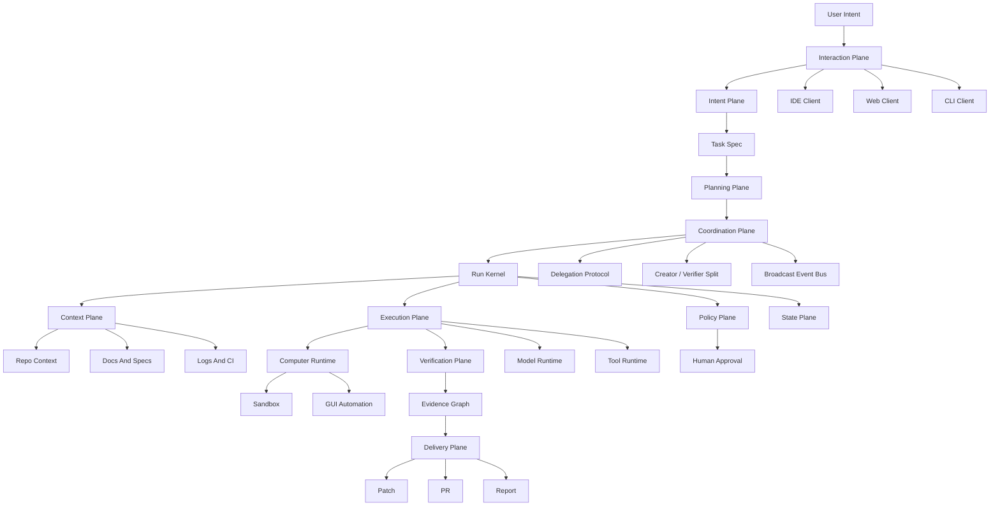

# Agentic Engineering OS 工程设计

## 1. 系统本质

这个系统不应该被定义成“多 IDE 控制器”，也不应该只是一个更大的 AI chat。它的终极形态应该更像一个面向工程任务的操作系统：

> Agentic Engineering OS：接收人的工程意图，把它转化为可调度、可审计、可恢复、可验证、可交付的任务执行系统。

这里的“操作系统”不是替代 Windows/Linux/macOS，而是像 OS 一样提供底层能力：

- 管理任务
- 管理资源
- 调度执行
- 控制权限
- 隔离环境
- 记录状态
- 处理失败
- 验证结果
- 交付产物

它真正要解决的是：

> 一个工程任务从提出、理解、执行、验证、审批、交付，到失败恢复，如何被系统化管理。

现在 IDE 里的 agentic workflow 把很多能力混在一起：

- Chat UI
- 上下文收集
- 模型规划
- 工具调用
- 文件修改
- terminal 执行
- diff 展示
- 人工确认
- 结果交付

短期看这些能力被 IDE 包住，所以我们会以为问题是“如何控制多个 IDE”。长期看，真正有价值的是中间的 workflow runtime。IDE 只是入口、展示层和部分能力提供者。

因此最终目标是：

- 任务可以从 IDE、CLI、Web、Chat、CI 进入。
- 系统能把自然语言任务变成结构化 `Run`。
- 每一步执行都有状态、事件、权限、上下文来源和输出证据。
- 失败后可以定位、重试、恢复，而不是重新开一轮 chat。
- 最后交付的是结构化 artifact，而不是一段不可追溯的回答。

一句话：把工程师每天隐式完成的工作流，显式建模成一个可执行、可观察、可恢复的系统。

## 2. 终局产品形态

终极体验不是“打开某个 IDE 再让 AI 帮忙”，而是：

```text
你表达目标
系统生成任务规格
系统规划和调度执行
系统收集上下文和证据
系统调用工具和 agent
系统验证结果
你只在关键节点审批
系统交付可追溯产物
```

例如用户说：

```text
帮我确认 Orion LSC m2b LEC regression 是否通过，并通知相关人。
```

系统应该完成：

- 找到正确 workspace、regression run、summary 和 log。
- 判断是否 all passed。
- 检查是否存在 warning、waived error、incomplete job、环境异常。
- 生成证据链。
- 生成英文汇报邮件。
- 等待用户确认。
- 发送、保存或复制交付内容。
- 保存这次任务的 run history、evidence 和 artifact。

普通 AI 助手是“你问一句，它答一句”。这个系统应该是“你交代目标，它管理完整执行周期”。

核心执行链路：

```text
Intent -> Spec -> Plan -> DAG -> Step -> ToolCall -> Observation -> Evidence -> Artifact -> Delivery
```

其中 `Spec` 和 `Evidence` 是这个系统区别于普通 agent 的关键。

## 2.1 Agentic Engineering OS Kernel 与 Workload 边界

核心修正：Agentic Engineering OS 的产品边界不是 regression log 分析器。Regression Evidence Demo 只是第一个 deterministic workload，用来证明 OS kernel 的抽象能闭环运行。真正的产品应该像操作系统一样提供 workload-independent kernel primitives，再让不同工程任务作为 workload / app 跑在这些 primitives 之上。

```text
Agentic Engineering OS Kernel
  -> workload-independent primitives
  -> workload adapters and task profiles
  -> first workload: Read-only Regression Evidence Demo
```

Kernel 不应该硬编码任何一个业务场景。它只拥有这些通用原语：

- `Intent`：人或系统提出的目标。
- `TaskSpec`：目标、约束、允许动作、禁止动作、成功标准、证据要求、审批点。
- `Plan` / `DAG`：可调度步骤与依赖关系。
- `Run` / `Step` / `RunEvent`：执行实例、最小动作、append-only 事件。
- `Capability` / `ToolCall`：标准能力接口和一次调用记录。
- `Observation`：工具、环境、IDE、CI、CUA、人工输入等产生的原始观察。
- `Evidence`：可复查、带来源和 hash 的证据节点。
- `Artifact`：可交付或中间产物。
- `Verifier`：独立验证 artifact / evidence / policy 的规则或 agent。
- `Policy`：权限、审批、side effect、sandbox、secret、delivery gate。
- `Delivery`：报告、邮件草稿、patch、PR、ticket、release note 等交付出口。
- `Agent` / `Message` / `Delegation` / `CoordinationEvent`：多 agent 运行时协作原语。

Workload 是这些 kernel primitives 的具体实例化，而不是新的核心系统。第一批 workload catalogue 应至少覆盖：

| Workload | 示例任务 | 主要 artifacts | 主要 verifier |
|---|---|---|---|
| Regression analysis | 判断 regression 是否通过并生成汇报 | `RegressionResultArtifact`、`EmailDraftArtifact` | log rule verifier、evidence grounding |
| Test execution / failure triage | 跑指定测试并总结失败原因 | `TestRunArtifact`、`FailureTriageReport` | test exit code、log evidence、flake policy |
| Code change / patch generation | 修改代码实现一个小需求 | `PatchArtifact`、`DiffSummary` | unit tests、lint、review verifier |
| PR review / code review | 审查一个 diff 的风险 | `ReviewFindingArtifact` | static analysis、test evidence、human review |
| Issue triage | 判断 bug/issue 类别和 owner | `TriageReport`、`RoutingDecision` | duplicate search、source refs |
| Documentation update | 根据代码或 spec 更新文档 | `DocPatchArtifact` | doc source grounding、link checks |
| Release / deploy readiness | 判断某 release 是否可交付 | `ReleaseReadinessReport` | CI status、approval policy、rollback evidence |
| Incident / log analysis | 分析线上告警和日志 | `IncidentSummary`、`TimelineArtifact` | log/source correlation、timeline consistency |
| IDE-assisted coding task | 在 IDE 中展示 diff、diagnostics、approval | `WorkspaceObservation`、`ApprovalHandoff` | permission policy、workspace source hash |
| Computer runtime / CUA task | 读取 GUI/desktop trajectory 作为 observation | `TrajectoryObservation` | redaction/source policy、task verdict ownership |

设计约束：

- `RegressionTaskSpecV1` 只能是 `TaskSpecV1` 的 workload subtype，不能成为唯一 TaskSpec。
- `read_log`、`extract_regression_result`、`email_draft.md` 只能属于 first workload；kernel capability / artifact / verifier contract 必须能扩展到 `run_test`、`apply_patch`、`review_diff`、`create_ticket_draft` 等任务。
- 后续实现应该先抽出 workload-independent contracts，再逐步增加第二、第三个 workload，而不是继续把 approval、delivery、policy 都绑定到 `all_passed` fixture。
- 如果某个新设计只能解释 regression email demo，不能解释 code patch / test execution / PR review，它不应进入 OS kernel，只能留在 workload adapter。

## 2.2 Automation 防走偏护栏

当前计划的主要风险不是验证不够，而是 automation 会沿着第一个 workload 无限深入，最终把系统做成 regression/email approval pipeline。后续自动化必须显式执行以下护栏。

Post-MVP slice selection priority：

1. Generalize a workload-independent kernel primitive：`TaskSpecV1`、`ArtifactV1`、`VerifierResultV1`、`CapabilityV1`、`RunEventV1`、`PolicyV1`、`DeliveryV1`。
2. Add or prepare a second workload：优先 `Test Execution / Failure Triage`，其次 `Code Patch / Review Loop`。
3. Add an Agent Coordination Layer protocol：`DelegationManifestV1`、`CreatorVerifierPairingV1`、`AgentMessageV1`、`NegotiationRecordV1`、`CoordinationEventV1` / broadcast event bus。
4. Strengthen a workload-independent verifier / evidence / policy / delivery invariant。
5. Only then extend the first regression/email workload。

Regression/email overfitting ban：

- 不再新增只服务 `all_passed`、`email_draft`、`regression_result`、`send_email`、approval lifecycle 或 delivery unlock 的 post-MVP artifact，除非它明确抽象出可复用的 OS kernel primitive 或 coordination protocol。
- 每个新 slice 必须回答：
  - Which OS kernel primitive does this advance?
  - Which non-regression workload could reuse it?
  - Which coordination protocol or creator-verifier invariant does it clarify?
  - Why is this not merely another regression/email fixture?
- 如果回答不了，必须拒绝或重写 slice。

下一阶段路线应从 regression-specific post-MVP chain 转向：

```text
Phase 10: Kernel Generalization
Phase 11: Multi-Workload Expansion
Phase 12: Agent Coordination Runtime Contracts
Phase 13: Creator-Verifier / Delegation Protocol
Phase 14: Runtime Integration Candidates
```

Build vs Integrate：

- Build：automation slice-selection guardrail、workload-independent marker validation、主计划和 automation prompt 的防过拟合约束。
- Integrate later：真实 scheduler、database、message queue、LangGraph/AutoGen/CrewAI、IDE/Web notification runtime；这些只能在 OS contract 明确后作为 substrate。

## 3. 操作系统式分层

```text
Interaction Plane
IDE / CLI / Web / Slack / CI

Intent Plane
需求澄清、任务规格、成功标准、约束提取

Planning Plane
任务拆解、依赖图、执行策略、风险预估

Coordination Plane
agent delegation、creator-verifier 分离、direct message、negotiation、broadcast/event bus

Context Plane
代码、log、docs、issues、CI、memory、symbol graph、引用来源

Execution Plane
模型、工具、shell、browser、git、CI、workspace worker

Computer Runtime Layer
sandbox、desktop control、screen observation、GUI automation、trajectory capture

Policy Plane
权限、审批、sandbox、secret control、危险操作拦截

State Plane
event log、run state、step state、resume、replay、audit

Verification Plane
测试、lint、review、evidence check、artifact validation

Delivery Plane
patch、PR、email、ticket、report、release note

Evaluation Plane
成功率、失败原因、成本、耗时、人工介入点、改进反馈
```

## 4. 核心架构



## 5. Agentic Engineering OS 的内核能力

### 5.1 Task Kernel

管理所有工程任务的生命周期。任务不是 chat message，而是有目标、状态、步骤、证据、交付物和审批记录的系统对象。

### 5.2 Scheduler

决定任务执行顺序、并发度、资源占用和等待条件。未来多个 agent、多个 workspace、多个 regression 或 CI 任务并行时，必须有调度层。

### 5.3 Context Manager

管理代码、log、文档、issue、历史记忆、symbol graph、CI 输出。它负责把“可能相关的一切”变成“当前任务真正需要的上下文”。

### 5.4 Capability Runtime

统一调用 shell、git、IDE、browser、CI、Jira、email、CUA、sandbox 等能力。上层 workflow 不直接依赖具体工具。

### 5.5 Permission System

控制哪些操作可以自动执行，哪些需要审批，哪些必须禁止。它负责把 agent 的能力限制在安全边界内。

### 5.6 Sandbox Manager

危险任务、GUI 操作、未知脚本、批量修改、外部依赖测试应该优先在隔离环境里运行。`trycua/cua` 这类项目可以成为这一层的重要执行基座。

### 5.7 State Store

保存 run、step、tool call、approval、artifact、evidence。任务中断后可以 resume，失败后可以 replay 和 debug。

### 5.8 Evidence Graph

每个结论都必须能追溯到来源：哪个 log、哪个命令、哪个 commit、哪个测试、哪个人工审批、哪个文件片段。

### 5.9 Verifier Runtime

Agent 不能自己说完成就算完成。Verifier 负责测试、lint、review、log 检查、artifact validation 和证据一致性检查。

### 5.10 Artifact Manager

管理最终交付物：patch、PR、报告、邮件、ticket、测试结果、decision record。交付物应该独立于 chat history 长期存在。

### 5.11 Human Gate

人不应该全程盯着 agent，而是在关键节点介入：批准 patch、确认风险、选择方向、发送邮件、开 PR。

### 5.12 Learning And Evaluation Loop

记录任务成功率、失败原因、耗时、成本、人工介入点和用户修改，逐步形成个人或团队的工程偏好和工作流经验。

### 5.13 Agent Coordination Layer

Agent Coordination Layer 是运行时能力，不是 Cursor 研究期多视角评审。研究期 reviewer agent 只帮助优化 plan；产品运行时 coordination layer 要管理真实工程任务里的 agent 分工、消息、争议、验证和事件广播。

它至少包含五类协议：

1. `Delegation`：planner 或 parent agent 把 `TaskSpec` 拆成 `SubTaskSpec` / `Assignment`，交给 executor、context、reviewer、reporter 或 specialized agent。
2. `Creator-Verifier`：creator 负责产出 artifact，verifier 独立检查 evidence、artifact、policy 和 acceptance criteria；关键 artifact 不能由 creator 自证完成。
3. `Direct Communication`：点对点 `AgentMessage`，用于请求上下文、解释决策、要求补充 evidence、交接 artifact。
4. `Negotiation`：proposal / counterproposal / agreement / rejection，用于 scope、risk、acceptance criteria、policy exception、fallback plan 的协商。
5. `Broadcast`：事件总线 / blackboard，把 `RunEvent`、`artifact.created`、`verification.failed`、`policy.denied`、`approval.requested` 广播给订阅者。

最小 contract 形态：

```typescript
type AgentRole =
  | "planner"
  | "context"
  | "executor"
  | "creator"
  | "verifier"
  | "reviewer"
  | "policy"
  | "reporter"
  | "delivery";

type AgentMessage = {
  id: string;
  runId: string;
  fromAgent: string;
  toAgent?: string;
  channel: "direct" | "broadcast" | "negotiation";
  intent: "request" | "proposal" | "counterproposal" | "decision" | "handoff" | "evidence_request";
  references: string[];
  payload: unknown;
};

type Delegation = {
  id: string;
  parentTaskSpecId: string;
  assigneeRole: AgentRole;
  subTaskSpec: TaskSpec;
  acceptanceCriteria: string[];
  requiredEvidence: string[];
  verifierRole: AgentRole;
};

type CoordinationEvent = {
  id: string;
  runId: string;
  type:
    | "delegation.created"
    | "agent.message.sent"
    | "negotiation.proposed"
    | "negotiation.accepted"
    | "negotiation.rejected"
    | "artifact.created"
    | "verification.requested"
    | "verification.completed"
    | "policy.denied";
  causalRefs: string[];
};
```

关键不变量：

- Delegation 必须有 parent spec、assignee、acceptance criteria、required evidence 和 verifier；不能只是一段自然语言“交给某 agent”。
- Creator 与 Verifier 默认分离；如果同一模型实例同时创建和验证，必须记录为弱验证，并要求更强 verifier 或 human gate。
- Direct communication 不能绕过 RunEvent；每条重要消息都必须有 causal refs。
- Negotiation 不能直接改变 TaskSpec 或 Policy；只能产出 proposal，最终变更必须进入新的 spec/version/event。
- Broadcast 是事件分发，不是群聊；订阅者只能基于事件生成新的 observation/evidence/artifact，不能私自修改历史。
- Policy agent 可以 veto side effect；delivery agent 不能覆盖 verifier verdict。

Build vs Integrate：

- Build：Agent / Message / Delegation / CoordinationEvent 的 OS-level contract、creator-verifier invariant、policy-gated negotiation 和 event bus 语义。
- Integrate later：LangGraph、AutoGen、CrewAI、Temporal、message queue、blackboard DB、WebSocket/Slack/IDE notification 可以作为 runtime substrate，但不能替代 OS contract。

## 6. 六个核心内核

### 6.1 Run Kernel

Run Kernel 是系统大脑，负责管理一次任务的生命周期。

任务不是一句 prompt，而是一个 `Run`：

```typescript
type RunStatus =
  | "created"
  | "planning"
  | "waiting_context"
  | "running"
  | "waiting_approval"
  | "verifying"
  | "completed"
  | "failed";

type Run = {
  id: string;
  task: string;
  workspaceId: string;
  status: RunStatus;
  steps: Step[];
  events: RunEvent[];
  artifacts: Artifact[];
};
```

关键原则：所有事情都事件化。

- 模型生成了什么计划，记录为 event。
- 调用了什么工具，记录输入、输出、耗时、错误。
- 用户批准或拒绝了什么，记录审批事件。
- 生成了什么 diff、报告、邮件草稿，记录 artifact。

只有 event log 存在，系统才有恢复、审计、回放、debug 的基础。

### 6.2 Capability Runtime

Agent 不应该直接操作 IDE、shell、git、浏览器，而应该调用标准能力。

```typescript
type Capability = {
  name: string;
  permission: "read" | "write" | "dangerous";
  sideEffect: boolean;
  timeoutMs: number;
  inputSchema: unknown;
  outputSchema: unknown;
  execute(input: unknown, context: RunContext): Promise<unknown>;
};
```

第一批标准能力：

- `search_code`
- `read_file`
- `read_log`
- `run_command`
- `run_test`
- `get_git_status`
- `apply_patch`
- `show_diff`
- `open_file`
- `summarize_log`
- `create_email_draft`
- `request_approval`

这样 workflow 不知道底层是 Cursor、VS Code、shell、CI 还是云端 worker，它只知道自己要调用一个 capability。

### 6.3 Context Broker

很多 agentic workflow 失败，不是模型不够聪明，而是上下文错了。Context Broker 专门负责上下文选择。

它要做的事情：

- 根据任务判断需要 repo、log、docs、issue、CI 还是 terminal 输出。
- 从不同 adapter 取信息。
- 压缩成可控的 `ContextPack`。
- 保留引用来源，方便最后解释依据。
- 控制 token budget，避免无关内容污染模型。

```typescript
type ContextPack = {
  purpose: string;
  sources: {
    type: "file" | "log" | "command" | "doc" | "issue";
    uri: string;
    excerpt: string;
    relevance: number;
  }[];
};
```

专业的系统不能把“找上下文”当成 prompt 技巧，而要把它做成一层可观测、可调试的 broker。

### 6.4 Policy And Approval Engine

只要系统能执行命令、改代码、发邮件、开 PR，就必须有权限层。

每个 capability 都要声明风险等级：

- `read_file`：只读，默认允许。
- `search_code`：只读，默认允许。
- `run_test`：低风险写操作，可配置自动允许。
- `apply_patch`：写操作，需要确认。
- `delete_file`：危险操作，强制确认。
- `send_email`：外部副作用，必须人工批准。
- `git_push`：外部副作用，必须人工批准。

Control plane 和普通 agent 的区别在这里：它不只是会干活，还知道什么时候不能直接干。

### 6.5 Artifact System

最终交付物不能只是聊天文本，而应该是结构化 artifact：

- `PatchArtifact`
- `TestResultArtifact`
- `LogSummaryArtifact`
- `RegressionResultArtifact`
- `EmailDraftArtifact`
- `PRArtifact`
- `ReportArtifact`
- `DecisionRecordArtifact`

比如“Orion LSC m2b LEC regression 全部通过”这个场景，系统不应该只给一句英文邮件，而应该产出：

- `RegressionResultArtifact`：通过依据、log 来源、命令或报告来源。
- `EmailDraftArtifact`：给相关人的英文汇报邮件。
- `RunEvidenceArtifact`：这次结论引用了哪些证据。

这样交付物才可复用、可追溯、可审计。

### 6.6 Coordination Kernel

Coordination Kernel 负责让多个 agent 像 OS 里的进程一样协作，而不是像一组松散聊天参与者。它管理 delegation graph、message log、negotiation state、broadcast subscriptions、creator-verifier pairing 和 policy veto。

最小执行模型：

```text
TaskSpec
  -> planner creates Delegation[]
  -> assignee agent creates Observation / Artifact
  -> verifier agent checks Evidence / Artifact / Policy
  -> policy agent may approve / deny side effect
  -> reporter / delivery agent emits Delivery artifact
```

它和 Phase 9 现有 `MultiAgentDeliveryManifestV1` 的关系：

- `MultiAgentDeliveryManifestV1` 是第一个静态 handoff artifact，证明 agent ownership 不能绕过 verifier / policy。
- 真正的 Coordination Kernel 还需要显式建模 `Delegation`、`AgentMessage`、`Negotiation`、`Broadcast` 和 `CreatorVerifierPairing`。
- 下一轮 plan / implementation 应把 Phase 9 从“多 agent delivery loop”升级为“Agent Coordination Layer”，再让 delivery loop 成为其中一个 workload-level protocol。

## 7. Intent-to-Spec 是第一关键层

很多 agent 系统直接从 prompt 进入 action，这是不稳定的。专业工程系统应该先把模糊需求转成 `TaskSpec`。

```typescript
type TaskSpec = {
  goal: string;
  workspace: string;
  constraints: string[];
  allowedActions: string[];
  forbiddenActions: string[];
  successCriteria: string[];
  requiredEvidence: string[];
  approvalPoints: string[];
  expectedArtifacts: string[];
};
```

例如用户说：

```text
帮我确认 regression 是否通过，并通知相关人。
```

系统应该先形成规格：

- 目标：确认指定 regression 的完成状态和 pass/fail 结果。
- 成功标准：找到可信 summary 或 log，并确认所有 test passed。
- 必需证据：regression summary、时间戳、workspace 或 run id、失败数量。
- 禁止动作：未经批准不得发送邮件，不得删除或修改 log。
- 预期交付：结果摘要、英文邮件草稿、证据引用。
- 审批点：发送邮件前需要用户确认。

没有 `TaskSpec`，agent 很容易直接行动、跑偏、或者给出不可验证结论。

## 8. Evidence 是第二关键层

系统不能只输出“all passed”。它必须能说明：

- 结论来自哪个 log 或 summary。
- 哪个命令产生了这个结果。
- 什么时候产生的。
- 对应 workspace / git revision / regression id 是什么。
- 有没有 warning、waiver、incomplete job 被忽略。
- 是否通过 verifier 检查。

`Evidence Graph` 应该连接：

```text
Run -> Step -> ToolCall -> Observation -> Evidence -> Artifact -> Delivery
```

这样每个结论都能被复查，每个 artifact 都有来源。

## 9. 与 trycua/cua 的关系

`trycua/cua` 的定位是 open-source infrastructure for Computer-Use Agents。它提供 sandboxes、SDK、driver、benchmark，让 agent 能控制完整桌面系统，包括 macOS、Linux、Windows、Android。

它解决的是：

```text
Agent 怎么使用一台电脑
```

我们要解决的是：

```text
Agent 怎么可靠地完成一个工程工作流
```

两者不是竞争关系，而是上下层关系：

```text
CUA = Computer Runtime / Sandbox / GUI Automation / Trajectory Layer
Agentic Engineering OS = Engineering Task Kernel / Policy / State / Evidence / Verification / Delivery Layer
```

应该借鉴 `CUA` 的点：

- Sandbox-first：危险操作优先在隔离环境执行。
- Trajectory recording：agent 操作应该可回放，和 event log / evidence graph 对齐。
- Cross-OS abstraction：不要绑定某个 IDE 或 OS。
- Benchmark mindset：agentic workflow 需要评估集和成功率。
- Background operation：agent 执行不应该打断用户当前工作。

在我们的架构里，`CUA` 可以作为 `Computer Runtime Layer` 的一个 adapter：

```text
Run Kernel
  -> Capability Runtime
    -> CUA Adapter
      -> Sandbox / Desktop / GUI App / Screenshot / Mouse / Keyboard / Shell
```

也就是说，不要重做 `CUA`。应该把它作为底层 computer-use / sandbox / trajectory runtime，在它上面构建工程任务的 control plane、policy、evidence、verification 和 delivery。

## 10. 必须标准化的对象

第一批不要围绕 IDE 设计，而要围绕 workflow 设计：

- `Task`：用户想完成什么，包括目标、workspace、约束、成功标准。
- `TaskSpec`：从意图提炼出的可执行规格，包括允许动作、禁止动作、成功标准、证据要求和审批点。
- `Run`：一次任务执行实例，包括 plan、steps、状态、事件流、结果和 artifact。
- `Step`：可执行的最小动作，比如搜索代码、跑测试、改文件、请求确认。
- `RunEvent`：系统发生过什么，包括模型输出、工具调用、审批、错误、结果。
- `Capability`：系统能调用的标准能力，比如 `read_context`、`run_command`、`apply_patch`、`run_test`、`show_diff`。
- `Adapter`：把标准能力映射到真实工具，比如 IDE adapter、shell adapter、git adapter、browser adapter、CI adapter。
- `ContextPack`：给模型的一组经过筛选的上下文，而不是把整个 repo 塞进去。
- `Evidence`：支持某个结论的证据节点，包括来源、时间、命令、内容摘要和可信度。
- `Artifact`：交付物，比如 diff、log summary、PR、report、email draft。

## 11. IDE 里的功能如何迁移出来

现在 IDE 里的 agentic workflow 大概包含这些能力：读文件、搜索代码、跑 terminal、看 diagnostics、应用 patch、展示 diff、问用户确认、运行测试。

迁移方式不是“远程控制 IDE”，而是把它们变成标准能力：

- `open_file`：IDE adapter 实现，也可以由 Web UI 实现。
- `read_context`：repo index、LSP、semantic search 实现。
- `get_diagnostics`：LSP adapter 或 IDE extension 实现。
- `run_test`：shell/CI adapter 实现。
- `apply_patch`：workspace adapter 实现。
- `show_diff`：IDE/Web/Git adapter 都可以实现。
- `request_human_approval`：IDE、Web、Slack、CLI 都可以承载。

这样 IDE 不再是大脑，只是能力提供者和展示前端之一。

## 12. 分阶段实现

### Phase 1：Read-only Regression Evidence Demo

第一版不要先实现完整 `Local Workflow Daemon`，而是分成两个 gate：先用 deterministic static fixture runner 验证 Evidence / Verifier / Artifact 契约，再把同一套 schema 迁入本地 read-only runner。

#### Phase 1a：Static Fixture Contract

目标：在零 IDE、零 CUA、零 CI、零 SQLite daemon 的条件下，先证明系统能把固定 regression observation 变成可复查的 evidence、artifact 和 verifier verdict。

最小输入：

- 一个提交到仓库或研究 fixtures 目录中的固定 regression log fixture。
- 可选 `fixture_meta.json`：记录 fixture id、来源说明、hash、run id、时间戳和人工标注期望。
- 可选 `task_spec.fixture.json`：用模板化 TaskSpec 代替 LLM 生成，避免第一步被 Intent-to-Spec 不确定性拖住。

固定输出：

- `run.json`：记录 task、模板 TaskSpec、steps 和最终状态。
- `events.jsonl`：append-only 事件视图，每条至少包含 event id、step id、type、timestamp、causal refs。
- `evidence.json`：记录 log 片段、来源、line range、classification、confidence 和 evidence id。
- `regression_result.json`：只保存提取器的结构化候选结论，包括 passed/failed/incomplete/warning/unknown。
- `email_draft.md`：只允许引用 `regression_result.json` 和 evidence ids，不允许重新自由断言结果。
- `verifier_report.json`：唯一权威 verdict，记录 overall_status、checks、blocking failures、触发规则 id、引用的 evidence ids 和 fixture hash。

Phase 1a 验收：

- 所有 JSON artifact 通过版本化 schema validation。
- `verifier_report.json` 至少包含 `schema_validation`、`evidence_refs`、`classification_consistency`、`email_draft_uses_structured_facts` 四类 check。
- 至少覆盖 `all passed`、`failed`、`incomplete`、`warning/waiver`、`ambiguous` 五类 fixture；负例必须输出 `unknown`、`needs_human_check` 或 FAIL，不能伪造通过。
- Phase 1a 不引入 SQLite、daemon、真实 log adapter、Capability registry、CUA、Browser-use、E2B、Temporal 或 LangGraph。

Build vs Integrate：

- Build：Run/Event/Evidence/Artifact schema、fixture harness、rule-based verifier、`verifier_report.json` 契约。
- Integrate / Defer：JSON Schema 或等价校验库可直接使用成熟实现；SQLite、真实 adapter、workflow backend、computer runtime 和 LLM TaskSpec 生成全部后移。

#### Phase 1a 范围切线：反方评审后的最小可执行路径

Feasibility Critic 结论：Phase 1a 的第一个可执行切片不是 daemon、SQLite、CLI 产品入口或 LLM workflow，而是一个 deterministic fixture contract gate。它只需要证明同一批固定输入能稳定生成同一类 artifact，并且 verifier 能拒绝负例。

最小执行边界：

- 第一批 fixture 先用合成日志，不等待真实脱敏 regression log；真实脱敏样例只作为 Phase 1a 通过后的校准数据。
- 入口先是固定脚本或测试命令，不要求正式 CLI UX；CLI 进入 Phase 1b。
- 不引入 SQLite；`events.jsonl` 和磁盘 JSON artifact 足够证明 event/evidence/artifact 语义。
- 不引入 LLM；`task_spec.fixture.json` 使用模板化字段，邮件草稿只能从 `regression_result.json` 转述。
- 不实现 capability registry；Phase 1a 的 `read_log`、`extract_regression_result`、`write_artifact` 可以先作为 fixture harness 内部步骤。

建议的 research fixture layout（本轮只定义契约，不新增产品代码）：

```text
fixtures/regression/
  all_passed.log
  failed_tests.log
  incomplete_jobs.log
  passed_with_warning_or_waiver.log
  ambiguous_summary.log
  fixture_meta.json
  task_spec.fixture.json
  expected/
    verifier_report.expected.json
```

验收顺序固定为：

```text
schema validation
  -> extraction consistency
  -> evidence reference check
  -> verdict precedence rules
  -> email grounding check
  -> verifier_report overall_status
```

停止条件：

- 五类 fixture 中任一负例需要靠人工解释才能避免误判为 `passed`，先收缩规则表或 fixture 表达，不进入 Phase 1b。
- 如果邮件草稿生成阶段能绕过 `regression_result.json` 产生新结论，先修 verifier，不进入 runner/daemon。
- 如果 `lineRange` 无法稳定取得，v1 仍不新增复杂 locator；必须用 `fixture_hash` + exact `excerpt` 保证可复查。

#### Phase 1b：Local Read-only Runner

在 Phase 1a schema 和 verifier 绿灯后，再实现一个 read-only 证据闭环 demo：

- 输入：一个固定 regression summary/log 路径 + 用户目标。
- 流程：生成 `TaskSpec` -> 读取 log -> 提取 pass/fail/warning/incomplete -> 生成 Evidence list -> 规则验证 -> 生成英文邮件草稿 artifact。
- 输出：`run.json`、`events.jsonl`、`evidence.json`、`regression_result.json`、`email_draft.md`、`verifier_report.json`。

建议最小组件：

- `run.json` + append-only `events.jsonl` 文件输出；SQLite event store 只在 fixture gate 通过后进入下一步
- 极简 step runner
- `read_log` capability
- `extract_regression_result` capability
- `write_artifact` capability
- policy gate：禁止外部副作用，只允许读取和生成草稿
- rule verifier
- artifact writer

成功标准：不用依赖 IDE，也不用修改任何代码，就能证明“结论来自哪里、是否被验证、交付物引用了哪些证据”。

Phase 1 的边界：

- Regression workflow 只是 bootstrap MVP 场景，用来验证 OS 抽象是否成立，不是产品边界。
- 核心对象必须保持通用：`TaskSpec`、`Run`、`Step`、`Capability`、`Observation`、`Evidence`、`Artifact`、`Verifier`、`Policy`、`Delivery`。
- Regression fixture 可以实例化这些通用 contract，但不能把整个系统硬编码成 regression verifier。
- 所有 regression-specific 逻辑都应该放在 adapter、fixture、parser 或 artifact subtype 后面，核心 schema 和接口要能复用于 CI 诊断、代码修改、测试执行、文档生成、ticket/report delivery 等工程任务。

### Phase 2：Intent-to-Spec 和任务规格化

先不要让 agent 直接行动。每个自然语言任务先生成 `TaskSpec`：

- 目标
- workspace
- 约束
- 允许动作
- 禁止动作
- 成功标准
- 必需证据
- 审批点
- 预期 artifact

成功标准：同一个任务在执行前能被用户或系统审查，避免一上来就跑偏。

#### Phase 2 最小 TaskSpec Builder Gate

2026-05-13 02:02 UTC 自动化实现结论：Phase 2 的第一个执行切片不是 LLM spec generator，而是把现有模板化 `RegressionTaskSpecV1` 从 runner 内部函数提升为可独立构建和校验的执行前契约。

最小入口：

```text
python3 scripts/task_spec.py --goal <goal> --input-log-path <log> --out <task_spec.json>
```

TaskSpec v1 的 schema version 固定为：

```text
regression-task-spec-v1
```

本切片完成后：

- `scripts/task_spec.py` 生成并校验 `RegressionTaskSpecV1`，字段包括 `schemaVersion`、`goal`、`inputLogPath`、`allowedActions`、`forbiddenActions`、`successCriteria`、`requiredEvidence`、`expectedArtifacts` 和 `approvalPoints`。
- Phase 1a fixture runner 和 Phase 1b local read-only runner 均复用同一个 TaskSpec builder / validator；local runner 在读取和分类 log 前先构建可审查 spec。
- `scripts/validate_repo.py` 会运行 TaskSpec CLI smoke，并验证缺少 allowed actions、forbidden actions、success criteria、required evidence 或 approval points 的 spec 会被拒绝。

Build vs Integrate：

- Build：`RegressionTaskSpecV1` builder、validator、CLI smoke 和 malformed spec validation gate。
- Integrate later：LLM intent parser、schema library、UI review form、多任务 spec catalogue。

当前 Phase 2 仍未完成：本切片只覆盖 regression log 场景的 deterministic spec builder；自然语言澄清、多场景 intent routing、用户审查 UI 和 LLM 草稿校验仍后移。

#### Phase 2 TaskSpec Intake Gate

2026-05-13 03:01 UTC 自动化实现结论：Phase 2 的第二个执行切片把 `RegressionTaskSpecV1` 从“可独立生成”推进到“可作为 runner 的执行前输入”。`scripts/local_readonly_runner.py` 现在可接收 `--task-spec-path <task_spec.json>`，在读取日志前校验该 spec 的 schema、goal、inputLogPath、allowed/forbidden actions、success criteria、required evidence、expected artifacts 和 approval points。

最小入口：

```text
python3 scripts/task_spec.py --goal <goal> --input-log-path <log> --out <task_spec.json>
python3 scripts/local_readonly_runner.py --log-path <log> --goal <goal> --task-spec-path <task_spec.json> --out-dir <out>
```

本切片完成后：

- local read-only runner 会优先加载并校验已审查的 TaskSpec；没有传入 `--task-spec-path` 时仍可使用 deterministic builder 保持 Phase 1b smoke 入口。
- `run.json#taskSpec` 必须与传入的 TaskSpec 完全一致，证明执行使用的是审查过的 spec，而不是运行时重新解释 goal。
- `scripts/validate_repo.py` 会验证 local runner 接受匹配 spec，并拒绝 `inputLogPath` 与 `--log-path` 不一致的 spec。

Build vs Integrate：

- Build：TaskSpec 文件加载、请求匹配校验、local runner intake gate、mismatched spec forced-failure validation。
- Integrate later：用户审查 UI、LLM clarification、multi-scenario intent router、独立 TaskSpec artifact registry。

当前 Phase 2 MVP gate 已满足 regression log 场景的“生成 -> 审查位置 -> 执行前校验 -> artifact 嵌入”闭环；更通用的自然语言澄清和多场景 routing 后移。下一步应进入 Phase 3 capability interface standardization，而不是继续扩大 Phase 2 范围。

### Phase 3：能力接口标准化

定义统一 capability 接口：

```typescript
interface Capability<I, O> {
  name: string;
  permission: "read" | "write" | "dangerous";
  sideEffect: boolean;
  timeoutMs: number;
  inputSchema: unknown;
  outputSchema: unknown;
  execute(input: I, context: RunContext): Promise<O>;
}
```

目标 capability catalogue：

- `read_file`
- `search_code`
- `run_command`
- `get_git_status`
- `apply_patch`
- `run_test`
- `summarize_log`
- `request_approval`

Phase 1a 只把这三个名字实现为同进程 deterministic functions；Phase 1b+ 才评估是否升级为 capability：

- `read_log`
- `extract_regression_result`
- `write_artifact`

成功标准：Phase 1a 先用最小 read-only function 子集验证 contract 是否成立；fixture gate 通过后，workflow 才需要不知道底层是 IDE、shell 还是云端 worker，只调用标准 capability。

#### Phase 3 最小 Capability Metadata Gate

2026-05-13 03:20 UTC 自动化实现结论：Phase 3 的第一个执行切片不是完整 capability registry、adapter plugin、daemon 或远程 tool runtime，而是给 Phase 1/2 已存在的三个同进程能力补上可机器校验的 metadata envelope。

最小 envelope：

```text
capability-envelope-v1
  -> capability-metadata-v1 read_log
  -> capability-metadata-v1 extract_regression_result
  -> capability-metadata-v1 write_artifact
```

每个 `capability-metadata-v1` 至少包含：

- `schemaVersion`
- `name`
- `ref`
- `permission`
- `sideEffect`
- `timeoutMs`
- `inputContract`
- `outputContract`

本切片完成后：

- `scripts/capability_contract.py` 定义 Phase 3 的最小 metadata/envelope、URI ref 和 validation helper。
- `run.json#capabilityEnvelope` 嵌入 `read_log`、`extract_regression_result`、`write_artifact` 的 metadata；`run.json.steps[]` 和相关 `events.jsonl` capability events 引用 `capabilityRef`。
- `scripts/validate_repo.py` 会校验 capability envelope 的 schema、permission、sideEffect、timeout 和 input/output contract，并用 forced-failure cases 证明缺失 permission 或声明外部 side effect 会被拒绝。

Build vs Integrate：

- Build：Phase 3 v1 capability metadata contract、artifact/event 引用和 deterministic validation gate。
- Integrate later：正式 registry、adapter plugin lifecycle、MCP/tool server、daemon、remote worker、IDE/CUA/browser/sandbox capability provider。

当前 Phase 3 仍未完成：本切片只标准化 regression demo 中已有的三个 same-process capability；`run_command`、`run_test`、`apply_patch`、`request_approval`、provider discovery、权限审批策略和 adapter runtime 仍后移。

#### Phase 3 Rule Verifier Capability Boundary Gate

2026-05-13 05:20 UTC 自动化实现结论：最新 main 已经具备三项执行 capability 的 metadata envelope，但 `run.json#steps[]` 中的 `step-verify` 仍然是裸 `rule_verifier` 字符串。Phase 3 的下一步不是扩大到 Phase 5 的完整 verifier runtime，而是补齐现有 verify step 的接口边界：它是一个只读、无外部副作用、输入为 TaskSpec/evidence/result/email draft、输出为 `verifier_report.json` 的本地 capability metadata。

本切片完成后：

- `capability-envelope-v1` 额外包含 `capability-metadata-v1 rule_verifier`。
- `rule_verifier.permission=read`，`sideEffect=false`，`outputContract.produces=["verifierReport"]`。
- `run.json#steps[]` 中所有 step 都必须有 `capabilityRef`，包括 `step-verify`。
- `events.jsonl` 的 `verifier.completed` 事件引用 `rule_verifier` 的 `capabilityRef`。
- `scripts/validate_repo.py` 会拒绝缺失 `step-verify.capabilityRef` 的 artifact packet。

Build vs Integrate：

- Build：现有 verify step 的 metadata contract、artifact/event refs、deterministic validation。
- Integrate later：完整 Verifier Runtime、可插拔 verifier、review agent、human verifier、policy engine 与外部 approval backend。

当前 Phase 3 仍未完成：本切片只保证 regression demo 的所有当前 step 都有 capability metadata。通用 capability catalogue、provider discovery、policy enforcement、adapter runtime 和非 regression 场景能力仍后移。

#### Phase 3 Capability Catalogue Artifact Gate

2026-05-13 05:40 UTC 自动化实现结论：在当前 regression demo 的四个 same-process capability 都具备 metadata/ref 后，Phase 3 的下一步不是提前实现 provider discovery 或 policy engine，而是把 `capability-envelope-v1` 提升为独立、可提交、可重新生成的 catalogue artifact。这样 Phase 4 Context Broker 和后续 verifier/policy runtime 可以引用稳定 capability provenance，而不是从某个 `run.json` 反向抽取接口定义。

本切片完成后：

- `scripts/capability_contract.py` 同时提供 builder/validator/CLI，可导出 `capability-catalog-v1`。
- 提交 `artifacts/capabilities/phase3_capability_catalog.json`，包含 `read_log`、`extract_regression_result`、`write_artifact`、`rule_verifier` 的完整 `capability-envelope-v1`。
- `scripts/validate_repo.py` 校验 committed catalogue 与 deterministic builder 输出完全一致，并用 forced-failure case 证明缺失 `rule_verifier` 会被拒绝。
- `run.json#capabilityEnvelope` 继续保留每次 run 的执行快照；catalogue artifact 成为 Phase 3 当前能力边界的独立事实源。

Build vs Integrate：

- Build：Phase 3 read-only MVP capability catalogue artifact、CLI export 和 repository validation gate。
- Integrate later：动态 registry、provider discovery、adapter plugin lifecycle、MCP/tool server、IDE/CUA/browser/sandbox provider、policy backend。

当前 Phase 3 regression-log MVP gate 已满足：现有执行能力有统一 metadata、run/event refs 和独立 catalogue artifact。通用 catalogue 扩展、provider discovery、policy enforcement 和 adapter runtime 后移到对应后续阶段，不阻塞进入 Phase 4 Context Broker。

### Phase 4：Context Broker

把上下文收集从 prompt 里拆出来：

- repo 文件和 symbol 检索
- log 和 regression summary 检索
- docs 和 issue 检索
- terminal 和 CI 输出收集
- ContextPack 生成
- 引用来源保存

成功标准：模型拿到的是经过筛选、带来源、可解释的上下文，而不是一堆无关文件。

#### Phase 4 ContextPackV1 Static Provenance Gate

2026-05-13 06:03 UTC 自动化实现结论：Phase 4 的第一个执行切片不是动态检索、symbol index、embedding store 或外部 issue/docs adapter，而是把当前 read-only regression demo 已经存在的 TaskSpec、input log evidence excerpts、capability catalogue 和 artifact refs 收敛成一个可提交、可重生成、可哈希校验的 `ContextPackV1`。

最小 context pack contract：

```text
schemaVersion: context-pack-v1
id: context-pack-<fixture_id>
taskSpecRef: artifacts/runs/<fixture_id>/run.json#/taskSpec
capabilityCatalogRef: artifacts/capabilities/phase3_capability_catalog.json
sources[]: task_spec / regression_log / capability_catalog / artifact refs with POSIX relative path + contentHash
contextItems[]: task goal, boundaries, capability refs, log excerpts, regression verdict candidate
artifactRefs[]: run/events/evidence/result/email/verifier artifacts with contentHash
```

本切片完成后：

- `scripts/context_pack.py` 提供 deterministic ContextPack builder、validator 和 CLI：`context-pack-builder --run-root <artifacts/runs> --fixture-root <fixtures/regression> --capability-catalog <catalog> --out-dir <artifacts/context>`。
- 提交 `artifacts/context/<fixture_id>/context_pack.json`，覆盖 5 个 regression fixtures，并只使用 POSIX-style relative paths、normalized line endings 和 content hashes。
- `scripts/validate_repo.py` 校验 committed ContextPack 与 deterministic builder/CLI 输出一致，并用 forced-failure case 证明缺失 capability catalog source 或 log hash mismatch 会被拒绝。
- ContextPack 目前是 read-only provenance artifact；local runner 尚未在执行前消费 ContextPack，动态 retrieval、token budget optimizer、symbol/docs/issues/CI adapters 后移。

Build vs Integrate：

- Build：Phase 4 最小 `context-pack-v1` schema、source/hash validation、fixture context artifacts、CLI 和 repository validation gate。
- Integrate later：embedding/vector store、LSP/symbol graph、ripgrep-based code search broker、docs/issues/CI adapters、token budget optimizer、ContextPack cache 和 runtime injection。

当前 Phase 4 已启动但未完成：本切片满足静态 provenance gate，证明上下文可以被筛选、引用和复查；下一步应让 local read-only runner 在执行前生成/消费 ContextPack，并把 evidence extraction 限制在 ContextPack 声明的 log excerpts/source refs 内。

#### Phase 4 ContextPackV1 Runtime Consumption Gate

2026-05-13 07:01 UTC 自动化实现结论：Phase 4 的第二个执行切片让 local read-only runner 可选加载 `ContextPackV1`，并在读取/分类 log 后验证所有 `LogEvidenceV1` 都由 ContextPack 声明的 `log_excerpt` source ref、line range 和文本支持。这个 gate 仍然是 read-only/same-process，不引入动态 retrieval、embedding store、外部 docs/issues/CI adapter、CUA 或 IDE adapter。

本切片完成后：

- `scripts/local_readonly_runner.py` 新增 `--context-pack-path`，在执行前校验 ContextPack 的 task goal 与 regression log source 和请求匹配。
- `scripts/context_pack.py` 新增 request matching 和 evidence enforcement helpers：ContextPack 必须声明 regression log source，runner 产生的每条 log evidence 都必须匹配 `contextItems[].kind="log_excerpt"` 的 source path、lineRange 和 text。
- `scripts/validate_repo.py` 的 local runner smoke 使用 committed `artifacts/context/all_passed/context_pack.json`，并加入 forced-failure：删除所有 `log_excerpt` 后 runner 必须拒绝该 ContextPack。

Build vs Integrate：

- Build：最小 ContextPack runtime consumption/enforcement，保证 Context Broker 不只是静态 artifact，而是进入执行路径。
- Integrate later：动态 source selection、token/line budget policy、symbol/docs/issues/CI adapters、ContextPack cache、embedding/vector retrieval 和 model-facing context broker service。

本 gate 完成时的下一步是补一个明确的 ContextPack budget/source-selection policy，例如限制最大 log excerpt 数/行数并用负例证明超预算 ContextPack 会被拒绝，然后再进入 Phase 5 Evidence List / MVP Verifier Runtime。

#### Phase 4 ContextPackV1 Budget / Source-Selection Gate

2026-05-13 07:16 UTC 自动化实现结论：Phase 4 的第三个执行切片把 ContextPack 从“包含若干 excerpt”收敛为有显式预算的 bounded context artifact。`context-pack-v1` 现在包含 `context-budget-v1`，声明 `maxLogExcerptItems`、`maxLogExcerptLines`、实际 excerpt 数/行数、selection rule 和 overflow behavior；validator 会拒绝超过预算的 ContextPack。

本切片完成后：

- `scripts/context_pack.py` 定义 `context-budget-v1`，当前 read-only regression MVP 固定 `maxLogExcerptItems=8`、`maxLogExcerptLines=8`、`selectionRule=ordered_unique_log_evidence_markers`、`overflowBehavior=reject_context_pack`。
- committed `artifacts/context/<fixture_id>/context_pack.json` 全部重新生成，包含 deterministic budget block，并保持 POSIX relative paths、normalized content hashes 和 builder 可重放。
- `scripts/validate_repo.py` 校验主计划包含 `context-budget-v1` 标记，比较 committed ContextPack 与 deterministic builder 输出，并新增 forced-failure：注入第 9 条 log excerpt 时必须因超过 ContextPack budget 被拒绝。
- local read-only runner 继续通过 `validate_context_pack(...)` 消费该预算合约；超预算 ContextPack 无法进入 evidence enforcement。

Build vs Integrate：

- Build：Phase 4 read-only MVP 的最小 context budget contract、source-selection rule、deterministic artifact regeneration 和超预算 validation gate。
- Integrate later：动态 token estimator、ranking/retrieval policy、embedding/vector store、symbol/docs/issues/CI adapters、ContextPack cache 和 broker service。

当前 Phase 4 regression-log MVP gate 已满足：ContextPack 具备静态 provenance、runtime consumption/evidence enforcement 和最小 budget/source-selection policy。动态 Context Broker service、retrieval/ranking、cache 和外部 source adapters 后移，不阻塞进入 Phase 5 Evidence List / MVP Verifier Runtime。

#### Phase 4 ContextPackV1 Budget / Source Selection Gate

2026-05-13 07:20 UTC 自动化实现结论：Phase 4 的第三个执行切片为 `ContextPackV1` 增加最小 budget/source-selection policy，使 Context Broker 不只记录来源，也能声明并验证本次上下文选择的边界。当前 policy 仍限定在 read-only regression MVP：ContextPack 只包含 evidence-backed log excerpts，且 validator 强制 log excerpt 数量与总行数不超过 pack 内声明的预算。

本切片完成后：

- `scripts/context_pack.py` 为每个 pack 写入 `budget.sourceSelection="evidence_items_only_v1"`、`budget.maxLogExcerptItems` 和 `budget.maxLogExcerptLines`。
- `validate_context_pack(...)` 要求每个 `log_excerpt` 引用 `evidenceId`，并拒绝超过 `budget.maxLogExcerptItems` 或 `budget.maxLogExcerptLines` 的 ContextPack。
- `scripts/validate_repo.py` 加入 forced-failure：把 `all_passed` 的 `budget.maxLogExcerptLines` 降到 1 时必须触发 `ContextPack log_excerpt line budget exceeded`。
- 重新生成并提交 `artifacts/context/<fixture_id>/context_pack.json`，使 committed artifacts 与 deterministic builder 输出一致。

Build vs Integrate：

- Build：最小 ContextPack budget/source-selection schema、deterministic artifact regeneration 和 over-budget validation gate。
- Integrate later：token estimator、semantic source ranking、dynamic retrieval service、ContextPack cache、symbol/docs/issues/CI adapters 和 model-facing broker API。

当前 Phase 4 regression MVP gate 已满足：ContextPack 有静态 provenance、runtime consumption/enforcement，以及最小 budget/source-selection policy。下一步可进入 Phase 5 Evidence List / MVP Verifier Runtime，但仍不引入完整 Evidence Graph、数据库、外部 review agent 或 human approval backend。

### Phase 5：Evidence List 和 MVP Verifier Runtime

MVP 不先实现完整图数据库或复杂 Evidence Graph，而是先实现 Evidence list：

- `LogEvidence`：来自 regression log 或 summary 的片段。
- `CommandEvidence`：来自命令输出的结果，MVP 可选。
- `HumanApprovalEvidence`：用户确认某个结论或发送动作。
- 每个 Artifact 都必须引用 evidence ids。
- 每个结论都必须经过 rule verifier 或 human verifier。

MVP verifier 只做三类检查：

- schema validation：artifact 和 evidence 字段完整。
- log rule check：能区分 `all passed`、`failed`、`incomplete`、`warning/waiver`、`unknown`。
- human approval：发送邮件或外部副作用前必须人工确认；MVP 只生成草稿，不实际发送。

成功标准：系统输出的结论能回答“你凭什么这么说”。

#### Phase 5 VerifierRuntimeV1 Rule Catalog / Replay Gate

2026-05-13 07:45 UTC 自动化实现结论：Phase 5 的第一步不是引入完整 Evidence Graph、数据库、review agent 或 human approval backend，而是把当前内嵌在 fixture runner 的规则验证提升为独立的 `verifier-runtime-v1` / `verifier-rule-catalog-v1` contract。这样 `verifier_report.json` 不再只是 runner 的副产物，而是可以由同一 runtime 规则目录 deterministic replay 的可审计 artifact。

最小 Verifier Runtime contract：

- `artifacts/verifier/phase5_verifier_rule_catalog.json` 记录 Phase 5 regression MVP 的 rule catalog：schema validation、evidence refs、classification precedence、warning/incomplete/failure guard、passed sufficiency 和 email grounding。
- `scripts/verifier_runtime.py` 提供 same-process read-only verifier runtime、catalog builder/validator 和 CLI replay；不发送邮件、不调用外部服务、不写仓库外 side effect。
- `verifier_report.json#verifierRuntime` 引用 `phase5_verifier_rule_catalog.json`，并声明 `schemaVersion="verifier-runtime-v1"`、`mode="same_process_readonly"`、`sideEffect=false`。
- `artifactChecks[]` 现在带稳定 `checkId`，让 artifact-level checks 也可被 catalog 验证。
- `scripts/validate_repo.py` 校验 committed rule catalog 等于 deterministic builder 输出，并对每个 fixture replay `verifier_report.json`；缺失 email grounding rule 或 report rule 的负例必须失败。

Build vs Integrate：

- Build：最小 VerifierRuntimeV1、rule catalog artifact、CLI replay、report runtime ref、artifact check ids 和 deterministic validation gate。
- Integrate later：JSON Schema 库、OPA/policy engine、review agent verifier、human verifier backend、数据库 Evidence Graph、外部 approval system 和可插拔 verifier provider。

当前 Phase 5 已启动但未完成：本 gate 固化了 verifier runtime contract 和 replay 验证；下一步应把 Evidence List 从当前 `evidence.json` schema 校验提升为独立 EvidenceListV1 module/CLI，验证 evidence source refs、line ranges、ContextPack provenance 和 artifact backlinks 的完整闭环。

#### Phase 5 EvidenceListV1 Provenance / Backlink Gate

2026-05-13 08:00 UTC 自动化实现结论：Phase 5 的第二步把 `evidence.json` 从 runner 副产物提升为独立 `EvidenceListV1` contract。当前 evidence item 不再只保存 `sourcePath`、`lineRange` 和 excerpt，还显式声明 `sourceRef`、`excerptHash` 和 artifact backlink contract，并由独立 CLI 校验其与 ContextPack 和下游 artifacts 的闭环。

最小 EvidenceListV1 contract：

- `scripts/evidence_list.py` 提供 same-process read-only EvidenceListV1 builder / validator / CLI，不调用外部服务、不写仓库外副作用。
- `evidence.json#items[]` 必须包含 `sourceRef="source-regression-log"`、POSIX `sourcePath`、`lineRange`、`excerpt` 和 `excerptHash=sha256(normalized excerpt)`。
- validator 会从 `sourcePath + lineRange` 重新读取日志片段，证明 excerpt/hash 没有漂移。
- validator 会消费 `ContextPackV1`，要求每个 evidence id 都有 matching `log_excerpt` provenance，且 sourceId、lineRange、text、classification、confidence 与 EvidenceListV1 一致。
- validator 会检查 `regression_result.json`、`verifier_report.json`、`events.jsonl` 和 `email_draft.md` 的 evidence backlinks，拒绝未知 evidence id 或未引用 result evidence ids 的 delivery draft。
- `scripts/validate_repo.py` 现在运行 EvidenceListV1 CLI，并包含 excerpt hash、ContextPack provenance 和 artifact backlink forced-failure cases。

Build vs Integrate：

- Build：最小 EvidenceListV1 module/CLI、excerpt hash、ContextPack provenance enforcement、artifact backlink validation 和 deterministic repository gate。
- Integrate later：JSON Schema 库、数据库 Evidence Graph、跨 artifact graph query、外部 CI/issue/docs evidence adapters、review agent verifier 和 human verifier backend。

当前 Phase 5 regression MVP gate 已满足：Evidence List 和 Verifier Runtime 都有独立 module/CLI、committed artifacts、deterministic replay/provenance validation 和 forced-failure tests。下一步应进入 Phase 6 state, permission, and recovery，先为当前 read-only run artifacts 增加最小 run state machine / permission policy / recovery snapshot，而不是提前实现 CUA、IDE、多 agent 或数据库 Evidence Graph。

### Phase 6：状态、权限和恢复

加入真正的控制平面能力：

- 每个 run 都有状态机：`created`、`planning`、`waiting_context`、`running`、`waiting_approval`、`verifying`、`completed`、`failed`。
- 每个工具调用都有权限级别：只读、可写、危险操作。
- 每个 step 都有输入、输出、错误、超时和重试策略。
- 中断后可以 resume，而不是重新开始。
- 所有写操作和外部副作用都经过 approval gate。

成功标准：长任务失败后能知道卡在哪里，并能从中间恢复。

#### Phase 6 RunControlV1 State / Permission / Recovery Snapshot Gate

2026-05-13 09:03 UTC 自动化实现结论：Phase 6 的第一步不是引入 daemon、SQLite/Temporal checkpoint、分布式 worker、外部 approval backend、CUA 或 IDE adapter，而是把当前 read-only regression run 已经产生的 `run.json` / `events.jsonl` 提升为可机器校验的控制平面快照。

最小 RunControlV1 contract：

- `scripts/run_control.py` 提供 `RunControlV1` validator / CLI，校验 `run-control-v1`、`run-state-machine-v1`、`permission-policy-v1` 和 `recovery-snapshot-v1`。
- `run.json#runControl.stateHistory` 必须由 `events.jsonl` deterministic 推导，覆盖 `created -> planning -> waiting_context -> running -> verifying -> completed|failed` 的当前 read-only regression MVP 状态流。
- `run.json#runControl.permissionPolicy` 必须镜像 capability envelope：`read_log`、`extract_regression_result`、`rule_verifier` 为 read/no side effect；`write_artifact` 只能在 `local_artifact_output_only` 边界内写入本地 artifact；`send_email`、dangerous capability 和 external side effect 必须保留为 approval-required/forbidden。
- `run.json#runControl.stepAttempts[]` 必须记录每个 step 的 capabilityRef、permission、inputRef、outputRef、timeoutMs、attempt、maxRetries 和 lastError，使失败位置可审计。
- `run.json#runControl.recoverySnapshot` 必须指向最后 event、当前 terminal state 和可重放 artifact refs；当前 MVP 的 completed terminal run 使用 `terminal_replay_only`，后续非 terminal run 才进入 durable resume。
- `scripts/validate_repo.py` 运行 RunControlV1 CLI，并包含 illegal state history、external side effects allowed、broken recovery last event 的 forced-failure cases。

Build vs Integrate：

- Build：最小 RunControlV1 schema、state history validation、permission policy validation、recovery snapshot validation、runner embedding 和 deterministic repository gate。
- Integrate later：SQLite/Temporal/LangGraph durable state backend、checkpoint storage、approval service、retry scheduler、distributed worker lease、real resume executor、CUA/IDE/browser adapter runtime。

当前 Phase 6 已启动但未完成：本 gate 让现有 read-only regression artifacts 能证明状态、权限和 terminal replay snapshot；下一步应增加可恢复的非 terminal failure fixture 或 interrupted-run fixture，证明 runner 能在中断点生成 recovery snapshot，而不是只对已完成 run 做事后审计。

#### Phase 6 InterruptedRecoveryFixtureV1 Non-terminal Resume Gate

2026-05-13 09:27 UTC 自动化实现结论：Phase 6 的第二步补齐了非终态恢复证据。当前不引入 durable daemon、SQLite/Temporal checkpoint、retry scheduler、外部 approval backend、CUA 或 IDE adapter，而是提交一个确定性的 interrupted run fixture，证明 `RunControlV1` 不只会审计 terminal run，也能描述 `running` 状态下从最后 event 恢复到下一步 capability。

最小 InterruptedRecoveryFixtureV1 contract：

- `scripts/recovery_fixture.py` 从 `fixtures/regression/all_passed/input.log` deterministic 生成 `artifacts/recovery/interrupted_after_extract/run.json` 和 `events.jsonl`。
- fixture 在 `capability.extract_regression_result.completed` 后停止，`run.status="interrupted"`，`runControl.currentState="running"`，`recoverySnapshot.resumeMode="from_last_event"`。
- `recoverySnapshot.nextAction="resume_step"`，并要求 `resumeTarget` 指向 `step-write-artifact`、`capability://phase3/write_artifact` 和 `regression_result_candidate`。
- `scripts/run_control.py` 支持 terminal run status 和 `interrupted` non-terminal status 的同一 validator；terminal snapshot 不允许 `resumeTarget`，non-terminal snapshot 必须提供完整 `resumeTarget`。
- `scripts/validate_repo.py` 比对 committed recovery fixture 与 deterministic CLI 输出，并包含删除 `resumeTarget` 的 forced-failure case。

Build vs Integrate：

- Build：最小 interrupted recovery fixture、non-terminal RunControlV1 validation、resume target validation、artifact-root-aware recovery refs 和 deterministic repository gate。
- Integrate later：durable checkpoint store、真实 resume executor、retry scheduler、approval workflow backend、distributed worker lease、CUA/IDE/browser adapter runtime。

当前 Phase 6 regression MVP gate 基本满足：terminal run artifacts 已能证明 state/permission/recovery snapshot，non-terminal interrupted fixture 已能证明 resume action contract。下一步可以进入 Phase 7 的 Computer Runtime / CUA Adapter contract，但仍只应定义 adapter boundary 和 observation/trajectory artifact contract，不实际执行 GUI 自动化或外部 side effect。

### Phase 7：Computer Runtime 和 CUA Adapter

把 GUI、桌面、VM、sandbox 这类能力作为底层执行基座，而不是系统核心：

- CUA 实际集成是 post-MVP；MVP 只定义 `computer.*` / `sandbox.*` / `trajectory.*` adapter contract。
- 研究 `CUA Sandbox`、`Cua Driver`、`CuaBot` 的能力边界。
- 抽象 `computer.screenshot`、`computer.click`、`computer.type`、`computer.run_shell`、`computer.record_trajectory`。
- 把 trajectory 归入 event log / evidence graph。
- 用 sandbox 隔离不可信操作。

成功标准：先明确 CUA 输出的是 observation / trajectory；是否可信、是否满足工程任务目标，由 OS 的 Evidence/Verifier 层判断。实际 GUI 操作不进入第一版。

#### Phase 7 ComputerRuntimeAdapterV1 Static Contract / Trajectory Observation Gate

2026-05-13 14:03 UTC 自动化实现结论：Phase 7 的第一步不是接入真实 trycua/cua、desktop provider、browser automation 或 sandbox executor，而是把 Computer Runtime 层的边界固化为可机器校验的 adapter contract，并用一个静态 `TrajectoryObservationV1` artifact 证明 trajectory 只能作为 Observation/Evidence 输入，不能自行声明工程任务 verdict。

最小 Computer Runtime / CUA adapter contract：

- `artifacts/computer_runtime/phase7_computer_runtime_contract.json` 采用 `computer-runtime-adapter-contract-v1`，声明 `ComputerRuntimeAdapterV1` 的 adapter-only 边界。
- contract 覆盖 `computer.screenshot`、`computer.click`、`computer.type`、`computer.run_shell`、`sandbox.session`、`trajectory.record` 六类底层 capability，但全部保持 `executionMode="contract_only"`、`implemented=false`、`externalSideEffectAllowed=false`。
- dangerous capability 必须 `approvalRequired=true`，且 Phase 7 MVP 明确 `realProviderExecutionAllowed=false`；因此不会执行 GUI、shell、sandbox、browser、desktop 或 CUA side effect。
- `artifacts/computer_runtime/phase7_trajectory_observation.json` 采用 `trajectory-observation-v1`，绑定 existing `all_passed` run/event/evidence artifacts，并通过 source hash、eventRef、evidenceId、lineRange 和 excerptHash 证明 trajectory observation 只是证据链中的 observation。
- validator 拒绝三类关键错误：contract 允许外部副作用、任何 real provider capability 被标记为 implemented、trajectory observation 引用不存在 evidence 或自行声明 task verdict。

Build vs Integrate：

- Build：Phase 7 最小 `ComputerRuntimeAdapterV1` schema、static adapter contract artifact、`TrajectoryObservationV1` artifact、deterministic builder/validator 和 repository validation gate。
- Integrate later：trycua/cua provider、真实 desktop/browser GUI automation、sandbox lifecycle executor、trajectory replay、redaction pipeline 和 provider health/runtime discovery。

当前 Phase 7 已启动但未完成：本 gate 固化了 CUA/Computer Runtime 作为底层 adapter 的边界，以及 trajectory -> observation/evidence 的最小 artifact contract。下一步应把该 contract 与 capability catalogue / policy gate 连接，例如新增只读 `computer_runtime` catalogue refs 或 adapter policy manifest，仍不执行真实 GUI 自动化或外部 side effect。

#### Phase 7 AdapterPolicyManifestV1 Permission Overlay Gate

2026-05-13 14:15 UTC 自动化实现结论：Phase 7 的第二步不是把 `computer.*` capability 注册进现有 regression runner，也不是接入真实 CUA/GUI provider，而是在静态 `ComputerRuntimeAdapterV1` 之上新增 `AdapterPolicyManifestV1` permission overlay。该 overlay 把 Phase 7 adapter contract 与 Phase 3 capability catalogue / Phase 6 `permission-policy-v1` 调度语义连接起来，证明 dangerous computer/sandbox capability 在没有显式 approval policy 时必须被 block。

最小 AdapterPolicyManifestV1 contract：

- `artifacts/computer_runtime/phase7_adapter_policy_manifest.json` 采用 `adapter-policy-manifest-v1`，引用 `phase7_computer_runtime_contract.json` 和 `phase3_capability_catalog.json`，并记录两者 content hash。
- `schedulerPolicy.schemaVersion="permission-policy-v1"`、`realProviderExecutionAllowed=false`、`externalSideEffectsAllowed=false`、`dangerousCapabilitiesRequireApproval=true`、`unapprovedDangerousDecision="block"`。
- `phase3CatalogBoundary` 证明当前 Phase 3 regression runner catalogue 仍只包含 `capability://phase3/*`，没有混入 `computer-runtime://phase7/*` adapter refs。
- `decisions[]` 为每个 `ComputerRuntimeAdapterV1` capability 生成调度决策：`computer.click`、`computer.type`、`computer.run_shell`、`sandbox.session` 必须 `scheduleWithoutApproval=false` 且 `schedulerDecision="blocked_requires_approval"`；只读 `computer.screenshot` 和 `trajectory.record` 仅允许 contract-only decision，仍不允许 real provider execution。
- validator 拒绝三类关键错误：dangerous capability 未审批即可调度、real provider execution 被打开、Phase 7 adapter capability 被注册进 Phase 3 runner catalogue。

Build vs Integrate：

- Build：Phase 7 最小 adapter policy manifest、permission-policy overlay validation、catalog boundary validation 和 forced-failure cases。
- Integrate later：真实 approval backend、provider registry、CUA/desktop/sandbox runtime scheduling、redaction policy executor、trajectory replay 和 runtime health checks。

当前 Phase 7 MVP gate 进一步收敛：Computer Runtime 已具备静态 adapter contract、trajectory observation artifact 和 adapter policy overlay。Phase 7 仍未完成真实 provider integration；下一步可以补一个更细的 observation redaction/source policy，或在计划明确接受 contract-only Phase 7 MVP 后进入 Phase 8 IDE Adapter。

#### Phase 7 ObservationRedactionPolicyV1 Source / Redaction Gate

2026-05-13 15:02 UTC 自动化实现结论：Phase 7 的第三步不是接入真实 trycua/cua、screen recorder、desktop automation 或 redaction engine，而是在现有 contract-only Computer Runtime artifact 上补齐 observation redaction/source policy。这个 gate 证明即使未来接入 screenshot/trajectory provider，Computer Runtime observation 也必须先声明 source binding、redaction boundary 和 Evidence/Verifier ownership，不能把 raw screen pixels、secret、credential 或 task verdict 直接带入工程任务 OS。

最小 ObservationRedactionPolicyV1 contract：

- `artifacts/computer_runtime/phase7_observation_redaction_policy.json` 采用 `observation-redaction-policy-v1`，引用 `phase7_computer_runtime_contract.json` 的 POSIX 相对路径和 content hash。
- `ComputerRuntimeAdapterV1#observationPolicy` 引用该 redaction policy artifact，并固定 `rawScreenPixelsAllowed=false`、`sensitiveValueCaptureAllowed=false`、`sourceBindingRequired=true`。
- `TrajectoryObservationV1` 增加 `redactionPolicyRef`、`policy.rawScreenPixelsCaptured=false`、`policy.sensitiveValuesCaptured=false` 和每条 observation 的 `redactionPolicy="evidence_bound_excerpt_only"`。
- redaction policy 覆盖 `screen_observation` 与 `trajectory_event` 两类 observation：前者只允许 redacted screenshot ref / metadata / visible text excerpt / accessibility excerpt；后者只允许 event/evidence/source/hash binding，且禁止 `task_verdict`。
- validator 拒绝三类关键错误：contract 允许 raw screen pixels、trajectory observation 缺失 redaction policy 或声明捕获 raw pixels、redaction policy 允许 raw screen pixels 或 trajectory event 携带 task verdict。

Build vs Integrate：

- Build：Phase 7 最小 `ObservationRedactionPolicyV1` schema、contract/observation 引用、source hash validation、redaction/source forced-failure cases。
- Integrate later：真实 screen redaction engine、accessibility tree sanitizer、trycua/cua trajectory redaction、provider-side capture policy、human approval UI 和 replay viewer。

当前 Phase 7 contract-only MVP gate 已满足：Computer Runtime 有 adapter boundary、trajectory observation、permission overlay 和 observation redaction/source policy，且全部由 deterministic validation 覆盖；真实 provider integration 明确后移。下一步可以进入 Phase 8 IDE Adapter，先定义 IDE adapter contract / workspace observation artifact，而不是执行 IDE side effects。

### Phase 8：IDE Adapter

再把 IDE 接进来，而不是一开始绑定 IDE：

- IDE 注册自己当前 workspace。
- 暴露打开文件、当前文件、diagnostics、terminal、diff view 等能力。
- 控制平面可以把某个 run 的结果推回 IDE 展示。
- 用户可以在 IDE 里批准某一步，比如应用 patch 或运行危险命令。

成功标准：同一个 workflow 可以从 CLI 启动，在 IDE 里查看和批准，在 Web 里看历史。

#### Phase 8 IDEAdapterContractV1 Static Workspace Observation Gate

2026-05-13 16:03 UTC 自动化实现结论：Phase 8 的第一步不是接入真实 Cursor/VS Code extension、打开文件、运行 terminal 或展示 diff，而是先把 IDE 作为 Interaction Plane adapter 的边界固化为可机器校验的 contract-only artifact。IDE 可以提供 workspace/current file/diagnostics/diff/terminal/approval surface，但 TaskSpec、Policy、Evidence、Verifier 和 Delivery 仍由 Agentic Engineering OS 拥有。

最小 IDE Adapter contract：

- `artifacts/ide_adapter/phase8_ide_adapter_contract.json` 采用 `ide-adapter-contract-v1`，声明 `IDEAdapterContractV1` 的 adapter-only 边界。
- contract 覆盖 `ide.workspace.inspect`、`ide.current_file.read`、`ide.diagnostics.read`、`ide.open_file`、`ide.diff_view.open`、`ide.terminal.request`、`ide.approval.request` 七类 IDE capability；全部保持 `executionMode="contract_only"`、`implemented=false`、`externalSideEffectAllowed=false`。
- `ide.open_file`、`ide.diff_view.open` 和 `ide.terminal.request` 必须 `approvalRequired=true`；Phase 8 MVP 明确 `realIdeExecutionAllowed=false`、`workspaceMutationAllowed=false`、`terminalExecutionAllowed=false`。
- `artifacts/ide_adapter/phase8_workspace_observation.json` 采用 `workspace-observation-v1`，绑定 existing `all_passed` ContextPack 和 run artifact，只记录 repo-relative workspace/current file/source refs，不打开 IDE、不运行 terminal、不修改 workspace。
- validator 拒绝关键错误：IDE contract 允许外部副作用、IDE capability 绕过 approval、workspace observation 缺少 ContextPack source binding、声明 task verdict、currentFile hash 漂移。

Build vs Integrate：

- Build：Phase 8 最小 `IDEAdapterContractV1` schema、`WorkspaceObservationV1` artifact、deterministic builder/validator、repository validation gate 和 forced-failure cases。
- Integrate later：真实 Cursor/VS Code extension bridge、workspace registry、diagnostics streaming、diff view UI、terminal execution approval flow、IDE/Web/CLI history synchronization。

当前 Phase 8 已启动但未完成：本 gate 只证明 IDE adapter 的 contract-only workspace observation 边界。下一步应补 IDE approval handoff manifest，让 IDE approval request 与 Phase 6 permission policy / human gate 对齐，仍不执行真实 IDE UI 或 terminal side effect。

#### Phase 8 IDEApprovalHandoffManifestV1 Approval / Permission Gate

2026-05-13 17:01 UTC 自动化实现结论：Phase 8 的第二步不是接入真实 Cursor/VS Code extension、terminal runner、diff UI 或 approval backend，而是新增一个可机器校验的 `IDEApprovalHandoffManifestV1`。该 artifact 证明 IDE adapter 只能把 open file、diff view、terminal 和 approval prompt 表达为 policy-bound handoff request；真正的 TaskSpec、permission policy、approval point、Evidence、Verifier 和 Delivery 仍由 Agentic Engineering OS 控制。

最小 IDE approval handoff contract：

- `artifacts/ide_adapter/phase8_ide_approval_handoff_manifest.json` 采用 `ide-approval-handoff-manifest-v1`，引用 `phase8_ide_adapter_contract.json`、`phase8_workspace_observation.json` 和 `artifacts/runs/all_passed/run.json` 的 POSIX 相对路径与 content hash。
- manifest 绑定 `run.json#runControl.permissionPolicy`，要求 `permission-policy-v1` 的 `externalSideEffectsAllowed=false`，并把 `dangerous`、`external_side_effect`、`send_email` 三类 approval requirement 显式带入 handoff request。
- manifest 绑定 `run.json#taskSpec.approvalPoints`；当前 regression MVP 只允许 `send_email_requires_human_approval` 作为 contract-only `ide.approval.request` handoff，`ide.open_file`、`ide.diff_view.open` 和 `ide.terminal.request` 因缺少 TaskSpec IDE approval point 均必须 `blocked_missing_task_spec_approval`。
- 所有 request 都固定 `executionAllowed=false`、`approvalDecisionSynthesized=false`；Phase 8 MVP 不自动批准、不打开 IDE UI、不运行 terminal、不修改 workspace。
- validator 拒绝关键错误：缺失 TaskSpec approval point 绑定、terminal request 被允许执行、manifest 声明真实 IDE execution、approval decision 被合成、policy binding 与 RunControlV1 不一致。

Build vs Integrate：

- Build：Phase 8 最小 `IDEApprovalHandoffManifestV1` schema、builder/validator/CLI、committed artifact、deterministic validation gate 和 approval/policy forced-failure cases。
- Integrate later：真实 IDE approval UI、Cursor/VS Code extension bridge、terminal runner、diff view renderer、human decision store、approval audit log 和 IDE/Web/CLI handoff synchronization。

当前 Phase 8 contract-only MVP gate 已满足 workspace observation 与 approval handoff 两个最小边界：IDE adapter 可以贡献 observation 和 approval request，但不能绕过 TaskSpec、RunControl permission policy、Evidence、Verifier 或 Human Gate 执行 side effect。下一步可进入 Phase 9 的多 agent / delivery loop contract，先定义 planner/context/executor/reviewer/reporter 的 handoff artifact，不引入完整多 agent runtime。

### Phase 9：Agent Coordination Layer 和交付闭环

Phase 9 不应该只理解为“几个 agent 顺序交付一封邮件”。它应该收敛为 Agentic Engineering OS 的 runtime coordination layer：让多个 agent 通过可审计协议完成 delegation、creator-verifier 分离、direct communication、negotiation 和 broadcast/event bus。

最小角色仍可以从五个开始，但它们只是 coordination primitives 的第一个实例：

- Planner agent：拆任务、创建 delegation、定义 acceptance criteria。
- Context agent：响应 delegation，生成 ContextPack / source refs。
- Executor / Creator agent：调用 capability，生成 Observation / Artifact。
- Verifier / Reviewer agent：独立检查 evidence、artifact、tests、risk 和 policy。
- Policy agent：处理 side effect request、approval requirement、deny / allow decision。
- Reporter / Delivery agent：只在 verifier / policy 允许的边界内生成交付 artifact。

成功标准：系统不只是“回答问题”或“串几个 agent”，而是能证明每次 delegation、消息、协商、验证和交付都有 event、source refs、policy gate 和 ownership。

Phase 9 的 runtime coordination primitives：

| Primitive | 作用 | 最小机器可验证 artifact |
|---|---|---|
| Delegation | 把 TaskSpec 拆成可验收子任务 | `DelegationManifestV1` |
| Creator-Verifier | 产物创建者和验证者分离 | `CreatorVerifierPairingV1` |
| Direct Communication | agent 间点对点请求/交接 | `AgentMessageV1` / `AgentMessageManifestV1` (`agent-message-v1` / `agent-message-manifest-v1`, `artifacts/coordination/post_mvp_agent_message_manifest.json`) |
| Negotiation | scope/risk/policy/验收标准协商 | `NegotiationRecordV1` |
| Broadcast | RunEvent / artifact / verifier / policy 事件广播 | `CoordinationEventV1` / `BroadcastSubscriptionV1` |

#### Phase 9 MultiAgentDeliveryManifestV1 Handoff / Delivery Gate

2026-05-13 18:01 UTC 自动化实现结论：Phase 9 的第一步不是引入真实多 agent runtime、LangGraph/AutoGen/CrewAI、并发调度器、PR 创建器或邮件发送器，而是先把 planner/context/executor/reviewer/reporter 的职责、交接和 Delivery ownership 固化为可机器校验的 contract-only artifact。这个 artifact 现在应被视为 Agent Coordination Layer 的第一个 handoff / ownership gate，而不是完整 runtime coordination。多 agent 层只能编排已有 TaskSpec、ContextPack、Run、EvidenceList、VerifierReport 和 Delivery draft refs；任务 verdict 仍由 `verifier-runtime-v1` 拥有，发送邮件仍由 `permission-policy-v1` / human approval gate 控制。

最小 multi-agent delivery contract：

- `artifacts/delivery/phase9_multi_agent_delivery_manifest.json` 采用 `multi-agent-delivery-manifest-v1`，每个交接采用 `agent-handoff-v1`。
- manifest 覆盖 `planner_agent`、`context_agent`、`executor_agent`、`reviewer_agent`、`reporter_agent` 五个最小角色，并绑定已有 `artifacts/runs/all_passed/run.json`、`artifacts/context/all_passed/context_pack.json`、`evidence.json`、`regression_result.json`、`verifier_report.json`、`email_draft.md` 和 Phase 8 `phase8_ide_approval_handoff_manifest.json` 的 POSIX 相对路径与 content hash。
- handoff sequence 固定为 `planner_to_context`、`context_to_executor`、`executor_to_reviewer`、`reviewer_to_reporter`、`reporter_to_delivery_gate`；所有 handoff 都必须 `sideEffectAllowed=false`、`executionAllowed=false`、`taskVerdictOwner="verifier-runtime-v1"`。
- delivery artifact 固定为现有 `email_draft.md`，要求 `verifierStatus="passed"`、`humanApprovalRequired=true`、`humanApprovalSatisfied=false`、`sendEmailAllowed=false`，并绑定 TaskSpec 的 `send_email_requires_human_approval` 与 Phase 8 IDE approval handoff。
- validator 拒绝关键错误：缺少 reviewer agent、handoff 允许 side effect、reporter 接管 task verdict、verifier 未通过、delivery 允许发送邮件或合成人类 approval。

Build vs Integrate：

- Build：Phase 9 最小 `MultiAgentDeliveryManifestV1` schema、`AgentHandoffV1` handoff contract、deterministic builder/validator/CLI、committed artifact 和 forced-failure validation gate。
- Integrate later：真实多 agent runtime、agent scheduler、parallel reviewer、agent memory、delivery dashboard、PR 创建器、邮件发送器、Slack/Web/IDE delivery synchronization。

当前 Phase 9 已启动但未完成完整多 agent runtime：本 gate 证明多 agent/交付闭环可以作为 OS contract 编排已有可验证 artifacts，而不会绕过 Evidence、Verifier、Policy 或 Human Gate。下一步应补 Phase 9 的 delivery readiness/report contract，例如把 `verifier_report.json`、approval handoff 和 delivery draft 聚合为最终可审计 `DeliveryReportV1`，仍不实际发送邮件或创建 PR。

#### Phase 9 DeliveryReportV1 Readiness / Blocker Gate

2026-05-13 19:01 UTC 自动化实现结论：Phase 9 的第二步不是引入真实多 agent scheduler、邮件发送器、PR 创建器或 delivery dashboard，而是在 `MultiAgentDeliveryManifestV1` 之后新增一个最终交付就绪汇总 artifact。`DeliveryReportV1` 把 verifier 状态、human approval 状态、delivery draft refs 和 remaining blockers 聚合成机器可审计报告，证明系统可以明确区分“verified draft ready for human review”和“external delivery allowed”。

最小 DeliveryReportV1 contract：

- `artifacts/delivery/phase9_delivery_report.json` 采用 `delivery-report-v1`，引用 `phase9_multi_agent_delivery_manifest.json`、`all_passed` run、`verifier_report.json`、`email_draft.md` 和 Phase 8 IDE approval handoff 的 POSIX 相对路径与 content hash。
- `readiness` 聚合 `verifierStatus`、`verifierPassed`、`deliveryDraftReady`、`readyForHumanReview`、`readyForExternalDelivery`、`humanApprovalRequired`、`humanApprovalSatisfied`、`sendEmailAllowed`、`externalSideEffectsAllowed` 和 `prCreationAllowed`。
- 当前 verified email draft 可进入 human review，但 `readyForExternalDelivery=false`，因为 `humanApprovalSatisfied=false` 且 Phase 9 MVP policy 禁止真实 email / PR / external side effect。
- `blockers[]` 必须至少包含 `human_approval_missing` 和 `external_delivery_disabled_by_mvp_policy`，使交付状态不再只藏在 manifest policy 字段里。
- validator 拒绝关键错误：外部交付被标记 ready、合成人类 approval、缺失 human approval blocker、允许发送 email、source hash 漂移。

Build vs Integrate：

- Build：Phase 9 最小 `DeliveryReportV1` schema、builder/validator/CLI、committed artifact、readiness/blocker forced-failure validation gate。
- Integrate later：真实 delivery dashboard、邮件发送器、PR/ticket/Slack delivery adapter、人类 approval decision store、多 agent scheduler 和 delivery audit UI。

当前 Phase 9 contract-only MVP gate 已满足：multi-agent handoff / ownership 与 delivery readiness / blocker report 均有 deterministic artifact 和 validation。但这只覆盖 delivery handoff，不等于完整 Agent Coordination Layer。Delegation、creator-verifier pairing、direct communication、negotiation、broadcast/event bus 的 runtime protocol 仍需要独立 contract 和 verifier。完整多 agent runtime、真实 external delivery 和 human approval backend 仍后移；下一步应进行计划收敛/完成度评审，决定 whole-plan MVP 是否以 contract-only Read-only Regression Evidence Demo 结项，或追加 Evaluation/learning loop 的最小验证 artifact。

#### Phase 9 / Whole-plan EvaluationReportV1 MVP Completion Gate

2026-05-13 20:02 UTC 自动化实现结论：Phase 1a-9 的 contract-only Read-only Regression Evidence Demo 已经具备完整机器可验证 artifact 链路，但需要一个最终评估 artifact 把“各阶段 MVP gate 已满足”和“完整产品仍未完成”同时固化下来。最小实现不是 production learning system、dashboard 或真实指标管道，而是 deterministic `EvaluationReportV1`，聚合已提交 artifact source hashes、phase coverage、known blockers、out-of-scope providers 和下一步建议。

最小 EvaluationReportV1 contract：

- `artifacts/evaluation/phase9_mvp_evaluation_report.json` 采用 `mvp-evaluation-report-v1`，引用 Phase 1a fixture runner outputs、Phase 1b/2 scripts、Phase 3 capability catalog、Phase 4 context packs、Phase 5 verifier rule catalog、Phase 6 recovery fixture、Phase 7 computer runtime artifacts、Phase 8 IDE artifacts、Phase 9 delivery artifacts 和 `scripts/validate_repo.py` 的 POSIX 相对路径与 content hash。
- `phaseCoverage[]` 必须按 `phase1a`、`phase1b`、`phase2`、`phase3`、`phase4`、`phase5`、`phase6`、`phase7`、`phase8`、`phase9` 顺序覆盖，并全部标记为 `mvp_gate_satisfied`。
- `mvpCompletionDecision` 明确：`contractOnlyMvpComplete=true`、`machineVerifiable=true`、`fullAgenticEngineeringOsComplete=false`、`readyForExternalDelivery=false`、`readyForExternalSideEffects=false`。
- `knownBlockers[]` 至少包含 human approval missing、external delivery disabled by MVP policy、real provider execution out of scope、full product runtime out of scope；`outOfScope[]` 明确真实 CUA provider、真实 IDE execution、external delivery adapters、durable multi-agent scheduler、full Evidence Graph database 和 full learning/evaluation analytics loop。
- validator 拒绝关键错误：缺少任一 phase coverage、声称完整产品已完成、允许 external side effects、source hash 漂移、缺少 real provider blocker 或缺少 CUA out-of-scope 声明。

Build vs Integrate：

- Build：Whole-plan MVP completion 的最小 `EvaluationReportV1` schema、builder/validator/CLI、committed artifact、source hash comparison 和 forced-failure validation gate。
- Integrate later：production learning/evaluation loop、longitudinal metrics store、dashboard、human approval decision store、real adapter provider telemetry、multi-agent scheduler metrics。

当前 whole-plan contract-only MVP gate 已满足：主链路 Intent -> Spec -> Plan -> DAG/Step -> ToolCall/Capability -> Observation -> Evidence -> Artifact -> Delivery 已由 Phase 1a-9 的 deterministic artifacts 和 `EvaluationReportV1` 汇总验证。完整 Agentic Engineering OS 产品仍在进行中，因为真实 durable runtime、approval backend、provider integrations、external delivery 和 learning analytics 明确后移。

#### Post-MVP DurableRunStoreV1 Static Replay Index Gate

2026-05-13 22:02 UTC 自动化实现结论：Phase 1a-9 contract-only MVP 和 HumanApprovalDecisionV1 fixture 已完成后，最早有价值的 post-MVP 前置切片不是接入 SQLite、Temporal、LangGraph checkpoint、真实 worker lease 或 provider runtime，而是先把当前 `all_passed` Run、append-only `events.jsonl`、`DeliveryReportV1` 和 `HumanApprovalDecisionV1` 收敛成一个 source-hash-bound replay index。这个 gate 证明 durable state store 的核心契约是“可重放、可校验、不可绕过 policy”，不是先引入数据库。

最小 DurableRunStoreV1 contract：

- `scripts/durable_run_store.py` 提供 `durable-run-store-v1` / `DurableRunStoreV1` builder、validator 和 CLI。
- `artifacts/state/post_mvp_durable_run_store.json` 采用 POSIX 相对路径和 normalized content hash，索引 `artifacts/runs/all_passed/run.json`、`events.jsonl`、`phase9_delivery_report.json` 和 `phase9_human_approval_decision_fixture.json`。
- `runIndex` 固定 run id、fixture id、status/current state、TaskSpec ref、permission policy ref、recovery snapshot ref、event count、append-only event ids、last event id、run hash 和 event log hash。
- `stateIndex` 绑定 RunControlV1 terminal replay snapshot；`deliveryIndex` 和 `approvalIndex` 继续保持 human review ready 但 external delivery / send email / external side effects blocked。
- `persistencePolicy` 明确当前只是 `committed_json_fixture`，`durableBackendImplemented=false`、`databaseUsed=false`、`replayOnly=true`、`externalSideEffectsAllowed=false`、`realProviderExecutionAllowed=false`。
- validator 拒绝关键错误：source hash 漂移、append-only event order 漂移、缺少 human approval source、database/durable backend 伪完成、外部副作用打开、approval grant 或 email/external delivery 被打开。

Build vs Integrate：

- Build：post-MVP 最小 `DurableRunStoreV1` schema、source-bound replay index artifact、builder/validator/CLI、deterministic repository validation gate。
- Integrate later：SQLite/Postgres/Temporal/LangGraph durable backend、worker lease、resume executor、event compaction、query API、approval audit database、provider runtime checkpointing。

当前 post-MVP durable state 前置 gate 已启动并满足 static replay index：Run/events/DeliveryReport/HumanApprovalDecision 可以被一个 deterministic store artifact 重新索引和校验，但完整 durable runtime、真实数据库、resume executor、调度器和 provider checkpoint 仍未实现。下一步应补一个 replay query fixture 或 identity-bound approval backend fixture，继续保持 no-side-effect policy。

#### Post-MVP ReplayQueryV1 Static Query Fixture Gate

2026-05-13 23:03 UTC 自动化实现结论：DurableRunStoreV1 已经能把 `all_passed` Run、events、DeliveryReportV1 和 HumanApprovalDecisionV1 索引为 source-hash-bound replay store；下一步最小有用切片不是接入数据库、query service、REST API、worker lease 或真实 approval backend，而是提交一个 deterministic `ReplayQueryV1` fixture，证明 store 至少可以回答 run state、delivery readiness、approval decision 和 event log tail 查询，并且查询结果不能绕过 no-side-effect policy。

最小 ReplayQueryV1 contract：

- `scripts/replay_query.py` 提供 `replay-query-v1` / `ReplayQueryV1` builder、validator 和 CLI。
- `artifacts/state/post_mvp_replay_query.json` 采用 POSIX 相对路径和 normalized content hash，绑定 `post_mvp_durable_run_store.json`、`all_passed` Run、append-only `events.jsonl`、DeliveryReportV1 和 HumanApprovalDecisionV1。
- `queries[]` 固定四类只读查询：`run_state_by_id`、`delivery_readiness_by_run_id`、`approval_decision_by_run_id` 和 `event_log_tail_by_run_id`；结果必须与 DurableRunStoreV1 的 `runIndex`、`stateIndex`、`deliveryIndex` 和 `approvalIndex` 完全一致。
- `queryPolicy` 明确当前是 `same_process_json_fixture` / `static_json_query_only`，`databaseUsed=false`、`durableBackendRequired=false`、`replayOnly=true`、`externalSideEffectsAllowed=false`、`realProviderExecutionAllowed=false`、`approvalGrantAllowed=false`。
- validator 拒绝关键错误：source hash 漂移、查询结果与 store index 不一致、event order 漂移、数据库伪完成、外部副作用打开或 approval grant 打开。

Build vs Integrate：

- Build：post-MVP 最小 `ReplayQueryV1` schema、source-bound query artifact、builder/validator/CLI、deterministic repository validation gate。
- Integrate later：SQLite/Postgres query backend、REST/GraphQL query API、durable event compaction、identity-bound approval database、workspace/provider checkpoint query 和 replay UI。

当前 post-MVP replay query 前置 gate 已满足 static query fixture：DurableRunStoreV1 不只可重放，也可被 deterministic read-only 查询验证。但完整 durable runtime、真实 query service、identity-bound approval backend、数据库和 resume executor 仍未实现。下一步应进入 identity-bound approval backend fixture，继续保持 no-side-effect policy。

#### Post-MVP IdentityBoundApprovalRecordV1 Static Identity Fixture Gate

2026-05-14 00:01 UTC 自动化实现结论：ReplayQueryV1 已能从 DurableRunStoreV1 查询 approval decision，但 approval backend 的下一步不应先接入真实身份服务、OAuth、database audit log、邮件发送器或 PR 创建器；最小有用切片是一个 deterministic `IdentityBoundApprovalRecordV1` fixture，把 HumanApprovalDecisionV1 绑定到 actor identity、TaskSpec intent、RunControl permission policy、DurableRunStoreV1、ReplayQueryV1 和 source hashes。这个 gate 证明 approval decision 不能只是一段 JSON 结论，必须被 actor/intent/policy/replay/source 共同约束，同时继续保持 no-side-effect policy。

最小 IdentityBoundApprovalRecordV1 contract：

- `scripts/identity_bound_approval.py` 提供 `identity-bound-approval-record-v1` / `IdentityBoundApprovalRecordV1` builder、validator 和 CLI。
- `artifacts/approval/post_mvp_identity_bound_approval_record.json` 采用 POSIX 相对路径和 normalized content hash，绑定 `phase9_human_approval_decision_fixture.json`、`post_mvp_durable_run_store.json`、`post_mvp_replay_query.json` 和 `all_passed` Run。
- `actorIdentity` 固定 `actorId=static-human-approver-fixture`、`actorType=human`、`authenticated=true`、`identitySynthesized=false` 和 `approvalAuthority=permission-policy-v1:send_email_requires_human_approval`。
- `intentBinding` 绑定 run id、fixture id、TaskSpec ref、TaskSpec id、TaskSpec content hash、goal 和 input log path，防止 approval record 漂移到不同任务。
- `approvalBinding` / `decisionBinding` / `policyBinding` 分别绑定 IDE approval handoff、HumanApprovalDecisionV1、RunControlV1 `permission-policy-v1`；`approvalGranted=false`、`taskVerdictOverrideAllowed=false`、`sendEmailRequiresApproval=true`、`externalSideEffectsAllowed=false`。
- `replayBinding` 绑定 DurableRunStoreV1 和 ReplayQueryV1 的 id/ref/query ids，证明身份记录可由 replay/query 层复查，而不是孤立审批声明。
- `effectBoundary` 明确 `approvalGrantAllowed=false`、`sendEmailAllowed=false`、`externalDeliveryAllowed=false`、`externalSideEffectsAllowed=false`、`prCreationAllowed=false`、`workspaceMutationAllowed=false`、`realProviderExecutionAllowed=false`、`databaseUsed=false`。
- validator 拒绝关键错误：actor identity 漂移、TaskSpec intent/hash 漂移、approval grant、external side effects 打开、send_email approval bypass、ReplayQuery source hash 漂移。

Build vs Integrate：

- Build：post-MVP 最小 `IdentityBoundApprovalRecordV1` schema、source-bound identity approval artifact、builder/validator/CLI、deterministic repository validation gate。
- Integrate later：真实 identity provider、approval backend、approval audit database、OAuth/SAML/SSO、signed decisions、multi-user approval UI、delivery adapter unlock 和 policy engine backend。

当前 post-MVP identity-bound approval 前置 gate 已满足 static identity fixture：approval decision 已绑定 actor/intent/policy/replay/source hashes，但完整 identity service、approval backend、database audit log、signed decision 和 external delivery unlock 仍未实现。下一步应补 approval audit query fixture，把 ReplayQueryV1 与 IdentityBoundApprovalRecordV1 一起纳入 read-only audit 查询，仍不得引入真实邮件、PR、workspace mutation 或 provider side effects。

#### Post-MVP ApprovalRevocationOrExpiryV1 Static Lifecycle Fixture Gate

2026-05-14 01:20 UTC 自动化实现结论：ApprovalAuditQueryV1 已能返回 actor、intent、policy、decision、effect boundary 和 source hash chain；下一步最小有用切片不是接入真实 approval backend、数据库、撤销 API、邮件发送器或 PR 创建器，而是提交一个 deterministic `ApprovalRevocationOrExpiryV1` fixture，证明审批生命周期可以被审计为 expired/revoked，且该状态绝不能打开 send_email、external delivery、workspace mutation、PR creation 或 provider side effect。

最小 ApprovalRevocationOrExpiryV1 contract：

- `scripts/approval_revocation.py` 提供 `approval-revocation-or-expiry-v1` / `ApprovalRevocationOrExpiryV1` builder、validator 和 CLI。
- `artifacts/approval/post_mvp_approval_revocation_or_expiry.json` 采用 POSIX 相对路径和 normalized content hash，绑定 `post_mvp_approval_audit_query.json` 与 `post_mvp_identity_bound_approval_record.json`。
- `auditBinding` 必须记录 ApprovalAuditQueryV1 id、IdentityBoundApprovalRecordV1 id、required audit query ids 和 source hash chain。
- `approvalLifecycle` 固定当前 static fixture 为 `currentState="expired_and_revoked"`，并要求 `expired=true`、`revoked=true`、`activeApproval=false`、`approvalUsableForDelivery=false`。
- `effectBoundary` 与 `lifecyclePolicy` 必须保持 `approvalGrantAllowed=false`、`sendEmailAllowed=false`、`externalDeliveryAllowed=false`、`externalSideEffectsAllowed=false`、`prCreationAllowed=false`、`workspaceMutationAllowed=false`、`realProviderExecutionAllowed=false`、`databaseUsed=false`。
- validator 拒绝关键错误：currentState 回到 active、active approval 打开、send email allowed、external side effects allowed、source hash chain 被删除或 ApprovalAuditQueryV1 source hash 漂移。

Build vs Integrate：

- Build：post-MVP 最小 `ApprovalRevocationOrExpiryV1` lifecycle fixture、source-bound audit binding、builder/validator/CLI、deterministic repository validation gate。
- Integrate later：真实 approval revocation/expiry backend、signed lifecycle event、database audit log、multi-user approval state machine、external delivery unlock 和 policy engine backend。

当前 post-MVP approval lifecycle 前置 gate 已满足 static revocation/expiry fixture：系统可以机器验证 expired/revoked approval state 仍保持 no-side-effect 边界。下一步应补 policy unlock request denial fixture，证明即使下游请求 unlock delivery，也必须被 expired/revoked lifecycle state 与 MVP policy 拒绝。

#### Post-MVP PolicyUnlockRequestDeniedV1 Static Denial Fixture Gate

2026-05-14 01:40 UTC 自动化实现结论：ApprovalRevocationOrExpiryV1 已能证明审批记录进入 expired/revoked lifecycle 后仍不能打开副作用；下一步最小有用切片不是接入真实 policy engine、approval backend、邮件发送器、PR 创建器或 delivery adapter，而是提交一个 deterministic `PolicyUnlockRequestDeniedV1` fixture，明确表达“下游请求 unlock delivery/email”这一危险请求，并证明该请求被 expired/revoked approval state、DeliveryReport blocker 和 MVP no-side-effect policy 共同拒绝。

最小 PolicyUnlockRequestDeniedV1 contract：

- `scripts/policy_unlock_denial.py` 提供 `policy-unlock-request-denied-v1` / `PolicyUnlockRequestDeniedV1` builder、validator 和 CLI。
- `artifacts/approval/post_mvp_policy_unlock_request_denied.json` 采用 POSIX 相对路径和 normalized content hash，绑定 `post_mvp_approval_revocation_or_expiry.json` 与 `phase9_delivery_report.json`。
- `unlockRequest` 固定表达一个 downstream delivery adapter fixture 对 `send_email`、`external_delivery` 和 `prCreation` 的 unlock 请求，但不请求 workspace mutation 或 real provider execution。
- `policyInputs` 必须绑定 `ApprovalRevocationOrExpiryV1` 的 `currentState="expired_and_revoked"`、`activeApproval=false`、`approvalUsableForDelivery=false`、`DeliveryReportV1.readyForExternalDelivery=false`、delivery blockers 和 source hash chain。
- `denialDecision` 必须为 `decision="denied"`、`unlockAllowed=false`，并包含 `approval_expired_or_revoked`、`mvp_no_external_side_effects_policy` 和 `delivery_report_blocks_external_delivery` 三类 blocking reason。
- `effectsAfterDecision` 与 `requestPolicy` 必须保持 `approvalGrantAllowed=false`、`sendEmailAllowed=false`、`externalDeliveryAllowed=false`、`externalSideEffectsAllowed=false`、`prCreationAllowed=false`、`workspaceMutationAllowed=false`、`realProviderExecutionAllowed=false` 和 `databaseUsed=false`。
- validator 拒绝关键错误：unlock allowed、approval state 回到 active、denial 后允许 send_email、request policy 允许 external side effects、缺少 expired/revoked blocking reason 或 ApprovalRevocationOrExpiryV1 source hash 漂移。

Build vs Integrate：

- Build：post-MVP 最小 `PolicyUnlockRequestDeniedV1` denial fixture、source-bound policy input binding、builder/validator/CLI、deterministic repository validation gate。
- Integrate later：真实 policy engine、approval backend、signed policy decision、delivery unlock API、database audit log、邮件/PR/ticket/Slack delivery adapter 和 policy decision UI。

当前 post-MVP policy unlock denial 前置 gate 已满足 static denial fixture：即使下游请求 unlock delivery，系统也能机器验证 expired/revoked approval 与 MVP no-side-effect policy 必须拒绝请求。下一步应补 PolicyDecisionAuditTraceV1 fixture，把 denial decision 的输入、规则、输出和 source hash chain 组织成可查询审计轨迹，仍不得接入真实外部副作用。

## 13. 第一版应该证明什么

第一版只需要证明一个核心闭环，但必须明确它是在验证 OS Kernel，不是在定义产品只能做 regression：

```text
输入任务 -> 生成 TaskSpec -> 收集上下文 -> 生成计划 -> 调用工具 -> 观察结果 -> 建立证据 -> 验证 -> 交付 artifact
```

建议第一个 demo / workload 任务选工程里真实高频场景：

- 分析 regression log 并总结失败原因。
- 找某个模块的相关代码和 owner 信息。
- 跑一个指定测试并根据结果给出下一步。
- 根据测试结果生成一封清晰的英文状态邮件。

这类任务足够真实，但不需要一开始解决复杂代码修改和 PR 自动化。

推荐第一个 demo：

```text
检查 m2b_lec_regr 是否通过，并生成英文汇报邮件。
```

期望流程：

```text
1. 创建 Run
2. 生成 regression 场景 TaskSpec
3. Planner 生成 steps
4. Phase 1a runner 调同进程 read_log / extract_regression_result / write_artifact functions
5. Evidence Builder 生成 Evidence list
6. Verifier 确认 all passed 是否有足够证据
7. Artifact System 生成 RegressionResultArtifact 和 EmailDraftArtifact
8. Human Approval 只确认草稿，不实际发送
```

这个 demo 能证明系统不是聊天壳，而是一个可追踪的工程 workflow。它是 kernel smoke test：如果同一套 TaskSpec / Run / Capability / Evidence / Verifier / Policy / Delivery contract 不能迁移到第二个 workload，例如 test execution 或 code patch，那么就说明抽象仍然过拟合 regression。

注意：这个 demo 是最小可验证入口，不是最终任务范围。后续 phase 必须把 regression 场景抽象出的 `TaskSpec`、capability contract、context pack、evidence list、verifier rule 和 artifact contract 推广为通用工程任务 OS 原语，而不是继续扩大一个只会处理 regression log 的专用工具。

第一版之后的 workload expansion gate：

```text
Workload 1: Regression Evidence Demo
Workload 2: Test Execution / Failure Triage
Workload 3: Code Patch / Review Loop
```

进入 Workload 2 前必须先抽出通用 `TaskSpecV1` envelope、`ArtifactV1` envelope、`VerifierV1` result envelope 和 `CapabilityV1` metadata；`RegressionTaskSpecV1` 只能作为 subtype 存在。

### 13.1 MVP Verification Contract

MVP 名称：

```text
Read-only Regression Evidence Demo
```

输入：

- 一个固定 regression summary/log 路径。
- 一个用户目标，例如“确认 m2b_lec_regr 是否通过，并生成英文汇报邮件”。
- 可选 workspace/run metadata，例如日期、run id、owner。

最小输出：

- `run.json`：记录 task、TaskSpec、steps、events、状态。
- `events.jsonl`：append-only 记录每个 step、Phase 1a function call、verification result。
- `evidence.json`：记录 log 片段、来源路径、时间戳、提取结论、可信度。
- `regression_result.json`：结构化结果，包括 passed/failed/incomplete/warning/unknown。
- `email_draft.md`：英文邮件草稿，必须引用 `regression_result.json` 的结论，而不是重新自由生成。
- `verifier_report.json`：记录 rule id、status、message 和相关 evidence ids。

Phase 1a 最小同进程函数：

- `read_log`
- `extract_regression_result`
- `write_artifact`

最小 verifier：

- 能指出结论来自哪些 log 片段。
- 能区分 `all passed`、`failed`、`incomplete`、`warning/waiver`、`unknown`。
- 证据不足时必须输出 `unknown` 或 `needs_human_check`，不能编造结论。
- artifact 必须引用 evidence ids。
- `verifier_report.json` 必须包含 canonical `status`、`ruleResults[]`、`artifactChecks[]`、`blockingFailures[]`、`evidenceIds` 和 `fixtureHash`。
- 邮件草稿如果出现未被 `regression_result.json` 或 evidence ids 支撑的新结论，verifier 必须失败。

硬性验收：

- 如果 demo 不能比普通 chat 更可复查、更少幻觉、更容易复用，就暂停扩展 OS 层。
- MVP 不执行写代码、发邮件、开 PR、控制 IDE、控制桌面或运行危险命令。
- Phase 1a 必须先用 fixture 负例证明 verifier 能拒绝 `ambiguous`、`incomplete` 或证据不足的结论，然后才能进入 SQLite 或真实 log adapter。

### 13.2 Evidence / Verifier v1 Contract

本轮收敛决策：MVP 不再把 Evidence Graph 和 Verifier Runtime 留在概念层。第一版只自研最小 evidence 语义、artifact 引用规则和 verifier 规则表；JSON/schema 校验工具可以集成，但不能替代 OS 层的 evidence / artifact 语义。

第一版唯一执行路径：

```text
固定用户目标 + 固定 regression log 路径
  -> 模板化 TaskSpec
  -> read_log
  -> extract_regression_result
  -> write_artifact
  -> schema + rule verifier
  -> regression_result.json + evidence.json + email_draft.md
```

不在 Phase 1 出现的能力：

- `computer.*`
- `sandbox.*`
- `trajectory.*`
- GUI / desktop / browser automation
- repo 写入、git 操作、真实邮件发送
- 多 agent planner 或完整 durable workflow backend

#### TaskSpec v1 默认决策

`TaskSpec` v1 先用模板/表单化字段生成。LLM 可以生成草稿，但只有通过 schema 和规则校验后的 TaskSpec 才能进入执行。

最小字段：

```typescript
type RegressionTaskSpecV1 = {
  id: string;
  goal: string;
  inputLogPath: string;
  allowedActions: ["read_log", "extract_regression_result", "write_artifact"];
  forbiddenActions: string[];
  successCriteria: string[];
  requiredEvidence: string[];
  expectedArtifacts: ["evidence.json", "regression_result.json", "email_draft.md"];
  approvalPoints: ["send_email_requires_human_approval"];
};
```

默认禁止动作必须包含：

- 修改 repo 或 log。
- 执行外部副作用。
- 发送邮件。
- 调用 GUI / desktop / CUA / browser capability。
- 在证据不足时输出确定性 `all passed` 结论。

#### Evidence list v1

MVP 不实现完整图数据库，先实现 append-only `evidence.json`。最小 evidence 节点：

```typescript
type LogEvidenceV1 = {
  id: string;
  type: "log";
  sourcePath: string;
  lineRange?: [number, number];
  excerpt: string;
  observedAt: string;
  classification:
    | "all_passed_marker"
    | "failure_marker"
    | "incomplete_marker"
    | "warning_marker"
    | "waiver_marker"
    | "metadata"
    | "ambiguous";
  confidence: "high" | "medium" | "low";
};
```

`lineRange` 如果无法可靠取得，可以为空，但 `sourcePath`、`excerpt`、`classification` 和 `confidence` 必须存在。任何 artifact 的结论都必须引用至少一个 evidence id。

#### RegressionResultArtifact v1

```typescript
type RegressionResultArtifactV1 = {
  id: string;
  verdict:
    | "passed"
    | "failed"
    | "incomplete"
    | "warning_or_waiver"
    | "unknown"
    | "needs_human_check";
  summary: string;
  evidenceIds: string[];
  ruleResults: {
    ruleId: string;
    status: "passed" | "failed" | "not_applicable";
    evidenceIds: string[];
    message: string;
  }[];
  generatedAt: string;
};
```

`email_draft.md` 必须引用 `RegressionResultArtifactV1.id` 和相关 `evidenceIds`。邮件生成阶段不得重新判断 pass/fail；它只能把 `regression_result.json` 的结论转述为英文草稿。如果 verdict 是 `unknown` 或 `needs_human_check`，邮件草稿必须明确写成“cannot confirm yet / needs human check”，不得写成 all passed。

#### Verifier v1 规则表

| Rule | 输入 | 判定 | 禁止行为 |
| --- | --- | --- | --- |
| `schema.required_fields` | `TaskSpec`、`evidence.json`、`regression_result.json` | 必填字段齐全，枚举值合法 | 字段缺失时继续生成确定性邮件 |
| `evidence.required_for_verdict` | `regression_result.evidenceIds` | 每个 verdict 至少引用一个 matching evidence id | 无 evidence id 时输出 `passed` |
| `verdict.failed_precedence` | failure markers | 出现 failure marker 时 verdict 必须是 `failed` 或 `needs_human_check` | 把失败片段覆盖成 `passed` |
| `verdict.incomplete_precedence` | incomplete/running/missing summary markers | 未完成或 summary 缺失时 verdict 必须是 `incomplete`、`unknown` 或 `needs_human_check` | 把未完成任务写成 all passed |
| `verdict.warning_guard` | warning/waiver markers | 有 warning/waiver 时 verdict 必须是 `warning_or_waiver` 或 `needs_human_check` | 忽略 warning/waiver 后输出纯 `passed` |
| `verdict.passed_sufficiency` | all passed marker + absence of conflict markers | 只有明确 all-pass 且无冲突 evidence 时才能输出 `passed` | 单凭模型总结输出 `passed` |
| `artifact.email_grounding` | `email_draft.md`、`regression_result.json` | 邮件只转述结构化 verdict，并引用 artifact/evidence ids | 邮件阶段生成新的未引用结论 |

`unknown` 的默认触发条件：

- 没有明确 pass/fail/incomplete marker。
- evidence 之间互相冲突。
- 只有模型自然语言总结，没有原始 log excerpt。
- log 来源、时间或路径缺失到无法复查。

`needs_human_check` 的默认触发条件：

- 发现 warning/waiver，但规则无法判断是否可接受。
- 同时存在 pass marker 和 failure/incomplete marker。
- 用户目标、log 路径或 run metadata 不一致。
- verifier 发现 schema 合法但业务规则无法给出安全结论。

#### Fixture Gate

Phase 1a 合并前至少需要 5 个合成 fixture；真实脱敏 fixture 作为通过 gate 后的扩展验证：

| Fixture | 期望 verdict | 是否允许普通 all-passed 邮件 |
| --- | --- | --- |
| `all_passed.log` | `passed` | 是 |
| `failed_tests.log` | `failed` | 否 |
| `incomplete_jobs.log` | `incomplete` | 否 |
| `passed_with_warning_or_waiver.log` | `warning_or_waiver` 或 `needs_human_check` | 否 |
| `ambiguous_summary.log` | `unknown` 或 `needs_human_check` | 否 |

如果这些 fixture 不能稳定产出预期 artifact，暂停扩展 Local Workflow Daemon、CUA adapter 或多 agent planner。

### 13.3 MVP Feasibility Cutline

本轮反方评审后的收敛决策：Phase 1a 不是 daemon、不是 IDE/CUA adapter、也不是通用 workflow backend，而是一个可重复运行的静态 fixture runner。

Phase 1a 唯一验收链路：

```text
synthetic fixture logs
  -> template RegressionTaskSpecV1
  -> read_log
  -> rule-based extract_regression_result
  -> run.json + events.jsonl
  -> evidence.json + regression_result.json + email_draft.md
  -> verifier_report.json
```

Phase 1a 必须 Build：

- `RegressionTaskSpecV1` 模板和 schema。
- `LogEvidenceV1` / `RegressionResultArtifactV1` 的 JSON 输出。
- 规则解析器和 verifier 规则表。
- email grounding check。
- 5 个合成 fixture 的 golden verdict。

Phase 1a 明确不 Build：

- SQLite schema、daemon、HTTP API、scheduler、resume/replay UI。
- repo 修改、测试执行、git 操作、PR 创建或真实邮件发送。
- CUA、Browser-use、E2B、Dagger、Temporal、LangGraph 的实际集成。
- LLM 自由判断 pass/fail；如使用 LLM，只能生成候选摘要，最终 verdict 仍由规则 verifier 决定。

Build vs Integrate 决策：

- Build：MVP 的 evidence/artifact 语义、fixture runner、verifier rules 和 grounding contract。
- Integrate later：SQLite/Temporal/LangGraph durable runtime、CUA/browser/sandbox adapters、coding agents 和 CI providers。

扩展门槛：

- 5 个合成 fixture 全部稳定通过，并能输出可复查 evidence ids。
- `passed_with_warning_or_waiver.log` 和 `ambiguous_summary.log` 不得生成普通 all-passed 邮件。
- `email_draft.md` 不得产生任何未由 `regression_result.json` 支持的新结论。
- fixture gate 未通过前，不启动 Local Workflow Daemon、CUA Adapter 或多 agent planner 研究。

### 13.4 Fixture Runner MVP Operating Contract

本轮收敛决策：`Local Workflow Daemon MVP` 的第一步不做 daemon。Phase 1a 的可执行形态是一个 deterministic、offline、one-shot fixture runner，用最少工程量验证 Evidence/Verifier/Artifact 语义是否成立。

Phase 1a 入口：

```text
fixture-runner --fixture-dir <fixtures/regression> --out-dir <artifacts/runs>
```

入口约束：

- 只允许 `--fixture-dir` 和 `--out-dir` 两个必需参数；不做 watch mode、HTTP API、后台进程、配置中心或 workspace registry。
- 每次运行读取 fixture 目录下的所有 case，并在输出目录中为每个 case 生成独立 run folder。
- 不访问网络，不调用 GUI / browser / CUA，不修改 repo，不发送邮件，不创建 PR。
- LLM 不是 Phase 1a 依赖；如未来允许 LLM 生成候选摘要，默认关闭，最终 verdict 仍由规则 verifier 决定。

最小 fixture 目录：

```text
fixtures/regression/
  all_passed/
    input.log
    fixture.json
  failed_tests/
    input.log
    fixture.json
  incomplete_jobs/
    input.log
    fixture.json
  passed_with_warning_or_waiver/
    input.log
    fixture.json
  ambiguous_summary/
    input.log
    fixture.json
```

`fixture.json` 只保存验收所需信息：

```typescript
type RegressionFixtureV1 = {
  id: string;
  goal: string;
  inputLogFile: "input.log";
  expectedVerdict:
    | "passed"
    | "failed"
    | "incomplete"
    | "warning_or_waiver"
    | "unknown"
    | "needs_human_check";
  allowAllPassedEmail: boolean;
};
```

最小输出目录：

```text
artifacts/runs/<fixture-id>/
  run.json
  events.jsonl
  evidence.json
  regression_result.json
  email_draft.md
  verifier_report.json
```

`events.jsonl` v1 只需要支持复查，不需要支持 replay backend。每行最小字段：

```typescript
type RunEventV1 = {
  id: string;
  runId: string;
  fixtureId: string;
  type:
    | "run.created"
    | "task_spec.generated"
    | "capability.read_log.completed"
    | "capability.extract_regression_result.completed"
    | "artifact.write.completed"
    | "verifier.completed"
    | "run.completed"
    | "run.failed";
  status: "started" | "completed" | "failed";
  timestamp: string;
  inputRef?: string;
  outputRef?: string;
  evidenceIds?: string[];
  error?: string;
};
```

`verifier_report.json` v1 最小字段：

```typescript
type VerifierReportV1 = {
  id: string;
  runId: string;
  fixtureId: string;
  status: "passed" | "failed";
  generatedAt: string;
  fixtureHash: string;
  ruleResults: {
    ruleId: string;
    status: "passed" | "failed" | "not_applicable";
    message: string;
    evidenceIds: string[];
  }[];
  artifactChecks: {
    artifactId: string;
    artifactType: "regression_result" | "email_draft" | "evidence";
    status: "passed" | "failed";
    message: string;
  }[];
  blockingFailures: {
    ruleId: string;
    message: string;
    evidenceIds: string[];
  }[];
  summary: string;
};
```

Golden validation 不做完整 artifact snapshot 对比，避免把邮件措辞和 JSON 字段顺序变成脆弱约束。Phase 1a 只检查：

- `regression_result.json.verdict` 等于 `fixture.json.expectedVerdict`，或在允许集合内安全降级为 `needs_human_check`。
- 每个非 `unknown` verdict 至少引用一个 matching evidence id。
- `email_draft.md` 引用 `regression_result.json` 的 artifact id 或 verdict，并且不新增未被 evidence 支持的 pass/fail 结论。
- 当 `allowAllPassedEmail=false` 时，邮件不得写成普通 all-passed 汇报。
- `verifier_report.json.status` 能反映规则失败，而不是只记录运行成功。

规则 marker v1 先写成代码常量，不外置 YAML/JSON。只有当 5 个合成 fixture 通过后，且真实脱敏日志暴露出需要按项目配置 marker 的证据时，才设计外置规则表。

Build vs Integrate：

- Build：one-shot fixture runner、fixture schema、file event log、evidence/result/email/verifier artifacts、golden validation。
- Integrate later：SQLite/Temporal/LangGraph daemon backend、CUA/browser/sandbox adapters、真实 CI/log provider、LLM summarizer、observability UI。

### 13.5 Phase 1a Contract Alignment And Evidence Intake Gate

本轮计划维护结论：当前计划已经足够支持 Phase 1a 开始实现，继续增加 OS 愿景、adapter 设计或 workflow backend 文字不会提高 MVP 可执行性。材料性改进只来自消除 fixture runner 契约歧义，并规定下一轮必须由运行证据触发。

Phase 1a artifact 权威边界：

- `verifier_report.json` 是唯一验收事实源；它决定本次 run 是否通过 fixture gate，并记录失败规则、artifact check 和 evidence ids。
- `regression_result.json` 是业务候选结论；它可以说明 verdict，但不能覆盖 verifier 的失败结果。
- `run.json` 是 run 生命周期索引；它记录 task/spec/steps/status，但不重新判定 pass/fail。
- `events.jsonl` 是 append-only 审计轨迹；它服务复查，不承担 replay backend、scheduler 或 durable workflow 职责。

Phase 1a capability 形态：

- `read_log`、`extract_regression_result`、`write_artifact` 在 Phase 1a 只是 fixture runner 内部的 deterministic same-process functions。
- 不建立 capability registry、adapter plugin、HTTP API、watch mode、workspace registry 或 daemon 生命周期。
- 只有当 5 个 synthetic fixture 产生完整 artifact packet 且 verifier gate 通过后，才在 Phase 1b 评估是否把这些函数提升为正式 capability contract。

下一轮证据进入门槛：

```text
fixtures/regression/* -> artifacts/runs/* -> verifier_report.json summary
```

下一轮计划修改只接受以下证据输入：

- 5 个 synthetic fixture 的完整 artifact packet。
- `verifier_report.json` 暴露的具体失败规则或 artifact check。
- `email_draft.md` grounding failure 或 false all-passed 邮件案例。
- 真实脱敏日志与 synthetic fixture 的差异证据。
- 能直接改变 Build vs Integrate 决策的运行结果，例如规则常量是否必须外置、`lineRange` 是否必须升级为 content hash。

如果没有上述证据，后续 Plan Optimizer 只允许追加短 Research Sprint Log，说明缺口和下一轮所需证据；不得继续扩写 CUA、workflow backend、多 agent、IDE adapter 或通用 OS 愿景。

### 13.6 Phase 1a Fixture Evidence Packet Implementation

2026-05-12 14:39 UTC 自动化实现结论：Phase 1a 的第一个实现切片已经从“等待 artifact evidence”推进到“可重复生成和校验 5 个 synthetic fixture artifact packet”。

本轮完成的最小可验证切片：

```text
Add Phase 1a deterministic fixture runner and synthetic fixtures so that python3 scripts/validate_repo.py validates the committed artifact packet.
```

新增可运行入口：

```text
python3 scripts/fixture_runner.py --fixture-dir fixtures/regression --out-dir artifacts/runs
```

新增 evidence packet：

```text
fixtures/regression/{all_passed,failed_tests,incomplete_jobs,passed_with_warning_or_waiver,ambiguous_summary}
artifacts/runs/<fixture-id>/{run.json,events.jsonl,evidence.json,regression_result.json,email_draft.md,verifier_report.json}
```

验收结果：

- 5 个 synthetic fixture 均生成完整 artifact packet。
- `verifier_report.json.status` 均为 `passed`，且包含 `schema_validation`、`evidence_refs`、`classification_consistency`、`email_draft_uses_structured_facts`。
- `failed_tests`、`incomplete_jobs`、`passed_with_warning_or_waiver`、`ambiguous_summary` 均未生成普通 all-passed 邮件。
- `scripts/validate_repo.py` 会重新运行 runner 到临时目录，校验 artifact 语义，并比较 committed `artifacts/runs` 与 deterministic runner 输出。

当前门槛状态：

- Phase 1a static fixture contract 的首个 synthetic evidence packet 已满足本地 validation gate。
- Phase 1a 仍需要在 PR / GitHub checks 中验证同一 gate 后，才能作为进入 Phase 1b 的机器验收依据。
- 下一轮不应跳到 CUA、IDE 或多 agent；应先做 Phase 1a Evidence Review，审查真实输出是否暴露 parser marker、email grounding 或 schema 摩擦点，再决定是否进入 Local Read-only Runner。

### 13.7 Phase 1a Forced-Failure Verifier Review

2026-05-13 00:00 UTC 自动化实现结论：Phase 1a Evidence Review 的最小强制失败切片已完成。现在 `scripts/validate_repo.py` 不只验证 happy-path artifact packet，也会复用 runner 的 verifier 逻辑，故意篡改 evidence refs 和 email grounding，并要求 `verifier_report.status="failed"` 与对应 `blockingFailures` 出现。

本轮完成的最小可验证切片：

```text
Add forced-failure verifier checks so that python3 scripts/validate_repo.py proves tampered evidence refs and email grounding produce failed verifier reports.
```

实现摘要：

- `scripts/fixture_runner.py` 新增 `verify_artifact_payloads(...)`，把原先嵌在 runner 生成流程中的 rule results、artifact checks、blocking failures 和 `verifier_report.json` 组装逻辑抽成可复用 verifier 函数。
- `scripts/validate_repo.py` 新增 forced-failure validation：基于生成的 `all_passed` artifact packet，分别篡改 `regression_result.json.evidenceIds` 和 `email_draft.md` 的 structured result 引用。
- 篡改 evidence ids 必须触发 `evidence_refs` blocking failure；篡改 email grounding 必须触发 `email_draft_uses_structured_facts` blocking failure。
- 正常 5 个 synthetic fixture artifact packet 仍保持 deterministic，committed artifacts 与重新生成输出一致。

验收结果：

- 正常 fixture gate：通过。
- evidence ref forced-failure：通过，产生 failed verifier report 和 `evidence_refs` blocking failure。
- email grounding forced-failure：通过，产生 failed verifier report 和 `email_draft_uses_structured_facts` blocking failure。
- Phase 1a 仍不引入 SQLite、daemon、capability registry、CUA、IDE、多 agent 或真实外部副作用。

当前门槛状态：

- Phase 1a static fixture contract 已具备 happy-path artifact packet、deterministic validation gate 和 forced-failure verifier proof。
- Phase 1a 仍需本 PR 的 GitHub check 通过后，才能作为进入 Phase 1b 的机器验收依据。
- 下一轮建议进入 Phase 1b 的最小 Local Read-only Runner 切片：接受一个本地 log 路径和用户目标，复用 Phase 1a schema / verifier，输出同一 artifact packet；仍不引入 daemon、SQLite、CUA、IDE 或外部副作用。

## 14. 第一版不要做什么

- 不要先做多 IDE 控制。
- 不要先做复杂 UI。
- 不要先做多个 agent 互相聊天。
- 不要先自动改大量代码。
- 不要先追求通用平台。
- 不要把 Phase 1a 直接扩展成常驻 daemon、后台队列、SQLite 依赖或真实外部 adapter。
- 不要实际集成 CUA、Browser-use、E2B、Modal、Dagger、Temporal 或 LangGraph。
- 不要实现完整 Evidence Graph，先做 Evidence list。
- 不要实现完整 Capability Runtime；Phase 1a 先做三个 runner 内部只读步骤，Phase 1b 再评估正式 capability。
- 不要发送邮件，只生成邮件草稿 artifact。

第一版真正要证明的是：一个工程任务可以被结构化执行，而不是被一次 chat 临时完成。

## 15. 关键原则

- 先抽象 workflow，不先抽象 IDE。
- 先定义 Intent-to-Spec，不让 agent 从 prompt 直接行动。
- 先做状态和工具调用闭环，不先做漂亮 UI。
- 先支持只读和低风险操作，再支持自动修改代码。
- 所有写操作都要有 human approval。
- 所有输出都要可追溯到上下文、命令、log 或 diff。
- IDE、CLI、Web、CI 都只是同一个控制平面的不同入口。
- CUA 这类工具是底层 computer runtime，不是工程任务 OS 本身。
- 系统的护城河不是“调用模型”，而是任务状态可追踪、工具调用可审计、上下文来源可引用、失败后可恢复、结果可验证、交付物可复用。

## 16. Cursor 内的持续研究机制

这份计划需要被当成一个持续演进的研究对象，而不是一次性文档。Cursor 中的执行方式如下：

```text
读取主计划 -> 聚焦一个研究主题 -> 多 agent 并行评审 -> 汇总分歧 -> 更新主计划 -> 生成下一轮问题
```

### 16.1 Source Of Truth

主计划文件是唯一事实源：

```text
.cursor/plans/agentic-control-plane.plan.md
```

所有研究结论、删减建议、Build vs Integrate 决策、MVP 范围和 open questions 都应该回写到这份文件，而不是散落在临时 chat 里。

### 16.2 Cursor Rule

已在当前 Cursor 工作区建立持久规则：

```text
.cursor/rules/agentic-engineering-os-research.mdc
```

这条规则要求后续研究始终围绕 Agentic Engineering OS，而不是退回到多 IDE 控制器或泛泛的 agent 平台。

### 16.3 Prompt Library

已建立可复用 prompt 库：

```text
.cursor/prompts/agentic-engineering-os/research-loop-prompts.md
```

里面包含：

- 完整 Research Sprint prompt。
- Open Source Coverage Mapping prompt。
- CUA Adapter 深挖 prompt。
- Evidence Graph 和 Verifier Runtime prompt。
- Feasibility Critic Review prompt。
- 每周计划维护 prompt。

### 16.4 Agent Review Roster

后续每轮研究默认启用五类评审视角：

- Open Source Mapping Agent：研究现有项目覆盖了哪些层，避免重复造轮子。
- Architecture Agent：审查系统边界、模块依赖、状态流和 MVP 切分。
- CUA Adapter Agent：判断 trycua/cua 能接入哪些底层 capability。
- Feasibility Critic Agent：找出过大、过虚、不可验证和不该进入第一版的内容。
- Research Strategy Agent：从论文、产品原型、demo 和长期差异化角度提出路线。

主 agent 的职责不是简单拼接意见，而是做冲突归并和取舍，最后形成明确的计划修改。

### 16.5 Plan Update Protocol

每次研究结束后必须更新这些区域：

- 正式章节：把已经确定的结论写入对应设计章节。
- Research Sprint Log：记录本轮研究主题、证据、结论和下一轮问题。
- Decision Log：记录关键取舍，尤其是 Build vs Integrate。
- Open Questions：保留还没有证据支持的问题。
- Parking Lot：放入暂时不做但未来可能有价值的方向。

### 16.6 Quality Gate

每轮研究必须通过这些检查：

- 是否让计划更收敛，而不是只增加概念。
- 是否明确了至少一个可验证实验。
- 是否指出哪些东西第一版不做。
- 是否给出证据来源或开源项目对比。
- 是否能推进到一个更清楚的 MVP。

## 17. Research Backlog

推荐按以下顺序推进：

1. Open Source Coverage Mapping：已完成，结论是自研 OS 语义，集成底层 runtime 和 coding agent。
2. MVP Verification Contract：已完成，把第一版压缩成 read-only regression evidence demo。
3. Feasibility Critic Review：已完成，把 Phase 1a 冻结为静态 fixture runner；SQLite、daemon、adapter 和 durable workflow 全部延后。
4. Fixture Runner MVP：已实现 Phase 1a one-shot runner、5 个 synthetic fixture、committed artifact packet 和 deterministic validation gate；入口为 `python3 scripts/fixture_runner.py --fixture-dir fixtures/regression --out-dir artifacts/runs`，输出并验证 `run.json`、`events.jsonl`、`evidence.json`、`regression_result.json`、`email_draft.md`、`verifier_report.json`，其中 `verifier_report.json` 是唯一验收真相；`scripts/validate_repo.py` 已加入 pass-style negative email、坏 evidence id、缺失 verifier rule、错误 schemaVersion、非法 evidence classification 和缺失 verifier status 的 forced-failure self-test。
5. Intent-to-Spec MVP：已实现 Phase 2 deterministic `RegressionTaskSpecV1` builder / validator / CLI gate，入口为 `python3 scripts/task_spec.py --goal <goal> --input-log-path <log> --out <task_spec.json>`；schema version 为 `regression-task-spec-v1`，fixture runner 和 local read-only runner 均复用该 spec gate。local read-only runner 现在也支持 `--task-spec-path <task_spec.json>`，并在读取日志前拒绝与请求 goal/log 不匹配的 spec。LLM 仍只能作为后续草稿生成器，必须通过同一 schema/rule verifier。
6. Evidence List + Verifier Runtime：已实现 Phase 5 regression MVP gate：`scripts/evidence_list.py` 提供 `EvidenceListV1` builder / validator / CLI，校验 sourcePath、lineRange、excerptHash、ContextPack provenance 和 artifact backlinks；`scripts/verifier_runtime.py` 提供 `verifier-runtime-v1` / `verifier-rule-catalog-v1` deterministic replay。数据库 Evidence Graph、review agent 和 human verifier backend 后移。
7. Local Read-only Runner：已实现 Phase 1b one-shot CLI `python3 scripts/local_readonly_runner.py --log-path <log> --goal <goal> --out-dir <out>`；该 runner 复用 Phase 1a schema、evidence list、email grounding 和 verifier report，`scripts/validate_repo.py` 已加入本地 read-only smoke gate。SQLite event store、daemon、正式 capability registry、真实外部 adapter 和更完整 run state 仍后移。
8. Capability Metadata Gate：已实现 Phase 3 最小 `capability-envelope-v1` / `capability-metadata-v1`，覆盖 `read_log`、`extract_regression_result`、`write_artifact` 和 `rule_verifier` 的 permission、sideEffect、timeout、input/output contract；`run.json` 和 `events.jsonl` 引用 capability ref，`artifacts/capabilities/phase3_capability_catalog.json` 作为独立 catalogue artifact，`scripts/validate_repo.py` 会拒绝缺失 permission、声明外部 side effect、缺失 `step-verify.capabilityRef` 或 catalogue 缺失当前 capability 的契约。
9. CUA Adapter Contract：Phase 7 contract-only MVP 已实现 `ComputerRuntimeAdapterV1`、`TrajectoryObservationV1`、`AdapterPolicyManifestV1` 和 `ObservationRedactionPolicyV1`，只定义 `computer.*` / `sandbox.*` / `trajectory.*` adapter boundary、permission overlay 与 redaction/source policy，不实际集成 GUI/CUA provider。
10. IDE Adapter Contract：Phase 8 contract-only MVP 已实现 `IDEAdapterContractV1`、`WorkspaceObservationV1` 和 `IDEApprovalHandoffManifestV1`，只定义 IDE workspace/current file/diagnostics/diff/terminal/approval surface 的 boundary；`scripts/validate_repo.py` 会拒绝 IDE side effect、绕过 approval、workspace observation 缺失 source binding、声明 task verdict、terminal execution 或真实 IDE execution。
11. Multi-agent / Delivery Loop：Phase 9 contract-only MVP 已实现 `MultiAgentDeliveryManifestV1` 和 `DeliveryReportV1`，证明 planner/context/executor/reviewer/reporter handoff、verifier-owned verdict、draft delivery readiness 和 human approval / external delivery blockers；不运行真实 multi-agent scheduler、不发邮件、不创建 PR。
12. Whole-plan MVP Evaluation：已实现 `EvaluationReportV1` / `mvp-evaluation-report-v1`，入口为 `python3 scripts/evaluation_report.py --report-out artifacts/evaluation/phase9_mvp_evaluation_report.json`；`scripts/validate_repo.py` 会验证 Phase 1a/1b/2/3/4/5/6/7/8/9 coverage、source hashes、MVP completion decision、known blockers 和 out-of-scope providers。结论是 contract-only Read-only Regression Evidence Demo MVP 已完成，完整 Agentic Engineering OS 产品仍未完成。
13. Phase 1a Evidence Intake Review：在 fixture runner 输出完整 artifact packet 前，后续优化只允许维护评分、Decision Log、Open Questions 和 Research Sprint Log；只有 `verifier_report.json` 失败、grounded email 问题、真实脱敏日志差异或 Build vs Integrate 运行证据出现后，才修改正式设计章节。
14. Evidence Packet Stop Rule：已由 2026-05-12 14:39 UTC artifact packet 解锁；后续修改必须基于 committed `artifacts/runs/*`、`verifier_report.json` failure、email grounding failure、真实脱敏日志差异或 Build vs Integrate 运行证据，不再无证据扩写 adapter mapping 或正式设计章节。
15. Phase 1a Verifier Hardening：已实现 deterministic negative validation，`scripts/validate_repo.py` 会验证 malformed schema、missing evidence refs、failure-marker-to-passed tamper 和 pass-style email injection 均被拒绝或生成 failed verifier report。
16. RunControlV1 State / Permission / Recovery：Phase 6 regression MVP gate 基本满足：`scripts/run_control.py` 提供 `RunControlV1` validator / CLI，`run.json#runControl` 使用 `run-control-v1`、`permission-policy-v1` 和 `recovery-snapshot-v1` 记录 stateHistory、permissionPolicy、stepAttempts 和 recoverySnapshot；`scripts/validate_repo.py` 会拒绝 state history 漂移、允许 external side effects、recovery last event 损坏或 non-terminal recovery 缺失 `resumeTarget` 的契约。`scripts/recovery_fixture.py` 生成 committed `artifacts/recovery/interrupted_after_extract/*`，证明 interrupted `running` 状态可以指向下一步 `write_artifact` resume action。
17. Post-MVP DurableRunStoreV1：已实现 static replay index gate，入口为 `python3 scripts/durable_run_store.py --store-out artifacts/state/post_mvp_durable_run_store.json`；`durable-run-store-v1` 索引 `all_passed` Run、append-only events、DeliveryReportV1 和 HumanApprovalDecisionV1 的 source hashes、state/delivery/approval/persistence policy，并由 `scripts/validate_repo.py` 拒绝 source hash 漂移、event order 漂移、缺少 approval source、database/外部副作用/approval grant 伪完成。
18. Post-MVP IdentityBoundApprovalRecordV1：已实现 static identity fixture gate，入口为 `python3 scripts/identity_bound_approval.py --record-out artifacts/approval/post_mvp_identity_bound_approval_record.json`；`identity-bound-approval-record-v1` 绑定 HumanApprovalDecisionV1、DurableRunStoreV1、ReplayQueryV1、Run/TaskSpec 和 permission-policy-v1 的 source hashes、actor identity、intent、decision、policy 与 replay query ids，并由 `scripts/validate_repo.py` 拒绝 actor 漂移、TaskSpec hash 漂移、approval grant、external side effects、send_email approval bypass 和 replay query hash mismatch。
19. Post-MVP ApprovalRevocationOrExpiryV1：已实现 static lifecycle fixture gate，入口为 `python3 scripts/approval_revocation.py --revocation-out artifacts/approval/post_mvp_approval_revocation_or_expiry.json`；`approval-revocation-or-expiry-v1` 绑定 ApprovalAuditQueryV1 与 IdentityBoundApprovalRecordV1 的 source hashes、audit query ids、source hash chain、expired/revoked lifecycle state 和 no-side-effect effect boundary，并由 `scripts/validate_repo.py` 拒绝 active approval、send email allowed、external side effects、source hash chain removal 和 audit source hash mismatch。
20. Post-MVP CreatorVerifierPairingV1：已实现 workload-independent creator-verifier pairing gate，入口为 `python3 scripts/coordination_contract.py --pairing-out artifacts/coordination/post_mvp_creator_verifier_pairing.json`；`creator-verifier-pairing-v1` 绑定 DelegationManifestV1、creator output ArtifactV1、EvidenceListV1、VerifierResultV1、独立 verifier assignment 和 no-side-effect independence policy，并由 `scripts/validate_repo.py` 拒绝 creator self-verification、缺 verifier acceptance evidence、weak self-verification、creator override、email delivery artifact、缺 non-regression reuse path 和 source hash 漂移。

每个 sprint 的交付物不是一段总结，而是对主计划的具体修改。

## 18. Open Source Coverage Mapping Sprint

本轮结论：现有开源和商业工具已经覆盖了很多底层能力，但没有一个项目完整覆盖 Agentic Engineering OS 的目标。不要重复实现 coding agent、browser automation、desktop control、sandbox、CI pipeline、通用 workflow engine。我们的差异化应集中在工程任务 OS 语义：`Intent-to-Spec`、`Run/Event`、`Evidence Graph`、`Verifier`、`Policy/Approval`、`Artifact` 和跨工具 adapter contract。

### 18.1 Coverage Matrix

成熟度标记：

- 高：已有稳定产品或广泛生产使用，可直接集成或强参考。
- 中：能力清楚，但需要二次封装、验证或只适合特定场景。
- 低：概念有价值，但不应作为 MVP 依赖。

#### LangGraph

- 覆盖层：Planning Plane、State Plane、部分 Human Gate、部分 Agent Orchestration。
- 成熟度：高。
- 可借鉴点：graph-based workflow、checkpoint、durable state、human-in-the-loop、streaming events、多 agent state 管理。
- 缺口：不理解工程任务 artifact、evidence、policy、workspace governance；不是工程 OS，本身不提供 coding execution substrate。
- 结论：可作为 planner / workflow prototyping 框架参考，MVP 不一定直接依赖。

#### AutoGen

- 覆盖层：Multi-agent communication、Agent orchestration、部分 observability。
- 成熟度：中。当前更适合作为多 agent 架构参考，新项目需关注 Microsoft 后续 Agent Framework 路线。
- 可借鉴点：异步消息、agent group chat、role-based collaboration、distributed agent pattern。
- 缺口：容易变成 agents chatting；缺少工程任务的 spec、evidence、artifact、policy-first 语义。
- 结论：参考多 agent 通信模式，不作为核心依赖。

#### CrewAI

- 覆盖层：Planning Plane、multi-agent team、role/task workflow、部分 memory。
- 成熟度：中到高。
- 可借鉴点：Crew/Flow 分层、role-based agents、任务分派、agentic RAG 和工具生态。
- 缺口：偏业务/任务自动化框架，不是工程执行 OS；缺少强 event sourcing、evidence graph、artifact governance。
- 结论：适合研究 agent roles，但 MVP 不需要引入。

#### OpenHands

- 覆盖层：Coding agent、Execution Plane、sandboxed workspace、CLI/Web UI、GitHub/CI 集成、部分 cloud agent。
- 成熟度：高。
- 可借鉴点：软件工程 agent SDK、sandboxed execution、workspace 操作、agent UI、issue/PR 自动化。
- 缺口：更像完整 coding agent 平台，不是跨工具工程任务 OS；其核心目标是让 agent 写代码，不是统一管理 evidence、policy 和 artifact lifecycle。
- 结论：不要重做 OpenHands 的 coding agent 能力；可作为 executor adapter 或对标项目。

#### SWE-agent / mini-swe-agent

- 覆盖层：coding issue solving、benchmark-driven agent loop、repo execution。
- 成熟度：中到高，mini-swe-agent 更适合作为简洁参考。
- 可借鉴点：极简 agent loop、SWE-bench 评估思维、repo problem solving 流程。
- 缺口：主要针对代码修复任务，不覆盖通用工程任务的 policy、human approval、evidence graph、delivery artifacts。
- 结论：借鉴评估和最小 agent loop，不作为 OS 内核。

#### Aider

- 覆盖层：CLI coding agent、git-based editing、diff/commit workflow、lint/test hooks。
- 成熟度：高。
- 可借鉴点：editor-agnostic、git-first、自动 diff、自动提交、代码库 map、CLI UX。
- 缺口：主要是 pair programming 工具，不管理长期任务状态、evidence、approval policy、跨系统 artifact。
- 结论：不要重做 terminal coding assistant；可借鉴 git/diff UX 和 repo map。

#### Claude Code

- 覆盖层：terminal/IDE coding agent、file/search/shell/git/web tools、MCP、plan review、diff、history、多入口。
- 成熟度：高，但不是开源 OS 内核。
- 可借鉴点：agentic loop、MCP tool ecosystem、terminal-first coding UX、plan review、human approval、IDE/terminal 多入口。
- 缺口：产品内闭环强，但不是可自定义的工程 OS；Evidence Graph、Artifact Registry、跨 agent task kernel 不是其开放核心。
- 结论：作为交互端和执行 agent 参考，不作为自研底层。

#### Cursor

- 覆盖层：IDE agent、context collection、code edit、terminal、diff、background agents、MCP、worktree isolation、multi-agent UX。
- 成熟度：高。
- 可借鉴点：IDE-integrated agent UX、background agents、worktree isolation、plan/build 分离、MCP 连接外部工具。
- 缺口：核心仍绑定 IDE/agent 产品，不是外部可控的工程任务 OS；跨工具 evidence、artifact、policy 模型需要我们定义。
- 结论：Cursor 是重要 client / execution surface，但不是 OS 本体。

#### Browser-use

- 覆盖层：Browser automation、web task execution、Playwright/CDP、browser agent。
- 成熟度：高。
- 可借鉴点：DOM/browser 操作抽象、browser task loop、web automation capabilities。
- 缺口：只覆盖 browser runtime，不覆盖工程任务 spec、state、policy、evidence、artifact。
- 结论：作为 `browser.*` capability adapter，不自研浏览器自动化内核。

#### trycua/cua

- 覆盖层：Computer Runtime Layer、sandbox、desktop control、screenshot/mouse/keyboard、trajectory、benchmark、VM。
- 成熟度：中到高，发展很快。
- 可借鉴点：sandbox-first、cross-OS computer-use API、background desktop control、trajectory recording、benchmark mindset。
- 缺口：解决“agent 如何使用电脑”，不解决“agent 如何可靠完成工程工作流”。
- 结论：作为 `computer.*` / sandbox / trajectory adapter 的首选研究对象，不重做其底层能力。

#### E2B

- 覆盖层：Sandbox Manager、secure code execution、cloud code interpreter、agent runtime。
- 成熟度：高。
- 可借鉴点：安全隔离、快速 sandbox、代码解释器、SDK、self-hosting。
- 缺口：偏代码执行环境，不管理工程任务 spec、evidence、policy、delivery artifacts。
- 结论：作为 `sandbox.run_code` / `sandbox.run_command` adapter 候选。

#### Devbox

- 覆盖层：reproducible dev environment、dependency management、workspace environment。
- 成熟度：高。
- 可借鉴点：Nix-backed reproducible shell、`devbox.json`、跨机器一致环境。
- 缺口：不是 agent runtime，不做任务执行、state、evidence、approval。
- 结论：作为 workspace environment reproducibility 层，避免自己做包管理。

#### Modal

- 覆盖层：cloud execution、serverless compute、sandbox、agent code execution、GPU/scale。
- 成熟度：高，但平台依赖较强。
- 可借鉴点：快速 sandbox、弹性并发、snapshot/resume、network controls、remote compute。
- 缺口：不是开源工程 OS；policy/evidence/artifact 需要上层定义。
- 结论：未来可作为 cloud worker / sandbox provider，MVP 不依赖。

#### Replit

- 覆盖层：cloud IDE、agent app builder、deployment、self-testing、project editor。
- 成熟度：高，但主要是商业平台。
- 可借鉴点：从 natural language 到 app 的产品体验、plan mode、preview/deploy 一体化、自测试。
- 缺口：不是开源可嵌入内核；偏应用构建平台，不是通用工程 workflow OS。
- 结论：研究产品体验，不作为技术依赖。

#### Dagger

- 覆盖层：CI/CD pipeline、containerized workflow、artifact build/test/ship、observability、local/CI/cloud 一致执行。
- 成熟度：高。
- 可借鉴点：pipeline-as-code、container sandbox、cache、OpenTelemetry、local-first CI。
- 缺口：不做 agent planning、intent/spec、evidence graph、human approval。
- 结论：作为 `ci.run_pipeline` / `build.test.ship` adapter，避免自研 CI pipeline。

#### Temporal

- 覆盖层：durable workflow、scheduler、state/retry、event history、long-running execution、monitoring UI。
- 成熟度：高。
- 可借鉴点：durable execution、workflow-as-code、activity retry、event history、resume/replay。
- 缺口：不是 agent framework，也不理解 engineering artifact/evidence/policy；引入成本对 MVP 可能偏高。
- 结论：长期可作为 State Plane / Scheduler backend；Phase 1a 先用文件化 `run.json` / `events.jsonl` 验证 OS 语义，SQLite 延后到 fixture gate 之后。

### 18.2 Build vs Integrate

#### 应该自研的层

- `Intent-to-Spec Engine`：这是差异化核心。现有工具大多从 prompt 直接进入 agent loop，缺少工程规格、成功标准、证据要求和审批点。
- `Run Kernel`：需要定义我们自己的 `Task`、`TaskSpec`、`Run`、`Step`、`RunEvent`、`Observation`、`Evidence`、`Artifact` 语义。
- `Evidence Graph`：现有工具有 logs、trajectory、trace，但很少把工程结论、证据、artifact 绑定成一等对象；MVP 先自研 `LogEvidenceV1` 和 artifact evidence-id 引用规则。
- `Policy/Approval Engine`：需要面向工程动作的权限等级、human gate、危险操作拦截和外部副作用控制。
- `Artifact Manager`：需要把 patch、PR、email、report、test evidence、decision record 作为长期交付物管理。
- `Capability Contract`：需要统一描述 `read_file`、`run_command`、`summarize_log`、`request_approval`、`computer.click`、`browser.open` 等能力的输入输出、权限和证据行为。
- `MVP Verifier Runtime`：第一版至少要有 schema validation、log rule check、email grounding check 和 fixture gate；human approval 先作为外部副作用前的 policy，不实际发送邮件。

#### 应该集成或借鉴的层

- Agent orchestration：参考 LangGraph，必要时集成；MVP 可先自研极简 DAG runner。
- Durable workflow backend：长期考虑 Temporal；Phase 1a 先用文件化 `run.json` / `events.jsonl`，fixture gate 通过后再评估 SQLite event store。
- Coding agent：集成或调用 Cursor、Claude Code、OpenHands、Aider，不重做。
- Browser runtime：集成 Browser-use 或 Playwright adapter，不重做。
- Computer runtime：研究并集成 trycua/cua，不重做桌面控制和 VM。
- Code sandbox：集成 E2B、Modal 或本地 Docker，不自研 sandbox 基础设施。
- Reproducible environment：集成 Devbox/Nix/devcontainer，不自研环境管理。
- CI/CD pipeline：集成 Dagger 或现有 CI，不自研 pipeline engine。
- Cloud app builder：参考 Replit 体验，不作为 MVP 依赖。

### 18.3 Differentiation

我们的系统真正不同的地方不是“也能写代码”，而是：

- Spec-first：先把意图变成任务规格，再允许 agent 行动。
- Evidence-first：每个结论都要能回答“凭什么这么说”。
- Artifact-first：交付物独立于 chat history，能复用、审计、转交。
- Policy-first：工具调用不是自由执行，而是受权限、审批、sandbox 和外部副作用控制。
- Adapter-neutral：IDE、CLI、Web、CI、CUA、Browser-use、OpenHands、Cursor 都只是 adapter 或 client。
- Engineering OS semantics：系统管理的是工程任务生命周期，而不是某个 agent 对话。

### 18.4 MVP Implication

第一版应该避开这些已有项目已经解决的问题：

- 不做通用 coding agent：Cursor、Claude Code、OpenHands、Aider、SWE-agent 已经覆盖。
- 不做多 agent 聊天框架：LangGraph、AutoGen、CrewAI 已经覆盖。
- 不做浏览器自动化引擎：Browser-use / Playwright 已经覆盖。
- 不做桌面控制和 VM runtime：trycua/cua 已经覆盖。
- 不做安全代码 sandbox：E2B、Modal、本地 Docker 已经覆盖。
- 不做可复现开发环境：Devbox/Nix/devcontainer 已经覆盖。
- 不做 CI/CD pipeline 引擎：Dagger、现有 CI 已经覆盖。
- 不做商业云 IDE/app builder：Replit 已经覆盖。

第一版应该拆成 Phase 1a contract gate 和 Phase 1b runner extension。Phase 1a 只做一个薄但有差异化的 fixture evidence kernel：

```text
Template RegressionTaskSpecV1
run.json + events.jsonl file event record
Run/Step/ToolCall/Observation/Evidence/Artifact JSON schema
Deterministic fixture runner functions
read_log / extract_regression_result / write_artifact same-process steps
Policy gate
Rule verifier
Static fixture runner
Regression log -> evidence -> email artifact demo
```

SQLite event store、minimal capability registry、正式 adapter 化的 `read_log` / `extract_regression_result` / `write_artifact` 属于 Phase 1b；Phase 1a 只保留 fixture runner 内部 deterministic functions。

### 18.5 Evidence Log

- LangGraph：公开文档和项目介绍强调 stateful agents、durable execution、checkpoint、human-in-the-loop 和 graph execution。
- AutoGen：公开资料显示其核心是多 agent framework、async messaging、AgentChat、observability；但工程 artifact/evidence 不是核心抽象。
- CrewAI：公开文档强调 Crews、Flows、role-based agents、multi-agent collaboration。
- OpenHands：公开资料显示其覆盖 coding agent platform、sandboxed execution、CLI/GUI/cloud、GitHub/CI/Slack/Jira 集成。
- SWE-agent / mini-swe-agent：公开资料显示其主要面向 SWE-bench 和 GitHub issue/code fixing agent loop。
- Aider：公开资料显示其是 terminal pair programming tool，强 git integration、repo map、lint/test。
- Claude Code：公开文档显示其覆盖 terminal/IDE coding agent、file/search/shell/git/web tools、MCP、plan review 和 diff。
- Cursor：公开资料显示其覆盖 IDE agent、background agents、worktree isolation、MCP、多 agent UX。
- Browser-use：公开资料显示其定位是让 AI agent 操作网站，基于 browser automation。
- trycua/cua：README 显示其定位是 computer-use agents 的 sandboxes、SDKs、benchmarks、desktop/VM control。
- E2B：公开资料显示其提供安全云 sandbox 和 code interpreter。
- Devbox：公开资料显示其提供 Nix-backed reproducible dev environments。
- Modal：公开资料显示其提供 serverless compute、sandbox、agent code execution 和 cloud worker。
- Replit：公开资料显示其是 cloud IDE + AI agent + deploy 平台。
- Dagger：公开资料显示其是 programmable CI/CD engine，覆盖 build/test/ship pipeline。
- Temporal：公开资料显示其是 durable execution workflow engine，覆盖 event history、retry、resume 和 long-running workflows。

### 18.6 下一轮问题

- 合成 fixture gate 通过后，需要引入哪些真实脱敏日志来验证 parser 没有过拟合？
- 真实脱敏日志是否需要新增 `contentHash` 或更稳定的 source locator，还是 `sourcePath + excerpt + optional lineRange` 已经足够复查？
- `needs_human_check` 在真实日志中是否应该继续作为 verdict，还是拆成 verifier status 与业务 verdict 两个字段？
- 什么时候才有足够证据进入 SQLite event store / Local Read-only Runner，而不是继续完善 fixture runner？

### 18.7 Prompt 2 Completion Checklist

本节用于确认 `Prompt 2: Open Source Coverage Mapping Sprint` 已经落到主计划中，避免后续重复执行同一轮研究。

- Coverage Matrix：已在 `18.1 Coverage Matrix` 中覆盖 LangGraph、AutoGen、CrewAI、OpenHands、SWE-agent、Aider、Claude Code、Cursor、Browser-use、trycua/cua、E2B、Devbox、Modal、Replit、Dagger、Temporal。
- Build vs Integrate：已在 `18.2 Build vs Integrate` 中明确自研层和集成层。
- Differentiation：已在 `18.3 Differentiation` 中明确差异化来自工程任务 OS 语义，而不是再做一个 coding agent。
- MVP Implication：已在 `18.4 MVP Implication` 中把第一版收敛到 read-only OS kernel demo。
- Research Sprint Log：已在 `21. Research Sprint Log` 中记录本轮目标、核心结论、Build vs Integrate 决策和下一轮建议。

## 19. Decision Log

- 2026-05-11：把研究方向固定为 Agentic Engineering OS，而不是多 IDE 控制器。
- 2026-05-11：把 trycua/cua 定位为 Computer Runtime / Sandbox / GUI Automation / Trajectory Layer 的 adapter，而不是 OS 本体。
- 2026-05-11：在 Cursor 中建立持久规则和 prompt library，用多 agent review 推动计划持续优化。
- 2026-05-11：第一轮正式研究应优先做 Open Source Coverage Mapping，因为它决定哪些层应该自研，哪些层应该集成。
- 2026-05-11：Open Source Coverage Mapping 后决定第一版不重做 coding agent、browser automation、desktop runtime、sandbox、CI pipeline 或通用 durable workflow；第一版自研重点收敛到 TaskSpec、Run/Event、Evidence、Policy、Artifact 和最小 Verifier。
- 2026-05-11：Temporal/LangGraph 暂定为长期可集成后端或参考实现；Phase 1a 先用 `run.json`、`events.jsonl` 和静态 fixture runner 验证 OS 语义，SQLite event store 延后。
- 2026-05-11：CUA、Browser-use、E2B、Devbox、Dagger 均定位为 adapter/provider，不进入第一版核心内核。
- 2026-05-11：Plan Optimizer 评审后决定本轮最低分维度是 Evidence Graph / Verifier Runtime 设计成熟度和 MVP 可执行性。
- 2026-05-11：MVP 收敛为 `Read-only Regression Evidence Demo`，只做 regression log -> TaskSpec -> Evidence list -> rule verifier -> email draft artifact。
- 2026-05-11：第一版不实际集成 CUA、Browser-use、E2B、Modal、Dagger、Temporal、LangGraph；只预留 adapter contract。
- 2026-05-11：第一版不实现完整 Evidence Graph，先实现 Evidence list；不实现完整 Capability Runtime，先实现 `read_log`、`extract_regression_result`、`write_artifact`。
- 2026-05-11：本轮 Plan Optimizer 选择 `Evidence Graph / Verifier Runtime` sprint，因为最低分维度是 Evidence Graph 设计成熟度和 Verifier Runtime 设计成熟度。
- 2026-05-11：`TaskSpec` v1 默认采用模板/表单化 schema；LLM 只能生成草稿，不能绕过 schema 和 verifier 直接驱动执行。
- 2026-05-11：Evidence/Verifier 属于自研 OS 语义；第一版只可集成通用 JSON/schema 校验工具，不集成 CUA、LangGraph、Temporal 或 coding agent 作为核心依赖。
- 2026-05-11：`unknown` 和 `needs_human_check` 是安全 verdict，不是失败兜底；证据冲突、来源不足、warning/waiver 不可判定时必须优先输出它们，而不是假定 all passed。
- 2026-05-11：Feasibility Critic Review 后决定 Phase 1a 只做静态 fixture runner；SQLite event store、daemon、HTTP API、scheduler、resume/replay、CUA/browser/sandbox adapter 均延后到 fixture gate 之后。
- 2026-05-11：第一批 fixture 默认使用合成日志覆盖 passed / failed / incomplete / warning-or-waiver / ambiguous 五类路径；真实脱敏日志只作为下一阶段 evidence robustness 验证，不阻塞 Phase 1a。
- 2026-05-11：Phase 1a 的状态记录先用 `run.json` 和 append-only `events.jsonl`；只有当 fixture runner 证明 evidence/verifier 语义有效后，才设计 SQLite 表结构。
- 2026-05-11：本轮 Plan Optimizer 选择 `Local Workflow Daemon MVP` sprint，但将其收敛为 one-shot Fixture Runner Contract；Phase 1a 不做 daemon、HTTP API、watch mode、SQLite、workspace registry 或 adapter 集成。
- 2026-05-11：Fixture runner v1 入口固定为 `fixture-runner --fixture-dir <fixtures/regression> --out-dir <artifacts/runs>`；只接受这两个必需参数，防止 MVP 变成通用 workflow backend。
- 2026-05-11：Phase 1a 的规则 marker 先写成代码常量；外置 YAML/JSON 规则表延后到合成 fixture 通过且真实脱敏日志证明需要项目级配置之后。
- 2026-05-11：`verifier_report.json` v1 最小字段固定为 run/fixture/status/generatedAt、ruleResults、artifactChecks 和 summary；golden validation 检查 verdict/evidence/email grounding，不做完整邮件 snapshot 对比。
- 2026-05-11：Plan Optimizer 维护轮评分后确认当前最低维度并非缺少更多愿景，而是缺少 fixture runner 运行证据；本轮选择 `Plan Maintenance`，将下一步研究改为证据门控。
- 2026-05-11：在 Phase 1a 产物出现前，不再新增 CUA、workflow backend、adapter 或多 agent 设计；所有新增研究问题必须绑定到 fixture artifact、verifier failure、真实脱敏日志或 Build vs Integrate 决策。
- 2026-05-11：如果后续 Plan Optimizer 没有新的 fixture 或真实日志证据，只追加短 Research Sprint Log 说明缺口，不重复修改正式设计章节。
- 2026-05-11：本轮 Plan Optimizer 继续选择 `Plan Maintenance`，材料性改进限定为消除 Phase 1a contract 歧义，而不是新增产品范围。
- 2026-05-11：`verifier_report.json` 被固定为 Phase 1a fixture gate 的唯一验收事实源；`regression_result.json` 只是业务候选结论，`run.json` 和 `events.jsonl` 只承担生命周期索引与审计职责。
- 2026-05-11：Phase 1a 的 `read_log`、`extract_regression_result`、`write_artifact` 只作为 fixture runner 内部 deterministic functions；capability registry、adapter plugin、daemon、HTTP API 和 workspace registry 均延后到 Phase 1b 证据成立后再评估。
- 2026-05-11：本轮 Plan Optimizer 选择 `Plan Maintenance`，但未发现足以修改正式设计章节的新证据；在 Phase 1a artifact packet 出现前，计划维护只记录缺口并继续冻结 Open Source Mapping、CUA adapter 和 workflow backend 扩写。
- 2026-05-12：本轮 Plan Optimizer 继续选择 `Plan Maintenance`；当前计划已足够进入 Phase 1a fixture runner 证据生产，材料性改进是把重复的 no-new-evidence backlog 收敛为 `Evidence Packet Stop Rule`，避免后续自动化在没有运行证据时继续扩写计划。
- 2026-05-12 13:00 UTC：本轮 Plan Optimizer 选择 `Plan Maintenance`；证据预检未发现 `fixtures/regression`、`artifacts/runs` 或 `verifier_report.json`，因此不修改正式设计章节、不新增开源 mapping 或 adapter 决策，只记录缺失证据并维持 fixture artifact packet 作为下一步唯一解锁条件。
- 2026-05-12 14:39 UTC：Phase 1a Fixture Runner Evidence Packet slice 已实现；决定将 5 个 synthetic fixture、committed `artifacts/runs/*` 和 `scripts/validate_repo.py` deterministic validation 作为进入 Phase 1a Evidence Review 的机器证据。Phase 1b 仍需等待 PR / GitHub checks 通过及 evidence review，不直接引入 capability registry、SQLite、daemon、CUA、IDE 或多 agent。
- 2026-05-12 15:01 UTC：Phase 1a forced-failure artifact validation 已实现；决定将 pass-style negative email、坏 evidence id、缺失 verifier rule 三个 deterministic negative self-test 纳入 `scripts/validate_repo.py`，作为进入 Phase 1b 前的机器验收补强。
- 2026-05-13 01:02 UTC：Phase 1a versioned schema validation 已实现；决定将 `run.json`、`events.jsonl`、`evidence.json`、`regression_result.json`、`verifier_report.json` 和 fixture metadata 的显式字段/枚举校验纳入 `scripts/validate_repo.py`，并用 malformed artifact forced-failure cases 证明错误 schemaVersion、非法 evidence classification 和缺失 verifier status 会被拒绝。
- 2026-05-13 01:02 UTC：Phase 1b Local Read-only Runner 的首个最小实现已完成；决定将 `scripts/local_readonly_runner.py --log-path <log> --goal <goal> --out-dir <out>` 作为 Phase 1b CLI gate，继续复用 Phase 1a 的 artifact schema、evidence list、email grounding 和 verifier report，不引入 SQLite、daemon、capability registry、CUA、IDE 或外部副作用。
- 2026-05-13 02:02 UTC：Phase 2 Intent-to-Spec 的首个最小实现已完成；决定将 deterministic `scripts/task_spec.py` 作为 regression 场景 TaskSpec builder / validator / CLI gate，schema version 固定为 `regression-task-spec-v1`，并让 fixture runner 与 local read-only runner 在执行前复用同一 spec validation。LLM intent parser、用户审查 UI 和多场景 spec router 继续后移。
- 2026-05-13 03:01 UTC：Phase 2 TaskSpec Intake Gate 已实现；决定让 local read-only runner 接收 `--task-spec-path`，并在读取 log 前校验该 spec 与请求 goal/log 匹配，`run.json#taskSpec` 使用传入 spec 原文。Phase 2 regression-log MVP gate 视为满足，下一轮进入 Phase 3 capability interface standardization。
- 2026-05-13 03:20 UTC：Phase 3 Capability Metadata Gate 已实现；决定先用 `capability-envelope-v1` / `capability-metadata-v1` 标准化 `read_log`、`extract_regression_result`、`write_artifact` 的 permission、sideEffect、timeout 和 input/output contract，并把正式 registry、adapter plugin、daemon、MCP/tool server、IDE/CUA/browser/sandbox provider 继续后移。
- 2026-05-13 05:20 UTC：Phase 3 Rule Verifier Capability Boundary Gate 已实现；决定把现有 `step-verify` 的 `rule_verifier` 纳入同一最小 capability envelope，以保证当前 run 的每个 step 都有 `capabilityRef`。这不等于进入完整 Phase 5 Verifier Runtime；可插拔 verifier、review agent、human verifier 和 policy engine 继续后移。
- 2026-05-13 05:40 UTC：Phase 3 Capability Catalogue Artifact Gate 已实现；决定将当前 read-only regression MVP 的 capability envelope 导出为 committed `capability-catalog-v1` artifact，并由 `scripts/validate_repo.py` 比对 deterministic builder 输出。动态 registry、provider discovery、adapter lifecycle 和 policy backend 继续后移；Phase 4 可从独立 catalogue 引用 capability provenance。
- 2026-05-13 06:03 UTC：Phase 4 ContextPackV1 Static Provenance Gate 已实现；决定先自研 deterministic `context-pack-v1` artifact，把 TaskSpec、regression log excerpts、capability catalogue 和 run artifact refs 统一成带 POSIX relative path 与 contentHash 的 context provenance。动态 retrieval、symbol/docs/issues/CI adapters、embedding store 和 ContextPack runtime injection 后移。
- 2026-05-13 07:01 UTC：Phase 4 ContextPackV1 Runtime Consumption Gate 已实现；决定让 local read-only runner 可选消费 committed ContextPack，并强制每条 log evidence 必须由 ContextPack 声明的 `log_excerpt` source ref 支持。动态 retrieval、cache、broker service 和 token budget optimizer 继续后移；下一步优先补最小 budget/source-selection policy。
- 2026-05-13 07:20 UTC：Phase 4 ContextPackV1 Budget / Source Selection Gate 已实现；决定在 `context-pack-v1` 中自研最小 `budget` 字段，先用 `sourceSelection=evidence_items_only_v1`、`maxLogExcerptItems` 和 `maxLogExcerptLines` 约束 read-only regression context。token estimator、semantic ranking 和动态 broker service 继续后移；Phase 5 可从已受限的 ContextPack 输入继续推进 Evidence/Verifier Runtime。
- 2026-05-13 07:45 UTC：Phase 5 VerifierRuntimeV1 Rule Catalog / Replay Gate 已实现；决定将当前规则验证自研为 `verifier-runtime-v1` / `verifier-rule-catalog-v1`、committed `artifacts/verifier/phase5_verifier_rule_catalog.json` 和 deterministic replay gate。外部 review agent、human verifier backend、policy engine 和完整 Evidence Graph 继续后移。
- 2026-05-13 08:00 UTC：Phase 5 EvidenceListV1 Provenance / Backlink Gate 已实现；决定将 `evidence.json` 固化为独立 `EvidenceListV1` contract，由 `scripts/evidence_list.py` 校验 sourcePath、lineRange、excerptHash、ContextPack provenance 和 artifact backlinks。数据库 Evidence Graph、跨任务 evidence store、review agent 和 human verifier backend 继续后移；下一轮进入 Phase 6 state, permission, and recovery。
- 2026-05-13 09:27 UTC：Phase 6 InterruptedRecoveryFixtureV1 Non-terminal Resume Gate 已实现；决定先用 committed interrupted fixture 证明 `RunControlV1` 的 non-terminal recovery contract，`resumeTarget` 指向下一步 `write_artifact`，而不是提前引入 durable workflow backend、真实 resume executor、CUA 或 IDE adapter。Phase 6 regression MVP gate 视为基本满足；下一轮可以进入 Phase 7 adapter contract boundary。
- 2026-05-13 15:02 UTC：Phase 7 ObservationRedactionPolicyV1 Source / Redaction Gate 已实现；决定将 Phase 7 contract-only MVP 收敛为 adapter boundary + trajectory observation + permission overlay + redaction/source policy 四件套。真实 trycua/cua provider、desktop automation、screen redaction engine、trajectory replay 和 IDE/CUA runtime scheduling 继续后移；下一轮可以进入 Phase 8 IDE Adapter contract。
- 2026-05-13 16:03 UTC：Phase 8 IDEAdapterContractV1 Static Workspace Observation Gate 已实现；决定先把 IDE 接入收敛为 contract-only `IDEAdapterContractV1` 和 source-bound `WorkspaceObservationV1`，不执行真实 IDE provider、open file、diff view、terminal 或 workspace mutation。真实 IDE extension bridge、diagnostics streaming、approval UI 和 CLI/Web/IDE history synchronization 继续后移；下一轮应补 IDE approval handoff manifest。
- 2026-05-13 18:01 UTC：Phase 9 MultiAgentDeliveryManifestV1 Handoff / Delivery Gate 已实现；决定先把多 agent 协作收敛为 contract-only `multi-agent-delivery-manifest-v1` 和 `agent-handoff-v1`，五个 agent 只通过已有 TaskSpec、ContextPack、Run、Evidence、Verifier、IDE approval handoff 和 Delivery draft refs 交接。真实多 agent runtime、调度器、PR 创建器、邮件发送器和 delivery dashboard 继续后移；下一轮应补最终 `DeliveryReportV1` / readiness summary contract。
- 2026-05-14 00:01 UTC：Post-MVP IdentityBoundApprovalRecordV1 Static Identity Fixture Gate 已实现；决定先自研 deterministic `identity-bound-approval-record-v1`，把 HumanApprovalDecisionV1 绑定到 actor identity、TaskSpec intent、permission-policy-v1、DurableRunStoreV1、ReplayQueryV1 和 source hashes。真实 identity provider、signed decisions、approval backend、audit database 和 external delivery unlock 继续后移；下一轮应补 approval audit query fixture。
- 2026-05-14 01:20 UTC：Post-MVP ApprovalRevocationOrExpiryV1 Static Lifecycle Fixture Gate 已实现；决定先自研 deterministic `approval-revocation-or-expiry-v1`，把 ApprovalAuditQueryV1 与 IdentityBoundApprovalRecordV1 绑定到 expired/revoked lifecycle state 和 no-side-effect effect boundary。真实 approval revocation backend、signed lifecycle events、database audit log、delivery unlock 和 policy engine backend 继续后移；下一轮应补 policy unlock request denial fixture。
- 2026-05-14 01:40 UTC：Post-MVP PolicyUnlockRequestDeniedV1 Static Denial Fixture Gate 已实现；决定先自研 deterministic `policy-unlock-request-denied-v1`，把 ApprovalRevocationOrExpiryV1、DeliveryReportV1、delivery unlock request、denial decision 和 no-side-effect effect boundary 绑定到 source hashes。真实 policy engine、delivery unlock API、signed policy decision、approval backend、database audit log、邮件/PR/ticket/Slack delivery adapter 继续后移；下一轮应补 PolicyDecisionAuditTraceV1 fixture。
- 2026-05-14 02:19 UTC：Plan hardening 决定把 Agentic Engineering OS 明确重写为 `OS Kernel + workload catalogue + first workload`。Regression Evidence Demo 只是第一个 deterministic workload / kernel smoke test，不是产品边界；Phase 9 的 runtime 目标升级为 Agent Coordination Layer，覆盖 delegation、creator-verifier、direct communication、negotiation 和 broadcast/event bus。Cursor 中的多视角评审机制改名为 research review loop，不能再与产品 runtime multi-agent coordination 混用。
- 2026-05-14 02:36 UTC：Plan / Automation Prompt Hardening 决定新增防走偏护栏。后续 automation 在 Phase 1a-9 contract-only MVP 完成后，必须按 `Kernel Generalization -> Multi-Workload Expansion -> Agent Coordination Runtime Contracts -> Workload-independent verifier/policy invariant -> First workload extension` 的优先级选 slice；禁止继续新增只服务 `all_passed`、`email_draft`、`regression_result`、`send_email` 或 approval/delivery unlock 的 artifact，除非它明确泛化 OS kernel primitive 或 coordination protocol。
- 2026-05-14 06:55 UTC：Post-MVP CreatorVerifierPairingV1 Coordination Kernel Contract Gate 已实现；决定先自研 deterministic `creator-verifier-pairing-v1`，把 DelegationManifestV1 的 creator output、EvidenceListV1、VerifierResultV1、independent verifier assignment 和 no-side-effect policy 固化为可机器验证 contract。真实多 agent scheduler、message bus、LangGraph/AutoGen/CrewAI runtime、review UI 和 external delivery 继续后移；下一轮应补 `AgentMessageV1` direct communication contract。

## 20. Open Questions

### 20.1 已收敛为 MVP 默认决策

- `TaskSpec` v1 先用模板/表单化 schema；LLM 只能生成草稿，必须经过 schema/rule verifier。
- `LogEvidence` v1 最小字段为 `id`、`type`、`sourcePath`、可选 `lineRange`、`excerpt`、`observedAt`、`classification`、`confidence`。
- `extract_regression_result` v1 以规则解析为主；如允许 LLM 辅助，只能填充候选 excerpt/classification，最终 verdict 必须由规则 verifier 决定。
- `unknown / needs_human_check` 的默认触发条件写入 `13.2 Evidence / Verifier v1 Contract`，用于避免虚假 `all passed`。
- `email_draft.md` 必须引用 `regression_result.json` 的 artifact id 和 evidence ids，且不得在邮件阶段生成新的 pass/fail 结论。
- 第一批 fixture log 先用合成日志覆盖 all passed / failed / incomplete / warning-or-waiver / ambiguous；真实脱敏日志作为 fixture gate 通过后的扩展证据。
- Phase 1a 不引入 SQLite event store；`run.json` 和 append-only `events.jsonl` 足够验证 event/evidence/artifact 语义。
- `lineRange` 在 Phase 1a 仍是可选字段；只有当 `sourcePath + excerpt` 无法稳定复查时，才新增 content hash 或更复杂定位机制。
- Fixture runner v1 入口固定为 `fixture-runner --fixture-dir <fixtures/regression> --out-dir <artifacts/runs>`；不提供 watch mode、HTTP API、后台 daemon、workspace registry 或额外配置参数。
- `events.jsonl` v1 只记录 `run.created`、`task_spec.generated`、`read_log` / `extract_regression_result` 完成事件、artifact 写入、verifier 完成和 run 完成/失败；它服务复查，不承担 replay backend。
- 规则 marker v1 仍使用代码常量；verifier rule catalog 已提升为 `artifacts/verifier/phase5_verifier_rule_catalog.json`，用于重放 `verifier_report.json`，但不等于可配置 parser marker registry。
- `verifier_report.json` v1 需要 run/fixture/status/generatedAt、`verifierRuntime`、ruleResults、artifactChecks、blockingFailures 和 summary；golden validation 会 replay VerifierRuntimeV1，检查 verdict、evidence 引用、email grounding、artifact check ids 和负向 fixture 不得生成普通 all-passed 邮件。
- `verifier_report.json` 是 Phase 1a 唯一验收事实源；`regression_result.json` 不能覆盖 verifier 失败，`run.json` 不重新判定业务 verdict，`events.jsonl` 不承担 replay backend。
- `read_log`、`extract_regression_result`、`write_artifact` 在 Phase 1a 只是 fixture runner 内部 deterministic functions；正式 capability registry 和 adapter 化实现延后到 Phase 1b。
- 没有完整 fixture artifact packet、verifier failure、email grounding failure、真实脱敏日志差异或 Build vs Integrate 运行证据时，后续优化不再修改正式设计章节。
- Phase 1a synthetic fixture artifact packet 已由 `scripts/fixture_runner.py` 生成并由 `scripts/validate_repo.py` 校验；当前默认门槛是先完成 Evidence Review，再决定是否进入 Phase 1b。
- Phase 1a Evidence Review 的 forced-failure gate 已收敛为 deterministic validation：malformed schema、missing evidence refs、failure marker 被篡改为 passed、负例邮件注入 pass-style claim 都必须失败。
- Phase 2 regression-log MVP gate 已收敛为 deterministic TaskSpec builder + runner intake：`task_spec.py` 生成审查对象，`local_readonly_runner.py --task-spec-path` 在执行前校验并使用该 spec。
- Phase 3 的最小 capability metadata envelope 已收敛为 `capability-envelope-v1` / `capability-metadata-v1`，覆盖 `schemaVersion`、`name`、`ref`、`permission`、`sideEffect`、`timeoutMs`、`inputContract` 和 `outputContract`；当前 regression demo 的 `read_log`、`extract_regression_result`、`write_artifact`、`rule_verifier` 都必须有 `capabilityRef`，正式 registry、daemon、adapter plugin 和外部 provider 继续后移。
- `capability-envelope-v1` 先作为 `artifacts/capabilities/phase3_capability_catalog.json` 独立 artifact 提交和验证；Phase 4 Context Broker 可引用该静态 catalogue，动态 registry / provider discovery 后移。
- Phase 4 的 Context Broker artifact 固定为 `ContextPackV1` / `context-pack-v1`：先用静态 builder 收敛 TaskSpec、log excerpts、capability catalogue 和 artifact refs，并用 contentHash 验证来源可复查；local runner 可选消费 committed ContextPack，且最小 `budget` 会限制 evidence-backed log excerpt 的数量和总行数。动态 retrieval 与 broker service 后移。
- Phase 5 的 Evidence / Verifier artifacts 固定为 `EvidenceListV1`、`verifier-runtime-v1` 和 `verifier-rule-catalog-v1`：先用 same-process read-only evidence validator、rule catalog 和 replay gate 验证 sourcePath/lineRange/excerptHash、ContextPack provenance、artifact backlinks 与 `verifier_report.json`，review agent、human verifier backend、policy engine 和数据库 Evidence Graph 后移。
- Phase 6 的 state/permission/recovery gate 固定为 `RunControlV1` + `InterruptedRecoveryFixtureV1`：terminal run 使用 `terminal_replay_only`，non-terminal interrupted run 必须提供 `resumeTarget` 和 `resume_step`；durable checkpoint store、真实 resume executor、retry scheduler 和 approval backend 后移。
- Phase 7 的 Computer Runtime / CUA Adapter gate 固定为 contract-only artifact set：`ComputerRuntimeAdapterV1` 定义底层 `computer.*` / `sandbox.*` / `trajectory.*` 能力边界，`TrajectoryObservationV1` 只能作为 Evidence/Verifier 输入，`AdapterPolicyManifestV1` 阻止未审批 dangerous capability，`ObservationRedactionPolicyV1` 禁止 raw screen pixels、secret、credential 和 trajectory task verdict；真实 trycua/cua、GUI automation、redaction engine 和 replay runtime 后移。
- Phase 8 的 IDE Adapter gate 已启动为 contract-only artifact set：`IDEAdapterContractV1` 定义 IDE workspace/current file/diagnostics/open file/diff view/terminal/approval request 边界，`WorkspaceObservationV1` 只能作为 source-bound ContextPack/workspace observation，不能声明 task verdict；真实 IDE extension、terminal execution、diff view UI、workspace registry 和 approval UI 后移。
- Post-MVP approval lifecycle gate 固定为 `ApprovalRevocationOrExpiryV1` / `approval-revocation-or-expiry-v1` static fixture：expired/revoked approval state 只能作为 audit artifact，必须绑定 ApprovalAuditQueryV1、IdentityBoundApprovalRecordV1 和 source hash chain，且不得解锁 send_email、external delivery、PR creation、workspace mutation、provider execution 或 database backend。

### 20.2 仍开放的问题

- Phase 1a runner 的实际输出会暴露哪些 contract 摩擦点：evidence locator、marker 常量、email grounding、verifier failure 表达，还是 fixture schema？
- 5 个合成 fixture 的 `verifier_report.json` 是否足以证明验收权威清晰，还是仍会出现 `regression_result.json` verdict 与 rule/artifact checks 解释不一致的问题？
- 合成 fixture 通过后，最少需要多少真实脱敏日志才能证明 evidence extraction 没有过拟合？
- 真实脱敏日志是否需要新增 `contentHash` 或更稳定的 source locator，还是 `sourcePath + excerpt + optional lineRange` 已经足够复查？
- `needs_human_check` 在真实日志中是否应该继续作为 verdict，还是拆成 verifier status 与业务 verdict 两个字段？
- 第一轮 fixture runner 输出中，最容易失败的是 schema validation、verdict precedence、evidence reference 还是 email grounding？失败项应反向决定下一轮只修改哪一条规则或字段。
- 5 个合成 fixture 的 `verifier_report.json` 是否暴露规则过强或过弱的问题，例如 false `passed`、过度 `needs_human_check`、warning/waiver 被误分类？
- 如果 fixture evidence packet 失败，如何区分 contract bug、fixture bug、parser marker bug 和 email grounding bug，并确保下一轮只改最小相关面？
- 真实脱敏日志出现后，是否需要把 `verifier_report.status` 与业务 `regression_result.verdict` 拆成更明确的二层模型？
- 真实脱敏日志出现前，是否有必要继续补 Open Source Mapping，还是应冻结集成研究，等待 fixture gate 证明哪些 adapter/provider 真的影响 MVP？
- 第一份完整 artifact packet 中，`verifier_report.json` 与 `regression_result.json` 是否会出现状态表达冲突？如果会，是否需要把业务 verdict 与 verification status 在 schema 中更强地分离？
- Phase 1a 内部 deterministic functions 是否足够表达 evidence provenance，还是实际实现会证明需要提前引入最小 capability call envelope？
- 当前最低分维度只剩 Open Source Mapping 完整度；如果没有 fixture runner 运行证据指出具体 adapter/provider 缺口，是否应保持 4/5 而不是继续扩写项目清单？
- 已有 5 个 synthetic fixture artifact packet 后，后续自动化是否应该从 Plan Maintenance 切换为 Evidence Review / implementation loop，并停止追加 no-evidence no-op 日志？
- Phase 1a verifier hardening 通过 PR / GitHub checks 后，是否足以直接进入 Phase 1b Local Read-only Runner，还是需要先用真实脱敏日志校准 marker 常量？
- 当前 marker 常量是否对真实脱敏 regression log 足够，还是 Evidence Review 会证明需要新增 project-specific marker 配置？
- `write_artifact.permission="write"` 且 `sideEffect=false` 是否足够表达“只写本地 artifact、无外部副作用”，还是需要在 Phase 6 policy gate 中引入更明确的 effect boundary 类型？
- Phase 4 已把 ContextPack 作为 local runner 的可选执行输入，并已加入最小 budget/source-selection negative test；下一步应进入 Phase 5 Evidence List / MVP Verifier Runtime。

## 21. Research Sprint Log

### 2026-05-11: Cursor 持续研究机制建立

本轮目标：让 Cursor 可以围绕 Agentic Engineering OS 方向持续深挖、评审和优化计划。

完成内容：

- 建立工作区规则 `agentic-engineering-os-research.mdc`。
- 建立 prompt 库 `research-loop-prompts.md`。
- 在主计划中加入持续研究机制、agent review roster、plan update protocol 和 research backlog。

下一轮建议：

```text
执行 Open Source Coverage Mapping Sprint，先确定现有开源项目覆盖层和我们真正需要自研的层。
```

### 2026-05-11: Open Source Coverage Mapping Sprint

本轮目标：比较 LangGraph、AutoGen、CrewAI、OpenHands、SWE-agent、Aider、Claude Code、Cursor、Browser-use、trycua/cua、E2B、Devbox、Modal、Replit、Dagger、Temporal 分别覆盖 Agentic Engineering OS 的哪些层。

核心结论：

- Orchestration / durable workflow 已有 LangGraph、Temporal、AutoGen、CrewAI，MVP 不应先重做完整框架。
- Coding agent 已有 Cursor、Claude Code、OpenHands、Aider、SWE-agent，MVP 不应先做“另一个写代码 agent”。
- Execution substrate 已有 CUA、Browser-use、E2B、Modal、Devbox、Dagger，MVP 不应先做底层 runtime。
- 真正缺口是工程任务 OS 语义：`TaskSpec`、`Run/Event`、`Evidence Graph`、`Policy/Approval`、`Artifact Manager`、`Verifier Runtime`。

Build vs Integrate 决策：

- Build：Intent-to-Spec、Run Kernel、Evidence Graph、Policy/Approval、Artifact Manager、Capability Contract、MVP Verifier。
- Integrate later：LangGraph/Temporal、Cursor/Claude Code/OpenHands/Aider、Browser-use、CUA、E2B/Modal、Devbox、Dagger。

下一轮建议：

```text
执行 Feasibility Critic Review，把 MVP 压缩成一个 read-only engineering OS kernel demo：
regression log -> TaskSpec -> evidence -> verifier -> email artifact。
```

### 2026-05-11: Plan Optimizer Sprint

本轮目标：按 Plan Optimizer 流程评估主计划质量，自动选择最低分方向，并做最小范围修改。

本轮开始质量评分：

- Vision 清晰度：5/5
- MVP 可执行性：3/5
- Open Source Mapping 完整度：4/5
- Build vs Integrate 清晰度：4/5
- Evidence Graph 设计成熟度：2/5
- Verifier Runtime 设计成熟度：2/5
- CUA Adapter 边界清晰度：4/5
- 风险控制和范围收敛度：3/5

最低分维度：

- Evidence Graph 设计成熟度
- Verifier Runtime 设计成熟度

自动选择的 sprint 类型：

```text
Evidence Graph / Verifier Runtime Sprint
```

本轮最重要结论：

- 计划已经有足够愿景和开源覆盖，不需要继续扩写平台概念。
- 当前最大风险是 MVP 仍偏大，Evidence/Verifier 仍偏概念化。
- 第一版必须收敛为 read-only demo，而不是 Local Workflow Daemon 全量雏形。
- Evidence Graph 第一版不做 graph，只做 Evidence list。
- Verifier Runtime 第一版只做 schema validation、log rule check 和 human approval。

本轮新增：

- `13.1 MVP Verification Contract`
- Phase 1 改为 `Read-only Regression Evidence Demo`
- Phase 5 改为 `Evidence List 和 MVP Verifier Runtime`
- Phase 7 明确 CUA actual integration 是 post-MVP

本轮删除或收敛：

- 把完整 Local Workflow Daemon 从 Phase 1 移出，改成 read-only regression demo。
- 把完整 Evidence Graph 收敛为 Evidence list。
- 把完整 Capability Runtime 收敛为 `read_log`、`extract_regression_result`、`write_artifact`。
- 把 CUA、Browser-use、E2B、Modal、Dagger、Temporal、LangGraph 从 MVP 依赖降级为后续 adapter/provider。

下一轮建议：

```text
执行 Intent-to-Spec MVP Sprint：
只为 regression log 场景定义 TaskSpec schema、字段约束、成功标准、证据要求、unknown/needs_human_check 触发条件。
```

### 2026-05-11: Plan Optimizer Sprint - Evidence/Verifier Contract

本轮目标：执行一轮 bounded Plan Optimizer Loop，只补齐最低分维度，不扩展通用平台愿景。

本轮评分（修改前）：

- Vision 清晰度：5/5
- MVP 可执行性：4/5
- Open Source Mapping 完整度：4/5
- Build vs Integrate 清晰度：4/5
- Evidence Graph 设计成熟度：3/5
- Verifier Runtime 设计成熟度：3/5
- CUA Adapter 边界清晰度：4/5
- 风险控制和范围收敛度：4/5

最低分维度：

- Evidence Graph 设计成熟度
- Verifier Runtime 设计成熟度

自动选择的 sprint 类型：

```text
Evidence Graph / Verifier Runtime
```

多视角评审结论：

- Open Source Mapping Agent：现有项目多覆盖 trace、sandbox、coding loop，但不提供工程结论、evidence 和 artifact 的 OS 语义绑定，本层应自研。
- Architecture Agent：计划已有 read-only demo，但缺少可机器验收的 schema、verdict 规则和 fixture gate。
- CUA Adapter Agent：CUA 必须继续停留在 post-MVP adapter；Phase 1 evidence 只接受 log/file/human approval 等明确来源。
- Feasibility Critic Agent：如果不冻结默认决策，Open Questions 会阻塞实现；需要把 TaskSpec、unknown、email grounding 写成硬约束。
- Research Strategy Agent：下一步演示路线应该能用 fixture 复现 verdict，而不是继续扩写 OS 叙事。

本轮写回：

- 新增 `13.2 Evidence / Verifier v1 Contract`。
- 固化 `RegressionTaskSpecV1`、`LogEvidenceV1`、`RegressionResultArtifactV1`。
- 增加 verifier 规则表和 `unknown` / `needs_human_check` 默认触发条件。
- 增加 5 类 fixture gate，作为 Phase 1 扩展前的硬性验收。
- 更新 Research Backlog、Decision Log 和 Open Questions，把已收敛问题移入默认决策。

本轮后评分：

- Vision 清晰度：5/5
- MVP 可执行性：4/5
- Open Source Mapping 完整度：4/5
- Build vs Integrate 清晰度：4/5
- Evidence Graph 设计成熟度：4/5
- Verifier Runtime 设计成熟度：4/5
- CUA Adapter 边界清晰度：4/5
- 风险控制和范围收敛度：4/5

下一轮建议：

```text
执行 Feasibility Critic Review：
基于 `13.2 Evidence / Verifier v1 Contract` 严格删减字段、规则和 fixture gate，确认它是最小可验收 MVP，而不是隐含的新平台范围。
```

### 2026-05-11: Plan Optimizer Sprint - Feasibility Critic Cutline

本轮目标：执行一轮 bounded Plan Optimizer Loop，只针对当前最低分维度收敛 MVP 范围，不扩写通用 OS 愿景。

本轮评分（修改前）：

- Vision 清晰度：5/5
- MVP 可执行性：4/5
- Open Source Mapping 完整度：4/5
- Build vs Integrate 清晰度：4/5
- Evidence Graph 设计成熟度：4/5
- Verifier Runtime 设计成熟度：4/5
- CUA Adapter 边界清晰度：4/5
- 风险控制和范围收敛度：3/5

最低分维度：

- 风险控制和范围收敛度
- MVP 可执行性

自动选择的 sprint 类型：

```text
Feasibility Critic Review
```

多视角评审结论：

- Open Source Mapping Agent：现有 runtime / coding / workflow 项目已足够多，Phase 1a 不应引入 LangGraph、Temporal、CUA、Browser-use、E2B、Dagger 或 coding agent 依赖。
- Architecture Agent：当前 contract 已可验收，但如果一开始设计 SQLite daemon 和完整 runner，会把验证 evidence 语义的问题变成平台工程问题。
- CUA Adapter Agent：CUA 继续保持 post-MVP adapter；Phase 1a 的 observation 只来自本地 fixture log，不接受 screenshot、trajectory 或 GUI 操作作为证据来源。
- Feasibility Critic Agent：把第一步冻结为静态 fixture runner，才能判断 Evidence/Verifier 是否真的比普通 chat 更可靠。
- Research Strategy Agent：演示路线应优先展示 5 个 fixture 的 golden verdict 和 grounded email，而不是展示 UI、daemon 或多 agent 协作。

本轮写回：

- 新增 `13.3 MVP Feasibility Cutline`，把 Phase 1a 定义为静态 fixture runner。
- 将 Phase 1 最小组件从 SQLite event store 收敛为 `run.json` + append-only `events.jsonl`；SQLite 延后到 fixture gate 之后。
- 更新 Research Backlog，把下一步改为 Fixture Runner MVP，并把 Local Read-only Runner 后移。
- 更新 Decision Log：合成 fixture 先行、真实脱敏日志后置、SQLite/daemon/adapter 延后。
- 更新 Open Questions：关闭 fixture 来源、SQLite 起步和 lineRange/hash 的 Phase 1a 默认决策，保留 runner 入口、规则配置和 verifier report 字段问题。

本轮后评分：

- Vision 清晰度：5/5
- MVP 可执行性：4/5
- Open Source Mapping 完整度：4/5
- Build vs Integrate 清晰度：4/5
- Evidence Graph 设计成熟度：4/5
- Verifier Runtime 设计成熟度：4/5
- CUA Adapter 边界清晰度：4/5
- 风险控制和范围收敛度：4/5

下一轮建议：

```text
执行 Local Workflow Daemon MVP 中的 Fixture Runner 子 sprint：
只定义最薄入口、fixture 目录结构、golden artifact 结构和 verifier_report.json 字段；不要引入 SQLite、daemon、CUA 或多 agent。
```

### 2026-05-11: Plan Optimizer Sprint - Fixture Runner MVP Contract

本轮目标：执行一轮 bounded Plan Optimizer Loop，在不修改产品代码的前提下，把下一步 Fixture Runner 的实现路径从开放问题收敛成可验收契约。

本轮评分（修改前）：

- Vision 清晰度：5/5
- MVP 可执行性：4/5
- Open Source Mapping 完整度：4/5
- Build vs Integrate 清晰度：4/5
- Evidence Graph 设计成熟度：4/5
- Verifier Runtime 设计成熟度：4/5
- CUA Adapter 边界清晰度：4/5
- 风险控制和范围收敛度：4/5

最低可改进维度：

- MVP 可执行性
- 风险控制和范围收敛度

自动选择的 sprint 类型：

```text
Local Workflow Daemon MVP
```

多视角评审结论：

- Open Source Mapping Agent：Temporal/LangGraph/SQLite 等 durable backend 仍应后置；本轮只需要文件化 fixture runner，不引入 workflow engine。
- Architecture Agent：实现路径最缺的是 runner 入口、fixture 目录、事件字段和 verifier report 字段；这些应成为 Phase 1a contract。
- CUA Adapter Agent：CUA 继续保持 post-MVP；Phase 1a 不接受 screenshot、trajectory、GUI observation 或 sandbox output 作为 evidence。
- Feasibility Critic Agent：如果把 Local Workflow Daemon 名称直接落成 daemon，会重新扩大范围；必须把第一步限定为 one-shot offline runner。
- Research Strategy Agent：演示重点应该是 5 个 fixture 的 golden verdict、grounded email 和 verifier failure 可复查，而不是 UI、后台服务或多 agent 协作。

本轮写回：

- 新增 `13.4 Fixture Runner MVP Operating Contract`。
- 固定 runner 入口为 `fixture-runner --fixture-dir <fixtures/regression> --out-dir <artifacts/runs>`。
- 固定最小 fixture 目录、输出目录、`RunEventV1` 和 `VerifierReportV1` 字段。
- 决定 Phase 1a marker 先用代码常量，外置规则表延后。
- 更新 Research Backlog、Decision Log、Open Questions，把 runner 入口、规则配置和 verifier report 字段从开放问题移入默认决策。

本轮后评分：

- Vision 清晰度：5/5
- MVP 可执行性：5/5
- Open Source Mapping 完整度：4/5
- Build vs Integrate 清晰度：5/5
- Evidence Graph 设计成熟度：4/5
- Verifier Runtime 设计成熟度：5/5
- CUA Adapter 边界清晰度：4/5
- 风险控制和范围收敛度：5/5

下一轮建议：

```text
执行 Plan Maintenance：
只有在 fixture runner 实现结果、5 个 fixture 输出或真实脱敏日志证据出现后，再整理 Decision Log / Open Questions；没有新证据前不要继续扩写 OS 愿景。
```

### 2026-05-11: Plan Optimizer Sprint - Plan Maintenance Evidence Gate

本轮目标：按 agentic-plan-optimizer skill 执行一轮 bounded loop，在不修改产品代码、不扩写通用愿景的前提下，判断当前计划是否还有材料性改进。

本轮评分（修改前）：

- Vision 清晰度：5/5
- MVP 可执行性：5/5
- Open Source Mapping 完整度：4/5
- Build vs Integrate 清晰度：5/5
- Evidence Graph 设计成熟度：4/5
- Verifier Runtime 设计成熟度：5/5
- CUA Adapter 边界清晰度：4/5
- 风险控制和范围收敛度：5/5

最低分维度：

- Open Source Mapping 完整度
- Evidence Graph 设计成熟度

自动选择的 sprint 类型：

```text
Plan Maintenance
```

选择理由：剩余 4/5 分不是因为缺少更多架构文字，而是缺少 Phase 1a fixture runner 的实际 artifact、verifier failure 和真实脱敏日志校准证据。继续扩写 OS 愿景、CUA adapter 或 workflow backend 会降低收敛度。

多视角评审结论：

- Open Source Mapping Agent：现有 mapping 已足够支持 Phase 1a 的 Build vs Integrate；下一次补 mapping 应由 fixture runner 暴露的具体 adapter/provider 需求触发。
- Architecture Agent：主计划已经把 Phase 1a 压缩成 one-shot fixture runner；下一步应验证产物，而不是新增 daemon、SQLite 或 HTTP API 设计。
- CUA Adapter Agent：CUA 边界仍清楚，且实际集成继续 post-MVP；没有 screenshot/trajectory 证据前不新增 `computer.*` contract 细节。
- Feasibility Critic Agent：当前最大风险是研究循环继续制造文档增量；需要明确没有新运行证据时只记录缺口。
- Research Strategy Agent：下一轮有价值的材料来自 5 个 fixture 的 `verifier_report.json`、grounded email 和真实脱敏日志差异，而不是更完整的产品叙事。

本轮写回：

- Research Backlog 新增 `Plan Maintenance Evidence Gate`，冻结无证据的计划扩写。
- Decision Log 记录当前选择 `Plan Maintenance`、证据门控和无新证据时的最小记录策略。
- Open Questions 新增 fixture runner 输出、verifier 规则强弱和是否继续补 Open Source Mapping 的证据问题。
- 本 Research Sprint Log 记录当前评分、最低维度、唯一 sprint 类型和下一轮触发条件。

本轮后评分：

- Vision 清晰度：5/5
- MVP 可执行性：5/5
- Open Source Mapping 完整度：4/5
- Build vs Integrate 清晰度：5/5
- Evidence Graph 设计成熟度：4/5
- Verifier Runtime 设计成熟度：5/5
- CUA Adapter 边界清晰度：4/5
- 风险控制和范围收敛度：5/5

下一轮建议：

```text
执行 Fixture Runner Evidence Review：
先收集或实现 Phase 1a fixture runner 的 5 个 synthetic fixture 输出，基于实际 verifier_report.json / evidence.json / email_draft.md 失败模式，只修改被运行证据证明不足的 schema、规则或 Build vs Integrate 决策。
```

### 2026-05-11: Plan Optimizer Sprint - Phase 1a Contract Alignment Gate

本轮目标：按 agentic-plan-optimizer skill 执行一轮 bounded loop，在不修改产品代码、不扩写通用愿景的前提下，判断当前计划是否还有材料性 MVP 改进。

本轮评分（修改前）：

- Vision 清晰度：5/5
- MVP 可执行性：5/5
- Open Source Mapping 完整度：4/5
- Build vs Integrate 清晰度：5/5
- Evidence Graph 设计成熟度：4/5
- Verifier Runtime 设计成熟度：5/5
- CUA Adapter 边界清晰度：4/5
- 风险控制和范围收敛度：5/5

最低分维度：

- Open Source Mapping 完整度
- Evidence Graph 设计成熟度

自动选择的 sprint 类型：

```text
Plan Maintenance
```

选择理由：最低分不是缺少更多开源项目清单或 CUA 设计，而是缺少 Phase 1a 运行证据来校准 evidence extraction、artifact ownership 和 Build vs Integrate。当前仍有材料性维护空间：把 Phase 1a artifact 权威边界和 capability 形态写清楚，避免实现时滑向 daemon、adapter framework 或通用 CLI。

多视角评审结论：

- Open Source Mapping Agent：现有 mapping 已足够支持“不自研 runtime / coding agent / workflow backend”的决策；下一轮补 mapping 必须由 fixture evidence 证明具体 provider 影响 MVP。
- Architecture Agent：`verifier_report.json`、`regression_result.json`、`run.json`、`events.jsonl` 的职责需要明确分离，否则实现时会出现多个事实源。
- CUA Adapter Agent：CUA 继续 post-MVP；没有 trajectory/screenshot 证据进入 Phase 1a，计划也不需要新增 `computer.*` contract。
- Feasibility Critic Agent：Phase 1a 的三个 capability 名称容易被误解为正式 registry/adapter；本轮应明确它们只是 same-process deterministic functions。
- Research Strategy Agent：下一次有价值的研究输入应是完整 artifact packet 和 verifier failure summary，而不是更多愿景叙事。

本轮写回：

- 新增 `13.5 Phase 1a Contract Alignment And Evidence Intake Gate`。
- 固定 `verifier_report.json` 为 Phase 1a 唯一验收事实源，明确 `regression_result.json`、`run.json`、`events.jsonl` 的非权威职责。
- 将 Phase 1a 的 `read_log`、`extract_regression_result`、`write_artifact` 明确为 fixture runner 内部 deterministic functions；正式 capability registry 和 adapter 化进入 Phase 1b 证据门槛之后。
- 更新 Research Backlog、Decision Log 和 Open Questions，把下一轮修改门槛绑定到 artifact packet、verifier failure、email grounding failure、真实脱敏日志差异或 Build vs Integrate 运行证据。
- 修正 `18.4 MVP Implication` 中容易把 Phase 1a 误读为 minimal capability registry 的表述。

本轮后评分：

- Vision 清晰度：5/5
- MVP 可执行性：5/5
- Open Source Mapping 完整度：4/5
- Build vs Integrate 清晰度：5/5
- Evidence Graph 设计成熟度：5/5
- Verifier Runtime 设计成熟度：5/5
- CUA Adapter 边界清晰度：5/5
- 风险控制和范围收敛度：5/5

下一轮建议：

```text
执行 Fixture Runner Evidence Review：
先收集 Phase 1a 的 5 个 synthetic fixture artifact packet 和 verifier_report.json summary；只根据实际失败模式调整 schema、规则、evidence locator 或 Build vs Integrate 决策。若没有新 artifact evidence，只追加短 Research Sprint Log，不修改正式设计章节。
```

### 2026-05-11: Plan Optimizer Sprint - No New Evidence Maintenance

本轮目标：按 agentic-plan-optimizer skill 执行一轮 bounded loop，确认当前计划是否有新的材料性改进空间，并避免在没有运行证据时扩写通用 OS 愿景。

本轮评分：

- Vision 清晰度：5/5
- MVP 可执行性：5/5
- Open Source Mapping 完整度：4/5
- Build vs Integrate 清晰度：5/5
- Evidence Graph 设计成熟度：5/5
- Verifier Runtime 设计成熟度：5/5
- CUA Adapter 边界清晰度：5/5
- 风险控制和范围收敛度：5/5

最低分维度：

- Open Source Mapping 完整度

自动选择的 sprint 类型：

```text
Plan Maintenance
```

选择理由：Open Source Mapping 的 4/5 不是因为缺少更多通用项目列表，而是缺少 Phase 1a fixture runner 运行结果来证明是否需要新增 adapter/provider 对比。当前没有新的 artifact packet、`verifier_report.json` failure、email grounding failure、真实脱敏日志差异或 Build vs Integrate 运行证据，因此不修改正式设计章节。

多视角评审结论：

- Open Source Mapping Agent：现有 mapping 已足够支撑 Phase 1a；下一次补充应由 fixture evidence 指向具体 provider 缺口。
- Architecture Agent：Phase 1a 的 contract 已足够进入实现/验证；继续加 schema 或 backend 文字会降低收敛度。
- CUA Adapter Agent：CUA 仍是 post-MVP adapter；没有 trajectory/screenshot 进入当前 evidence intake。
- Feasibility Critic Agent：本轮最重要动作是拒绝无证据扩写，只记录缺口。
- Research Strategy Agent：下一轮有价值输入必须来自 5 个 synthetic fixture 的完整 artifact packet 或真实脱敏日志校准。

本轮写回：

- Research Backlog 增加 no-new-evidence maintenance gate。
- Decision Log 记录本轮选择 `Plan Maintenance` 且不改正式设计章节的决策。
- Open Questions 记录 Open Source Mapping 4/5 是否应保持冻结，直到 fixture evidence 指出具体缺口。
- 本 Research Sprint Log 记录当前评分、最低维度、唯一 sprint 类型和缺失证据。

下一轮建议：

```text
执行 Fixture Runner Evidence Review：
先产出或收集 Phase 1a 的 5 个 synthetic fixture artifact packet、`verifier_report.json` summary 和 grounded email 检查结果；若仍没有这些证据，只追加短 Research Sprint Log，不修改正式设计章节。
```

### 2026-05-11: Plan Optimizer Sprint - Evidence Wait No-op

本轮目标：执行一轮 bounded Plan Optimizer Loop，检查当前计划是否仍有不依赖新证据的实质优化空间。

本轮评分：

- Vision 清晰度：5/5
- MVP 可执行性：5/5
- Open Source Mapping 完整度：4/5
- Build vs Integrate 清晰度：5/5
- Evidence Graph 设计成熟度：5/5
- Verifier Runtime 设计成熟度：5/5
- CUA Adapter 边界清晰度：5/5
- 风险控制和范围收敛度：5/5

最低可改进维度：

- Open Source Mapping 完整度

自动选择的 sprint 类型：

```text
Plan Maintenance
```

多视角评审结论：

- Open Source Mapping Agent：开源覆盖仍可继续补引用，但当前缺口不会改变 Phase 1a 的 Build vs Integrate；没有 fixture artifact 前不应重新打开 LangGraph、Temporal、CUA、Browser-use 或 sandbox provider 讨论。
- Architecture Agent：正式设计已经把 Phase 1a 收敛到 one-shot fixture runner；继续增加 schema 或 CLI/API 细节需要实际 runner 输出支撑。
- CUA Adapter Agent：CUA 边界已经足够清楚，仍是 post-MVP adapter；本轮无理由引入 screenshot、trajectory 或 GUI observation。
- Feasibility Critic Agent：没有 5-fixture evidence packet 时，任何新抽象都更可能扩大范围而不是提高可执行性。
- Research Strategy Agent：下一轮有价值输入应是 artifact bundle、verifier failure 例子和真实脱敏日志 intake 观察，而不是更多愿景文本。

本轮写回：

- Research Backlog 增加 `Plan Maintenance Evidence Wait Gate`，明确没有 evidence packet 前只记录 no-op evidence gap。
- Decision Log 记录本轮不新增正式抽象的取舍。
- Open Questions 增加 Phase 1b 进入门槛问题：只有合成 fixture artifact 是否足够，还是必须先补真实日志 intake review。
- Research Sprint Log 记录本轮 no-op 原因和缺失证据。

缺失证据：

- 5 个 synthetic fixture 的实际 artifact bundle。
- 至少一个负向 fixture 的 `verifier_report.json.status="failed"` 或安全降级例子。
- `email_draft.md` 在 warning/waiver、ambiguous、incomplete 场景下拒绝普通 all-passed 汇报的输出。
- 真实脱敏日志是否暴露新的 marker、source locator、hash 或人工标注问题。

本轮后评分：

- Vision 清晰度：5/5
- MVP 可执行性：5/5
- Open Source Mapping 完整度：4/5
- Build vs Integrate 清晰度：5/5
- Evidence Graph 设计成熟度：5/5
- Verifier Runtime 设计成熟度：5/5
- CUA Adapter 边界清晰度：5/5
- 风险控制和范围收敛度：5/5

下一轮建议：

```text
执行 Local Workflow Daemon MVP 的 Fixture Runner Evidence Packet sprint：
先收集或实现 5 个 synthetic fixture 的 artifact bundle，再根据 verifier_report、email grounding 和负向 fixture 结果决定是否更新 schema、rules 或 Phase 1b gate。
```

### 2026-05-11: Plan Optimizer Sprint - Evidence-limited Maintenance No-op

本轮目标：按 agentic-plan-optimizer skill 执行一轮 bounded loop，判断当前计划是否还有材料性修改空间，并避免在缺少 Phase 1a 运行证据时继续扩写愿景、adapter 或 workflow backend。

本轮评分（修改前）：

- Vision 清晰度：5/5
- MVP 可执行性：5/5
- Open Source Mapping 完整度：4/5
- Build vs Integrate 清晰度：5/5
- Evidence Graph 设计成熟度：5/5
- Verifier Runtime 设计成熟度：5/5
- CUA Adapter 边界清晰度：5/5
- 风险控制和范围收敛度：5/5

最低分维度：

- Open Source Mapping 完整度

自动选择的 sprint 类型：

```text
Plan Maintenance
```

选择理由：Open Source Mapping 的 4/5 是 evidence-limited score，不是当前 Phase 1a 缺少更多开源项目对比。没有 fixture artifacts、`verifier_report.json` failure mode 或真实脱敏日志差异前，继续补 LangGraph / Temporal / CUA / sandbox / coding agent mapping 不能提升 MVP 可执行性，反而会削弱收敛。

多视角评审结论：

- Open Source Mapping Agent：现有 mapping 已足够支持 Phase 1a 的 Build vs Integrate；下一次 mapping 必须由 fixture failure 暴露的具体 provider 需求触发。
- Architecture Agent：主计划已把 Phase 1a 固定为 deterministic same-process fixture runner；缺口是运行证据，不是 daemon、SQLite、adapter registry 或 HTTP API 设计。
- CUA Adapter Agent：CUA 边界仍清楚且继续 post-MVP；没有 screenshot/trajectory 作为 Phase 1a evidence source 的需求。
- Feasibility Critic Agent：本轮不应修改正式设计章节；只应记录证据缺口和下一轮触发条件。
- Research Strategy Agent：下一轮有价值输入是 5 个 fixture 的 `evidence.json`、`regression_result.json`、`email_draft.md`、`verifier_report.json`，不是更多产品叙事。

本轮写回：

- Research Backlog 新增 evidence-limited Open Source Mapping gate。
- Decision Log 记录不为追求 5/5 扩大开源 mapping 的取舍。
- Open Questions 记录 Open Source Mapping 4/5 是否应保持为 evidence-limited score。
- 本 Research Sprint Log 记录评分、最低维度、唯一 sprint 类型和无材料性设计变更的原因。

本轮后评分：

- Vision 清晰度：5/5
- MVP 可执行性：5/5
- Open Source Mapping 完整度：4/5
- Build vs Integrate 清晰度：5/5
- Evidence Graph 设计成熟度：5/5
- Verifier Runtime 设计成熟度：5/5
- CUA Adapter 边界清晰度：5/5
- 风险控制和范围收敛度：5/5

下一轮建议：

```text
执行 Local Workflow Daemon MVP 中的 Fixture Runner Evidence Review：
先获得 5 个 synthetic fixture 的实际 artifact 输出，再根据 `verifier_report.json.ruleResults`、`artifactChecks`、email grounding failure 和真实脱敏日志差异，决定是否修改 schema、规则或 Build vs Integrate。
```

### 2026-05-11: Plan Optimizer Sprint - Contract Alignment Maintenance

本轮目标：执行一轮 bounded Plan Optimizer Loop，只修正会影响 Phase 1a 实现判断的 contract 歧义，不修改产品代码，不扩写 OS 愿景。

本轮评分（修改前）：

- Vision 清晰度：5/5
- MVP 可执行性：5/5
- Open Source Mapping 完整度：5/5
- Build vs Integrate 清晰度：4/5
- Evidence Graph 设计成熟度：4/5
- Verifier Runtime 设计成熟度：5/5
- CUA Adapter 边界清晰度：4/5
- 风险控制和范围收敛度：5/5

最低分维度：

- Build vs Integrate 清晰度
- Evidence Graph 设计成熟度

自动选择的 sprint 类型：

```text
Plan Maintenance
```

多视角评审结论：

- Open Source Mapping Agent：开源覆盖已经足够，不需要新增项目比较；当前真正风险是把 Phase 1a 内部函数误读成要集成的 capability/adapter framework。
- Architecture Agent：`verifier_report.json` 必须成为唯一验收源，否则 `regression_result.json`、email draft、event log 和程序运行成功之间会出现责任重叠。
- CUA Adapter Agent：CUA 仍是 post-MVP；本轮通过冻结 adapter/capability registry，避免 Phase 1a 被误扩展成 runtime integration。
- Feasibility Critic Agent：没有 runner evidence packet 前，继续设计 SQLite、daemon、provider 或 adapter 都会扩大范围；只应澄清已有 contract。
- Research Strategy Agent：下一轮有效输入仍然是 5 个 synthetic fixture 的 evidence packet，以及 verifier failure / email grounding 的实际摩擦点。

本轮写回：

- 将 `13.5 Phase 1a Evidence Intake Gate` 收敛为 `13.5 Phase 1a Contract Alignment And Evidence Intake Gate`。
- 明确 `verifier_report.json.status` 和其中的 rule/artifact checks 是唯一验收源。
- 明确 `regression_result.json`、`email_draft.md`、`run.json`、`events.jsonl`、`evidence.json` 的责任边界。
- 明确 Phase 1a 的 `read_log`、`extract_regression_result`、`write_artifact` 只是 fixture runner 内部 deterministic same-process functions，不是 capability registry 或 adapter。
- 更新 Research Backlog、Decision Log、Open Questions 和 `18.4 MVP Implication`，把 capability registry / adapter contract 推迟到 fixture evidence packet 之后。

本轮后评分：

- Vision 清晰度：5/5
- MVP 可执行性：5/5
- Open Source Mapping 完整度：5/5
- Build vs Integrate 清晰度：5/5
- Evidence Graph 设计成熟度：5/5
- Verifier Runtime 设计成熟度：5/5
- CUA Adapter 边界清晰度：5/5
- 风险控制和范围收敛度：5/5

下一轮建议：

```text
执行 Local Workflow Daemon MVP 的 fixture evidence review：
只有当 5 个 synthetic fixture 的完整 evidence packet 出现后，才分析 verifier_report、evidence ids、email grounding 和 forced-failure 输出；如果仍没有 evidence packet，只记录 no-op Plan Maintenance，不新增设计面。
```

### 2026-05-12: Plan Optimizer Sprint - Evidence Packet Stop Rule Maintenance

本轮目标：按 agentic-plan-optimizer skill 执行一轮 bounded loop，在没有 Phase 1a 运行证据时防止计划继续扩写，并确认下一步仍是产出 fixture artifact packet。

本轮评分（修改前）：

- Vision 清晰度：5/5
- MVP 可执行性：5/5
- Open Source Mapping 完整度：5/5
- Build vs Integrate 清晰度：5/5
- Evidence Graph 设计成熟度：5/5
- Verifier Runtime 设计成熟度：5/5
- CUA Adapter 边界清晰度：5/5
- 风险控制和范围收敛度：4/5

最低可改进维度：

- 风险控制和范围收敛度

自动选择的 sprint 类型：

```text
Plan Maintenance
```

多视角评审结论：

- Open Source Mapping Agent：当前 mapping 已足够支撑 Phase 1a；没有 fixture failure 指向具体 provider 前，不补项目清单。
- Architecture Agent：正式设计已经可执行，下一步缺的是 `artifacts/runs/*` 和 `verifier_report.json`，不是新 schema 或 daemon 设计。
- CUA Adapter Agent：CUA 继续 post-MVP；本轮没有任何 trajectory、screenshot 或 sandbox 证据进入 Phase 1a。
- Feasibility Critic Agent：重复追加 no-new-evidence backlog 会制造文档膨胀；应收敛成一个停止规则。
- Research Strategy Agent：下一轮研究输入必须来自 5 个 synthetic fixture 的 artifact packet，尤其是负向 fixture 的 verifier 和 email grounding 输出。

本轮写回：

- Research Backlog 将重复的 no-new-evidence maintenance 项收敛为 `Evidence Packet Stop Rule`。
- Decision Log 记录 2026-05-12 的 `Plan Maintenance` 决策。
- Open Questions 增加是否暂停或降级无证据自动化的问题。
- 未修改正式设计章节、产品代码或 adapter 设计。

本轮后评分：

- Vision 清晰度：5/5
- MVP 可执行性：5/5
- Open Source Mapping 完整度：5/5
- Build vs Integrate 清晰度：5/5
- Evidence Graph 设计成熟度：5/5
- Verifier Runtime 设计成熟度：5/5
- CUA Adapter 边界清晰度：5/5
- 风险控制和范围收敛度：5/5

下一轮建议：

```text
执行 Local Workflow Daemon MVP 的 Fixture Runner Evidence Packet sprint：
产出 5 个 synthetic fixture 的 `artifacts/runs/*`、`evidence.json`、`regression_result.json`、`email_draft.md` 和 `verifier_report.json` summary；只有这些证据出现后，才继续修改 schema、rules、Build vs Integrate 或 Phase 1b gate。
```

### 2026-05-12 12:02 UTC: Plan Optimizer Sprint - Evidence Wait No-op

本轮目标：按 agentic-plan-optimizer skill 执行一轮 bounded loop，检查当前计划是否存在可材料性提升 MVP 清晰度或 Build vs Integrate 决策的新证据。

本轮评分：

- Vision 清晰度：5/5
- MVP 可执行性：5/5
- Open Source Mapping 完整度：5/5
- Build vs Integrate 清晰度：5/5
- Evidence Graph 设计成熟度：5/5
- Verifier Runtime 设计成熟度：5/5
- CUA Adapter 边界清晰度：5/5
- 风险控制和范围收敛度：5/5

最低可改进维度：

- 无低于 5/5 的维度；当前瓶颈不是计划文字，而是缺少 Phase 1a fixture runner 运行证据。

自动选择的 sprint 类型：

```text
Plan Maintenance
```

多视角评审结论：

- Open Source Mapping Agent：现有 mapping 已足够支撑 Phase 1a；没有 fixture failure 指向具体 provider 前，不新增项目清单。
- Architecture Agent：Phase 1a 契约已足够进入 fixture evidence packet 生产；没有 `artifacts/runs/*` 前不修改 schema、daemon 或 runner 边界。
- CUA Adapter Agent：CUA 仍是 post-MVP adapter；本轮没有 trajectory、screenshot 或 sandbox evidence 进入 Phase 1a。
- Feasibility Critic Agent：继续扩写计划会降低收敛度；本轮只记录缺失证据。
- Research Strategy Agent：下一轮有效输入必须是 5 个 synthetic fixture 的完整 artifact packet，尤其是 verifier_report 和 email grounding 输出。

本轮写回：

- 未修改正式设计章节、Research Backlog、Decision Log 或 Open Questions；已有 `Evidence Packet Stop Rule` 已覆盖本轮无证据状态。
- 仅追加本 Research Sprint Log，说明未发现有用改进和仍缺失的证据。

缺失证据：

- 5 个 synthetic fixture 的 `artifacts/runs/*` 输出。
- `verifier_report.json` 的 ruleResults、artifactChecks、blockingFailures 或安全降级样例。
- `email_draft.md` 在 warning/waiver、ambiguous、incomplete 场景下不生成普通 all-passed 邮件的实际输出。
- 真实脱敏日志与 synthetic fixture 的差异证据。

下一轮建议：

```text
执行 Local Workflow Daemon MVP 的 Fixture Runner Evidence Packet sprint：
先产出 5 个 synthetic fixture artifact packet；只有 verifier_report、evidence ids、email grounding 或真实脱敏日志差异暴露具体问题后，才修改 schema、rules、Build vs Integrate 或 Phase 1b gate。
```

### 2026-05-12 13:00 UTC: Plan Optimizer Sprint - Evidence Wait No-op

本轮目标：检查主计划是否已有新的 Phase 1a 运行证据可以支持材料性修改。预检未发现 `fixtures/regression`、`artifacts/runs` 或 `verifier_report.json`，因此本轮只记录证据缺口。

- Vision 清晰度：5/5
- MVP 可执行性：5/5
- Open Source Mapping 完整度：5/5
- Build vs Integrate 清晰度：5/5
- Evidence Graph 设计成熟度：5/5
- Verifier Runtime 设计成熟度：5/5
- CUA Adapter 边界清晰度：5/5
- 风险控制和范围收敛度：5/5

- 最低 1-2 个维度：Open Source Mapping 完整度和 Evidence Graph 设计成熟度在本轮并列 5/5；它们已足够支撑 Phase 1a，下一次有效修改必须由 fixture evidence 指向具体 provider 或 evidence contract 摩擦点。
- 自动选择的 sprint 类型：`Plan Maintenance`。
- 五个评审视角一致结论：不要补开源清单、CUA adapter、schema、rules 或 workflow backend；下一步只需要 Phase 1a fixture artifact packet。
- 本轮写回：Research Backlog、Decision Log、Open Questions 和 Research Sprint Log 记录 2026-05-12 13:00 UTC 无证据状态。

- `fixtures/regression/*/fixture.json`。
- `artifacts/runs/*/verifier_report.json`。
- 5 个 synthetic fixture 的 `evidence.json`、`regression_result.json` 和 `email_draft.md`。
- 任何真实脱敏日志差异、email grounding failure 或 Build vs Integrate 运行证据。

```text
执行 Local Workflow Daemon MVP 的 Fixture Runner Evidence Packet sprint：
先产出 5 个 synthetic fixture 的完整 artifact packet；如果下一轮仍没有这些证据，只追加短 Research Sprint Log，不修改正式设计章节、Open Source Mapping、CUA adapter 或 workflow backend。
```

### 2026-05-12 14:39 UTC: Phase 1a Fixture Runner Evidence Packet Implementation

本轮目标：执行最早未完成的 Phase 1a implementation slice，产出 5 个 synthetic fixture 的完整 artifact packet，并把验证纳入仓库 deterministic gate。

Active phase：

```text
Phase 1a: Static Fixture Contract / Read-only Regression Evidence Demo foundation
```

Selected slice：

```text
Add Phase 1a deterministic fixture runner and synthetic fixtures so that python3 scripts/validate_repo.py validates the committed artifact packet.
```

为什么这是下一步：主计划此前已经冻结研究扩写，并把 `fixtures/regression/* -> artifacts/runs/* -> verifier_report.json summary` 作为唯一解锁证据；仓库在本轮开始时没有 fixture、runner 或 artifact packet。

实现摘要：

- 新增 `scripts/fixture_runner.py`，只使用 Python 标准库，实现 `read_log`、`extract_regression_result`、`write_artifact` 三个 Phase 1a same-process deterministic functions。
- 新增 5 个 synthetic fixture：`all_passed`、`failed_tests`、`incomplete_jobs`、`passed_with_warning_or_waiver`、`ambiguous_summary`。
- 新增 committed `artifacts/runs/*`，每个 fixture 均包含 `run.json`、`events.jsonl`、`evidence.json`、`regression_result.json`、`email_draft.md`、`verifier_report.json`。
- 扩展 `scripts/validate_repo.py`：重新运行 runner 到临时目录，校验 verdict、evidence refs、email grounding、verifier report、events，并比较 committed artifacts 与 deterministic 输出。

验收标准和结果：

- 5 个 fixture 生成完整 artifact packet：通过。
- `verifier_report.json` 包含 schema / evidence / classification / email grounding checks：通过。
- 负例不生成普通 all-passed 邮件：通过。
- `regression_result.json.verdict` 与 fixture 期望一致或安全降级：通过。
- committed artifact packet 与重新生成输出一致：通过。

验证命令：

```text
python scripts/validate_repo.py
python3 scripts/validate_repo.py
python3 -m py_compile scripts/fixture_runner.py scripts/validate_repo.py
python3 scripts/fixture_runner.py --fixture-dir fixtures/regression --out-dir /tmp/phase1a-smoke
```

验证结果：

- `python scripts/validate_repo.py`：本机缺少 `python` 命令，返回 command not found；GitHub Actions 的 setup-python 环境预期提供 `python`。
- `python3 scripts/validate_repo.py`：通过。
- `python3 -m py_compile scripts/fixture_runner.py scripts/validate_repo.py`：通过。
- fixture runner smoke test：通过，处理 5 个 fixtures。

剩余风险：

- 当前 marker 规则只由 synthetic logs 覆盖，尚未经过真实脱敏 regression log 校准。
- 当前验证证明正向 gate、安全降级路径，以及 validation gate 能拒绝故意破坏的 email grounding、evidence ref 和 verifier rule；尚未加入真实脱敏 regression log 校准。
- Phase 1b 仍不得直接引入 SQLite、daemon、capability registry、CUA、IDE 或 multi-agent；必须先完成本 artifact packet 的 Evidence Review。

下一轮建议：

```text
执行 Phase 1a Evidence Review / forced-failure validation slice：
基于 committed artifacts 检查 verifier_report、email grounding 和 evidence refs 是否足以拒绝被篡改或缺证据 artifact；如需要，新增一个 deterministic negative validation case，而不是进入 Phase 1b。
```

### 2026-05-12 15:01 UTC: Phase 1a Forced-failure Artifact Validation

本轮目标：补齐 Phase 1a positive fixture packet 之后的最小负向证据，证明本地 deterministic validation 不只接受 happy path，也会拒绝被篡改或缺证据的 artifact packet。

Active phase：

```text
Phase 1a: Static Fixture Contract / Evidence Review forced-failure gate
```

Selected slice：

```text
Add Phase 1a forced-failure artifact validation so that python3 scripts/validate_repo.py rejects tampered email, evidence refs, and verifier report rules.
```

为什么这是下一步：上一轮已经生成 5 个 synthetic fixture 的完整 artifact packet，但计划仍记录一个关键风险：缺少故意破坏 email grounding / evidence ref / verifier report 后 validation gate 会失败的证据。该切片比直接进入 Phase 1b 更早满足 Phase 1a 的机器验收边界。

实现摘要：

- `scripts/validate_repo.py` 新增 forced-failure 自测，在临时目录复制 runner 输出并分别篡改：
  - `failed_tests/email_draft.md` 追加 pass-style 文案，必须触发 negative fixture email grounding failure。
  - `all_passed/regression_result.json.evidenceIds` 改成不存在的 evidence id，必须触发 evidence reference failure。
  - `all_passed/verifier_report.json.ruleResults` 移除 `schema_validation`，必须触发 verifier report required-rule failure。
- `.gitignore` 增加 `__pycache__/`，避免本地 `py_compile` 验证污染工作区。

验收标准和结果：

- 正向 5 个 fixture artifact packet 仍通过 schema、evidence、classification、email grounding 和 deterministic artifact comparison：通过。
- forced-failure self-test 能确认 pass-style negative email 被拒绝：通过。
- forced-failure self-test 能确认坏 evidence id 被拒绝：通过。
- forced-failure self-test 能确认缺失 verifier rule 被拒绝：通过。

验证命令：

```text
python3 scripts/validate_repo.py
python scripts/validate_repo.py
python3 -m py_compile scripts/fixture_runner.py scripts/validate_repo.py
python3 scripts/fixture_runner.py --fixture-dir fixtures/regression --out-dir /tmp/phase1a-forced-failure-smoke
```

验证结果：

- `python3 scripts/validate_repo.py`：通过。
- `python scripts/validate_repo.py`：本地环境缺少 `python` 命令，返回 command not found；GitHub Actions 的 `actions/setup-python` 环境预期提供 `python`。
- `python3 -m py_compile scripts/fixture_runner.py scripts/validate_repo.py`：通过。
- fixture runner smoke test：通过，处理 5 个 fixtures。

剩余风险：

- 当前 forced-failure cases 覆盖 artifact packet validation gate，不代表真实脱敏 regression log 的 marker 规则已经充分。
- 当前仍未引入 Phase 1b 的真实 read-only runner、capability registry、SQLite、daemon、CUA、IDE 或 multi-agent；这些必须等 Phase 1a PR / GitHub checks 通过后再按顺序推进。

下一轮建议：

```text
若本 PR 的 GitHub validation checks 通过，进入 Phase 1b Local Read-only Runner 的最小切片：
添加一个本地 read-only runner CLI，接收真实/fixture log path 与用户目标，复用 Phase 1a schema 和 verifier 生成 artifact packet，并继续由 python3 scripts/validate_repo.py 或专门 smoke test 验证。
```

### 2026-05-13 01:02 UTC: Phase 1a Versioned Schema Validation

本轮目标：补齐 Phase 1a 验收中的显式版本化 schema validation，让 validation gate 不只检查 artifact 语义，也能拒绝结构不合法或版本错误的 artifact packet。

Active phase：

```text
Phase 1a: Static Fixture Contract / versioned schema validation gate
```

Selected slice：

```text
Add Phase 1a versioned schema validation so that python3 scripts/validate_repo.py rejects malformed run, evidence, and verifier artifacts.
```

为什么这是下一步：主线已经具备 Phase 1a fixture runner、5 个 committed artifact packet 和基础 forced-failure gate，但 Phase 1a 明确要求所有 JSON artifact 通过版本化 schema validation；在进入 Phase 1b Local Read-only Runner 前，应先把这个机器验收条件固化到 `scripts/validate_repo.py`。

实现摘要：

- `scripts/validate_repo.py` 新增显式 schema 校验函数，覆盖 fixture metadata、`run.json` / TaskSpec / steps、`events.jsonl`、`evidence.json`、`regression_result.json`、`verifier_report.json`。
- 校验 `schemaVersion`、必填字段、枚举值、evidence id 引用、event/run id 对齐、artifact check 类型和 rule result 状态。
- forced-failure 自测新增 malformed artifact cases：错误 `run.json.schemaVersion`、非法 evidence classification、缺失 `verifier_report.json.status`。

验收标准：

- 正常 generated artifact packet 通过 schema、语义和 forced-failure validation。
- committed `artifacts/runs/*` 与 deterministic runner 输出保持一致并通过同一 schema。
- malformed schema cases 必须在 `scripts/validate_repo.py` 中失败，不能被当作通过。
- 不引入 SQLite、daemon、capability registry、CUA、IDE 或 multi-agent runtime。

验证命令：

```text
python scripts/validate_repo.py
python3 scripts/validate_repo.py
python3 -m py_compile scripts/fixture_runner.py scripts/validate_repo.py
python3 scripts/fixture_runner.py --fixture-dir fixtures/regression --out-dir /tmp/phase1a-schema-validation-smoke
```

验证结果：

```text
- `python scripts/validate_repo.py`：本地环境缺少 `python` 命令，返回 command not found；GitHub Actions 的 `actions/setup-python` 环境预期提供 `python`。
- `python3 scripts/validate_repo.py`：通过。
- `python3 -m py_compile scripts/fixture_runner.py scripts/validate_repo.py`：通过。
- fixture runner smoke test：通过，处理 5 个 fixtures。
```

剩余风险：

- 当前 schema validation 是标准库手写校验，足够 Phase 1a deterministic gate；是否引入 JSON Schema 库应等 Phase 1b/真实日志暴露复用压力后再决定。
- 当前 marker 规则仍只经过 synthetic fixture 覆盖，真实脱敏 regression log 校准仍是 Phase 1b 前后的后续风险。

下一轮建议：

```text
若本 PR 的本地验证和 GitHub validation checks 通过，进入 Phase 1b Local Read-only Runner 的最小切片：
新增 `scripts/local_readonly_runner.py`，接收 `--log-path`、`--goal` 和 `--out-dir`，复用 Phase 1a artifact schema / verifier 生成单个 read-only artifact packet。
```

### 2026-05-13 01:02 UTC: Phase 1b Local Read-only Runner

本轮目标：在 Phase 1a fixture/verifier/schema gate 已进入 main 后，推进最早未完成的 Phase 1b：给单个本地 regression log 提供 read-only CLI runner，复用 Phase 1a artifact contract 生成可验证 evidence packet。

Active phase：

```text
Phase 1b: Local Read-only Runner
```

Selected slice：

```text
Add a local read-only runner CLI so that python3 scripts/validate_repo.py smoke-validates a single --log-path/--goal run using the Phase 1a artifact contract.
```

为什么这是下一步：最新 main 已具备 Phase 1a fixture runner、schema validation 和 verifier hardening；Phase 2 Intent-to-Spec 之前，计划要求先把同一套 schema 从 static fixture gate 迁入本地 read-only runner。

实现摘要：

- 新增 `scripts/local_readonly_runner.py`，支持 `--log-path`、`--goal`、`--out-dir`。
- CLI 只读取指定 log，不修改 repo/log、不访问网络、不发送邮件、不调用 CUA/IDE/browser。
- 复用 Phase 1a 的 `extract_evidence`、`classify`、`task_spec_for`、`verify_artifacts`、`build_events` 和 artifact writer 语义。
- 输出 `run.json`、`events.jsonl`、`evidence.json`、`regression_result.json`、`email_draft.md`、`verifier_report.json` 到 `<out-dir>/<derived-run-id>/`。
- `scripts/validate_repo.py` 新增 Phase 1b smoke gate：用 `fixtures/regression/all_passed/input.log` 跑本地 runner，并用 Phase 1a schema/verifier checks 校验输出。

验收标准：

- `scripts/local_readonly_runner.py --log-path fixtures/regression/all_passed/input.log --goal <goal> --out-dir <tmp>` 生成完整 artifact packet。
- 生成的 `regression_result.json.verdict` 为 `passed`，`verifier_report.json.status` 为 `passed`。
- `email_draft.md` 引用 structured result id 和 evidence ids，不重新自由断言。
- `python3 scripts/validate_repo.py` 同时覆盖 Phase 1a fixture gate 和 Phase 1b smoke gate。
- 不引入 SQLite、daemon、capability registry、CUA、IDE、browser、multi-agent 或真实邮件发送。

验证命令：

```text
python scripts/validate_repo.py
python3 scripts/validate_repo.py
python3 -m py_compile scripts/fixture_runner.py scripts/validate_repo.py scripts/local_readonly_runner.py
python3 scripts/local_readonly_runner.py --log-path fixtures/regression/all_passed/input.log --goal "Confirm whether the m2b_lec_regr regression passed and draft a grounded English status email." --out-dir /tmp/phase1b-local-readonly-smoke
```

验证结果：

```text
- `python scripts/validate_repo.py`：本地环境缺少 `python` 命令，返回 command not found；GitHub Actions 的 `actions/setup-python` 环境预期提供 `python`。
- `python3 scripts/validate_repo.py`：通过，覆盖 Phase 1a fixture/schema/verifier gate 和 Phase 1b local read-only smoke gate。
- `python3 -m py_compile scripts/fixture_runner.py scripts/validate_repo.py scripts/local_readonly_runner.py`：通过。
- `python3 scripts/local_readonly_runner.py --log-path fixtures/regression/all_passed/input.log --goal "Confirm whether the m2b_lec_regr regression passed and draft a grounded English status email." --out-dir /tmp/phase1b-local-readonly-smoke`：通过，生成 `/tmp/phase1b-local-readonly-smoke/all_passed` artifact packet。
```

剩余风险：

- Phase 1b 仍使用 synthetic fixture log 做 smoke validation；真实脱敏 regression log 校准仍未完成。
- 本地 runner 仍是 one-shot CLI，不包含 daemon、SQLite resume/replay、正式 capability registry 或外部 adapter。

下一轮建议：

```text
进入 Phase 2 Intent-to-Spec 最小切片：
将当前模板化 TaskSpec 提炼为可独立校验的 spec builder/schema，使自然语言 goal + log path 在执行前生成可审查的 TaskSpec artifact，并由 validation gate 拒绝缺少 allowed/forbidden actions、success criteria 或 evidence requirements 的 spec。
```

### 2026-05-13 02:02 UTC: Phase 2 Intent-to-Spec TaskSpec Builder Gate

本轮目标：推进最早未完成的 Phase 2，把 runner 内部模板化 TaskSpec 提炼为可独立构建、校验和 smoke test 的执行前规格层。

Active phase：

```text
Phase 2: Intent-to-Spec and task specification
```

Selected slice：

```text
Add an independent regression TaskSpec builder/validator so that python3 scripts/validate_repo.py proves goal + log path produce a reviewable spec and malformed specs are rejected before runner execution.
```

为什么这是下一步：Phase 1b 已能对单个本地 log 生成 evidence packet；进入 Phase 3 capability contract 前，计划要求先保证自然语言 goal 和 log path 被转换成可审查的 `TaskSpec`，避免 workflow 从 prompt 直接行动。

实现摘要：

- 新增 `scripts/task_spec.py`，提供 `RegressionTaskSpecV1` builder、validator 和 CLI：`python3 scripts/task_spec.py --goal <goal> --input-log-path <log> --out <task_spec.json>`。
- `RegressionTaskSpecV1.schemaVersion` 固定为 `regression-task-spec-v1`。
- `scripts/fixture_runner.py` 和 `scripts/local_readonly_runner.py` 复用同一个 TaskSpec builder / validator；local runner 在读取和分类 log 前先构建 spec。
- `scripts/validate_repo.py` 新增 TaskSpec CLI smoke gate，并验证缺少 `allowedActions`、`forbiddenActions`、`successCriteria`、`requiredEvidence` 或 `approvalPoints` 的 spec 会被拒绝。
- 重新生成 committed `artifacts/runs/*`，使 `run.json#taskSpec` 包含 schema version 和统一的 Phase 2 spec 字段。

验收标准：

- TaskSpec CLI 能从 goal + log path 生成可校验 spec。
- fixture runner 和 local read-only runner 均复用独立 TaskSpec builder / validator。
- validation gate 能拒绝缺失核心动作、约束、成功标准、证据要求或审批点的 malformed spec。
- Phase 2 本切片不引入 LLM、daemon、SQLite、CUA、IDE、browser、multi-agent 或外部副作用。

验证命令：

```text
python3 scripts/validate_repo.py
python3 -m py_compile scripts/fixture_runner.py scripts/validate_repo.py scripts/local_readonly_runner.py scripts/task_spec.py
python3 scripts/task_spec.py --goal "Confirm whether the m2b_lec_regr regression passed and draft a grounded English status email." --input-log-path fixtures/regression/all_passed/input.log --out /tmp/phase2-task-spec.json
python3 scripts/local_readonly_runner.py --log-path fixtures/regression/all_passed/input.log --goal "Confirm whether the m2b_lec_regr regression passed and draft a grounded English status email." --out-dir /tmp/phase2-local-readonly-smoke
```

验证结果：

```text
- `python3 scripts/validate_repo.py`：通过，覆盖 Phase 1a fixture/schema/verifier gate、Phase 1b local read-only smoke gate 和 Phase 2 TaskSpec builder/malformed spec gate。
- `python3 -m py_compile scripts/fixture_runner.py scripts/validate_repo.py scripts/local_readonly_runner.py scripts/task_spec.py`：通过。
- `python3 scripts/task_spec.py --goal "Confirm whether the m2b_lec_regr regression passed and draft a grounded English status email." --input-log-path fixtures/regression/all_passed/input.log --out /tmp/phase2-task-spec.json`：通过，生成 `/tmp/phase2-task-spec.json`。
- `python3 scripts/local_readonly_runner.py --log-path fixtures/regression/all_passed/input.log --goal "Confirm whether the m2b_lec_regr regression passed and draft a grounded English status email." --out-dir /tmp/phase2-local-readonly-smoke`：通过，生成 `/tmp/phase2-local-readonly-smoke/all_passed` artifact packet。
- `git diff --check`：通过。
- `python scripts/validate_repo.py`：本地环境缺少 `python` 命令，返回 command not found；GitHub Actions 的 `actions/setup-python` 环境预期提供 `python`。
```

剩余风险：

- 当前 `RegressionTaskSpecV1` 仍是 deterministic 模板，尚未处理多意图澄清、用户审查 UI 或 LLM 草稿校验。
- 当前 TaskSpec 作为 `run.json#taskSpec` 嵌入 artifact packet；是否需要单独 committed `task_spec.json` artifact 仍留给后续 Phase 2/3 切片。

下一轮建议：

```text
进入 Phase 3 capability interface standardization 的最小切片：
定义 read_log / extract_regression_result / write_artifact 的 capability metadata envelope（permission、sideEffect、input/output contract、timeout），并让现有 runner 通过该 envelope 记录 step/capability 信息，但仍保持同进程、只读、无外部副作用。
```

### 2026-05-13 03:01 UTC: Phase 2 TaskSpec Intake Gate

本轮目标：继续推进最早未完成的 Phase 2，把已生成的 `RegressionTaskSpecV1` 变成 local runner 的显式执行前输入，而不是只在 runner 内部重新生成。

Active phase：

```text
Phase 2: Intent-to-Spec and task specification
```

Selected slice：

```text
Add reviewed TaskSpec intake to the local read-only runner so that python3 scripts/validate_repo.py proves runner execution uses a prebuilt RegressionTaskSpecV1 and rejects mismatched specs before reading logs.
```

为什么这是下一步：Phase 2 的上一切片已经能生成 deterministic spec，但“可审查”还缺少一个机器门槛证明：runner 必须能接收该 spec，并在执行前验证它与请求一致。这个切片补齐 regression-log MVP 的 Intent-to-Spec 闭环，同时仍不引入 UI、LLM、daemon 或外部副作用。

实现摘要：

- `scripts/task_spec.py` 新增 `load_regression_task_spec`、path 归一化匹配和 `validate_task_spec_for_request`。
- `scripts/local_readonly_runner.py` 新增 `--task-spec-path`，并在读取/classify log 前加载、校验和使用外部 spec。
- `scripts/validate_repo.py` 新增 local runner TaskSpec intake smoke：确认 `run.json#taskSpec` 与传入 spec 完全一致，并确认 mismatched `inputLogPath` 会被拒绝。
- 主计划将 Phase 2 regression-log MVP gate 记录为已满足，下一轮转入 Phase 3 capability interface standardization。

验收标准：

- TaskSpec CLI 生成的 `RegressionTaskSpecV1` 可作为 local runner 输入。
- local runner 在执行前拒绝与 `--goal` 或 `--log-path` 不匹配的 TaskSpec。
- `run.json#taskSpec` 使用传入 TaskSpec 原文，避免运行时重新解释 goal。
- 本切片不引入 LLM、daemon、SQLite、CUA、IDE、browser、multi-agent 或外部副作用。

验证命令：

```text
python3 scripts/validate_repo.py
python3 -m py_compile scripts/fixture_runner.py scripts/validate_repo.py scripts/local_readonly_runner.py scripts/task_spec.py
python3 scripts/task_spec.py --goal "Confirm whether the m2b_lec_regr regression passed and draft a grounded English status email." --input-log-path fixtures/regression/all_passed/input.log --out /tmp/phase2-task-spec-intake.json
python3 scripts/local_readonly_runner.py --log-path fixtures/regression/all_passed/input.log --goal "Confirm whether the m2b_lec_regr regression passed and draft a grounded English status email." --task-spec-path /tmp/phase2-task-spec-intake.json --out-dir /tmp/phase2-task-spec-intake-smoke
```

验证结果：

```text
- `python3 scripts/validate_repo.py`：通过，覆盖 Phase 1a fixture/schema/verifier gate、Phase 1b local read-only smoke gate、Phase 2 TaskSpec builder/malformed spec gate，以及本轮 TaskSpec intake/mismatched inputLogPath forced-failure gate。
- `python3 -m py_compile scripts/fixture_runner.py scripts/validate_repo.py scripts/local_readonly_runner.py scripts/task_spec.py`：通过。
- `python3 scripts/task_spec.py --goal "Confirm whether the m2b_lec_regr regression passed and draft a grounded English status email." --input-log-path fixtures/regression/all_passed/input.log --out /tmp/phase2-task-spec-intake.json`：通过，生成 `/tmp/phase2-task-spec-intake.json`。
- `python3 scripts/local_readonly_runner.py --log-path fixtures/regression/all_passed/input.log --goal "Confirm whether the m2b_lec_regr regression passed and draft a grounded English status email." --task-spec-path /tmp/phase2-task-spec-intake.json --out-dir /tmp/phase2-task-spec-intake-smoke`：通过，生成 `/tmp/phase2-task-spec-intake-smoke/all_passed` artifact packet，并使用预生成 TaskSpec。
- `git diff --check`：通过。
- `python scripts/validate_repo.py`：本地环境缺少 `python` 命令，返回 command not found；GitHub Actions 的 `actions/setup-python` 环境预期提供 `python`。
```

剩余风险：

- 当前 TaskSpec 仍是 regression-log 场景的 deterministic schema；自然语言澄清、多场景 routing 和用户审查 UI 仍后移。
- `--task-spec-path` 只验证 path/goal 与安全字段一致，不处理 artifact registry、签名、审批历史或持久 spec lifecycle。

下一轮建议：

```text
进入 Phase 3 capability interface standardization 的最小切片：
定义 read_log / extract_regression_result / write_artifact 的 capability metadata envelope（permission、sideEffect、timeout、input/output contract），并让 run.json/events.jsonl 引用该 envelope；仍保持同进程、只读、无 registry/daemon/adapter。
```

### 2026-05-13 03:20 UTC: Phase 3 Capability Metadata Gate

本轮目标：推进最早未完成的 Phase 3，把 Phase 1/2 已存在的 same-process functions 标准化为可机器校验的最小 capability metadata/envelope。

Active phase：

```text
Phase 3: capability interface standardization
```

Selected slice：

```text
Add a Phase 3 capability metadata envelope for read_log, extract_regression_result, and write_artifact so that python3 scripts/validate_repo.py proves runner artifacts declare permission, sideEffect, timeout, and input/output contracts.
```

为什么这是下一步：Phase 2 已完成 regression-log TaskSpec builder + intake gate，计划明确下一步应进入 Phase 3；但正式 registry、daemon、adapter plugin 和外部 provider 仍会过早扩大范围，因此本轮只标准化现有三个本地能力的 metadata 和 artifact/event 引用。

实现摘要：

- 新增 `scripts/capability_contract.py`，定义 `capability-envelope-v1`、`capability-metadata-v1`、`capability://phase3/<name>` ref、metadata builder 和 validator。
- `scripts/fixture_runner.py` 与 `scripts/local_readonly_runner.py` 在 `run.json#capabilityEnvelope` 中嵌入三个 capability metadata，并让 `steps[]` / capability events 引用 `capabilityRef`。
- 重新生成 committed `artifacts/runs/*`，使 Phase 1a artifact packet 反映 Phase 3 envelope。
- `scripts/validate_repo.py` 校验 capability envelope 的 schema、permission、sideEffect、timeout、input/output contract，并新增缺失 permission 与外部 side effect 的 forced-failure cases。

验收标准：

- 三个 Phase 3 capability 均声明 `schemaVersion/name/ref/permission/sideEffect/timeoutMs/inputContract/outputContract`：通过。
- `run.json.steps[]` 和 `events.jsonl` 的 capability event 均引用合法 `capabilityRef`：通过。
- validation gate 能拒绝缺失 capability permission 或声明外部 side effect 的 tampered artifact：通过。
- 本切片不引入 registry、daemon、SQLite、MCP/tool server、CUA、IDE、browser、sandbox provider 或外部副作用：通过。

验证命令：

```text
python scripts/validate_repo.py
python3 scripts/validate_repo.py
python3 -m py_compile scripts/capability_contract.py scripts/fixture_runner.py scripts/validate_repo.py scripts/local_readonly_runner.py scripts/task_spec.py
python3 scripts/fixture_runner.py --fixture-dir fixtures/regression --out-dir /tmp/phase3-capability-fixture-smoke
python3 scripts/task_spec.py --goal "Confirm whether the m2b_lec_regr regression passed and draft a grounded English status email." --input-log-path fixtures/regression/all_passed/input.log --out /tmp/phase3-capability-task-spec.json
python3 scripts/local_readonly_runner.py --log-path fixtures/regression/all_passed/input.log --goal "Confirm whether the m2b_lec_regr regression passed and draft a grounded English status email." --task-spec-path /tmp/phase3-capability-task-spec.json --out-dir /tmp/phase3-capability-local-smoke
git diff --check
```

验证结果：

```text
- `python scripts/validate_repo.py`：本地环境缺少 `python` 命令，返回 command not found；GitHub Actions 的 `actions/setup-python` 环境预期提供 `python`。
- `python3 scripts/validate_repo.py`：通过，覆盖 Phase 1a fixture/schema/verifier gate、Phase 1b local read-only smoke、Phase 2 TaskSpec gate 和 Phase 3 capability envelope forced-failure gate。
- `python3 -m py_compile scripts/capability_contract.py scripts/fixture_runner.py scripts/validate_repo.py scripts/local_readonly_runner.py scripts/task_spec.py`：通过。
- `python3 scripts/fixture_runner.py --fixture-dir fixtures/regression --out-dir /tmp/phase3-capability-fixture-smoke`：通过，处理 5 个 fixtures。
- `python3 scripts/task_spec.py --goal "Confirm whether the m2b_lec_regr regression passed and draft a grounded English status email." --input-log-path fixtures/regression/all_passed/input.log --out /tmp/phase3-capability-task-spec.json`：通过。
- `python3 scripts/local_readonly_runner.py --log-path fixtures/regression/all_passed/input.log --goal "Confirm whether the m2b_lec_regr regression passed and draft a grounded English status email." --task-spec-path /tmp/phase3-capability-task-spec.json --out-dir /tmp/phase3-capability-local-smoke`：通过，生成 `/tmp/phase3-capability-local-smoke/all_passed` artifact packet。
- `git diff --check`：通过。
```

剩余风险：

- 当前 envelope 只覆盖 regression demo 的三个 same-process capability；`rule_verifier`、`run_command`、`run_test`、`apply_patch`、provider discovery 和 policy approval 仍未标准化。
- `write_artifact.permission="write"` 但 `sideEffect=false` 表达的是只写本地 artifact、没有外部副作用；更细的 effect boundary 需要在 Phase 6 policy/recovery gate 中继续验证。

下一轮建议：

```text
继续 Phase 3 的最小后续切片：
要么为 `rule_verifier` 增加同样的 capability metadata，使 verifier step 也进入统一 envelope；要么将 `capabilityEnvelope` 抽成独立 artifact/contract validation，为 Phase 4 Context Broker 和 Phase 5 Verifier Runtime 复用。
```

### 2026-05-13 05:20 UTC: Phase 3 Rule Verifier Capability Boundary Gate

本轮目标：在最新 main 已合入 Phase 3 capability metadata gate 后，推进最早仍不完整的 Phase 3 子切片，补齐现有 `step-verify` 的 capability metadata/ref。

Active phase：

```text
Phase 3: capability interface standardization
```

Selected slice：

```text
Add rule_verifier to the capability metadata envelope so that python3 scripts/validate_repo.py proves every run.json step has a valid capabilityRef.
```

为什么这是下一步：`read_log`、`extract_regression_result`、`write_artifact` 已经有 metadata envelope，但 `rule_verifier` 仍作为裸字符串存在于 `run.json#steps[]`。在进入 Context Broker 或 Verifier Runtime 扩展前，当前 run 的每个 step 都应该具备统一 capability provenance。

实现摘要：

- `scripts/capability_contract.py` 将 `rule_verifier` 纳入 `PHASE3_CAPABILITY_NAMES`，定义只读、无外部副作用、输入为 TaskSpec/evidence/result/email draft、输出为 `VerifierReportV1` 的 metadata。
- `fixture_runner.py` / `local_readonly_runner.py` 的 `capabilityEnvelope` 包含 `rule_verifier`，`step-verify` 使用 `capabilityRef`，`verifier.completed` event 引用同一 capability。
- `scripts/validate_repo.py` 要求 `step-verify.capabilityRef` 存在并匹配，并新增 missing `rule_verifier` ref 的 forced-failure self-test。
- 重新生成 committed `artifacts/runs/*`，保持 deterministic artifact packet。

验收标准：

- `rule_verifier` 有 permission、sideEffect、timeout、input/output contract：通过。
- `run.json#steps[]` 的每个当前 step 都有合法 `capabilityRef`：通过。
- `events.jsonl#verifier.completed` 引用 `rule_verifier`：通过。
- validation gate 能拒绝缺失 `step-verify.capabilityRef` 的篡改：通过。
- 不引入完整 Phase 5 Verifier Runtime、review agent、human verifier、registry、daemon、adapter 或外部副作用：通过。

验证命令：

```text
python scripts/validate_repo.py
python3 scripts/validate_repo.py
python3 -m py_compile scripts/capability_contract.py scripts/fixture_runner.py scripts/validate_repo.py scripts/local_readonly_runner.py scripts/task_spec.py
python3 scripts/fixture_runner.py --fixture-dir fixtures/regression --out-dir /tmp/phase3-rule-verifier-fixtures
python3 scripts/task_spec.py --goal "Confirm whether the m2b_lec_regr regression passed and draft a grounded English status email." --input-log-path fixtures/regression/all_passed/input.log --out /tmp/phase3-rule-verifier-task-spec.json
python3 scripts/local_readonly_runner.py --log-path fixtures/regression/all_passed/input.log --goal "Confirm whether the m2b_lec_regr regression passed and draft a grounded English status email." --task-spec-path /tmp/phase3-rule-verifier-task-spec.json --out-dir /tmp/phase3-rule-verifier-local
git diff --check
```

验证结果：

```text
- `python scripts/validate_repo.py`：本地镜像缺少 `python` 命令，返回 command not found；GitHub Actions 的 setup-python 环境预期提供 `python`。
- `python3 scripts/validate_repo.py`：通过，覆盖 Phase 1a/1b/2 gates、Phase 3 capability envelope，以及 `rule_verifier` step/event refs 和 forced-failure validation。
- `python3 -m py_compile scripts/capability_contract.py scripts/fixture_runner.py scripts/validate_repo.py scripts/local_readonly_runner.py scripts/task_spec.py`：通过。
- `python3 scripts/fixture_runner.py --fixture-dir fixtures/regression --out-dir /tmp/phase3-rule-verifier-fixtures`：通过，处理 5 个 fixtures。
- `python3 scripts/task_spec.py --goal "Confirm whether the m2b_lec_regr regression passed and draft a grounded English status email." --input-log-path fixtures/regression/all_passed/input.log --out /tmp/phase3-rule-verifier-task-spec.json`：通过。
- `python3 scripts/local_readonly_runner.py --log-path fixtures/regression/all_passed/input.log --goal "Confirm whether the m2b_lec_regr regression passed and draft a grounded English status email." --task-spec-path /tmp/phase3-rule-verifier-task-spec.json --out-dir /tmp/phase3-rule-verifier-local`：通过。
- `git diff --check`：通过。
```

剩余风险：

- `rule_verifier` 现在只描述当前本地规则验证 step 的 metadata，不代表完整 Verifier Runtime 已完成。
- 后续仍需决定 capability envelope 是否应成为独立 artifact，以及 policy/approval metadata 如何表达。

下一轮建议：

```text
继续 Phase 3：
将 `capability-envelope-v1` 抽成可单独复用的 artifact contract，或补齐 policy enforcement / approval metadata，让 Phase 4 Context Broker 能引用稳定的 capability provenance。
```

### 2026-05-13 05:40 UTC: Phase 3 Capability Catalogue Artifact Gate

本轮目标：把当前 Phase 3 capability envelope 从 run 内嵌结构提升为独立、可提交、可验证的 catalogue artifact，完成进入 Phase 4 前的最小 capability contract 边界。

Active phase：

```text
Phase 3: capability interface standardization
```

Selected slice：

```text
Add a deterministic Phase 3 capability catalogue export so that repository validation proves the current capability contract independently of run artifacts.
```

为什么这是下一步：Phase 3 已经覆盖 `read_log`、`extract_regression_result`、`write_artifact` 和 `rule_verifier` 的 metadata/ref，但缺少脱离单次 run 的稳定事实源。独立 catalogue 是 Context Broker / Verifier / Policy 后续复用 capability provenance 的最小前置条件，同时不提前实现动态 registry 或 provider discovery。

实现摘要：

- `scripts/capability_contract.py` 新增 `capability-catalog-v1` builder、validator 和 CLI export。
- 新增 committed artifact `artifacts/capabilities/phase3_capability_catalog.json`。
- `scripts/validate_repo.py` 验证 committed catalogue 与 deterministic builder 完全一致，并新增 missing `rule_verifier` catalogue forced-failure check。
- 主计划将 Phase 3 regression-log MVP gate 标记为满足；通用 provider discovery、policy enforcement 和 adapter runtime 后移。

验收标准：

- CLI 能生成 deterministic Phase 3 capability catalogue：通过。
- committed catalogue 包含当前四个 capability 的完整 metadata envelope：通过。
- `scripts/validate_repo.py` 能拒绝缺失当前 capability 的 tampered catalogue：通过。
- 不引入 registry、daemon、MCP/tool server、CUA、IDE、browser、sandbox provider 或外部副作用：通过。

验证命令：

```text
python scripts/validate_repo.py
python3 scripts/validate_repo.py
python3 -m py_compile scripts/capability_contract.py scripts/fixture_runner.py scripts/validate_repo.py scripts/local_readonly_runner.py scripts/task_spec.py
python3 scripts/capability_contract.py --out /tmp/phase3-capability-catalog.json
python3 scripts/fixture_runner.py --fixture-dir fixtures/regression --out-dir /tmp/phase3-catalog-fixtures
python3 scripts/task_spec.py --goal "Confirm whether the m2b_lec_regr regression passed and draft a grounded English status email." --input-log-path fixtures/regression/all_passed/input.log --out /tmp/phase3-catalog-task-spec.json
python3 scripts/local_readonly_runner.py --log-path fixtures/regression/all_passed/input.log --goal "Confirm whether the m2b_lec_regr regression passed and draft a grounded English status email." --task-spec-path /tmp/phase3-catalog-task-spec.json --out-dir /tmp/phase3-catalog-local
git diff --check
```

验证结果：

```text
- `python scripts/validate_repo.py`：本地镜像缺少 `python` 命令，返回 command not found；GitHub Actions 的 setup-python 环境预期提供 `python`。
- `python3 scripts/validate_repo.py`：通过，覆盖 Phase 1a fixture/schema/verifier gate、Phase 1b local read-only smoke、Phase 2 TaskSpec gate、Phase 3 run/event capability refs，以及独立 capability catalogue deterministic/forced-failure validation。
- `python3 -m py_compile scripts/capability_contract.py scripts/fixture_runner.py scripts/validate_repo.py scripts/local_readonly_runner.py scripts/task_spec.py`：通过。
- `python3 scripts/capability_contract.py --out /tmp/phase3-capability-catalog.json`：通过，生成 deterministic catalogue。
- `python3 scripts/fixture_runner.py --fixture-dir fixtures/regression --out-dir /tmp/phase3-catalog-fixtures`：通过，处理 5 个 fixtures。
- `python3 scripts/task_spec.py --goal "Confirm whether the m2b_lec_regr regression passed and draft a grounded English status email." --input-log-path fixtures/regression/all_passed/input.log --out /tmp/phase3-catalog-task-spec.json`：通过。
- `python3 scripts/local_readonly_runner.py --log-path fixtures/regression/all_passed/input.log --goal "Confirm whether the m2b_lec_regr regression passed and draft a grounded English status email." --task-spec-path /tmp/phase3-catalog-task-spec.json --out-dir /tmp/phase3-catalog-local`：通过。
- `git diff --check`：通过。
```

剩余风险：

- catalogue 仍是静态 read-only MVP artifact，不是动态 registry。
- `write_artifact` 的更细 effect boundary / approval policy 仍需在 Phase 6 state, permission, and recovery 中验证。

下一轮建议：

```text
进入 Phase 4 Context Broker：
实现最小 read-only context pack builder，读取 TaskSpec、input log excerpt、capability catalogue 和 committed artifact refs，输出带 source refs 的 ContextPackV1，并由 scripts/validate_repo.py 校验 source refs 与 token/line budget。
```

### 2026-05-13 06:03 UTC Automation Implementation Log - Phase 4 ContextPackV1 Static Provenance Gate

Active phase：

```text
Phase 4: Context Broker
```

Selected slice：

```text
Add a deterministic ContextPackV1 builder and committed fixture context packs so that scripts/validate_repo.py verifies context source provenance and hashes.
```

为什么这是下一步：Phase 3 已经把当前 regression demo capability 收敛为独立 `phase3_capability_catalog.json`，Phase 4 的最小前置不是动态 retrieval，而是证明上下文可以被显式选择、引用、哈希复查，并由机器验证。该切片把 `TaskSpec`、input log evidence excerpts、capability catalogue 和已有 artifact refs 组合成 `context-pack-v1`，为后续 runner consumption / token budget policy 提供稳定 contract。

实现摘要：

- 新增 `scripts/context_pack.py`，提供 deterministic builder、validator 和 CLI。
- 新增 committed `artifacts/context/<fixture_id>/context_pack.json`，覆盖 5 个 regression fixtures。
- `scripts/validate_repo.py` 新增 ContextPack schema/source/hash/artifact validation、deterministic builder/CLI comparison，以及缺失 capability catalog source、log hash mismatch 两个 forced-failure cases。
- 主计划 Phase 4 标记为 in progress，并记录 Build vs Integrate：自研最小 ContextPack contract，延后 embedding/vector store、symbol/docs/issues/CI adapters 和动态 retrieval。

验收标准：

- `ContextPackV1` / `context-pack-v1` schema 存在并包含 TaskSpec、regression log、capability catalogue 和 artifact refs：通过。
- committed context packs 可由 CLI deterministic 重生成并与仓库内容完全一致：通过。
- source path 使用 POSIX relative paths，contentHash 基于 normalized text，可拒绝 hash tamper：通过。
- 不引入外部 side effects、动态 adapter、embedding store、CUA、IDE 或 browser automation：通过。

验证命令：

```text
python3 scripts/context_pack.py --run-root artifacts/runs --fixture-root fixtures/regression --capability-catalog artifacts/capabilities/phase3_capability_catalog.json --out-dir artifacts/context
python3 scripts/validate_repo.py
python3 -m py_compile scripts/capability_contract.py scripts/context_pack.py scripts/fixture_runner.py scripts/local_readonly_runner.py scripts/task_spec.py scripts/validate_repo.py
python3 scripts/context_pack.py --run-root artifacts/runs --fixture-root fixtures/regression --capability-catalog artifacts/capabilities/phase3_capability_catalog.json --out-dir /tmp/phase4-context-smoke
python3 scripts/fixture_runner.py --fixture-dir fixtures/regression --out-dir /tmp/phase4-fixture-smoke
python3 scripts/task_spec.py --goal "Confirm whether the m2b_lec_regr regression passed and draft a grounded English status email." --input-log-path fixtures/regression/all_passed/input.log --out /tmp/phase4-task-spec.json
python3 scripts/local_readonly_runner.py --log-path fixtures/regression/all_passed/input.log --goal "Confirm whether the m2b_lec_regr regression passed and draft a grounded English status email." --task-spec-path /tmp/phase4-task-spec.json --out-dir /tmp/phase4-local-smoke
git diff --check
```

验证结果：

```text
- Python executable resolved for this run: python3.
- `python3 scripts/context_pack.py ... --out-dir artifacts/context`：通过，写出 5 个 ContextPack artifacts。
- `python3 scripts/validate_repo.py`：通过，覆盖 Phase 1a/1b/2/3 gates 和 Phase 4 ContextPack committed/builder/forced-failure gate。
- `python3 -m py_compile ...`：通过。
- `python3 scripts/context_pack.py ... --out-dir /tmp/phase4-context-smoke`：通过，写出 5 个 ContextPack artifacts。
- `python3 scripts/fixture_runner.py --fixture-dir fixtures/regression --out-dir /tmp/phase4-fixture-smoke`：通过。
- `python3 scripts/task_spec.py ... --out /tmp/phase4-task-spec.json`：通过。
- `python3 scripts/local_readonly_runner.py ... --out-dir /tmp/phase4-local-smoke`：通过。
- `git diff --check`：通过。
```

剩余风险：

- ContextPack 当前是静态 artifact，不是 runtime broker；local read-only runner 还没有在执行前消费 ContextPack。
- token/line budget 目前通过显式 evidence excerpts 间接收敛，尚未加入独立 budget policy 或 source selection ranking。
- 开放 PR #47 是已被当前 main supersede 的 Phase 3 capability catalogue 重复 PR；本环境没有写权限工具可关闭 stale PR。

下一轮建议：

```text
继续 Phase 4 Context Broker：
让 local read-only runner 在执行前生成或加载 ContextPackV1，并验证 evidence extraction 只能使用 ContextPack 声明的 source refs / log excerpts；同时加入一个负例证明未声明 source 的 evidence 会被拒绝。
```

### 2026-05-13 07:01 UTC Automation Implementation Log - Phase 4 ContextPackV1 Runtime Consumption Gate

Active phase：

```text
Phase 4: Context Broker
```

Selected slice：

```text
Add ContextPackV1 consumption to the local read-only runner so that scripts/validate_repo.py rejects log evidence not declared by the supplied ContextPack.
```

为什么这是下一步：Phase 4 已有 committed `context-pack-v1` 静态 provenance artifacts，但执行路径仍可绕过 ContextPack 直接从 log 生成 evidence。当前切片把 ContextPack 接入 local runner，并将 evidence extraction 的可接受来源限制到 ContextPack 声明的 log excerpts/source refs，完成 Context Broker 从静态 artifact 到 runtime guard 的最小闭环。

实现摘要：

- `scripts/context_pack.py` 新增 `validate_context_pack_for_request(...)` 和 `validate_evidence_with_context_pack(...)`。
- `scripts/local_readonly_runner.py` 新增 `--context-pack-path`，校验 ContextPack 与请求 goal/log 匹配，并强制 runner 生成的 log evidence 匹配 ContextPack `log_excerpt` items。
- `scripts/validate_repo.py` 的 local runner gate 使用 `artifacts/context/all_passed/context_pack.json`，并增加删除 `log_excerpt` 的 forced-failure case，证明未声明 evidence 会被拒绝。

验收标准：

- local read-only runner 可加载 committed ContextPack 并完成 all_passed smoke：通过。
- ContextPack task goal 与 regression log source 必须匹配请求：通过。
- runner 生成的每条 `LogEvidenceV1` 必须匹配 ContextPack 声明的 source path、lineRange 和 text：通过。
- 删除 ContextPack 的 `log_excerpt` 后验证失败，不能绕过 Context Broker：通过。
- 不引入外部 side effects、动态 retrieval、embedding store、CUA、IDE 或 browser automation：通过。

验证命令：

```text
python3 scripts/validate_repo.py
python3 -m py_compile scripts/capability_contract.py scripts/context_pack.py scripts/fixture_runner.py scripts/local_readonly_runner.py scripts/task_spec.py scripts/validate_repo.py
python3 scripts/task_spec.py --goal "Confirm whether the m2b_lec_regr regression passed and draft a grounded English status email." --input-log-path fixtures/regression/all_passed/input.log --out /tmp/phase4-context-task-spec.json
python3 scripts/local_readonly_runner.py --log-path fixtures/regression/all_passed/input.log --goal "Confirm whether the m2b_lec_regr regression passed and draft a grounded English status email." --task-spec-path /tmp/phase4-context-task-spec.json --context-pack-path artifacts/context/all_passed/context_pack.json --out-dir /tmp/phase4-context-runner-smoke
python3 scripts/context_pack.py --run-root artifacts/runs --fixture-root fixtures/regression --capability-catalog artifacts/capabilities/phase3_capability_catalog.json --out-dir /tmp/phase4-context-pack-smoke
python3 scripts/fixture_runner.py --fixture-dir fixtures/regression --out-dir /tmp/phase4-fixture-smoke
git diff --check
```

验证结果：

```text
- Python executable resolved for this run: python3.
- `python3 scripts/validate_repo.py`：通过，覆盖 Phase 1a/1b/2/3 gates、Phase 4 ContextPack static provenance，以及 local runner ContextPack consumption/forced-failure gate。
- `python3 -m py_compile ...`：通过。
- `python3 scripts/task_spec.py ... --out /tmp/phase4-context-task-spec.json`：通过。
- `python3 scripts/local_readonly_runner.py ... --context-pack-path artifacts/context/all_passed/context_pack.json ...`：通过。
- `python3 scripts/context_pack.py ... --out-dir /tmp/phase4-context-pack-smoke`：通过，写出 5 个 ContextPack artifacts。
- `python3 scripts/fixture_runner.py --fixture-dir fixtures/regression --out-dir /tmp/phase4-fixture-smoke`：通过。
- `git diff --check`：通过。
```

剩余风险：

- ContextPack 仍由静态 artifact 提供，尚未实现动态 context broker service 或 source selection/ranking。
- 当前 enforcement 验证 evidence 是否来自声明的 `log_excerpt`，但尚未限制 ContextPack 总大小、最大行数或 token budget。
- 本环境没有写权限 GitHub merge tool；如果 PR 被创建为 draft，无法通过 `gh pr ready` 或 auto-merge 写操作解除。

下一轮建议：

```text
继续 Phase 4 Context Broker：
增加最小 ContextPack budget/source-selection policy，例如 schema 中声明 `budget.maxLogExcerptLines` 和 validator 强制 log_excerpt 总行数不超预算；加入 committed artifact 校验和超预算 forced-failure，然后再进入 Phase 5 Evidence List / MVP Verifier Runtime。
```

### 2026-05-13 07:20 UTC Automation Implementation Log - Phase 4 ContextPackV1 Budget / Source Selection Gate

Active phase：

```text
Phase 4: Context Broker
```

Selected slice：

```text
Add a minimal ContextPackV1 budget/source-selection policy so that scripts/validate_repo.py rejects over-budget log excerpt context.
```

为什么这是下一步：最新 main 已经具备 ContextPack 静态 provenance 和 local runner runtime consumption。Phase 4 的剩余最小缺口是明确 Context Broker 选择了多少上下文、按什么策略选择，并用机器负例证明过量上下文不会被悄悄接受；这比提前进入 Phase 5 更能稳定 Evidence/Verifier Runtime 的输入边界。

实现摘要：

- `scripts/context_pack.py` 新增 `SOURCE_SELECTION_POLICY="evidence_items_only_v1"`、`build_context_budget(...)` 和 `validate_context_budget(...)`。
- 每个 `context-pack-v1` artifact 现在包含 `budget.maxLogExcerptItems`、`budget.maxLogExcerptLines` 和 `budget.sourceSelection`。
- `validate_context_pack(...)` 要求每个 `log_excerpt` 有 `evidenceId`，并拒绝超过 item/line budget 的 ContextPack。
- `scripts/validate_repo.py` 新增超预算 forced-failure：将 `all_passed` 的 `budget.maxLogExcerptLines` 降到 1 后必须失败。
- 已重新生成 `artifacts/context/<fixture_id>/context_pack.json`，保持 committed artifacts 与 deterministic builder 输出一致。

验收标准：

- ContextPack builder 为 5 个 committed packs 生成 deterministic budget：通过。
- validator 强制 `sourceSelection=evidence_items_only_v1`：通过。
- validator 强制所有 `log_excerpt` 有 `evidenceId` 且不超过 item/line budget：通过。
- over-budget forced-failure 能被 `scripts/validate_repo.py` 捕获：通过。
- 不引入动态 retrieval、embedding store、外部 adapter、数据库、CUA、IDE 或 browser automation：通过。

验证命令：

```text
/usr/bin/python3 scripts/context_pack.py --run-root artifacts/runs --fixture-root fixtures/regression --capability-catalog artifacts/capabilities/phase3_capability_catalog.json --out-dir artifacts/context
/usr/bin/python3 scripts/validate_repo.py
/usr/bin/python3 -m py_compile scripts/capability_contract.py scripts/context_pack.py scripts/fixture_runner.py scripts/local_readonly_runner.py scripts/task_spec.py scripts/validate_repo.py
/usr/bin/python3 scripts/context_pack.py --run-root artifacts/runs --fixture-root fixtures/regression --capability-catalog artifacts/capabilities/phase3_capability_catalog.json --out-dir /tmp/phase4-budget-context-smoke
/usr/bin/python3 scripts/task_spec.py --goal "Confirm whether the m2b_lec_regr regression passed and draft a grounded English status email." --input-log-path fixtures/regression/all_passed/input.log --out /tmp/phase4-budget-task-spec.json
/usr/bin/python3 scripts/local_readonly_runner.py --log-path fixtures/regression/all_passed/input.log --goal "Confirm whether the m2b_lec_regr regression passed and draft a grounded English status email." --task-spec-path /tmp/phase4-budget-task-spec.json --context-pack-path artifacts/context/all_passed/context_pack.json --out-dir /tmp/phase4-budget-runner-smoke
/usr/bin/python3 scripts/fixture_runner.py --fixture-dir fixtures/regression --out-dir /tmp/phase4-budget-fixture-smoke
git diff --check
```

验证结果：

```text
- Python executable resolved for this run: /usr/bin/python3.
- `/usr/bin/python3 scripts/context_pack.py ... --out-dir artifacts/context`：通过，重新生成 5 个 committed ContextPack artifacts。
- `/usr/bin/python3 scripts/validate_repo.py`：通过，覆盖 committed ContextPack budget、deterministic builder comparison 和 over-budget forced-failure。
- `/usr/bin/python3 -m py_compile ...`：通过。
- `/usr/bin/python3 scripts/context_pack.py ... --out-dir /tmp/phase4-budget-context-smoke`：通过，写出 5 个 ContextPack artifacts。
- `/usr/bin/python3 scripts/task_spec.py ... --out /tmp/phase4-budget-task-spec.json`：通过。
- `/usr/bin/python3 scripts/local_readonly_runner.py ... --context-pack-path artifacts/context/all_passed/context_pack.json ...`：通过。
- `/usr/bin/python3 scripts/fixture_runner.py --fixture-dir fixtures/regression --out-dir /tmp/phase4-budget-fixture-smoke`：通过。
- `git diff --check`：通过。
```

剩余风险：

- Budget 目前以行数和 excerpt item 数约束，不包含 token estimator 或语义去重。
- `sourceSelection=evidence_items_only_v1` 仍是 deterministic regression MVP 策略，不是通用 retrieval/ranking API。
- PR #51 是由本轮自动化更新的同一指定分支；先前重复的 runtime-consumption 内容已被最新 main supersede 并通过 merge-main 处理。

下一轮建议：

```text
进入 Phase 5 Evidence List / MVP Verifier Runtime：
把当前内嵌在 `fixture_runner.verify_artifacts(...)` 的规则验证提升为更明确的 Verifier Runtime v1 contract，例如独立 verifier rule catalogue / CLI，并由 validation 证明 schema、evidence refs、classification precedence、email grounding 和 human-approval-before-side-effect checks 都由该 runtime 统一执行。
```

### 2026-05-13 07:45 UTC Automation Implementation Log - Phase 5 VerifierRuntimeV1 Rule Catalog / Replay Gate

Active phase：

```text
Phase 5: Evidence List and MVP Verifier Runtime
```

Selected slice：

```text
Add a standalone VerifierRuntimeV1 rule catalog and replay CLI so that scripts/validate_repo.py proves verifier reports are regenerated deterministically by one runtime contract.
```

为什么这是下一步：Phase 4 已经把 ContextPack 的静态 provenance、runtime consumption 和 budget/source-selection policy 固化为机器验证输入边界。Phase 5 的最小前置不是完整 Evidence Graph 或外部 review/human verifier，而是让当前 `verifier_report.json` 能引用明确 runtime/catalog，并由统一规则目录 deterministic replay，避免 verifier 逻辑继续隐藏在 fixture runner 内部。

实现摘要：

- 新增 `scripts/verifier_runtime.py`，提供 `verifier-runtime-v1`、`verifier-rule-catalog-v1`、same-process read-only runtime、catalog builder/validator 和 CLI replay。
- 新增 committed `artifacts/verifier/phase5_verifier_rule_catalog.json`，覆盖 schema validation、evidence refs、classification precedence、warning/incomplete/failure guard、passed sufficiency、email grounding 和 artifact checks。
- `scripts/fixture_runner.py` 改为复用 VerifierRuntimeV1，5 个 committed `verifier_report.json` 增加 `verifierRuntime` 引用和稳定 `artifactChecks[].checkId`。
- `scripts/validate_repo.py` 校验 rule catalog deterministic 输出、缺失 email grounding rule 的 forced-failure、每个 fixture 的 verifier report runtime ref，以及 committed report 与 VerifierRuntimeV1 replay 完全一致。
- 已重新生成 `artifacts/runs/*/verifier_report.json` 和 `artifacts/context/*/context_pack.json`，保持 ContextPack artifact hash 与 committed verifier reports 一致。

验收标准：

- `phase5_verifier_rule_catalog.json` 可由 CLI deterministic 生成并通过 schema/规则覆盖验证：通过。
- 5 个 fixture 的 `verifier_report.json` 均引用 `verifier-runtime-v1` 且可由 runtime replay 完全复现：通过。
- 缺失 verifier rule、缺失 report rule、坏 evidence refs、pass-style negative email 等 forced-failure 仍被 repository validation 捕获：通过。
- 不引入外部 side effects、真实邮件发送、数据库、review agent、human verifier backend、CUA、IDE 或 browser automation：通过。

验证命令：

```text
python3 scripts/validate_repo.py
python3 -m py_compile scripts/*.py
python3 scripts/verifier_runtime.py --catalog-out /tmp/phase5-verifier-catalog.json
python3 scripts/verifier_runtime.py --task-spec artifacts/runs/all_passed/run.json --evidence artifacts/runs/all_passed/evidence.json --result artifacts/runs/all_passed/regression_result.json --email artifacts/runs/all_passed/email_draft.md --fixture-id all_passed --run-id run-all_passed-988940c2 --fixture-hash 988940c2ac2945e2e0ae9bd4522f5fadc42f69cb0763eb6121ff1ced240d05c2 --allow-all-passed-email --out /tmp/phase5-all-passed-verifier-report.json
python3 scripts/fixture_runner.py --fixture-dir fixtures/regression --out-dir /tmp/phase5-fixture-smoke
python3 scripts/task_spec.py --goal "Confirm whether the m2b_lec_regr regression passed and draft a grounded English status email." --input-log-path fixtures/regression/all_passed/input.log --out /tmp/phase5-task-spec.json
python3 scripts/local_readonly_runner.py --log-path fixtures/regression/all_passed/input.log --goal "Confirm whether the m2b_lec_regr regression passed and draft a grounded English status email." --task-spec-path /tmp/phase5-task-spec.json --context-pack-path artifacts/context/all_passed/context_pack.json --out-dir /tmp/phase5-local-smoke
git diff --check
```

验证结果：

```text
- Python executable resolved for this run: python3.
- `python3 scripts/validate_repo.py`：通过，覆盖 Phase 1a/1b/2/3/4 gates，以及 Phase 5 verifier rule catalog、runtime ref、deterministic replay 和 forced-failure validation。
- `python3 -m py_compile scripts/*.py`：通过。
- `python3 scripts/verifier_runtime.py --catalog-out /tmp/phase5-verifier-catalog.json`：通过，生成 deterministic rule catalog。
- `python3 scripts/verifier_runtime.py ... --out /tmp/phase5-all-passed-verifier-report.json`：通过，重放 all_passed verifier report。
- `python3 scripts/fixture_runner.py --fixture-dir fixtures/regression --out-dir /tmp/phase5-fixture-smoke`：通过，处理 5 个 fixtures。
- `python3 scripts/task_spec.py ... --out /tmp/phase5-task-spec.json`：通过。
- `python3 scripts/local_readonly_runner.py ... --context-pack-path artifacts/context/all_passed/context_pack.json ...`：通过。
- `git diff --check`：通过。
```

剩余风险：

- Verifier Runtime 仍是 same-process read-only MVP，不是可插拔 verifier provider。
- Rule catalog 固化 verifier rules，但 parser marker 仍在代码常量中；真实脱敏日志可能暴露 marker 规则需要独立配置。
- Evidence List 仍主要由 `evidence.json` schema 和 report replay 间接验证，尚未有独立 EvidenceListV1 module/CLI。
- 开放 PR #53 是 Phase 4 budget/source-selection 的 draft/stale 候选；当前 main 已包含等价 Phase 4 gate，但本环境没有写权限 GitHub 工具可关闭或标记 ready。

下一轮建议：

```text
继续 Phase 5：
新增独立 EvidenceListV1 module/CLI，验证 evidence item 的 sourcePath、lineRange、excerpt hash、ContextPack provenance 和 artifact backlinks，使 Evidence List contract 不再只依赖 fixture runner 与 verifier replay 间接校验。
```

### 2026-05-13 08:00 UTC Automation Implementation Log - Phase 5 EvidenceListV1 Provenance / Backlink Gate

Active phase：

```text
Phase 5: Evidence List and MVP Verifier Runtime
```

Selected slice：

```text
Add a standalone EvidenceListV1 module/CLI so that python3 scripts/validate_repo.py proves evidence sourcePath, lineRange, excerpt hash, ContextPack provenance, and artifact backlinks.
```

为什么这是下一步：Phase 5 已经有 VerifierRuntimeV1 rule catalog 和 replay gate，但 `evidence.json` 仍主要通过 runner schema 和 verifier replay 间接验证。进入 Phase 6 state/permission/recovery 之前，Evidence List 本身必须成为可独立校验的 contract，能回答每条 evidence 来自哪里、hash 是否稳定、是否被 ContextPack 声明、是否被 artifacts 正确引用。

实现摘要：

- 新增 `scripts/evidence_list.py`，提供 `EvidenceListV1` builder / validator / CLI。
- `fixture_runner.py` 和 `local_readonly_runner.py` 现在通过 EvidenceListV1 builder 写入 `evidence.json`，每条 evidence 包含 `sourceRef` 和 `excerptHash`。
- `scripts/validate_repo.py` 运行 EvidenceListV1 CLI，并校验 committed evidence artifacts、ContextPack provenance、artifact backlinks，以及 excerpt hash / provenance / backlink forced-failure cases。
- `scripts/verifier_runtime.py` 的 schema validation 现在要求 evidence item 包含 `sourceRef`、`lineRange` 和 `excerptHash`。
- 已重新生成 `artifacts/runs/*/evidence.json` 和 `artifacts/context/*/context_pack.json`，保持 committed artifact hashes deterministic。

验收标准：

- 5 个 fixture 的 `evidence.json` 均满足 `EvidenceListV1` schema、sourcePath、lineRange 和 excerptHash 校验：通过。
- EvidenceListV1 CLI 可使用 committed ContextPack 和 run artifacts 完成 provenance/backlink 校验：通过。
- 篡改 excerptHash、ContextPack evidence provenance 或 regression_result evidence ref 会被 `scripts/validate_repo.py` 拒绝：通过。
- 不引入外部 side effects、真实邮件发送、数据库、review agent、human verifier backend、CUA、IDE 或 browser automation：通过。

验证命令：

```text
python3 -m py_compile scripts/*.py
python3 scripts/fixture_runner.py --fixture-dir fixtures/regression --out-dir artifacts/runs
python3 scripts/context_pack.py --run-root artifacts/runs --fixture-root fixtures/regression --capability-catalog artifacts/capabilities/phase3_capability_catalog.json --out-dir artifacts/context
python3 scripts/validate_repo.py
python3 scripts/evidence_list.py --evidence artifacts/runs/all_passed/evidence.json --run-dir artifacts/runs/all_passed --context-pack artifacts/context/all_passed/context_pack.json
python3 scripts/verifier_runtime.py --catalog-out /tmp/phase5-verifier-catalog.json
python3 scripts/fixture_runner.py --fixture-dir fixtures/regression --out-dir /tmp/phase5-evidence-fixture-smoke
python3 scripts/task_spec.py --goal "Confirm whether the m2b_lec_regr regression passed and draft a grounded English status email." --input-log-path fixtures/regression/all_passed/input.log --out /tmp/phase5-evidence-task-spec.json
python3 scripts/local_readonly_runner.py --log-path fixtures/regression/all_passed/input.log --goal "Confirm whether the m2b_lec_regr regression passed and draft a grounded English status email." --task-spec-path /tmp/phase5-evidence-task-spec.json --context-pack-path artifacts/context/all_passed/context_pack.json --out-dir /tmp/phase5-evidence-local-smoke
git diff --check
```

验证结果：

```text
- Python executable resolved for this run: python3.
- `python3 -m py_compile scripts/*.py`：通过。
- `python3 scripts/fixture_runner.py --fixture-dir fixtures/regression --out-dir artifacts/runs`：通过，重新生成 5 个 committed run artifacts。
- `python3 scripts/context_pack.py --run-root artifacts/runs --fixture-root fixtures/regression --capability-catalog artifacts/capabilities/phase3_capability_catalog.json --out-dir artifacts/context`：通过，重新生成 5 个 ContextPack artifacts。
- `python3 scripts/validate_repo.py`：通过，覆盖 Phase 1a/1b/2/3/4 gates、VerifierRuntimeV1 replay，以及 EvidenceListV1 schema/provenance/backlink forced-failure validation。
- `python3 scripts/evidence_list.py --evidence artifacts/runs/all_passed/evidence.json --run-dir artifacts/runs/all_passed --context-pack artifacts/context/all_passed/context_pack.json`：通过。
- `python3 scripts/verifier_runtime.py --catalog-out /tmp/phase5-verifier-catalog.json`：通过。
- `python3 scripts/fixture_runner.py --fixture-dir fixtures/regression --out-dir /tmp/phase5-evidence-fixture-smoke`：通过。
- `python3 scripts/task_spec.py ... --out /tmp/phase5-evidence-task-spec.json`：通过。
- `python3 scripts/local_readonly_runner.py ... --context-pack-path artifacts/context/all_passed/context_pack.json ...`：通过。
- `git diff --check`：通过。
```

剩余风险：

- EvidenceListV1 仍是 file-based read-only MVP，不是数据库 Evidence Graph。
- Artifact backlink validation 当前覆盖 regression_result、verifier_report、events 和 email draft；跨任务 artifact graph query 后移。
- 真实脱敏日志仍可能要求更稳定的 locator 或 source hashing policy。

下一轮建议：

```text
进入 Phase 6：
新增最小 RunStateV1 / PermissionPolicyV1 / RecoverySnapshotV1 contract，让当前 read-only runner 的 run.json/events.jsonl 能证明状态流转、允许/禁止动作、失败位置和可恢复输入快照，而不引入 daemon、SQLite、外部 side effects、CUA 或 IDE adapter。
```

### 2026-05-13 09:03 UTC Automation Implementation Log - Phase 6 RunControlV1 State / Permission / Recovery Snapshot Gate

Active phase：

```text
Phase 6: state, permission, and recovery
```

Selected slice：

```text
Add RunControlV1 to committed run artifacts so that python3 scripts/validate_repo.py proves state history, permission policy, step attempts, and recovery snapshot integrity.
```

为什么这是下一步：Phase 5 regression MVP gate 已满足，最早未完成阶段是 Phase 6。当前系统已经有 `run.json`、`events.jsonl`、capability metadata、EvidenceListV1 和 VerifierRuntimeV1；最小有价值切片是把这些 artifacts 收敛成可审计控制平面快照，而不是提前实现 daemon、数据库、retry scheduler、CUA 或 IDE adapter。

实现摘要：

- 新增 `scripts/run_control.py`，提供 `RunControlV1` validator / CLI。
- `fixture_runner.py` 和 `local_readonly_runner.py` 现在在 `run.json#runControl` 写入 `run-control-v1`、`run-state-machine-v1`、`permission-policy-v1`、`stepAttempts` 和 `recovery-snapshot-v1`。
- `scripts/validate_repo.py` 校验每个 committed run 的 RunControlV1，并运行 CLI smoke。
- 新增 forced-failure cases：stateHistory 与 events 漂移、permission policy 允许 external side effects、recovery snapshot last event 损坏。
- 已重新生成 `artifacts/runs/*/run.json` 和 `artifacts/context/*/context_pack.json`，保持 ContextPack artifact hashes deterministic。

验收标准：

- 5 个 committed fixture 的 `run.json#runControl.stateHistory` 可由 `events.jsonl` deterministic 推导：通过。
- PermissionPolicyV1 镜像 capability envelope，禁止 external side effects，并限制 `write_artifact` 到 local artifact boundary：通过。
- Step attempts 记录 capabilityRef、permission、input/output refs、timeout、attempt、retry 和 lastError：通过。
- RecoverySnapshotV1 指向最后 event、terminal state 和可重放 artifact refs：通过。
- 篡改 state history、external side-effect policy 或 recovery last event 会被 validation 拒绝：通过。

验证命令：

```text
/usr/bin/python3 scripts/task_spec.py --goal "Confirm whether the m2b_lec_regr regression passed and draft a grounded English status email." --input-log-path fixtures/regression/all_passed/input.log --out /tmp/agentic-os-task-spec.json
/usr/bin/python3 scripts/validate_repo.py
/usr/bin/python3 -m py_compile scripts/*.py
/usr/bin/python3 scripts/run_control.py --run artifacts/runs/all_passed/run.json --events artifacts/runs/all_passed/events.jsonl
/usr/bin/python3 scripts/fixture_runner.py --fixture-dir fixtures/regression --out-dir /tmp/agentic-os-fixture-smoke
/usr/bin/python3 scripts/local_readonly_runner.py --log-path fixtures/regression/all_passed/input.log --goal "Confirm whether the m2b_lec_regr regression passed and draft a grounded English status email." --out-dir /tmp/agentic-os-local-smoke --task-spec-path /tmp/agentic-os-task-spec.json --context-pack-path artifacts/context/all_passed/context_pack.json
git diff --check
```

验证结果：

```text
- Python executable resolved for this run: /usr/bin/python3.
- `/usr/bin/python3 scripts/validate_repo.py`：通过，覆盖 Phase 1a/1b/2/3/4/5 gates，以及 Phase 6 RunControlV1 state/permission/recovery forced-failure validation。
- `/usr/bin/python3 -m py_compile scripts/*.py`：通过。
- `/usr/bin/python3 scripts/run_control.py --run artifacts/runs/all_passed/run.json --events artifacts/runs/all_passed/events.jsonl`：通过。
- `/usr/bin/python3 scripts/fixture_runner.py --fixture-dir fixtures/regression --out-dir /tmp/agentic-os-fixture-smoke`：通过。
- `/usr/bin/python3 scripts/local_readonly_runner.py ... --task-spec-path /tmp/agentic-os-task-spec.json --context-pack-path artifacts/context/all_passed/context_pack.json ...`：通过。
- `git diff --check`：通过。
```

剩余风险：

- RunControlV1 当前是 embedded artifact snapshot，不是 durable state backend。
- RecoverySnapshotV1 只覆盖 terminal replay；还没有 interrupted/non-terminal fixture 证明真正 resume。
- `maxRetries=0` 是 MVP 不重试策略；retry scheduler 和 failure recovery executor 后移。
- PermissionPolicyV1 还没有外部 approval backend，只记录本地 read-only/write-artifact 边界。

下一轮建议：

```text
继续 Phase 6：
新增 interrupted-run 或 non-terminal failure fixture，使 runner 能产出 waiting_context/running/verifying 中断状态和 recovery snapshot，并用 validate_repo 证明可以从最后 event/artifacts 判断下一步 resume action。
```

### 2026-05-13 09:27 UTC Automation Implementation Log - Phase 6 InterruptedRecoveryFixtureV1 Non-terminal Resume Gate

Active phase：

```text
Phase 6: state, permission, and recovery
```

Selected slice：

```text
Add an InterruptedRecoveryFixtureV1 generator and committed artifact so that scripts/validate_repo.py proves a non-terminal running recovery snapshot points to the next resumable step.
```

为什么这是下一步：Phase 6 首个 gate 已经让 terminal run artifacts 具备 state history、permission policy、step attempts 和 recovery snapshot，但计划明确指出这还只是事后审计。最早未完成切片是提交一个非终态 interrupted fixture，让同一 RunControlV1 contract 能证明从最后 event 恢复到下一步 capability，而不是提前进入 durable backend、CUA 或 IDE adapter。

实现摘要：

- `scripts/run_control.py` 支持 `interrupted` non-terminal run status，并要求 non-terminal `RecoverySnapshotV1` 必须包含 `resumeTarget`。
- 新增 `scripts/recovery_fixture.py`，从 `fixtures/regression/all_passed` deterministic 生成 `artifacts/recovery/interrupted_after_extract/run.json` 和 `events.jsonl`。
- committed interrupted fixture 停在 `capability.extract_regression_result.completed`，`runControl.currentState="running"`、`resumeMode="from_last_event"`、`nextAction="resume_step"`，并把 `resumeTarget` 指向 `step-write-artifact`。
- `scripts/validate_repo.py` 比对 committed fixture 与 deterministic CLI 输出，并加入删除 `resumeTarget` 的 forced-failure case。

验收标准：

- `artifacts/recovery/interrupted_after_extract` 包含 deterministic `run.json` 和 `events.jsonl`：通过。
- RunControlV1 CLI 接受 `run.status="interrupted"`、`currentState="running"` 和 `resumeMode="from_last_event"`：通过。
- Non-terminal snapshot 缺失 `resumeTarget` 会被仓库验证拒绝：通过。
- 不引入外部 side effects、真实 resume executor、数据库、approval backend、CUA、IDE 或 browser automation：通过。

验证命令：

```text
<python_executable> scripts/validate_repo.py
<python_executable> -m py_compile scripts/*.py
<python_executable> scripts/recovery_fixture.py --source-fixture-dir fixtures/regression/all_passed --out-dir /tmp/agentic-os-recovery-smoke
<python_executable> scripts/run_control.py --run artifacts/recovery/interrupted_after_extract/run.json --events artifacts/recovery/interrupted_after_extract/events.jsonl
<python_executable> scripts/fixture_runner.py --fixture-dir fixtures/regression --out-dir /tmp/agentic-os-fixture-smoke
<python_executable> scripts/task_spec.py --goal "Confirm whether the m2b_lec_regr regression passed and draft a grounded English status email." --input-log-path fixtures/regression/all_passed/input.log --out /tmp/agentic-os-task-spec.json
<python_executable> scripts/local_readonly_runner.py --log-path fixtures/regression/all_passed/input.log --goal "Confirm whether the m2b_lec_regr regression passed and draft a grounded English status email." --out-dir /tmp/agentic-os-local-smoke --task-spec-path /tmp/agentic-os-task-spec.json --context-pack-path artifacts/context/all_passed/context_pack.json
git diff --check
```

验证结果：

```text
- Python executable resolved for this run: /usr/bin/python3.
- `/usr/bin/python3 scripts/validate_repo.py`：通过，覆盖 committed InterruptedRecoveryFixtureV1、deterministic builder comparison 和缺失 resumeTarget forced-failure。
- `/usr/bin/python3 -m py_compile scripts/*.py`：通过。
- `/usr/bin/python3 scripts/recovery_fixture.py --source-fixture-dir fixtures/regression/all_passed --out-dir /tmp/agentic-os-recovery-smoke`：通过。
- `/usr/bin/python3 scripts/run_control.py --run artifacts/recovery/interrupted_after_extract/run.json --events artifacts/recovery/interrupted_after_extract/events.jsonl`：通过。
- `/usr/bin/python3 scripts/fixture_runner.py --fixture-dir fixtures/regression --out-dir /tmp/agentic-os-fixture-smoke`：通过。
- `/usr/bin/python3 scripts/task_spec.py ... --out /tmp/agentic-os-task-spec.json`：通过。
- `/usr/bin/python3 scripts/local_readonly_runner.py ... --task-spec-path /tmp/agentic-os-task-spec.json --context-pack-path artifacts/context/all_passed/context_pack.json ...`：通过。
- `git diff --check`：通过。
```

剩余风险：

- InterruptedRecoveryFixtureV1 仍是 file-based contract fixture，不是 durable checkpoint store 或真实 resume executor。
- 当前只覆盖 `running` 状态 after-extract 中断；`waiting_context`、`verifying`、approval wait 和 retry policy 仍后移。
- `resumeTarget` 指向下一步 capability，但不会自动执行该 step；真实恢复执行器留到后续控制平面 runtime。

下一轮建议：

```text
进入 Phase 7 Computer Runtime / CUA Adapter：
先定义 `computer.*` / `trajectory.*` adapter contract 和 observation/evidence 边界，并用静态 schema/fixture 验证 CUA 只作为底层 runtime adapter；不要实际执行 GUI 自动化、发送外部 side effect 或引入 desktop/sandbox provider。
```

### 2026-05-13 14:03 UTC Automation Implementation Log - Phase 7 ComputerRuntimeAdapterV1 Static Contract / Trajectory Observation Gate

Active phase：

```text
Phase 7: Computer Runtime and CUA Adapter
```

Selected slice：

```text
Add a static ComputerRuntimeAdapterV1 contract and TrajectoryObservationV1 artifact so that /usr/bin/python3 scripts/validate_repo.py proves CUA remains an adapter-only, no-side-effect boundary.
```

为什么这是下一步：Phase 6 已经满足 terminal/non-terminal run state、permission 和 recovery snapshot gate。Phase 7 的最小前置不是执行 GUI 自动化，而是先把 `computer.*` / `sandbox.*` / `trajectory.*` 的边界标准化，并证明 trajectory observation 必须绑定 existing evidence/event，不能越过 Evidence/Verifier 层直接宣称任务成功。

实现摘要：

- 新增 `scripts/computer_runtime.py`，提供 `computer-runtime-adapter-contract-v1` / `ComputerRuntimeAdapterV1` builder、validator 和 CLI。
- 新增 committed `artifacts/computer_runtime/phase7_computer_runtime_contract.json`，声明 `computer.screenshot`、`computer.click`、`computer.type`、`computer.run_shell`、`sandbox.session`、`trajectory.record` 的 contract-only capability metadata。
- 新增 committed `artifacts/computer_runtime/phase7_trajectory_observation.json`，以 `trajectory-observation-v1` 绑定 `artifacts/runs/all_passed` 的 run/event/evidence refs 和 source hashes。
- `scripts/validate_repo.py` 现在校验 Phase 7 committed artifacts、deterministic builder 输出，以及外部 side effect、real provider implemented、missing evidence binding、trajectory 自行声明 task verdict 的 forced-failure cases。

验收标准：

- ComputerRuntimeAdapterV1 contract 可 deterministic 生成并通过 validation：通过。
- TrajectoryObservationV1 artifact 可 deterministic 生成，并绑定 existing run/event/evidence/source hash：通过。
- validator 拒绝 external side effects、real provider implementation、missing evidence binding 和 task verdict leakage：通过。
- 不执行 GUI、desktop、browser、sandbox、shell、CUA provider 或外部 side effect：通过。

验证命令：

```text
/usr/bin/python3 -m py_compile scripts/*.py
/usr/bin/python3 scripts/validate_repo.py
/usr/bin/python3 scripts/computer_runtime.py --validate-contract artifacts/computer_runtime/phase7_computer_runtime_contract.json --validate-observation artifacts/computer_runtime/phase7_trajectory_observation.json
/usr/bin/python3 scripts/computer_runtime.py --contract-out /tmp/phase7_computer_runtime_contract.json --observation-out /tmp/phase7_trajectory_observation.json --run artifacts/runs/all_passed/run.json --evidence artifacts/runs/all_passed/evidence.json --events artifacts/runs/all_passed/events.jsonl
/usr/bin/python3 scripts/fixture_runner.py --fixture-dir fixtures/regression --out-dir /tmp/phase7-fixture-smoke
/usr/bin/python3 scripts/task_spec.py --goal "Confirm whether the m2b_lec_regr regression passed and draft a grounded English status email." --input-log-path fixtures/regression/all_passed/input.log --out /tmp/phase7-task-spec.json
/usr/bin/python3 scripts/local_readonly_runner.py --log-path fixtures/regression/all_passed/input.log --goal "Confirm whether the m2b_lec_regr regression passed and draft a grounded English status email." --out-dir /tmp/phase7-local-smoke --task-spec-path /tmp/phase7-task-spec.json --context-pack-path artifacts/context/all_passed/context_pack.json
git diff --check
```

验证结果：

```text
- Python executable resolved for this run: /usr/bin/python3.
- 首次 `/usr/bin/python3 scripts/validate_repo.py`：失败，原因是主计划尚未包含 Phase 7 required markers；已通过本日志和 Phase 7 正文更新修复。
- `/usr/bin/python3 -m py_compile scripts/*.py`：通过。
- 修复后 `/usr/bin/python3 scripts/validate_repo.py`：通过，覆盖 Phase 1a-6 gates 和 Phase 7 ComputerRuntimeAdapterV1 / TrajectoryObservationV1 committed artifact、deterministic builder、forced-failure validation。
- `/usr/bin/python3 scripts/computer_runtime.py --validate-contract ... --validate-observation ...`：通过。
- `/usr/bin/python3 scripts/computer_runtime.py --contract-out /tmp/phase7_computer_runtime_contract.json --observation-out /tmp/phase7_trajectory_observation.json ...`：通过，可 deterministic 生成 Phase 7 artifacts。
- `/usr/bin/python3 scripts/fixture_runner.py --fixture-dir fixtures/regression --out-dir /tmp/phase7-fixture-smoke`：通过。
- `/usr/bin/python3 scripts/task_spec.py ... --out /tmp/phase7-task-spec.json`：通过。
- `/usr/bin/python3 scripts/local_readonly_runner.py ... --context-pack-path artifacts/context/all_passed/context_pack.json ...`：通过。
- `git diff --check`：通过。
```

剩余风险：

- 当前 Phase 7 仍是静态 contract，不是 trycua/cua provider、desktop automation 或 sandbox executor。
- trajectory observation 只覆盖现有 `all_passed` fixture 的 evidence-bound sample；真实 CUA trajectory redaction、screen diff、accessibility tree 和 replay 留待后续 adapter runtime。
- auto-merge workflow 存在，但最近运行显示其 author allowlist 可能拒绝 `app/cursor`，这是基础设施阻塞，不属于本产品切片。

下一轮建议：

```text
继续 Phase 7：
把 ComputerRuntimeAdapterV1 与现有 capability catalogue / permission policy 连接，例如新增 Phase 7 adapter policy manifest 或 capability catalogue refs，并用 validation 证明 dangerous computer/sandbox capabilities 在未批准时不可被 RunControl 调度；仍不要执行真实 GUI/CUA side effect。
```

### 2026-05-13 14:15 UTC Automation Implementation Log - Phase 7 AdapterPolicyManifestV1 Permission Overlay Gate

Active phase：

```text
Phase 7: Computer Runtime and CUA Adapter
```

Selected slice：

```text
Add a Phase 7 AdapterPolicyManifestV1 so that /usr/bin/python3 scripts/validate_repo.py proves dangerous computer/sandbox adapter capabilities are blocked without approval.
```

为什么这是下一步：Phase 7 已经完成 static `ComputerRuntimeAdapterV1` contract 和 evidence-bound `TrajectoryObservationV1` artifact。计划明确要求下一步把该 contract 与 capability catalogue / permission policy gate 连接；因此本切片只新增调度权限 overlay，不把 Phase 7 adapter 注册进当前 runner，也不执行真实 GUI、desktop、browser、sandbox、shell 或 CUA provider。

实现摘要：

- `scripts/computer_runtime.py` 新增 `adapter-policy-manifest-v1` / `AdapterPolicyManifestV1` builder、validator 和 CLI。
- 新增 committed `artifacts/computer_runtime/phase7_adapter_policy_manifest.json`，引用 Phase 7 contract 与 Phase 3 capability catalogue source hash。
- manifest 声明 `permission-policy-v1` overlay：dangerous capability 未审批时必须 block，real provider execution 和 external side effects 均为 false。
- `scripts/validate_repo.py` 校验 committed manifest、deterministic CLI 输出，并加入 forced-failure：dangerous capability `scheduleWithoutApproval=true`、打开 real provider execution、Phase 7 ref 混入 Phase 3 runner catalogue。

验收标准：

- `phase7_adapter_policy_manifest.json` 可 deterministic 生成并通过 validation：通过。
- manifest 绑定 `phase7_computer_runtime_contract.json` 与 `phase3_capability_catalog.json` 的 POSIX 相对路径和 content hash：通过。
- validator 拒绝未审批 dangerous computer/sandbox capability 调度、真实 provider execution 和 Phase 7 ref 注册进 Phase 3 runner catalogue：通过。
- 不执行 GUI、desktop、browser、sandbox、shell、CUA provider 或外部 side effect：通过。

验证命令：

```text
/usr/bin/python3 -m py_compile scripts/*.py
/usr/bin/python3 scripts/validate_repo.py
/usr/bin/python3 scripts/computer_runtime.py --validate-contract artifacts/computer_runtime/phase7_computer_runtime_contract.json --validate-observation artifacts/computer_runtime/phase7_trajectory_observation.json --validate-policy-manifest artifacts/computer_runtime/phase7_adapter_policy_manifest.json
/usr/bin/python3 scripts/computer_runtime.py --contract-out /tmp/phase7_policy_contract.json --observation-out /tmp/phase7_policy_observation.json --policy-manifest-out /tmp/phase7_policy_manifest.json --run artifacts/runs/all_passed/run.json --evidence artifacts/runs/all_passed/evidence.json --events artifacts/runs/all_passed/events.jsonl
/usr/bin/python3 scripts/fixture_runner.py --fixture-dir fixtures/regression --out-dir /tmp/phase7-policy-fixture-smoke
/usr/bin/python3 scripts/task_spec.py --goal "Confirm whether the m2b_lec_regr regression passed and draft a grounded English status email." --input-log-path fixtures/regression/all_passed/input.log --out /tmp/phase7-policy-task-spec.json
/usr/bin/python3 scripts/local_readonly_runner.py --log-path fixtures/regression/all_passed/input.log --goal "Confirm whether the m2b_lec_regr regression passed and draft a grounded English status email." --out-dir /tmp/phase7-policy-local-smoke --task-spec-path /tmp/phase7-policy-task-spec.json --context-pack-path artifacts/context/all_passed/context_pack.json
git diff --check
```

验证结果：

```text
- Python executable resolved for this run: /usr/bin/python3.
- 首次 `/usr/bin/python3 -m py_compile scripts/*.py && /usr/bin/python3 scripts/validate_repo.py`：py_compile 通过；validate 失败，原因是主计划尚未包含新 Phase 7 policy manifest required markers；已通过本日志和 Phase 7 正文更新修复。
- 修复后 `/usr/bin/python3 -m py_compile scripts/*.py`：通过。
- 修复后 `/usr/bin/python3 scripts/validate_repo.py`：通过，覆盖 AdapterPolicyManifestV1 committed artifact、deterministic builder、dangerous unapproved scheduling / real provider execution / adapter refs in runner catalog forced-failure cases。
- `/usr/bin/python3 scripts/computer_runtime.py --validate-contract ... --validate-observation ... --validate-policy-manifest ...`：通过。
- `/usr/bin/python3 scripts/computer_runtime.py --contract-out /tmp/phase7_policy_contract.json --observation-out /tmp/phase7_policy_observation.json --policy-manifest-out /tmp/phase7_policy_manifest.json ...`：通过，可 deterministic 生成 Phase 7 contract、observation 和 policy manifest artifacts。
- `/usr/bin/python3 scripts/fixture_runner.py --fixture-dir fixtures/regression --out-dir /tmp/phase7-policy-fixture-smoke`：通过。
- `/usr/bin/python3 scripts/task_spec.py ... --out /tmp/phase7-policy-task-spec.json`：通过。
- `/usr/bin/python3 scripts/local_readonly_runner.py ... --context-pack-path artifacts/context/all_passed/context_pack.json ...`：通过。
- `git diff --check`：通过。
```

剩余风险：

- AdapterPolicyManifestV1 仍是 contract-only permission overlay，不是 provider registry、approval backend 或 scheduler runtime。
- 只证明 dangerous adapter capability 未审批时被 block；真实审批、redaction、screen observation privacy 和 trajectory replay 后移。
- Phase 7 adapter capability 仍未进入 Phase 3 runner catalogue，避免 regression MVP 误调真实 computer runtime。

下一轮建议：

```text
继续 Phase 7：
新增最小 observation redaction/source policy，规定 screenshot/trajectory observation 必须声明 redaction boundary 和 Evidence/Verifier ownership；或者记录决策认为 Phase 7 contract-only MVP 已足以进入 Phase 8 IDE Adapter。
```

### 2026-05-13 15:02 UTC Automation Implementation Log - Phase 7 ObservationRedactionPolicyV1 Source / Redaction Gate

Active phase：

```text
Phase 7: Computer Runtime and CUA Adapter
```

Selected slice：

```text
Add a Phase 7 ObservationRedactionPolicyV1 so that python3 scripts/validate_repo.py proves computer runtime observations are source-bound and redaction-aware without real CUA/GUI side effects.
```

为什么这是下一步：Phase 7 已经完成 static adapter contract、trajectory observation 和 permission overlay；计划明确把 observation redaction/source policy 作为进入 Phase 8 前的最小安全缺口。本切片只补 artifact contract 和 validator，不注册真实 provider、不执行 GUI/desktop/browser/sandbox/shell/CUA side effect。

实现摘要：

- `scripts/computer_runtime.py` 新增 `observation-redaction-policy-v1` / `ObservationRedactionPolicyV1` builder、validator 和 CLI 参数。
- 新增 committed `artifacts/computer_runtime/phase7_observation_redaction_policy.json`，引用 `phase7_computer_runtime_contract.json` source hash。
- `phase7_computer_runtime_contract.json` 新增 `observationPolicy`，固定 raw screen pixels、sensitive value capture 均不允许，且要求 source binding。
- `phase7_trajectory_observation.json` 新增 `redactionPolicyRef`、raw/sensitive capture flags 和 per-observation `redactionPolicy="evidence_bound_excerpt_only"`。
- `scripts/validate_repo.py` 校验 committed redaction policy、deterministic CLI 输出，并加入 forced-failure：contract 允许 raw screen pixels、trajectory observation 缺失 redaction ref 或声明 raw capture、redaction policy 允许 raw screen pixels 或 trajectory event 携带 task verdict。

验收标准：

- `phase7_observation_redaction_policy.json` 可 deterministic 生成并通过 validation：通过。
- contract 与 trajectory observation 都引用同一 redaction policy artifact：通过。
- validator 拒绝 raw screen pixels、sensitive capture、缺失 redaction policy 和 trajectory task verdict leakage：通过。
- 不执行真实 GUI、desktop、browser、sandbox、shell、CUA provider 或外部 side effect：通过。

验证命令：

```text
python3 -m py_compile scripts/*.py
python3 scripts/validate_repo.py
python3 scripts/computer_runtime.py --validate-contract artifacts/computer_runtime/phase7_computer_runtime_contract.json --validate-observation artifacts/computer_runtime/phase7_trajectory_observation.json --validate-policy-manifest artifacts/computer_runtime/phase7_adapter_policy_manifest.json --validate-redaction-policy artifacts/computer_runtime/phase7_observation_redaction_policy.json
python3 scripts/computer_runtime.py --contract-out /tmp/phase7_redaction_contract.json --observation-out /tmp/phase7_redaction_observation.json --policy-manifest-out /tmp/phase7_redaction_policy_manifest.json --redaction-policy-out /tmp/phase7_redaction_policy.json --run artifacts/runs/all_passed/run.json --evidence artifacts/runs/all_passed/evidence.json --events artifacts/runs/all_passed/events.jsonl
python3 scripts/fixture_runner.py --fixture-dir fixtures/regression --out-dir /tmp/phase7-redaction-fixture-smoke
python3 scripts/task_spec.py --goal "Confirm whether the m2b_lec_regr regression passed and draft a grounded English status email." --input-log-path fixtures/regression/all_passed/input.log --out /tmp/phase7-redaction-task-spec.json
python3 scripts/local_readonly_runner.py --log-path fixtures/regression/all_passed/input.log --goal "Confirm whether the m2b_lec_regr regression passed and draft a grounded English status email." --out-dir /tmp/phase7-redaction-local-smoke --task-spec-path /tmp/phase7-redaction-task-spec.json --context-pack-path artifacts/context/all_passed/context_pack.json
git diff --check
```

验证结果：

```text
- Python executable resolved for this run: python3.
- Baseline `python3 scripts/validate_repo.py` before edits：通过。
- `python3 -m py_compile scripts/*.py`：通过。
- `python3 scripts/validate_repo.py`：通过，覆盖 ObservationRedactionPolicyV1 committed artifact、deterministic builder、raw screen pixel / missing redaction ref / task verdict leakage forced-failure cases。
- `python3 scripts/computer_runtime.py --validate-contract ... --validate-observation ... --validate-policy-manifest ... --validate-redaction-policy ...`：通过。
- `python3 scripts/computer_runtime.py --contract-out ... --redaction-policy-out ...`：通过，可 deterministic 生成 Phase 7 contract、trajectory observation、adapter policy manifest 和 redaction policy artifacts。
- `python3 scripts/fixture_runner.py --fixture-dir fixtures/regression --out-dir /tmp/phase7-redaction-fixture-smoke`：通过。
- `python3 scripts/task_spec.py ... --out /tmp/phase7-redaction-task-spec.json`：通过。
- `python3 scripts/local_readonly_runner.py ... --context-pack-path artifacts/context/all_passed/context_pack.json ...`：通过。
- `git diff --check`：通过。
```

剩余风险：

- ObservationRedactionPolicyV1 仍是 contract-only policy，不是实际 screen redaction engine、provider-side sanitizer 或 replay viewer。
- 只覆盖 static fixture trajectory observation；真实 CUA/screenshot/accessibility tree 数据需要后续 provider adapter 和 redaction runtime 验证。
- Phase 7 adapter capability 仍未注册进 runner catalogue，避免当前 regression MVP 误调真实 computer runtime。

下一轮建议：

```text
进入 Phase 8：
新增最小 IDEAdapterContractV1 / workspace observation artifact，声明 IDE workspace、open file、diagnostics、terminal/diff approval 等 capability boundary，并用 validation 证明 IDE adapter 只产生 observation/approval request，不直接绕过 TaskSpec、Policy、Evidence 和 Verifier。
```

### 2026-05-13 16:03 UTC: Phase 8 IDEAdapterContractV1 Static Workspace Observation Gate

Active phase：Phase 8 IDE Adapter。

Selected slice：

```text
Add IDEAdapterContractV1 static workspace observation contract so that python3 scripts/validate_repo.py verifies deterministic Phase 8 IDE adapter artifacts and negative cases.
```

为什么这是下一步：Phase 7 contract-only Computer Runtime / CUA Adapter gate 已满足；`validate.yml` 和 `auto-merge-cursor-pr.yml` 均存在，且本轮编辑前基线 `python3 scripts/validate_repo.py` 已通过。最早未完成且 prerequisites 满足的产品 phase 是 Phase 8，计划要求先定义 IDE adapter contract / workspace observation artifact，而不是执行真实 IDE side effect。

实现摘要：

- 新增 `scripts/ide_adapter.py`，提供 `ide-adapter-contract-v1` / `IDEAdapterContractV1` 和 `workspace-observation-v1` / `WorkspaceObservationV1` builder、validator 和 CLI。
- 新增 committed `artifacts/ide_adapter/phase8_ide_adapter_contract.json`，声明 IDE workspace/current file/diagnostics/open file/diff view/terminal/approval request capability boundary；全部保持 `contract_only`、`implemented=false`、`externalSideEffectAllowed=false`。
- 新增 committed `artifacts/ide_adapter/phase8_workspace_observation.json`，引用 `artifacts/context/all_passed/context_pack.json` 和 `artifacts/runs/all_passed/run.json`，只记录 repo-relative currentFile、visibleFiles 和 ContextPack log_excerpt source binding。
- `scripts/validate_repo.py` 纳入 Phase 8 required files、plan markers、committed artifact validation、deterministic CLI output comparison，以及 forced-failure：IDE external side effect、open file side effect、terminal approval bypass、workspace observation missing sourceRef、task verdict leakage、currentFile hash mismatch。

验收标准：

- `phase8_ide_adapter_contract.json` 和 `phase8_workspace_observation.json` 可 deterministic 生成并通过 validation。
- IDE contract 不允许真实 IDE execution、workspace mutation、terminal execution 或外部副作用。
- IDE UI/terminal 类 capability 必须走 approval boundary。
- Workspace observation 必须绑定 ContextPack/source hash，不能声明 task verdict。
- 仓库级 validation 覆盖正向 deterministic output 和负向 tamper cases。

验证命令：

```text
/usr/bin/python3 scripts/validate_repo.py
/usr/bin/python3 -m py_compile scripts/*.py
/usr/bin/python3 scripts/ide_adapter.py --validate-contract artifacts/ide_adapter/phase8_ide_adapter_contract.json --validate-observation artifacts/ide_adapter/phase8_workspace_observation.json
/usr/bin/python3 scripts/ide_adapter.py --contract-out /tmp/phase8_ide_adapter_contract.json --observation-out /tmp/phase8_workspace_observation.json --context-pack artifacts/context/all_passed/context_pack.json --run artifacts/runs/all_passed/run.json
/usr/bin/python3 scripts/fixture_runner.py --fixture-dir fixtures/regression --out-dir /tmp/phase8-ide-fixture-smoke
/usr/bin/python3 scripts/task_spec.py --goal "Confirm whether the m2b_lec_regr regression passed and draft a grounded English status email." --input-log-path fixtures/regression/all_passed/input.log --out /tmp/phase8-ide-task-spec.json
/usr/bin/python3 scripts/local_readonly_runner.py --log-path fixtures/regression/all_passed/input.log --goal "Confirm whether the m2b_lec_regr regression passed and draft a grounded English status email." --out-dir /tmp/phase8-ide-local-smoke --task-spec-path /tmp/phase8-ide-task-spec.json --context-pack-path artifacts/context/all_passed/context_pack.json
git diff --check
```

验证结果：

```text
- Python executable resolved for this run: /usr/bin/python3.
- Baseline `/usr/bin/python3 scripts/validate_repo.py` before edits：通过。
- `/usr/bin/python3 -m py_compile scripts/*.py`：通过。
- `/usr/bin/python3 scripts/validate_repo.py`：通过，覆盖 IDEAdapterContractV1 / WorkspaceObservationV1 committed artifacts、deterministic builder output 和 IDE side-effect / approval bypass / missing sourceRef / task verdict / hash mismatch forced-failure cases。
- `/usr/bin/python3 scripts/ide_adapter.py --validate-contract ... --validate-observation ...`：通过。
- `/usr/bin/python3 scripts/ide_adapter.py --contract-out ... --observation-out ...`：通过，可 deterministic 生成 Phase 8 IDE adapter contract 和 workspace observation artifacts。
- `/usr/bin/python3 scripts/fixture_runner.py --fixture-dir fixtures/regression --out-dir /tmp/phase8-ide-fixture-smoke`：通过。
- `/usr/bin/python3 scripts/task_spec.py ... --out /tmp/phase8-ide-task-spec.json`：通过。
- `/usr/bin/python3 scripts/local_readonly_runner.py ... --context-pack-path artifacts/context/all_passed/context_pack.json ...`：通过。
- `git diff --check`：通过。
```

剩余风险：

- Phase 8 当前仍是 contract-only，不包含真实 IDE extension bridge、diagnostics stream、diff view renderer、terminal runner 或 approval UI。
- WorkspaceObservationV1 只绑定 static regression ContextPack；真实 IDE workspace state 需要后续 provider adapter 与 source/redaction policy 验证。
- IDE approval handoff 尚未与 Phase 6 permission policy / human gate manifest 形成独立 artifact。

下一轮建议：

```text
继续 Phase 8：
新增 IDEApprovalHandoffManifestV1，把 ide.approval.request / ide.terminal.request / ide.open_file / ide.diff_view.open 与 Phase 6 permission-policy-v1 和 approvalPoints 对齐，证明 IDE 只能提交 approval request，不能直接执行 workspace/terminal side effect。
```

### 2026-05-13 17:01 UTC: Phase 8 IDEApprovalHandoffManifestV1 Approval / Permission Gate

Active phase：Phase 8 IDE Adapter。

Selected slice：

```text
Add IDEApprovalHandoffManifestV1 so that /usr/bin/python3 scripts/validate_repo.py proves IDE approval/open-file/diff/terminal handoff requests are bound to Phase 6 permission policy and TaskSpec approval points without real IDE side effects.
```

为什么这是下一步：`validate.yml` 和 `auto-merge-cursor-pr.yml` 均存在；Phase 8 已完成 `IDEAdapterContractV1` 与 `WorkspaceObservationV1` static workspace observation gate。主计划明确下一步是补 IDE approval handoff manifest，把 IDE approval request 与 Phase 6 `permission-policy-v1` / TaskSpec `approvalPoints` 对齐，仍不执行真实 IDE UI、terminal 或 workspace side effect。

实现摘要：

- `scripts/ide_adapter.py` 新增 `ide-approval-handoff-manifest-v1` / `IDEApprovalHandoffManifestV1` builder、validator 和 CLI 参数。
- 新增 committed `artifacts/ide_adapter/phase8_ide_approval_handoff_manifest.json`，引用 IDE contract、workspace observation 和 `all_passed` run source hash。
- manifest 绑定 `runControl.permissionPolicy` 的 `dangerous`、`external_side_effect`、`send_email` approval requirements，以及 TaskSpec 的 `send_email_requires_human_approval` approval point。
- `ide.open_file`、`ide.diff_view.open`、`ide.terminal.request` 均被标记为 `blocked_missing_task_spec_approval` 且 `executionAllowed=false`；`ide.approval.request` 只允许 contract-only handoff，不合成 approval decision。
- `scripts/validate_repo.py` 纳入 required file/markers、committed artifact validation、deterministic CLI output comparison，以及 forced-failure：缺失 TaskSpec approval binding、terminal execution allowed、real IDE execution declared。

验收标准：

- `phase8_ide_approval_handoff_manifest.json` 可 deterministic 生成并通过 validation。
- handoff manifest 绑定 IDE contract、workspace observation、RunControl permission policy 和 TaskSpec approval points。
- validator 拒绝 terminal/IDE side effect、approval bypass 和 TaskSpec approval point 缺失。
- 不执行真实 IDE UI、terminal、workspace mutation、邮件发送或外部 side effect。

验证命令：

```text
/usr/bin/python3 scripts/validate_repo.py
/usr/bin/python3 -m py_compile scripts/*.py
/usr/bin/python3 scripts/ide_adapter.py --validate-contract artifacts/ide_adapter/phase8_ide_adapter_contract.json --validate-observation artifacts/ide_adapter/phase8_workspace_observation.json --validate-approval-handoff artifacts/ide_adapter/phase8_ide_approval_handoff_manifest.json
/usr/bin/python3 scripts/ide_adapter.py --contract-out /tmp/phase8_ide_adapter_contract.json --observation-out /tmp/phase8_workspace_observation.json --approval-handoff-out /tmp/phase8_ide_approval_handoff_manifest.json --context-pack artifacts/context/all_passed/context_pack.json --run artifacts/runs/all_passed/run.json
/usr/bin/python3 scripts/fixture_runner.py --fixture-dir fixtures/regression --out-dir /tmp/phase8-handoff-fixture-smoke
/usr/bin/python3 scripts/task_spec.py --goal "Confirm whether the m2b_lec_regr regression passed and draft a grounded English status email." --input-log-path fixtures/regression/all_passed/input.log --out /tmp/phase8-handoff-task-spec.json
/usr/bin/python3 scripts/local_readonly_runner.py --log-path fixtures/regression/all_passed/input.log --goal "Confirm whether the m2b_lec_regr regression passed and draft a grounded English status email." --out-dir /tmp/phase8-handoff-local-smoke --task-spec-path /tmp/phase8-handoff-task-spec.json --context-pack-path artifacts/context/all_passed/context_pack.json
git diff --check
```

验证结果：

```text
- Python executable resolved for this run: /usr/bin/python3.
- `/usr/bin/python3 scripts/validate_repo.py`：通过，覆盖 IDEApprovalHandoffManifestV1 committed artifact、deterministic builder output，以及 TaskSpec approval binding / terminal execution / real IDE execution forced-failure cases。
- `/usr/bin/python3 -m py_compile scripts/*.py`：通过。
- `/usr/bin/python3 scripts/ide_adapter.py --validate-contract ... --validate-observation ... --validate-approval-handoff ...`：通过。
- `/usr/bin/python3 scripts/ide_adapter.py --contract-out ... --observation-out ... --approval-handoff-out ...`：通过，可 deterministic 生成 Phase 8 IDE contract、workspace observation 和 approval handoff manifest artifacts。
- `/usr/bin/python3 scripts/fixture_runner.py --fixture-dir fixtures/regression --out-dir /tmp/phase8-handoff-fixture-smoke`：通过。
- `/usr/bin/python3 scripts/task_spec.py ... --out /tmp/phase8-handoff-task-spec.json`：通过。
- `/usr/bin/python3 scripts/local_readonly_runner.py ... --context-pack-path artifacts/context/all_passed/context_pack.json ...`：通过。
- `git diff --check`：通过。
```

剩余风险：

- IDEApprovalHandoffManifestV1 仍是 contract-only artifact，不是实际 IDE extension、approval UI、terminal runner 或 human decision store。
- 当前 TaskSpec 只有 send-email approval point；IDE open/diff/terminal side effect 被正确 block，后续若要允许它们必须先扩展 TaskSpec approval point 和 policy runtime。
- Phase 8 不处理真实 IDE/Web/CLI 历史同步。

下一轮建议：

```text
进入 Phase 9：
新增 MultiAgentDeliveryManifestV1，定义 planner/context/executor/reviewer/reporter 的最小 handoff artifact、Evidence/Verifier/Delivery ownership 和 forced-failure cases，先不引入完整多 agent runtime。
```

### 2026-05-13 18:01 UTC: Phase 9 MultiAgentDeliveryManifestV1 Handoff / Delivery Gate

Active phase：Phase 9 multi-agent and delivery loop。

Selected slice：

```text
Add MultiAgentDeliveryManifestV1 so that /usr/bin/python3 scripts/validate_repo.py proves planner/context/executor/reviewer/reporter handoffs are source-bound and delivery remains verifier- and human-gate-controlled without a real multi-agent runtime.
```

为什么这是下一步：`validate.yml` 和 `auto-merge-cursor-pr.yml` 均存在；Phase 8 已完成 IDE workspace observation 与 approval handoff gate。主计划下一阶段是多 agent 和交付闭环，最小可验证前置不是运行真实多 agent framework，而是定义 agent handoff / delivery ownership contract，证明多 agent 层不会绕过 TaskSpec、ContextPack、Evidence、Verifier、Policy 或 Human Gate。

实现摘要：

- 新增 `scripts/multi_agent_delivery.py`，提供 `multi-agent-delivery-manifest-v1` / `MultiAgentDeliveryManifestV1` 和 `agent-handoff-v1` builder、validator 和 CLI。
- 新增 committed `artifacts/delivery/phase9_multi_agent_delivery_manifest.json`，绑定 `all_passed` TaskSpec、ContextPack、Run、EvidenceList、RegressionResult、VerifierReport、email draft 和 Phase 8 IDE approval handoff 的 source hashes。
- manifest 固定 planner -> context -> executor -> reviewer -> reporter -> delivery gate 交接；所有 handoff 均 `sideEffectAllowed=false`、`executionAllowed=false`，task verdict owner 固定为 `verifier-runtime-v1`。
- delivery artifact 仍是 `email_draft.md` draft，要求 verifier passed、human approval required、human approval unsatisfied、send email disallowed，并绑定 `send_email_requires_human_approval`。
- `scripts/validate_repo.py` 纳入 Phase 9 required file/markers、committed artifact validation、deterministic CLI output comparison，以及 forced-failure：缺少 reviewer agent、handoff side effect、task verdict owner 被 reporter 接管、verifier status mismatch、delivery 允许发邮件、合成人类 approval。

验收标准：

- `phase9_multi_agent_delivery_manifest.json` 可 deterministic 生成并通过 validation：通过。
- manifest 覆盖 planner/context/executor/reviewer/reporter 五个 agent 和完整 handoff sequence：通过。
- Delivery draft 绑定 EvidenceList、RegressionResult、VerifierReport 和 IDE approval handoff，且不能发送邮件或合成人类 approval：通过。
- validator 拒绝 side effect、verdict ownership bypass、缺失 reviewer、verifier 不一致和 delivery approval bypass：通过。
- 不执行真实多 agent runtime、workspace mutation、PR 创建、邮件发送或外部 side effect：通过。

验证命令：

```text
/usr/bin/python3 scripts/validate_repo.py
/usr/bin/python3 -m py_compile scripts/*.py
/usr/bin/python3 scripts/multi_agent_delivery.py --validate-manifest artifacts/delivery/phase9_multi_agent_delivery_manifest.json
/usr/bin/python3 scripts/multi_agent_delivery.py --manifest-out /tmp/phase9_multi_agent_delivery_manifest.json
/usr/bin/python3 scripts/fixture_runner.py --fixture-dir fixtures/regression --out-dir /tmp/phase9-delivery-fixture-smoke
/usr/bin/python3 scripts/task_spec.py --goal "Confirm whether the m2b_lec_regr regression passed and draft a grounded English status email." --input-log-path fixtures/regression/all_passed/input.log --out /tmp/phase9-delivery-task-spec.json
/usr/bin/python3 scripts/local_readonly_runner.py --log-path fixtures/regression/all_passed/input.log --goal "Confirm whether the m2b_lec_regr regression passed and draft a grounded English status email." --out-dir /tmp/phase9-delivery-local-smoke --task-spec-path /tmp/phase9-delivery-task-spec.json --context-pack-path artifacts/context/all_passed/context_pack.json
git diff --check
```

验证结果：

```text
- Python executable resolved for this run: /usr/bin/python3.
- Baseline `/usr/bin/python3 scripts/validate_repo.py` before edits：通过。
- 首次 `/usr/bin/python3 -m py_compile scripts/*.py && /usr/bin/python3 scripts/validate_repo.py`：py_compile 通过；validate 失败，原因是主计划尚未包含 Phase 9 required markers；已通过本日志和 Phase 9 正文更新修复。
- 修复后 `/usr/bin/python3 -m py_compile scripts/*.py`：通过。
- 修复后 `/usr/bin/python3 scripts/validate_repo.py`：通过，覆盖 MultiAgentDeliveryManifestV1 committed artifact、deterministic builder output，以及 missing reviewer / handoff side effect / task verdict ownership / verifier mismatch / email send / synthesized approval forced-failure cases。
- `/usr/bin/python3 scripts/multi_agent_delivery.py --validate-manifest artifacts/delivery/phase9_multi_agent_delivery_manifest.json`：通过。
- `/usr/bin/python3 scripts/multi_agent_delivery.py --manifest-out /tmp/phase9_multi_agent_delivery_manifest.json`：通过，可 deterministic 生成 Phase 9 manifest artifact。
- `/usr/bin/python3 scripts/fixture_runner.py --fixture-dir fixtures/regression --out-dir /tmp/phase9-delivery-fixture-smoke`：通过。
- `/usr/bin/python3 scripts/task_spec.py ... --out /tmp/phase9-delivery-task-spec.json`：通过。
- `/usr/bin/python3 scripts/local_readonly_runner.py ... --context-pack-path artifacts/context/all_passed/context_pack.json`：通过。
- `git diff --check`：通过。
```

剩余风险：

- MultiAgentDeliveryManifestV1 仍是 contract-only artifact，不是实际多 agent runtime、scheduler、agent memory 或并行 reviewer。
- 当前 delivery artifact 只覆盖 read-only regression email draft；真实代码修改、PR、release、Slack/Web/IDE delivery synchronization 继续后移。
- Phase 9 只证明 handoff / delivery ownership，不证明复杂 agent 协作质量、冲突仲裁或 long-running workflow runtime。

下一轮建议：

```text
继续 Phase 9：
新增 DeliveryReportV1 / DeliveryReadinessSummary contract，把 verifier_report、human approval state、delivery artifact refs 和 remaining blockers 聚合为最终可审计交付报告；仍不发送邮件、不创建 PR、不运行真实多 agent scheduler。
```

### 2026-05-13 19:01 UTC: Phase 9 DeliveryReportV1 Readiness / Blocker Gate

Active phase：Phase 9 multi-agent and delivery loop。

Selected slice：

```text
Add DeliveryReportV1 so that /usr/bin/python3 scripts/validate_repo.py proves verifier status, approval state, delivery refs, and remaining blockers are aggregated into a final auditable delivery-readiness report without sending email or creating PRs.
```

为什么这是下一步：`validate.yml` 和 `auto-merge-cursor-pr.yml` 均存在；Phase 9 已完成 `MultiAgentDeliveryManifestV1` handoff / delivery ownership gate。主计划明确下一步是补 delivery readiness/report contract，把 verified draft 和 external delivery permission 分开，防止 reporter 或 delivery layer 绕过 verifier、permission policy 或 human approval gate。

实现摘要：

- `scripts/multi_agent_delivery.py` 新增 `delivery-report-v1` / `DeliveryReportV1` builder、validator 和 CLI 参数。
- 新增 committed `artifacts/delivery/phase9_delivery_report.json`，引用 Phase 9 manifest、`all_passed` run、verifier report、email draft 和 Phase 8 IDE approval handoff 的 source hashes。
- report 聚合 `verifierStatus`、`verifierPassed`、`deliveryDraftReady`、`readyForHumanReview`、`readyForExternalDelivery`、`humanApprovalRequired`、`humanApprovalSatisfied`、`sendEmailAllowed`、`externalSideEffectsAllowed` 和 `prCreationAllowed`。
- `blockers[]` 明确记录 `human_approval_missing` 和 `external_delivery_disabled_by_mvp_policy`；当前 email draft 只 ready for human review，不 ready for external delivery。
- `scripts/validate_repo.py` 纳入 Phase 9 required file/markers、committed artifact validation、deterministic CLI output comparison，以及 forced-failure：external delivery ready without approval、synthesized approval、missing human approval blocker、send email allowed、email draft source hash mismatch。

验收标准：

- `phase9_delivery_report.json` 可 deterministic 生成并通过 validation。
- DeliveryReportV1 必须绑定 verifier report、email draft、IDE approval handoff 和 MultiAgentDeliveryManifestV1。
- verified draft 可以标记为 `readyForHumanReview=true`，但 `readyForExternalDelivery=false`。
- validator 必须拒绝 human approval synthesis、email sending、external delivery bypass、缺失 blocker 和 source hash 漂移。
- 不执行真实多 agent runtime、workspace mutation、PR 创建、邮件发送或外部 side effect。

验证命令：

```text
/usr/bin/python3 scripts/validate_repo.py
/usr/bin/python3 -m py_compile scripts/*.py
/usr/bin/python3 scripts/multi_agent_delivery.py --validate-manifest artifacts/delivery/phase9_multi_agent_delivery_manifest.json --validate-delivery-report artifacts/delivery/phase9_delivery_report.json
/usr/bin/python3 scripts/multi_agent_delivery.py --manifest-out /tmp/phase9_multi_agent_delivery_manifest.json --delivery-report-out /tmp/phase9_delivery_report.json
/usr/bin/python3 scripts/fixture_runner.py --fixture-dir fixtures/regression --out-dir /tmp/phase9-report-fixture-smoke
/usr/bin/python3 scripts/task_spec.py --goal "Confirm whether the m2b_lec_regr regression passed and draft a grounded English status email." --input-log-path fixtures/regression/all_passed/input.log --out /tmp/phase9-report-task-spec.json
/usr/bin/python3 scripts/local_readonly_runner.py --log-path fixtures/regression/all_passed/input.log --goal "Confirm whether the m2b_lec_regr regression passed and draft a grounded English status email." --out-dir /tmp/phase9-report-local-smoke --task-spec-path /tmp/phase9-report-task-spec.json --context-pack-path artifacts/context/all_passed/context_pack.json
git diff --check
```

验证结果：

```text
- Python executable resolved for this run: /usr/bin/python3.
- `/usr/bin/python3 -m py_compile scripts/*.py`：通过。
- `/usr/bin/python3 scripts/validate_repo.py`：通过，覆盖 DeliveryReportV1 committed artifact、deterministic builder output，以及 external delivery ready / synthesized approval / missing blocker / send email allowed / source hash mismatch forced-failure cases。
- `/usr/bin/python3 scripts/multi_agent_delivery.py --validate-manifest ... --validate-delivery-report ...`：通过。
- `/usr/bin/python3 scripts/multi_agent_delivery.py --manifest-out ... --delivery-report-out ...`：通过，可 deterministic 生成 Phase 9 manifest 和 delivery report artifacts。
- `/usr/bin/python3 scripts/fixture_runner.py --fixture-dir fixtures/regression --out-dir /tmp/phase9-report-fixture-smoke`：通过。
- `/usr/bin/python3 scripts/task_spec.py ... --out /tmp/phase9-report-task-spec.json`：通过。
- `/usr/bin/python3 scripts/local_readonly_runner.py ... --context-pack-path artifacts/context/all_passed/context_pack.json`：通过。
- `git diff --check`：通过。
```

剩余风险：

- DeliveryReportV1 仍是 contract-only readiness report，不是实际 delivery dashboard、邮件发送器、PR/ticket adapter 或 human decision store。
- 当前 report 只覆盖 read-only regression email draft；真实代码修改、PR delivery、release note、Slack/Web/IDE 多渠道交付仍后移。
- Full plan 的 implementation phases 已到 Phase 9 contract-only MVP，但完整 Agentic Engineering OS 产品仍缺真实 durable runtime、approval backend、adapter providers 和 multi-agent scheduler。

下一轮建议：

```text
进行 whole-plan MVP completion / scope decision sprint：
读取当前 Phase 1a-9 artifacts 和 validation gates，决定 Read-only Regression Evidence Demo 是否作为 contract-only MVP 结项；若继续实现，优先新增 EvaluationReportV1 / milestone report 来汇总全链路 artifact coverage、known blockers 和 out-of-scope adapters，而不是直接接入真实 side-effect providers。
```

### 2026-05-13 20:02 UTC: Phase 9 / Whole-plan EvaluationReportV1 MVP Completion Gate

Active phase：Phase 9 / whole-plan MVP completion。

Selected slice：

```text
Add EvaluationReportV1 so that /usr/bin/python3 scripts/validate_repo.py proves Phase 1a-9 artifact coverage, MVP completion decision, known blockers, and out-of-scope providers are machine-auditable without claiming the full product is complete.
```

为什么这是下一步：`validate.yml` 和 `auto-merge-cursor-pr.yml` 均存在；Phase 9 已完成 `MultiAgentDeliveryManifestV1` 和 `DeliveryReportV1`。主计划的下一步是 whole-plan MVP completion / scope decision，最小可验证实现是新增一个 deterministic evaluation artifact，把当前 contract-only MVP 的完成范围、证据来源、剩余 blocker 和后移范围固定下来。

实现摘要：

- 新增 `scripts/evaluation_report.py`，提供 `mvp-evaluation-report-v1` / `EvaluationReportV1` builder、validator 和 CLI。
- 新增 committed `artifacts/evaluation/phase9_mvp_evaluation_report.json`，绑定 Phase 1a-9 关键 scripts/artifacts、`DeliveryReportV1` 和 `scripts/validate_repo.py` 的 source hashes。
- `phaseCoverage[]` 按 phase1a、phase1b、phase2、phase3、phase4、phase5、phase6、phase7、phase8、phase9 顺序记录全部 `mvp_gate_satisfied`。
- `mvpCompletionDecision` 明确 contract-only MVP complete、machine-verifiable、ready for human review，但 full Agentic Engineering OS product incomplete、external delivery / external side effects not ready。
- `knownBlockers[]` 和 `outOfScope[]` 明确 human approval、external delivery、real provider execution、full runtime、真实 CUA/IDE provider、durable scheduler、full Evidence Graph 和 learning analytics 均不在当前 MVP 中。
- `scripts/validate_repo.py` 纳入 EvaluationReportV1 required file/markers、committed artifact validation、deterministic CLI output comparison，以及 forced-failure：缺少 phase coverage、错误声称 full product complete、允许 external side effects、source hash mismatch、缺少 real provider blocker、缺少 CUA out-of-scope。

验收标准：

- `phase9_mvp_evaluation_report.json` 可 deterministic 生成并通过 validation。
- report 必须覆盖 Phase 1a/1b/2/3/4/5/6/7/8/9，并绑定关键 artifact source hashes。
- report 必须声明 contract-only MVP complete，但 full Agentic Engineering OS product incomplete。
- validator 必须拒绝缺失 phase、source hash 漂移、external side effects ready、full product complete claim、缺少 blocker 或缺少 out-of-scope 声明。
- 不执行真实 multi-agent runtime、workspace mutation、PR 创建、邮件发送、IDE/CUA provider 或外部 side effect。

验证命令：

```text
/usr/bin/python3 scripts/validate_repo.py
/usr/bin/python3 -m py_compile scripts/*.py
/usr/bin/python3 scripts/evaluation_report.py --validate-report artifacts/evaluation/phase9_mvp_evaluation_report.json
/usr/bin/python3 scripts/evaluation_report.py --report-out /tmp/phase9_mvp_evaluation_report.json
/usr/bin/python3 scripts/multi_agent_delivery.py --validate-manifest artifacts/delivery/phase9_multi_agent_delivery_manifest.json --validate-delivery-report artifacts/delivery/phase9_delivery_report.json
/usr/bin/python3 scripts/fixture_runner.py --fixture-dir fixtures/regression --out-dir /tmp/phase9-evaluation-fixture-smoke
/usr/bin/python3 scripts/task_spec.py --goal "Confirm whether the m2b_lec_regr regression passed and draft a grounded English status email." --input-log-path fixtures/regression/all_passed/input.log --out /tmp/phase9-evaluation-task-spec.json
/usr/bin/python3 scripts/local_readonly_runner.py --log-path fixtures/regression/all_passed/input.log --goal "Confirm whether the m2b_lec_regr regression passed and draft a grounded English status email." --out-dir /tmp/phase9-evaluation-local-smoke --task-spec-path /tmp/phase9-evaluation-task-spec.json --context-pack-path artifacts/context/all_passed/context_pack.json
git diff --check
```

验证结果：

```text
- Python executable resolved for this run: /usr/bin/python3.
- Baseline `/usr/bin/python3 scripts/validate_repo.py` before edits：通过。
- `/usr/bin/python3 -m py_compile scripts/*.py`：通过。
- `/usr/bin/python3 scripts/validate_repo.py`：通过，覆盖 EvaluationReportV1 committed artifact、deterministic builder output，以及 missing phase coverage / full product complete claim / external side effects ready / delivery report hash mismatch / missing real provider blocker / missing CUA out-of-scope forced-failure cases。
- `/usr/bin/python3 scripts/evaluation_report.py --validate-report artifacts/evaluation/phase9_mvp_evaluation_report.json`：通过。
- `/usr/bin/python3 scripts/evaluation_report.py --report-out /tmp/phase9_mvp_evaluation_report.json`：通过，可 deterministic 生成 EvaluationReportV1 artifact。
- `/usr/bin/python3 scripts/multi_agent_delivery.py --validate-manifest artifacts/delivery/phase9_multi_agent_delivery_manifest.json --validate-delivery-report artifacts/delivery/phase9_delivery_report.json`：通过。
- `/usr/bin/python3 scripts/fixture_runner.py --fixture-dir fixtures/regression --out-dir /tmp/phase9-evaluation-fixture-smoke`：通过。
- `/usr/bin/python3 scripts/task_spec.py ... --out /tmp/phase9-evaluation-task-spec.json`：通过。
- `/usr/bin/python3 scripts/local_readonly_runner.py ... --context-pack-path artifacts/context/all_passed/context_pack.json`：通过。
- `git diff --check`：通过。
```

剩余风险：

- EvaluationReportV1 是 deterministic milestone artifact，不是 production learning/evaluation loop、dashboard、metrics store 或 human approval backend。
- 当前结项只覆盖 contract-only Read-only Regression Evidence Demo；真实 durable runtime、provider integrations、external delivery、workspace mutation 和 multi-agent scheduler 仍为 post-MVP。
- Full plan 的 phase order 已覆盖到 Phase 9，但完整 Agentic Engineering OS 产品仍在进行中，不应把 MVP complete 误读为产品 complete。

下一轮建议：

```text
进入 post-MVP 前置切片：
在保持当前 no-side-effect MVP contract 的前提下，选择一个最小 durable run store 或 human approval decision fixture；不要直接接入真实 CUA/IDE provider、邮件发送或 PR 创建。
```

### 2026-05-13 21:02 UTC: Post-MVP HumanApprovalDecisionV1 Fixture Gate

Active phase：post-MVP 前置切片，基于 Phase 1a-9 contract-only MVP 已完成后的 human approval blocker 收敛。

Selected slice：

```text
Add HumanApprovalDecisionV1 fixture so that /usr/bin/python3 scripts/validate_repo.py proves human approval decisions are source-bound, not synthesized, and cannot enable external delivery side effects.
```

为什么这是下一步：`validate.yml` 和 `auto-merge-cursor-pr.yml` 均存在且 baseline validation 通过。计划和 `EvaluationReportV1` 已明确 Phase 1a-9 contract-only MVP 完成，但完整产品仍被 human approval missing、external delivery disabled 和真实 provider execution out-of-scope 阻塞。最小有用实现不是发送邮件、创建 PR 或接入真实 approval backend，而是先提交一个 deterministic human approval decision fixture，证明 approval 也必须成为可审计 artifact，且即使记录了决策也不能绕过 MVP 的 no-side-effect policy。

验收标准：

- 新增 `HumanApprovalDecisionV1` builder / validator / CLI，输出 deterministic `human-approval-decision-v1` artifact。
- committed fixture 必须绑定 `DeliveryReportV1`、`IDEApprovalHandoffManifestV1` 和 `PermissionPolicyV1` source hash。
- validator 必须拒绝 synthesized approval、允许发送 email、允许 external delivery、缺失 delivery blocker、source hash 漂移或 task verdict 被 human decision 覆盖。
- `scripts/validate_repo.py` 必须验证 committed fixture、deterministic builder 输出和 forced-failure cases。
- 不执行真实邮件发送、PR 创建、IDE/CUA provider、workspace mutation 或外部 side effect。

预期改动文件：

- `scripts/human_approval.py`
- `artifacts/approval/phase9_human_approval_decision_fixture.json`
- `artifacts/evaluation/phase9_mvp_evaluation_report.json`
- `scripts/evaluation_report.py`
- `scripts/validate_repo.py`
- `.cursor/plans/agentic-control-plane.plan.md`

验证命令：

```text
/usr/bin/python3 scripts/validate_repo.py
/usr/bin/python3 -m py_compile scripts/*.py
/usr/bin/python3 scripts/human_approval.py --validate-decision artifacts/approval/phase9_human_approval_decision_fixture.json
/usr/bin/python3 scripts/human_approval.py --decision-out /tmp/phase9_human_approval_decision_fixture.json
/usr/bin/python3 scripts/evaluation_report.py --validate-report artifacts/evaluation/phase9_mvp_evaluation_report.json
/usr/bin/python3 scripts/fixture_runner.py --fixture-dir fixtures/regression --out-dir /tmp/post-mvp-approval-fixture-smoke
git diff --check
```

实现摘要：

- 新增 `scripts/human_approval.py`，提供 `HumanApprovalDecisionV1` / `human-approval-decision-v1` builder、validator 和 CLI。
- 新增 committed `artifacts/approval/phase9_human_approval_decision_fixture.json`，绑定 IDE adapter contract、`DeliveryReportV1`、`IDEApprovalHandoffManifestV1`、`all_passed` run 和 verifier report 的 source hashes。
- 该 fixture 记录一个 static human gate decision state：decision 为 `rejected`、`approvalGranted=false`、`approvalDecisionSynthesized=false`，并保持 `sendEmailAllowed=false`、`externalDeliveryAllowed=false`、`taskVerdictOverrideAllowed=false`。
- `scripts/validate_repo.py` 纳入 HumanApprovalDecisionV1 required file/markers、committed artifact validation、deterministic CLI output comparison，以及 forced-failure：synthesized approval、send email allowed、external delivery allowed、missing DeliveryReport blocker、source hash mismatch、task verdict override。
- `scripts/evaluation_report.py` 将 `post_mvp_human_approval_decision` 纳入 source artifact hash 汇总，并把下一推荐切片更新为 durable run store fixture。

验证结果：

```text
- Python executable resolved for this run: /usr/bin/python3.
- Baseline `/usr/bin/python3 scripts/validate_repo.py` before edits：通过。
- `/usr/bin/python3 -m py_compile scripts/*.py`：通过。
- `/usr/bin/python3 scripts/validate_repo.py`：通过，覆盖 HumanApprovalDecisionV1 committed artifact、deterministic builder output，以及 synthesized approval / send email allowed / external delivery allowed / missing blocker / source hash mismatch / task verdict override forced-failure cases。
- `/usr/bin/python3 scripts/human_approval.py --validate-decision artifacts/approval/phase9_human_approval_decision_fixture.json`：通过。
- `/usr/bin/python3 scripts/human_approval.py --decision-out /tmp/phase9_human_approval_decision_fixture.json`：通过，可 deterministic 生成 HumanApprovalDecisionV1 fixture。
- `/usr/bin/python3 scripts/evaluation_report.py --validate-report artifacts/evaluation/phase9_mvp_evaluation_report.json`：通过。
- `/usr/bin/python3 scripts/fixture_runner.py --fixture-dir fixtures/regression --out-dir /tmp/post-mvp-approval-fixture-smoke`：通过。
- `git diff --check`：通过。
```

剩余风险：

- HumanApprovalDecisionV1 仍是 static fixture，不是 production human approval backend、identity-bound decision store、UI prompt 或 durable audit database。
- 本切片记录的是拒绝/不授权外部发送的决策状态，不会更新既有 `DeliveryReportV1` 为可外部交付；external delivery 仍被 MVP policy 阻塞。
- 完整 Agentic Engineering OS 产品仍缺 durable runtime、真实 approval backend、真实 IDE/CUA providers、external delivery adapters 和 production learning/evaluation loop。

下一轮建议：

```text
进入 post-MVP durable state slice：
新增最小 DurableRunStoreV1 fixture / validator，保存 Run、events、HumanApprovalDecisionV1 和 DeliveryReportV1 的可重放索引；仍不得接入真实数据库、真实邮件发送、PR 创建或 provider side effects。
```

### 2026-05-13 22:02 UTC: Post-MVP DurableRunStoreV1 Static Replay Index Gate

Active phase：post-MVP durable state 前置切片，基于 Phase 1a-9 contract-only MVP 与 HumanApprovalDecisionV1 fixture 已完成后的 state store 收敛。

Selected slice：

```text
Add DurableRunStoreV1 fixture so that /usr/bin/python3 scripts/validate_repo.py proves Run/events/HumanApprovalDecisionV1/DeliveryReportV1 are source-hash indexed, replayable, and still blocked from runtime side effects.
```

为什么这是下一步：`validate.yml` 和 `auto-merge-cursor-pr.yml` 均存在且 baseline validation 通过。主计划上一轮明确推荐 post-MVP durable state slice；最小有用实现不是接入 SQLite、Temporal、LangGraph checkpoint、真实 worker lease 或 provider runtime，而是先提交 deterministic replay index，证明 durable store 的核心契约可以在 no-side-effect MVP 内被机器校验。

验收标准：

- 新增 `DurableRunStoreV1` builder / validator / CLI，输出 deterministic `durable-run-store-v1` artifact。
- committed fixture 必须绑定 `all_passed` Run、append-only `events.jsonl`、`DeliveryReportV1` 和 `HumanApprovalDecisionV1` source hashes。
- validator 必须拒绝 source hash 漂移、event order 漂移、缺少 human approval source、database/durable backend 伪完成、外部副作用打开、approval grant 或 email/external delivery 被打开。
- `scripts/validate_repo.py` 必须验证 committed fixture、deterministic builder output 和 forced-failure cases。
- 不接入真实数据库、resume executor、邮件发送、PR 创建、IDE/CUA provider、workspace mutation 或外部 side effect。

预期改动文件：

- `scripts/durable_run_store.py`
- `artifacts/state/post_mvp_durable_run_store.json`
- `scripts/validate_repo.py`
- `scripts/evaluation_report.py`
- `artifacts/evaluation/phase9_mvp_evaluation_report.json`
- `.cursor/plans/agentic-control-plane.plan.md`

实现摘要：

- 新增 `scripts/durable_run_store.py`，提供 `DurableRunStoreV1` / `durable-run-store-v1` builder、validator 和 CLI。
- 新增 committed `artifacts/state/post_mvp_durable_run_store.json`，索引 `all_passed` run、events、DeliveryReportV1 和 HumanApprovalDecisionV1 的 POSIX relative paths 与 normalized content hashes。
- store 包含 `runIndex`、`stateIndex`、`deliveryIndex`、`approvalIndex`、`persistencePolicy` 和 `replayPlan`，明确当前是 `static_json_index_only` / `committed_json_fixture`，不声明真实 durable backend 或数据库。
- `scripts/validate_repo.py` 纳入 DurableRunStoreV1 required file/markers、committed artifact validation、deterministic CLI output comparison，以及 database enabled、external side effects allowed、event order drift、event log hash mismatch、missing human approval source、approval granted forced-failure cases。
- `scripts/evaluation_report.py` 将 durable store script 和 artifact 纳入 source artifact hash 汇总，并把下一推荐切片更新为 replay query fixture 或 identity-bound approval backend fixture。

验证结果：

```text
- Python executable resolved for this run: /usr/bin/python3.
- Baseline `/usr/bin/python3 scripts/validate_repo.py` before edits：通过。
- `/usr/bin/python3 -m py_compile scripts/*.py`：通过。
- `/usr/bin/python3 scripts/validate_repo.py`：通过，覆盖 DurableRunStoreV1 committed artifact、deterministic builder output，以及 database / external side effects / event order / event hash / missing approval source / approval grant forced-failure cases。
- `/usr/bin/python3 scripts/durable_run_store.py --validate-store artifacts/state/post_mvp_durable_run_store.json`：通过。
- `/usr/bin/python3 scripts/durable_run_store.py --store-out /tmp/post_mvp_durable_run_store.json`：通过，可 deterministic 生成 DurableRunStoreV1 artifact。
- `/usr/bin/python3 scripts/evaluation_report.py --validate-report artifacts/evaluation/phase9_mvp_evaluation_report.json`：通过。
- `/usr/bin/python3 scripts/fixture_runner.py --fixture-dir fixtures/regression --out-dir /tmp/post-mvp-durable-fixture-smoke`：通过。
- `/usr/bin/python3 scripts/task_spec.py ... --out /tmp/post-mvp-durable-task-spec.json`：通过。
- `/usr/bin/python3 scripts/local_readonly_runner.py ... --context-pack-path artifacts/context/all_passed/context_pack.json`：通过。
- `git diff --check`：通过。
```

剩余风险：

- DurableRunStoreV1 仍是 static JSON replay index，不是 production durable database、worker lease、resume executor、query service 或 event compaction backend。
- 本切片只索引 `all_passed` read-only regression run；真实代码修改、多 run 查询、失败恢复执行、provider checkpoints 和 approval audit DB 仍后移。
- 完整 Agentic Engineering OS 产品仍缺真实 durable runtime、approval backend、IDE/CUA providers、external delivery adapters 和 production learning/evaluation loop。

下一轮建议：

```text
进入 post-MVP replay query / approval backend 前置切片：
新增一个最小 ReplayQueryV1 fixture 或 identity-bound approval backend fixture，基于 DurableRunStoreV1 查询 run/delivery/approval 状态；仍不得接入真实数据库、真实邮件发送、PR 创建或 provider side effects。
```

### 2026-05-13 23:03 UTC: Post-MVP ReplayQueryV1 Static Query Fixture Gate

Active phase：post-MVP replay query 前置切片，基于 Phase 1a-9 contract-only MVP、HumanApprovalDecisionV1 和 DurableRunStoreV1 已完成后的 durable state 查询收敛。

Selected slice：

```text
Add ReplayQueryV1 fixture so that /usr/bin/python3 scripts/validate_repo.py proves DurableRunStoreV1 can answer run/delivery/approval replay queries without a database or side effects.
```

为什么这是下一步：`validate.yml` 和 `auto-merge-cursor-pr.yml` 均存在且 baseline validation 通过。上一轮主计划推荐 replay query / approval backend 前置切片；最早可验证的 product slice 是先让 DurableRunStoreV1 产生 deterministic query result artifact，证明 state store 不只是静态索引，也能以 read-only query contract 返回 run state、delivery readiness、approval decision 和 event log tail，同时仍不能打开 external delivery、approval grant 或 provider execution。

验收标准：

- 新增 `ReplayQueryV1` builder / validator / CLI，输出 deterministic `replay-query-v1` artifact。
- committed fixture 必须绑定 DurableRunStoreV1、`all_passed` Run、append-only `events.jsonl`、DeliveryReportV1 和 HumanApprovalDecisionV1 source hashes。
- validator 必须拒绝 source hash 漂移、查询结果与 DurableRunStoreV1 index 不一致、event order 漂移、database/durable backend 伪完成、外部副作用打开、approval grant 打开。
- `scripts/validate_repo.py` 必须验证 committed fixture、deterministic builder output 和 forced-failure cases。
- 不接入真实数据库、query service、resume executor、邮件发送、PR 创建、IDE/CUA provider、workspace mutation 或外部 side effect。

预期改动文件：

- `scripts/replay_query.py`
- `artifacts/state/post_mvp_replay_query.json`
- `scripts/validate_repo.py`
- `scripts/evaluation_report.py`
- `artifacts/evaluation/phase9_mvp_evaluation_report.json`
- `.cursor/plans/agentic-control-plane.plan.md`

实现摘要：

- 新增 `scripts/replay_query.py`，提供 `ReplayQueryV1` / `replay-query-v1` builder、validator 和 CLI。
- 新增 committed `artifacts/state/post_mvp_replay_query.json`，绑定 DurableRunStoreV1、Run、events、DeliveryReportV1 和 HumanApprovalDecisionV1 的 POSIX relative paths 与 normalized content hashes。
- Query artifact 固定四类 read-only query：`run_state_by_id`、`delivery_readiness_by_run_id`、`approval_decision_by_run_id` 和 `event_log_tail_by_run_id`，结果必须与 DurableRunStoreV1 的 `runIndex`、`stateIndex`、`deliveryIndex` 和 `approvalIndex` 一致。
- `scripts/validate_repo.py` 纳入 ReplayQueryV1 required file/markers、committed artifact validation、deterministic CLI output comparison，以及 database enabled、external side effects allowed、approval grant allowed、run state result drift、event order drift、store hash mismatch forced-failure cases。
- `scripts/evaluation_report.py` 将 replay query script 和 artifact 纳入 source artifact hash 汇总，并把下一推荐切片更新为 identity-bound approval backend fixture。

验证结果：

```text
- Python executable resolved for this run: /usr/bin/python3.
- Baseline `/usr/bin/python3 scripts/validate_repo.py` before edits：通过。
- `/usr/bin/python3 -m py_compile scripts/*.py`：通过。
- `/usr/bin/python3 scripts/validate_repo.py`：通过，覆盖 ReplayQueryV1 committed artifact、deterministic builder output，以及 database enabled / external side effects allowed / approval grant allowed / run state drift / event order drift / store hash mismatch forced-failure cases。
- `/usr/bin/python3 scripts/replay_query.py --validate-query artifacts/state/post_mvp_replay_query.json`：通过。
- `/usr/bin/python3 scripts/replay_query.py --query-out /tmp/post_mvp_replay_query.json`：通过，可 deterministic 生成 ReplayQueryV1 artifact。
- `/usr/bin/python3 scripts/durable_run_store.py --validate-store artifacts/state/post_mvp_durable_run_store.json`：通过。
- `/usr/bin/python3 scripts/durable_run_store.py --store-out /tmp/post_mvp_durable_run_store.json`：通过。
- `/usr/bin/python3 scripts/evaluation_report.py --validate-report artifacts/evaluation/phase9_mvp_evaluation_report.json`：通过。
- `/usr/bin/python3 scripts/fixture_runner.py --fixture-dir fixtures/regression --out-dir /tmp/post-mvp-replay-fixture-smoke`：通过。
- `/usr/bin/python3 scripts/task_spec.py ... --input-log-path fixtures/regression/all_passed/input.log --out /tmp/post-mvp-replay-task-spec.json`：通过。
- `/usr/bin/python3 scripts/local_readonly_runner.py ... --context-pack-path artifacts/context/all_passed/context_pack.json`：通过。
- `git diff --check`：通过。
- 备注：第一次 smoke 命令使用了错误的 TaskSpec CLI 参数 `--log-path`，脚本按预期拒绝；已用正确的 `--input-log-path` 重跑并通过。
```

剩余风险：

- ReplayQueryV1 仍是 static JSON query fixture，不是 production query service、database index、REST/GraphQL API、event compaction backend 或 replay UI。
- 本切片只查询 `all_passed` read-only regression run；真实代码修改、多 run 查询、失败恢复执行、provider checkpoints 和 approval audit DB 仍后移。
- 完整 Agentic Engineering OS 产品仍缺真实 durable runtime、identity-bound approval backend、IDE/CUA providers、external delivery adapters 和 production learning/evaluation loop。

下一轮建议：

```text
进入 post-MVP identity-bound approval backend 前置切片：
新增最小 IdentityBoundApprovalRecordV1 fixture，基于 HumanApprovalDecisionV1、DurableRunStoreV1 和 ReplayQueryV1 证明 approval decision 必须绑定 actor/intent/policy/source hashes；仍不得接入真实身份服务、邮件发送、PR 创建或 provider side effects。
```

### 2026-05-14 00:01 UTC Automation Sprint：Post-MVP IdentityBoundApprovalRecordV1 Static Identity Fixture Gate

Active phase：post-MVP state / permission / approval hardening（Phase 1a-9 contract-only MVP 已满足，完整 Agentic Engineering OS 产品仍未完成）。

Selected slice：

```text
Add IdentityBoundApprovalRecordV1 static approval identity fixture so that scripts/validate_repo.py verifies actor/intent/policy/source-hash binding.
```

为什么这是下一步：

- `validate.yml` 和 `.github/workflows/auto-merge-cursor-pr.yml` 均存在；baseline `python3 scripts/validate_repo.py` 已通过。
- `EvaluationReportV1` 和上一轮 ReplayQueryV1 已明确下一步是 identity-bound approval backend fixture。
- 真实 identity provider、approval backend、database audit log、邮件发送、PR 创建和 external delivery unlock 仍过早；本轮只完成可机器验证的 source-bound identity record。

验收标准：

- 新增 `scripts/identity_bound_approval.py` builder / validator / CLI。
- 新增 committed `artifacts/approval/post_mvp_identity_bound_approval_record.json`，schemaVersion 为 `identity-bound-approval-record-v1`。
- `IdentityBoundApprovalRecordV1` 必须绑定 HumanApprovalDecisionV1、DurableRunStoreV1、ReplayQueryV1、Run/TaskSpec、actor identity、permission-policy-v1 和 source hashes。
- `scripts/validate_repo.py` 必须验证 committed artifact、deterministic CLI output，并拒绝 actor drift、TaskSpec hash drift、approval grant、external side effects、send_email approval bypass、ReplayQuery hash mismatch。
- `EvaluationReportV1` 必须把 identity-bound approval script/artifact 纳入 source hash 汇总，并把下一推荐切片推进为 approval audit query fixture。

实现摘要：

- 新增 `scripts/identity_bound_approval.py`，提供 `IdentityBoundApprovalRecordV1` / `identity-bound-approval-record-v1` builder、validator 和 CLI。
- 新增 committed `artifacts/approval/post_mvp_identity_bound_approval_record.json`，记录 actorIdentity、intentBinding、approvalBinding、decisionBinding、policyBinding、replayBinding、effectBoundary 和 invariants。
- 更新 `scripts/validate_repo.py` 的 required files/markers、committed artifact validation、deterministic builder output comparison 和 forced-failure cases。
- 更新 `scripts/evaluation_report.py` 与 `artifacts/evaluation/phase9_mvp_evaluation_report.json`，将 identity-bound approval 作为 post-MVP source artifact 并推进下一推荐切片。

验证计划 / 结果：

```text
- Python executable resolved for this run: python3.
- Baseline `python3 scripts/validate_repo.py` before edits：通过。
- Initial post-edit `python3 scripts/validate_repo.py`：按预期失败，原因是主计划缺少新的 identity-bound marker；已补主计划。
- First final `python3 scripts/validate_repo.py`：通过，覆盖 IdentityBoundApprovalRecordV1 committed artifact、deterministic builder output 和 forced-failure cases。
- `python3 -m py_compile scripts/*.py`：通过。
- Second final `python3 scripts/validate_repo.py`：通过。
- `python3 scripts/identity_bound_approval.py --validate-record artifacts/approval/post_mvp_identity_bound_approval_record.json`：通过。
- `python3 scripts/identity_bound_approval.py --record-out /tmp/post-mvp-identity-checks/post_mvp_identity_bound_approval_record.json`：通过，可 deterministic 生成 IdentityBoundApprovalRecordV1 artifact。
- `python3 scripts/replay_query.py --validate-query artifacts/state/post_mvp_replay_query.json`：通过。
- `python3 scripts/evaluation_report.py --validate-report artifacts/evaluation/phase9_mvp_evaluation_report.json`：通过。
- `python3 scripts/fixture_runner.py --fixture-dir fixtures/regression --out-dir /tmp/post-mvp-identity-checks/fixture-smoke`：通过。
- `python3 scripts/task_spec.py --goal ... --input-log-path fixtures/regression/all_passed/input.log --out /tmp/post-mvp-identity-checks/task-spec.json`：通过。
- `python3 scripts/local_readonly_runner.py ... --context-pack-path artifacts/context/all_passed/context_pack.json`：通过。
- `git diff --check`：通过。
- Final post-plan-update `python3 scripts/validate_repo.py`：通过。
```

剩余风险：

- IdentityBoundApprovalRecordV1 仍是 static fixture，不是生产 identity provider、signed decision、approval backend、audit database 或 delivery unlock。
- 本切片只覆盖 `all_passed` read-only regression run；多用户、多 run、多 approval point、撤销/过期、审批 UI 和外部 delivery 仍后移。
- 完整 Agentic Engineering OS 产品仍缺真实 durable runtime、identity-bound approval backend、IDE/CUA providers、external delivery adapters 和 production learning/evaluation loop。

下一轮建议：

```text
进入 post-MVP approval audit query fixture：
新增最小 ApprovalAuditQueryV1 fixture，基于 ReplayQueryV1 和 IdentityBoundApprovalRecordV1 证明审批审计查询能同时返回 actor、intent、policy、decision、replay source hashes 和 no-side-effect 状态；仍不得接入真实身份服务、数据库、邮件发送、PR 创建或 provider side effects。
```

### 2026-05-14 01:02 UTC Automation Sprint：Post-MVP ApprovalAuditQueryV1 Static Audit Fixture Gate

Active phase：post-MVP approval / state hardening（Phase 1a-9 contract-only MVP 已满足，完整 Agentic Engineering OS 产品仍未完成）。

Selected slice：

```text
Add ApprovalAuditQueryV1 fixture so that /usr/bin/python3 scripts/validate_repo.py verifies actor, intent, policy, decision, replay source hashes, and no-side-effect approval audit state.
```

为什么这是下一步：

- `.github/workflows/validate.yml` 和 `.github/workflows/auto-merge-cursor-pr.yml` 均存在；本轮 baseline `/usr/bin/python3 scripts/validate_repo.py` 已通过。
- 上一轮 `EvaluationReportV1` 与主计划均推荐 approval audit query fixture。
- 真实 identity provider、approval backend、database audit log、邮件发送、PR 创建和 external delivery unlock 仍过早；本轮只完成可机器验证的 static audit query artifact。

验收标准：

- 新增 `scripts/approval_audit_query.py` builder / validator / CLI。
- 新增 committed `artifacts/approval/post_mvp_approval_audit_query.json`，schemaVersion 为 `approval-audit-query-v1`。
- `ApprovalAuditQueryV1` 必须绑定 `ReplayQueryV1` 和 `IdentityBoundApprovalRecordV1` source hashes，并返回 actor、intent、policy、decision、effect boundary 和 source hash chain 查询结果。
- `scripts/validate_repo.py` 必须验证 committed artifact、deterministic CLI output，并拒绝 database enabled、external side effects、actor drift、approval grant drift、source hash chain removal 和 identity record hash mismatch。
- `EvaluationReportV1` 必须把 approval audit query script/artifact 纳入 source hash 汇总，并把下一推荐切片推进为 approval expiry / revocation fixture。

实现摘要：

- 新增 `scripts/approval_audit_query.py`，提供 `ApprovalAuditQueryV1` / `approval-audit-query-v1` builder、validator 和 CLI。
- 新增 committed `artifacts/approval/post_mvp_approval_audit_query.json`，固定五类 read-only audit query：actor、intent/policy、decision、effect boundary、source hash chain。
- 更新 `scripts/validate_repo.py` 的 required files/markers、committed artifact validation、deterministic builder output comparison 和 forced-failure cases。
- 更新 `scripts/evaluation_report.py` 与 `artifacts/evaluation/phase9_mvp_evaluation_report.json`，将 approval audit query 作为 post-MVP source artifact 并推进下一推荐切片。

验证计划 / 结果：

```text
- Python executable resolved for this run: /usr/bin/python3.
- Baseline `/usr/bin/python3 scripts/validate_repo.py` before edits：通过。
- `/usr/bin/python3 -m py_compile scripts/*.py`：通过。
- `/usr/bin/python3 scripts/validate_repo.py`：通过，覆盖 ApprovalAuditQueryV1 committed artifact、deterministic builder output，以及 database enabled / external side effects / actor drift / approval grant drift / source hash chain removal / identity record hash mismatch forced-failure cases。
- `/usr/bin/python3 scripts/approval_audit_query.py --validate-audit artifacts/approval/post_mvp_approval_audit_query.json`：通过。
- `/usr/bin/python3 scripts/approval_audit_query.py --audit-out /tmp/post-mvp-approval-audit-checks/post_mvp_approval_audit_query.json`：通过，可 deterministic 生成 ApprovalAuditQueryV1 artifact。
- `/usr/bin/python3 scripts/identity_bound_approval.py --validate-record artifacts/approval/post_mvp_identity_bound_approval_record.json`：通过。
- `/usr/bin/python3 scripts/replay_query.py --validate-query artifacts/state/post_mvp_replay_query.json`：通过。
- `/usr/bin/python3 scripts/evaluation_report.py --validate-report artifacts/evaluation/phase9_mvp_evaluation_report.json`：通过。
- `/usr/bin/python3 scripts/fixture_runner.py --fixture-dir fixtures/regression --out-dir /tmp/post-mvp-approval-audit-checks/fixture-smoke`：通过。
- `/usr/bin/python3 scripts/task_spec.py ... --input-log-path fixtures/regression/all_passed/input.log --out /tmp/post-mvp-approval-audit-checks/task-spec.json`：通过。
- `/usr/bin/python3 scripts/local_readonly_runner.py ... --context-pack-path artifacts/context/all_passed/context_pack.json`：通过。
- `git diff --check`：通过。
```

剩余风险：

- ApprovalAuditQueryV1 仍是 static JSON audit fixture，不是 production approval audit API、identity provider、signed receipt、database audit log、UI 或 revocation backend。
- 本切片只覆盖 `all_passed` read-only regression run；多用户、多 run、多 approval point、撤销/过期、审批 UI 和 external delivery unlock 仍后移。
- 完整 Agentic Engineering OS 产品仍缺真实 durable runtime、identity-bound approval backend、IDE/CUA providers、external delivery adapters 和 production learning/evaluation loop。

下一轮建议：

```text
进入 post-MVP approval expiry / revocation fixture：
新增最小 ApprovalRevocationOrExpiryV1 fixture，基于 ApprovalAuditQueryV1 证明审批记录可以被审计为 revoked/expired 且不能打开 send_email、external delivery 或 provider side effects；仍不得接入真实身份服务、数据库、邮件发送、PR 创建或 provider side effects。
```

### 2026-05-14 01:20 UTC Automation Sprint：Post-MVP ApprovalRevocationOrExpiryV1 Static Lifecycle Fixture Gate

Active phase：post-MVP approval / state hardening（Phase 1a-9 contract-only MVP 已满足，完整 Agentic Engineering OS 产品仍未完成）。

Selected slice：

```text
Add ApprovalRevocationOrExpiryV1 fixture so that /usr/bin/python3 scripts/validate_repo.py verifies revoked/expired approval state remains source-bound and cannot enable email/external side effects.
```

为什么这是下一步：

- `.github/workflows/validate.yml` 和 `.github/workflows/auto-merge-cursor-pr.yml` 均存在；最近 `validate` 与 auto-merge workflow run 均为 success，本轮 baseline `/usr/bin/python3 scripts/validate_repo.py` 已通过。
- 上一轮 `EvaluationReportV1` 与主计划均推荐 approval expiry / revocation fixture。
- 真实 approval backend、identity provider、database audit log、邮件发送、PR 创建和 external delivery unlock 仍过早；本轮只完成可机器验证的 static lifecycle artifact。

验收标准：

- 新增 `scripts/approval_revocation.py` builder / validator / CLI。
- 新增 committed `artifacts/approval/post_mvp_approval_revocation_or_expiry.json`，schemaVersion 为 `approval-revocation-or-expiry-v1`。
- `ApprovalRevocationOrExpiryV1` 必须绑定 ApprovalAuditQueryV1、IdentityBoundApprovalRecordV1、audit query ids、source hash chain、expired/revoked lifecycle state 和 no-side-effect effect boundary。
- `scripts/validate_repo.py` 必须验证 committed artifact、deterministic CLI output，并拒绝 active current state、active approval、send email allowed、external side effects、source hash chain removal 和 ApprovalAuditQueryV1 hash mismatch。
- `EvaluationReportV1` 必须把 approval revocation script/artifact 纳入 source hash 汇总，并把下一推荐切片推进为 policy unlock request denial fixture。

实现摘要：

- 新增 `scripts/approval_revocation.py`，提供 `ApprovalRevocationOrExpiryV1` / `approval-revocation-or-expiry-v1` builder、validator 和 CLI。
- 新增 committed `artifacts/approval/post_mvp_approval_revocation_or_expiry.json`，记录 auditBinding、approvalLifecycle、effectBoundary、lifecyclePolicy 和 invariants。
- 更新 `scripts/validate_repo.py` 的 required files/markers、committed artifact validation、deterministic builder output comparison 和 forced-failure cases。
- 更新 `scripts/evaluation_report.py` 与 `artifacts/evaluation/phase9_mvp_evaluation_report.json`，将 approval revocation/expiry 作为 post-MVP source artifact 并推进下一推荐切片。

验证计划 / 结果：

```text
- Python executable resolved for this run: /usr/bin/python3.
- Baseline `/usr/bin/python3 scripts/validate_repo.py` before edits：通过。
- `/usr/bin/python3 -m py_compile scripts/*.py`：通过。
- `/usr/bin/python3 scripts/validate_repo.py`：通过，覆盖 ApprovalRevocationOrExpiryV1 committed artifact、deterministic builder output，以及 active current state / active approval / send email allowed / external side effects / source hash chain removal / ApprovalAuditQueryV1 hash mismatch forced-failure cases。
- `/usr/bin/python3 scripts/approval_revocation.py --validate-revocation artifacts/approval/post_mvp_approval_revocation_or_expiry.json`：通过。
- `/usr/bin/python3 scripts/approval_revocation.py --revocation-out /tmp/post-mvp-approval-revocation-checks/post_mvp_approval_revocation_or_expiry.json`：通过，可 deterministic 生成 ApprovalRevocationOrExpiryV1 artifact。
- `/usr/bin/python3 scripts/approval_audit_query.py --validate-audit artifacts/approval/post_mvp_approval_audit_query.json`：通过。
- `/usr/bin/python3 scripts/identity_bound_approval.py --validate-record artifacts/approval/post_mvp_identity_bound_approval_record.json`：通过。
- `/usr/bin/python3 scripts/evaluation_report.py --validate-report artifacts/evaluation/phase9_mvp_evaluation_report.json`：通过。
- `/usr/bin/python3 scripts/fixture_runner.py --fixture-dir fixtures/regression --out-dir /tmp/post-mvp-approval-revocation-checks/fixture-smoke`：通过。
- `/usr/bin/python3 scripts/task_spec.py --goal ... --input-log-path fixtures/regression/all_passed/input.log --out /tmp/post-mvp-approval-revocation-checks/task-spec.json`：通过。
- `/usr/bin/python3 scripts/local_readonly_runner.py ... --context-pack-path artifacts/context/all_passed/context_pack.json`：通过。
- `git diff --check`：通过。
```

剩余风险：

- ApprovalRevocationOrExpiryV1 仍是 static JSON lifecycle fixture，不是 production approval backend、signed lifecycle event、database audit log、UI、revocation API 或 delivery unlock。
- 本切片只覆盖 `all_passed` read-only regression run；多用户、多 run、多 approval point、撤销/过期策略、审批 UI 和 external delivery unlock 仍后移。
- 完整 Agentic Engineering OS 产品仍缺真实 durable runtime、identity-bound approval backend、IDE/CUA providers、external delivery adapters 和 production learning/evaluation loop。

下一轮建议：

```text
进入 post-MVP policy unlock request denial fixture：
新增最小 PolicyUnlockRequestDeniedV1 fixture，基于 ApprovalRevocationOrExpiryV1 证明下游 delivery unlock 请求会被 expired/revoked approval state 与 MVP no-side-effect policy 拒绝；仍不得接入真实身份服务、数据库、邮件发送、PR 创建或 provider side effects。
```

### 2026-05-14 01:40 UTC Automation Sprint：Post-MVP PolicyUnlockRequestDeniedV1 Static Denial Fixture Gate

Active phase：post-MVP approval / state / policy hardening（Phase 1a-9 contract-only MVP 已满足，完整 Agentic Engineering OS 产品仍未完成）。

Selected slice：

```text
Add PolicyUnlockRequestDeniedV1 fixture so that /usr/bin/python3 scripts/validate_repo.py proves delivery unlock requests are denied by expired/revoked approval state and MVP no-side-effect policy.
```

为什么这是下一步：

- `.github/workflows/validate.yml` 和 `.github/workflows/auto-merge-cursor-pr.yml` 均存在；本轮 baseline `/usr/bin/python3 scripts/validate_repo.py` 已通过。
- 上一轮 `EvaluationReportV1` 与主计划均推荐 policy unlock request denial fixture。
- 真实 policy engine、approval backend、database audit log、邮件发送、PR 创建和 external delivery adapter 仍过早；本轮只完成可机器验证的 static denial artifact。

验收标准：

- 新增 `scripts/policy_unlock_denial.py` builder / validator / CLI。
- 新增 committed `artifacts/approval/post_mvp_policy_unlock_request_denied.json`，schemaVersion 为 `policy-unlock-request-denied-v1`。
- `PolicyUnlockRequestDeniedV1` 必须绑定 ApprovalRevocationOrExpiryV1、DeliveryReportV1、expired/revoked lifecycle state、delivery blockers、denied unlock decision 和 no-side-effect effect boundary。
- `scripts/validate_repo.py` 必须验证 committed artifact、deterministic CLI output，并拒绝 unlock allowed、active approval state、send email allowed after denial、request policy external side effects、missing expired/revoked blocking reason 和 ApprovalRevocationOrExpiryV1 source hash mismatch。
- `EvaluationReportV1` 必须把 policy unlock denial script/artifact 纳入 source hash 汇总，并把下一推荐切片推进为 PolicyDecisionAuditTraceV1 fixture。

实现摘要：

- 新增 `scripts/policy_unlock_denial.py`，提供 `PolicyUnlockRequestDeniedV1` / `policy-unlock-request-denied-v1` builder、validator 和 CLI。
- 新增 committed `artifacts/approval/post_mvp_policy_unlock_request_denied.json`，记录 unlockRequest、policyInputs、denialDecision、effectsAfterDecision、requestPolicy 和 invariants。
- 更新 `scripts/validate_repo.py` 的 required files/markers、committed artifact validation、deterministic builder output comparison 和 forced-failure cases。
- 更新 `scripts/evaluation_report.py` 与 `artifacts/evaluation/phase9_mvp_evaluation_report.json`，将 policy unlock denial 作为 post-MVP source artifact 并推进下一推荐切片。

验证计划 / 结果：

```text
- Python executable resolved for this run: /usr/bin/python3.
- Baseline `/usr/bin/python3 scripts/validate_repo.py` before edits：通过。
- Initial post-edit `/usr/bin/python3 scripts/validate_repo.py`：按预期失败，原因是主计划缺少新的 `policy-unlock-request-denied-v1` 和 `post_mvp_policy_unlock_request_denied.json` markers；已补主计划。
- `/usr/bin/python3 -m py_compile scripts/*.py`：通过。
- `/usr/bin/python3 scripts/validate_repo.py`：通过，覆盖 PolicyUnlockRequestDeniedV1 committed artifact、deterministic builder output，以及 unlock allowed / active approval state / send email allowed after denial / request policy external side effects / missing expired-revoked blocking reason / ApprovalRevocationOrExpiryV1 source hash mismatch forced-failure cases。
- `/usr/bin/python3 scripts/policy_unlock_denial.py --validate-denial artifacts/approval/post_mvp_policy_unlock_request_denied.json`：通过。
- `/usr/bin/python3 scripts/policy_unlock_denial.py --denial-out /tmp/post-mvp-policy-unlock-checks/post_mvp_policy_unlock_request_denied.json`：通过，可 deterministic 生成 PolicyUnlockRequestDeniedV1 artifact。
- `/usr/bin/python3 scripts/approval_revocation.py --validate-revocation artifacts/approval/post_mvp_approval_revocation_or_expiry.json`：通过。
- `/usr/bin/python3 scripts/evaluation_report.py --validate-report artifacts/evaluation/phase9_mvp_evaluation_report.json`：通过。
- `/usr/bin/python3 scripts/fixture_runner.py --fixture-dir fixtures/regression --out-dir /tmp/post-mvp-policy-unlock-checks/fixture-smoke`：通过。
- `/usr/bin/python3 scripts/task_spec.py --goal ... --input-log-path fixtures/regression/all_passed/input.log --out /tmp/post-mvp-policy-unlock-checks/task-spec.json`：通过。
- `/usr/bin/python3 scripts/local_readonly_runner.py ... --context-pack-path artifacts/context/all_passed/context_pack.json`：通过。
- `git diff --check`：通过。
```

剩余风险：

- PolicyUnlockRequestDeniedV1 仍是 static JSON denial fixture，不是 production policy engine、signed policy decision、approval backend、database audit log、UI、delivery unlock API 或 external delivery adapter。
- 本切片只覆盖 `all_passed` read-only regression run；多用户、多 run、多 approval point、多 policy reason、真实 delivery unlock request 和 audit UI 仍后移。
- 完整 Agentic Engineering OS 产品仍缺真实 durable runtime、identity-bound approval backend、policy engine、IDE/CUA providers、external delivery adapters 和 production learning/evaluation loop。

下一轮建议：

```text
进入 post-MVP policy decision audit trace fixture：
新增最小 PolicyDecisionAuditTraceV1 fixture，基于 PolicyUnlockRequestDeniedV1 证明 denial decision 的输入、规则、输出和 source hash chain 可查询审计；仍不得接入真实身份服务、数据库、邮件发送、PR 创建或 provider side effects。
```

### 2026-05-14 02:19 UTC Plan Hardening Sprint：OS Kernel / Workload / Coordination Boundary Rewrite

Active phase：plan hardening for product architecture（用户指出 plan 过度围绕 regression，并且 research-time multi-agent review 与 product runtime coordination 容易混淆）。

Selected slice：

```text
Refactor the plan so Agentic Engineering OS is defined as workload-independent OS Kernel + workload catalogue + first workload Regression Evidence Demo, and add Agent Coordination Layer covering delegation, creator-verifier, direct communication, negotiation, and broadcast.
```

为什么这是下一步：

- Phase 1a-9 contract-only MVP 已经完整实现，但 plan 后续叙事继续围绕 `all_passed` regression run、email draft、approval/delivery unlock 展开，存在 workload overfitting 风险。
- `establish-cursor-research-loop` 原 todo 使用“多 agent 评审机制”措辞，容易和产品 runtime multi-agent coordination 混淆。
- 用户明确要求把系统改成 `Agentic Engineering OS Kernel -> supports many workload types -> first workload: Regression Evidence Demo -> coordination layer: delegation / creator-verifier / direct comm / negotiation / broadcast`。

实现摘要：

- 新增 `Agentic Engineering OS Kernel 与 Workload 边界` 正式章节，明确 kernel primitives、workload catalogue 和 Regression Evidence Demo 的 first workload / smoke test 定位。
- 在系统分层和核心架构图中新增 `Coordination Plane`。
- 新增 `Agent Coordination Layer` 与 `Coordination Kernel`，定义 `AgentRole`、`AgentMessage`、`Delegation`、`CoordinationEvent`、delegation、creator-verifier、direct communication、negotiation、broadcast 的不变量和 Build vs Integrate 决策。
- 将 Phase 9 从“多 agent 和交付闭环”改写为“Agent Coordination Layer 和交付闭环”，并把 `MultiAgentDeliveryManifestV1` 降格为第一个 handoff / ownership gate，而不是完整 runtime coordination。
- 将 `establish-cursor-research-loop` 改名为 `establish-cursor-research-review-loop`，明确它只是研究期多视角评审，不是产品 runtime coordination。
- 更新 Parking Lot：真实并发 multi-agent scheduler/framework integration 仍后移，但 OS-level Agent Coordination Layer contract 不再放入 Parking Lot。

Build vs Integrate：

- Build：OS Kernel contract、workload-independent primitive boundary、workload catalogue、Agent Coordination Layer contract、creator-verifier invariant、delegation/message/negotiation/broadcast event semantics。
- Integrate later：LangGraph、AutoGen、CrewAI、Temporal、message queue、blackboard database、IDE/Web/Slack realtime notification、真实并发 scheduler。

验证计划 / 结果：

```text
- `python3 scripts/validate_repo.py`：通过。
- `git diff --check`：通过。
```

剩余风险：

- 本轮是 plan-hardening slice，不新增 runtime code 或 artifact schema；下一轮需要把 `DelegationManifestV1` 或 `CreatorVerifierPairingV1` 变成机器可验证 artifact，避免 coordination layer 停留在概念层。
- Workload catalogue 仍是设计约束；第二个 workload（建议 Test Execution / Failure Triage）尚未实现。

下一轮建议：

```text
新增最小 DelegationManifestV1 或 CreatorVerifierPairingV1 contract artifact：
证明一个 workload-independent TaskSpec 可以被 planner delegate 给 creator，并由独立 verifier 验收；仍以 static fixture 起步，但字段不能依赖 regression/email。
```

### 2026-05-14 02:36 UTC Plan / Automation Prompt Hardening Sprint：Anti-Overfitting Guardrails

Active phase：automation guardrail hardening（用户指出当前 plan 与 automation prompt 需要优化，避免系统继续走偏到 regression/email approval pipeline）。

Selected slice：

```text
Update the main plan, automation prompt, and validation markers so future automation prioritizes workload-independent OS kernel and coordination primitives over regression/email-specific post-MVP artifacts.
```

为什么这是下一步：

- 最近多个 post-MVP slice 都围绕 `all_passed`、email draft、human approval、approval audit、revocation、policy unlock denial 展开，证明当前 automation prompt 容易把 first workload 当成产品主线。
- 主计划虽已声明 Regression Evidence Demo 不是产品边界，但 automation prompt 仍把 target MVP 写成 regression demo，且旧 auto-merge 文档还包含直接 `gh pr merge --auto --squash` 指令。
- 如果不先加 guardrail，下一轮 automation 可能继续选择 `PolicyDecisionAuditTraceV1` 这类仍围绕 regression/email delivery 的局部 artifact，而不是进入 workload-independent coordination。

实现摘要：

- 在主计划新增 `Automation 防走偏护栏` 章节，明确 post-MVP slice selection priority。
- 在 automation prompt 新增 `Product boundary guardrail`、`Regression boundary rule`、`Post-MVP slice selection priority` 和 `Slice rejection rule`。
- 将 automation prompt 的 auto-merge 章节改为 `Auto-merge delegation`，明确 Cursor Automation 不运行 `gh pr merge --auto --squash`，只委托 `.github/workflows/auto-merge-cursor-pr.yml`。
- 更新 `scripts/validate_repo.py`，将 plan / automation prompt guardrail marker 纳入机器验证，防止后续 prompt 回退到 regression-only 或 direct auto-merge。

Build vs Integrate：

- Build：主计划和 automation prompt 的防过拟合规则、post-MVP slice priority、workload-independent marker validation。
- Integrate later：真实多 workload runner、coordination runtime、scheduler、message bus、database 或外部 agent framework。

验证计划 / 结果：

```text
- `python3 scripts/validate_repo.py`：待运行。
- `git diff --check`：待运行。
```

剩余风险：

- 本轮仍是 plan/prompt hardening，不新增 `DelegationManifestV1` 或第二 workload runtime artifact。
- 已存在历史日志仍包含 regression/email approval 链路，这是事实记录；真正的方向修正依赖后续 automation 按新 guardrail 选择 workload-independent slice。

下一轮建议：

```text
新增 workload-independent `DelegationManifestV1` contract artifact：
输入一个 generic TaskSpecV1 envelope，输出 planner -> creator delegation、acceptance criteria、required evidence、independent verifier binding 和 CoordinationEventV1；字段不得依赖 regression_result/email_draft/send_email。
```

### 2026-05-14 03:03 UTC Automation Sprint：DelegationManifestV1 Coordination Kernel Contract Gate

Active phase：post-MVP Kernel Generalization / Agent Coordination Runtime Contracts（Phase 1a-9 contract-only MVP 已满足，完整 Agentic Engineering OS 产品仍未完成）。

Selected slice：

```text
Add DelegationManifestV1 contract artifact so that /usr/bin/python3 scripts/validate_repo.py verifies workload-independent planner-to-creator delegation, independent verifier binding, and CoordinationEventV1 causal chain.
```

为什么这是下一步：

- `.github/workflows/validate.yml` 和 `.github/workflows/auto-merge-cursor-pr.yml` 均存在；本轮 baseline `/usr/bin/python3 scripts/validate_repo.py` 已通过。
- 最新计划和 automation prompt 已明确禁止继续沿着 regression/email approval 链路深化；继续实现 `PolicyDecisionAuditTraceV1` 会弱化新的 post-MVP priority。
- `DelegationManifestV1` 是 Agent Coordination Layer 的最小 OS-level contract，可把 Phase 9 的 handoff 记录升级为 workload-independent delegation primitive。

OS kernel primitive advanced：

- `Delegation`：把 parent TaskSpec、assignee、acceptance criteria、required evidence、expected ArtifactV1 / VerifierResultV1 和 PolicyV1 boundary 放进可验证 manifest。
- `CoordinationEvent`：用 `coordination-event-v1` 串联 `delegation.created -> delegation.accepted -> verification.requested` causal refs。
- `TaskSpecV1` envelope：以 generic envelope 包住现有 first-workload TaskSpec subtype，证明 regression spec 只是 workload subtype，不是唯一 TaskSpec。

Non-regression workload reuse path：

- `Test Execution / Failure Triage` 可以复用同一 delegation manifest，把测试执行委托给 creator，再由独立 verifier 检查 test log、exit code、flake policy 和 failure triage report。
- `Code Patch / Review Loop` 可以复用 creator/verifier 分离：patch creator 产出 diff/artifact，reviewer/verifier 根据 tests、lint 和 review findings 验收。

Coordination protocol / invariant clarified：

- `DelegationManifestV1` / `delegation-manifest-v1` 明确 planner -> creator assignment。
- `CoordinationEventV1` / `coordination-event-v1` 明确事件因果链。
- creator 与 verifier 必须是不同 agent；creator output 不能自证完成，`VerifierResultV1` owner 仍是 `verifier-runtime-v1`。

为什么这不是另一个 regression/email fixture：

- 新 artifact 路径为 `artifacts/coordination/post_mvp_delegation_manifest.json`，scope 是 `agent_coordination_delegation_contract`，不是 regression result、email draft、approval lifecycle 或 delivery unlock。
- `expectedArtifacts` 只允许 workload-independent `EvidenceListV1`、`ArtifactV1`、`VerifierResultV1` refs；validator 明确拒绝 `EmailDraftArtifactV1` / email delivery artifact。
- manifest 记录 `nonRegressionReusePath`，必须包含 `test_execution_failure_triage`、`code_patch_review_loop` 和 `pr_review`。

Acceptance criteria：

- 新增 `scripts/coordination_contract.py` builder / validator / CLI。
- 新增 committed `artifacts/coordination/post_mvp_delegation_manifest.json`，schemaVersion 为 `delegation-manifest-v1`，并包含 `coordination-event-v1` events。
- `scripts/validate_repo.py` 验证 committed artifact、deterministic builder output，并拒绝 creator self-verification、缺 required evidence、external side effects、email delivery artifact、coordination event causal chain 断裂和缺 non-regression reuse path。
- `EvaluationReportV1` 把 delegation manifest script/artifact 纳入 source hash 汇总，并把下一推荐切片推进为 `CreatorVerifierPairingV1`。

实现摘要：

- 新增 `scripts/coordination_contract.py`，提供 `DelegationManifestV1`、`DelegationV1`、`CoordinationEventV1` builder、validator 和 CLI。
- 新增 committed `artifacts/coordination/post_mvp_delegation_manifest.json`。
- 更新 `scripts/validate_repo.py` 的 required files/markers、artifact validation、deterministic CLI replay 和 forced-failure cases。
- 更新 `scripts/evaluation_report.py` 与 `artifacts/evaluation/phase9_mvp_evaluation_report.json`，将 coordination artifact 纳入 source hash，并推荐下一步 `CreatorVerifierPairingV1`。

验证计划 / 结果：

```text
- Python executable resolved for this run: /usr/bin/python3.
- Baseline `/usr/bin/python3 scripts/validate_repo.py` before edits：通过。
- Initial post-edit `/usr/bin/python3 scripts/validate_repo.py`：按预期失败，原因是主计划缺少 `delegation-manifest-v1`、`coordination-event-v1` 和 `post_mvp_delegation_manifest.json` markers；已补主计划。
- `/usr/bin/python3 -m py_compile scripts/*.py`：通过。
- `/usr/bin/python3 scripts/validate_repo.py`：通过，覆盖 DelegationManifestV1 committed artifact、deterministic builder output，以及 creator self-verification / missing required evidence / external side effect / email delivery artifact / broken CoordinationEventV1 causal chain / missing non-regression reuse path forced-failure cases。
- `/usr/bin/python3 scripts/coordination_contract.py --validate-delegation artifacts/coordination/post_mvp_delegation_manifest.json`：通过。
- `/usr/bin/python3 scripts/coordination_contract.py --delegation-out /tmp/post-mvp-delegation-checks/post_mvp_delegation_manifest.json`：通过，可 deterministic 生成 DelegationManifestV1 artifact。
- `/usr/bin/python3 scripts/fixture_runner.py --fixture-dir fixtures/regression --out-dir /tmp/post-mvp-delegation-checks/fixture-smoke`：通过。
- `/usr/bin/python3 scripts/task_spec.py --goal ... --input-log-path fixtures/regression/all_passed/input.log --out /tmp/post-mvp-delegation-checks/task-spec.json`：通过。
- `/usr/bin/python3 scripts/local_readonly_runner.py ... --context-pack-path artifacts/context/all_passed/context_pack.json`：通过。
- `git diff --check`：通过。
```

剩余风险：

- `DelegationManifestV1` 仍是 static contract artifact，不是 production multi-agent scheduler、message bus、blackboard database、LangGraph/AutoGen/CrewAI integration 或 durable coordination runtime。
- 当前 artifact 仍以 first workload 的 existing TaskSpec / artifact refs 作为 source fixture；第二 workload 尚未实现。
- Direct communication、negotiation 和 broadcast 仍需要后续 `AgentMessageV1`、`NegotiationRecordV1`、`BroadcastSubscriptionV1` contracts。

下一轮建议：

```text
新增 workload-independent `CreatorVerifierPairingV1` contract artifact：
基于 DelegationManifestV1 明确 creator output、verifier assignment、verifier independence strength、weak/self-verification prohibition、acceptance evidence 和 verifier result binding；字段不得依赖 regression_result/email_draft/send_email。
```

### 2026-05-14 06:55 UTC Automation Sprint：CreatorVerifierPairingV1 Coordination Kernel Contract Gate

Active phase：post-MVP Kernel Generalization / Agent Coordination Runtime Contracts（Phase 1a-9 contract-only MVP 已满足，完整 Agentic Engineering OS 产品仍未完成）。

Selected slice：

```text
Add CreatorVerifierPairingV1 contract artifact so that /usr/bin/python3 scripts/validate_repo.py verifies creator output, independent verifier assignment, acceptance evidence, and weak/self-verification prohibition over DelegationManifestV1.
```

为什么这是下一步：

- `.github/workflows/validate.yml` 和 `.github/workflows/auto-merge-cursor-pr.yml` 均存在；本轮 baseline `/usr/bin/python3 scripts/validate_repo.py` 已通过。
- Phase 1a-9 contract-only MVP 已由 `EvaluationReportV1` 标记完成；后续 slice 必须按 post-MVP guardrail 避免继续深化 regression/email approval 链路。
- 上一轮 `DelegationManifestV1` 已有 planner -> creator delegation 和 CoordinationEventV1 causal chain；本轮补 creator-verifier pairing，使 creator output 与 verifier acceptance 分离成为独立可验证 contract。

OS kernel primitive advanced：

- `Agent` / `Verifier`：明确 creator_agent 与 verifier_agent 的职责、权限和 ownership。
- `Artifact` / `Evidence`：creator output 必须绑定 workload-independent `ArtifactV1`，acceptance 必须绑定 `EvidenceListV1` 与 `VerifierResultV1`。
- `Delegation` / `CoordinationEvent`：pairing 继承 `DelegationManifestV1` 的 delegationRef 和 coordinationEventRefs，证明 creator-verifier 协议不是孤立声明。

Non-regression workload reuse path：

- `Test Execution / Failure Triage` 可复用 pairing：creator 产出 test run / triage artifact，verifier 独立检查 exit code、test log evidence、flake policy 和 failure classification。
- `Code Patch / Review Loop` 可复用 pairing：creator 产出 patch artifact，verifier/reviewer 绑定 tests、lint、review findings 和 policy invariant 后才允许 acceptance。
- `PR Review` 可复用 pairing：review finding creator 与 independent verifier 分离，避免 finding 自证有效。

Coordination protocol / invariant clarified：

- `CreatorVerifierPairingV1` / `creator-verifier-pairing-v1` 明确 creator output、verifier assignment、verifier result binding、acceptance evidence 和 independence policy。
- creator 与 verifier 必须是不同 agent；creator 不能 verify artifact、不能 declare acceptance、不能 override verifier result。
- `VerifierResultV1` owner 仍是 `verifier-runtime-v1`；weak/self-verification 被 validator 明确拒绝。

为什么这不是另一个 regression/email fixture：

- 新 artifact 路径为 `artifacts/coordination/post_mvp_creator_verifier_pairing.json`，scope 是 `agent_coordination_creator_verifier_pairing_contract`，不是 regression result、email draft、approval lifecycle 或 delivery unlock。
- schema 字段使用 generic `ArtifactV1`、`EvidenceListV1`、`VerifierResultV1`、`Agent`、`Delegation` 和 `CoordinationEvent`；validator 明确拒绝 email/send_email/delivery unlock artifact ref。
- artifact 必须记录 `nonRegressionReusePath`，包含 `test_execution_failure_triage`、`code_patch_review_loop` 和 `pr_review`。

Acceptance criteria：

- `scripts/coordination_contract.py` 提供 `CreatorVerifierPairingV1` builder / validator / CLI。
- 新增 committed `artifacts/coordination/post_mvp_creator_verifier_pairing.json`，schemaVersion 为 `creator-verifier-pairing-v1`。
- `scripts/validate_repo.py` 验证 committed artifact、deterministic builder output，并拒绝 creator self-verification、缺 verifier acceptance evidence、weak self-verification、creator override、email delivery artifact、缺 non-regression reuse path 和 source hash 漂移。
- `EvaluationReportV1` 把 creator-verifier pairing artifact 纳入 source hash 汇总，并把下一推荐切片推进为 `AgentMessageV1` direct communication contract。

实现摘要：

- 扩展 `scripts/coordination_contract.py`，在保留 `DelegationManifestV1` 的同时新增 `CreatorVerifierPairingV1` builder、validator 和 CLI 参数 `--pairing-out` / `--validate-pairing`。
- 新增 committed `artifacts/coordination/post_mvp_creator_verifier_pairing.json`。
- 更新 `scripts/validate_repo.py` 的 required files/markers、artifact validation、deterministic CLI replay 和 forced-failure cases。
- 更新 `scripts/evaluation_report.py` 与 `artifacts/evaluation/phase9_mvp_evaluation_report.json`，将 pairing artifact 纳入 source hash，并推荐下一步 `AgentMessageV1`。

验证计划 / 结果：

```text
- Python executable resolved for this run: /usr/bin/python3.
- Baseline `/usr/bin/python3 scripts/validate_repo.py` before edits：通过。
- `/usr/bin/python3 -m py_compile scripts/*.py`：通过。
- `/usr/bin/python3 scripts/validate_repo.py`：通过，覆盖 CreatorVerifierPairingV1 committed artifact、deterministic builder output，以及 creator self-verification / missing verifier acceptance evidence / weak self-verification / creator override / email delivery artifact / missing non-regression reuse path / source hash mismatch forced-failure cases。
- `/usr/bin/python3 scripts/coordination_contract.py --validate-pairing artifacts/coordination/post_mvp_creator_verifier_pairing.json`：通过。
- `/usr/bin/python3 scripts/coordination_contract.py --pairing-out /tmp/.../post_mvp_creator_verifier_pairing.json`：通过，可 deterministic 生成 CreatorVerifierPairingV1 artifact。
- `/usr/bin/python3 scripts/fixture_runner.py --fixture-dir fixtures/regression --out-dir /tmp/.../fixture-smoke`：通过。
- `/usr/bin/python3 scripts/task_spec.py --goal ... --input-log-path fixtures/regression/all_passed/input.log --out /tmp/.../task-spec.json`：通过。
- `/usr/bin/python3 scripts/local_readonly_runner.py ... --context-pack-path artifacts/context/all_passed/context_pack.json`：通过。
- `git diff --check`：通过。
```

剩余风险：

- `CreatorVerifierPairingV1` 仍是 static contract artifact，不是 production multi-agent scheduler、message bus、blackboard database、LangGraph/AutoGen/CrewAI integration 或 durable coordination runtime。
- 当前 artifact 仍以 first workload 的 existing TaskSpec / artifact refs 作为 source fixture；第二 workload 尚未实现。
- Direct communication、negotiation 和 broadcast 仍需要后续 `AgentMessageV1`、`NegotiationRecordV1`、`BroadcastSubscriptionV1` contracts。

下一轮建议：

```text
新增 workload-independent `AgentMessageV1` direct communication contract artifact：
基于 DelegationManifestV1 和 CreatorVerifierPairingV1 明确 creator -> verifier verification request、verifier -> creator response、message causal refs、source hash binding 和 no-side-effect policy；字段不得依赖 regression_result/email_draft/send_email。
```

### 2026-05-14 07:20 UTC Automation Sprint：AgentMessageManifestV1 Direct Communication Contract Gate

Active phase：post-MVP Kernel Generalization / Agent Coordination Runtime Contracts（Phase 1a-9 contract-only MVP 已满足，完整 Agentic Engineering OS 产品仍未完成）。

Selected slice：

```text
Add AgentMessageManifestV1 contract artifact so that /usr/bin/python3 scripts/validate_repo.py verifies workload-independent creator -> verifier verification.request and verifier -> creator verification.response messages, request/response binding, payload artifact refs, and no-broadcast / no-side-effect / no-override policy over DelegationManifestV1 and CreatorVerifierPairingV1.
```

为什么这是下一步：

- `.github/workflows/validate.yml` 和 `.github/workflows/auto-merge-cursor-pr.yml` 均存在；本轮 baseline `/usr/bin/python3 scripts/validate_repo.py` 已通过。
- `DelegationManifestV1` 和 `CreatorVerifierPairingV1` 已 land；Agent Coordination Layer 的下一个最小 contract 就是 `AgentMessageV1` direct communication，避免继续深化 regression/email approval 链路。
- Post-MVP slice priority #3（Agent Coordination Layer protocol）要求 `AgentMessageV1` 与 `DelegationManifestV1`、`CreatorVerifierPairingV1`、`NegotiationRecordV1`、`CoordinationEventV1`、`BroadcastSubscriptionV1` 并列；先证明 direct point-to-point 请求/响应的 OS-level contract，再进入 negotiation 与 broadcast。

OS kernel primitive advanced：

- `AgentMessage`：定义 schemaVersion `agent-message-v1`，绑定 channel、from/to agent、delegationRef、pairingRef、causalRefs、payloadRefs、requiresResponse、expectedResponseType、carriesSideEffects、mayOverrideVerifierResult。
- `Message` / `Channel`：以 `agent-message-manifest-v1` 包住 channel 列表、消息列表和 messageTypeSequence，使 creator <-> verifier 直接通信成为 workload-independent contract，而不是 ad-hoc 调度器调用。
- `CoordinationEvent`：继承 `DelegationManifestV1` 的 coordination event refs，把 verification.requested event 作为 verification.request 消息的 causal 起点。

Non-regression workload reuse path：

- `Test Execution / Failure Triage` 可复用：creator 把 test run/triage artifact 通过 verification.request 发给独立 verifier，verifier 通过 verification.response 返回 VerifierResultV1。
- `Code Patch / Review Loop` 可复用：creator 把 patch artifact 与 evidence 作为 payload，verifier/reviewer 返回 review verdict；creator 不允许 override 或 broadcast。
- `PR Review` 可复用：reviewer 与 patch creator 通过 direct message 通道沟通，避免 finding 自证或绕过 verifier 结果。

Coordination protocol / invariant clarified：

- `AgentMessageManifestV1` / `agent-message-manifest-v1` 明确 direct point-to-point 通道、causal ordering 和 broadcast 禁令。
- `AgentMessageV1` / `agent-message-v1` 明确每条消息必须绑定 delegationRef、pairingRef、causalRefs、payloadRefs 和 inReplyToMessageId（response 必须绑定 request）。
- `communicationInvariant` 要求 creator/verifier 必须不同；verifier 必须先返回 VerifierResultV1，才允许下游 acceptance；message 不能 override `verifier-runtime-v1` 的 verdict、不能携带 side effect、不能广播。

为什么这不是另一个 regression/email fixture：

- 新 artifact 路径为 `artifacts/coordination/post_mvp_agent_message_manifest.json`，scope 是 `agent_coordination_direct_communication_contract`，不是 regression result、email draft、approval lifecycle 或 delivery unlock。
- payload 仅允许 workload-independent `ArtifactV1`、`EvidenceListV1`、`VerifierResultV1` refs；validator 明确拒绝 email/send_email/delivery_unlock 路径，并要求 payload refs 等于 `DelegationManifestV1` 的 ArtifactV1/EvidenceListV1/VerifierResultV1 paths。
- manifest 记录 `nonRegressionReusePath`，必须包含 `test_execution_failure_triage`、`code_patch_review_loop` 和 `pr_review`。

Acceptance criteria：

- `scripts/coordination_contract.py` 提供 `AgentMessageManifestV1` builder / validator / CLI（`--agent-message-out` / `--validate-agent-message`）。
- 新增 committed `artifacts/coordination/post_mvp_agent_message_manifest.json`，schemaVersion 为 `agent-message-manifest-v1`，内含两条 `agent-message-v1` 消息（verification.request、verification.response）。
- `scripts/validate_repo.py` 验证 committed artifact、deterministic builder output，并拒绝 channel broadcast、response 未绑定 request、message 加入 email payload、缺失 verification.response、message 携带 side effect、message override verifier result、外部 side effect 被允许、缺 non-regression reuse path 和 source hash drift。
- `EvaluationReportV1` 把 agent message manifest artifact 纳入 source hash 汇总，并把下一推荐切片推进为 `NegotiationRecordV1` 协商 contract。

实现摘要：

- 扩展 `scripts/coordination_contract.py`，在保留 `DelegationManifestV1` 和 `CreatorVerifierPairingV1` 的同时新增 `AgentMessageManifestV1` builder、validator 与 CLI 参数 `--agent-message-out` / `--validate-agent-message`。
- 新增 committed `artifacts/coordination/post_mvp_agent_message_manifest.json`。
- 更新 `scripts/validate_repo.py` 的 required files、PLAN markers、artifact validation、deterministic CLI replay 和 forced-failure cases。
- 更新 `scripts/evaluation_report.py` 与 `artifacts/evaluation/phase9_mvp_evaluation_report.json`，将 agent message manifest artifact 纳入 source hash，并推荐下一步 `NegotiationRecordV1`。

Build vs Integrate：

- Build：`AgentMessageManifestV1` schema、deterministic builder/validator/CLI、committed artifact、forced-failure validation gate、EvaluationReportV1 source hash 集成。
- Integrate later：真实 message bus、blackboard、agent inbox、LangGraph/AutoGen/CrewAI runtime、streaming reply、retry policy、message store、并发 reviewer。

验证计划 / 结果：

```text
- Python executable resolved for this run: /usr/bin/python3.
- Baseline `/usr/bin/python3 scripts/validate_repo.py` before edits：通过。
- `/usr/bin/python3 -m py_compile scripts/*.py`：通过。
- `/usr/bin/python3 scripts/coordination_contract.py --agent-message-out artifacts/coordination/post_mvp_agent_message_manifest.json`：通过。
- `/usr/bin/python3 scripts/coordination_contract.py --validate-agent-message artifacts/coordination/post_mvp_agent_message_manifest.json`：通过。
- `/usr/bin/python3 scripts/validate_repo.py`：通过，覆盖 AgentMessageManifestV1 committed artifact、deterministic builder output、channel_broadcast_allowed / response_not_bound_to_request / email_delivery_payload_added / missing_verification_response / messages_carry_side_effects / messages_override_verifier_result / policy_external_side_effects_allowed / missing_non_regression_reuse_path / pairing_source_hash_mismatch forced-failure cases。
- `git diff --check`：通过。
```

剩余风险：

- `AgentMessageManifestV1` 仍是 static contract artifact，不是 production message bus、blackboard database、streaming inbox、LangGraph/AutoGen/CrewAI runtime 或 durable coordination runtime。
- 当前 artifact 仍以 first workload 的 existing TaskSpec / artifact refs 作为 source fixture；第二 workload 尚未实现。
- Negotiation 和 broadcast 仍需要后续 `NegotiationRecordV1` 和 `BroadcastSubscriptionV1` contracts。

下一轮建议：

```text
新增 workload-independent `NegotiationRecordV1` contract artifact：
基于 DelegationManifestV1、CreatorVerifierPairingV1、AgentMessageManifestV1 明确 creator/verifier 间 scope/risk/policy/acceptance-criteria 协商、proposal/counter-proposal/agreement 状态机、source hash binding 和 no-side-effect / no-override policy；字段不得依赖 regression_result/email_draft/send_email。
```

### 2026-05-14 07:40 UTC Automation Sprint：NegotiationRecordV1 Coordination Kernel Contract Gate

Active phase：post-MVP Kernel Generalization / Agent Coordination Runtime Contracts（Phase 1a-9 contract-only MVP 已满足，完整 Agentic Engineering OS 产品仍未完成）。

Selected slice：

```text
Add NegotiationRecordV1 contract artifact so /usr/bin/python3 scripts/validate_repo.py verifies workload-independent creator/verifier scope/risk/policy/acceptance-criteria negotiation, proposal/counter-proposal/agreement state machine, source hash binding, and no-override / no-side-effect / no-broadcast policy on top of DelegationManifestV1, CreatorVerifierPairingV1, and AgentMessageManifestV1.
```

为什么这是下一步：

- `.github/workflows/validate.yml` 和 `.github/workflows/auto-merge-cursor-pr.yml` 均存在；本轮 baseline `/usr/bin/python3 scripts/validate_repo.py` 已通过。
- `DelegationManifestV1`、`CreatorVerifierPairingV1`、`AgentMessageManifestV1` 已 land；Agent Coordination Layer 的下一个最小 contract 是 `NegotiationRecordV1`，覆盖 negotiation primitive，避免继续深化 regression/email approval 链路。
- Post-MVP slice priority #3（Agent Coordination Layer protocol）要求 `NegotiationRecordV1` 与 `DelegationManifestV1`、`CreatorVerifierPairingV1`、`AgentMessageV1`、`CoordinationEventV1`、`BroadcastSubscriptionV1` 并列；先证明协商状态机的 OS-level contract，再进入 broadcast。

OS kernel primitive advanced：

- `NegotiationRecord` / `negotiation-record-v1` 包住 proposal、counter-proposal、agreement、negotiation invariant、policyBoundary 与 coordination event refs。
- `Agreement` / `negotiation-agreement-v1` 明确双方共同签署、不可 override VerifierResultV1、不可 mutate delegation expectedArtifacts、不可 mutate policyBoundary、不可 carry side effects、不可 broadcast。
- `CoordinationEvent` / `AgentMessage`：proposals 通过 causal refs 引用 `AgentMessageManifestV1#messages/agent-message-verification-request` 和 `DelegationManifestV1#coordinationEvents/...`，使协商状态机继承既有事件链而非新建并行总线。

Non-regression workload reuse path：

- `Test Execution / Failure Triage` 可复用：creator 与 verifier 就 flake threshold、failure classification、retry policy 协商，并产出双方共同签署的 acceptance clause。
- `Code Patch / Review Loop` 可复用：creator 与 reviewer/verifier 就 review scope、severity、blocking criteria 协商，最终 agreement 不允许 override review verdict 或 mutate patch artifact。
- `PR Review` 可复用：reviewer 与 patch creator 就 finding severity 与 fix scope 协商，agreement 不可 override verifier 的 review verdict。

Coordination protocol / invariant clarified：

- `NegotiationRecordV1` / `negotiation-record-v1` 明确 negotiation primitive 与 `DelegationManifestV1`、`CreatorVerifierPairingV1`、`AgentMessageManifestV1` 的绑定关系。
- 状态机：`proposal -> counter_proposal -> agreement`；每条 proposal 必须 causal 链到前一条；agreement 必须由 creator 与 verifier 共同签署且引用 root/final proposal。
- 不变量：agreement 不能 override VerifierResultV1、不能 mutate delegation expectedArtifacts、不能 mutate policyBoundary、不能 carry side effects、不能 broadcast；creator 与 verifier 必须不同 agent。

为什么这不是另一个 regression/email fixture：

- 新 artifact 路径为 `artifacts/coordination/post_mvp_negotiation_record.json`，scope 为 `agent_coordination_negotiation_contract`，不是 regression result、email draft、approval lifecycle 或 delivery unlock。
- schema 字段使用 generic `NegotiationRecordV1` / `NegotiationProposalV1` / `NegotiationAgreementV1`，proposals 仅允许 workload-independent topic `scope` / `risk` / `policy` / `acceptance_criteria`；validator 明确拒绝 `email` / `send_email` / `delivery_unlock` clause。
- artifact 记录 `nonRegressionReusePath`，必须包含 `test_execution_failure_triage`、`code_patch_review_loop` 和 `pr_review`。

Acceptance criteria：

- `scripts/coordination_contract.py` 提供 `NegotiationRecordV1` builder / validator / CLI（`--negotiation-out` / `--validate-negotiation`）。
- 新增 committed `artifacts/coordination/post_mvp_negotiation_record.json`，schemaVersion 为 `negotiation-record-v1`，内含 `negotiation-proposal-v1` proposal/counter_proposal/agreement 三条 proposal 与 `negotiation-agreement-v1` agreement。
- `scripts/validate_repo.py` 验证 committed artifact、deterministic builder output，并拒绝 agreement override verifier result、agreement mutate delegation expectedArtifacts、agreement missing verifier、proposal sequence missing counter_proposal、proposals carry side effects、proposals broadcast allowed、email delivery clause added、policy broadcast allowed、缺 non-regression reuse path、AgentMessageManifestV1 source hash mismatch 和 messageRefs 未绑定 verification.request。
- `EvaluationReportV1` 把 negotiation record artifact 纳入 source hash 汇总，并把下一推荐切片推进为 `BroadcastSubscriptionV1` 协调 contract。

实现摘要：

- 扩展 `scripts/coordination_contract.py`，新增 `NegotiationRecordV1`、`NegotiationProposalV1`、`NegotiationAgreementV1` builder / validator 与 CLI 参数 `--negotiation-out` / `--validate-negotiation`，保留既有 Delegation/Pairing/AgentMessage 行为。
- 新增 committed `artifacts/coordination/post_mvp_negotiation_record.json`。
- 更新 `scripts/validate_repo.py` 的 required files、PLAN markers (`NegotiationRecordV1`、`negotiation-record-v1`、`negotiation-proposal-v1`、`negotiation-agreement-v1`、`post_mvp_negotiation_record.json`)、artifact validation、deterministic CLI replay 与 forced-failure cases。
- 更新 `scripts/evaluation_report.py` 与 `artifacts/evaluation/phase9_mvp_evaluation_report.json`，将 negotiation record 纳入 source hash，并推荐下一步 `BroadcastSubscriptionV1`。

Build vs Integrate：

- Build：`NegotiationRecordV1` schema、deterministic builder/validator/CLI、committed artifact、forced-failure validation gate、EvaluationReportV1 source hash 集成。
- Integrate later：真实 negotiation runtime、blackboard scheduler、ChatRoom/RFC bus、LangGraph/AutoGen/CrewAI、协商策略学习、长程记忆、多 stakeholder 流程。

验证计划 / 结果：

```text
- Python executable resolved for this run: /usr/bin/python3.
- Baseline `/usr/bin/python3 scripts/validate_repo.py` before edits：通过。
- `/usr/bin/python3 -m py_compile scripts/*.py`：通过。
- `/usr/bin/python3 scripts/coordination_contract.py --negotiation-out artifacts/coordination/post_mvp_negotiation_record.json`：通过。
- `/usr/bin/python3 scripts/coordination_contract.py --validate-negotiation artifacts/coordination/post_mvp_negotiation_record.json`：通过。
- `/usr/bin/python3 scripts/evaluation_report.py --report-out artifacts/evaluation/phase9_mvp_evaluation_report.json`：通过。
- `/usr/bin/python3 scripts/evaluation_report.py --validate-report artifacts/evaluation/phase9_mvp_evaluation_report.json`：通过。
- `/usr/bin/python3 scripts/validate_repo.py`：通过，覆盖 NegotiationRecordV1 committed artifact、deterministic builder output 与 agreement_overrides_verifier_result / agreement_mutates_expected_artifacts / agreement_missing_verifier / proposal_sequence_missing_counter_proposal / proposals_carry_side_effects / proposals_broadcast_allowed / email_delivery_clause_added / policy_broadcast_allowed / missing_non_regression_reuse_path / agent_message_manifest_source_hash_mismatch / message_refs_request_not_bound forced-failure cases。
- `git diff --check`：通过。
```

剩余风险：

- `NegotiationRecordV1` 仍是 static contract artifact，不是 production negotiation runtime、message bus、blackboard、stakeholder workflow 或真实 LangGraph/AutoGen/CrewAI integration。
- 当前 artifact 仍以 first workload 的 existing TaskSpec / artifact refs 作为 source fixture；第二 workload 尚未实现。
- Broadcast 仍需要后续 `BroadcastSubscriptionV1` contract，才能完成 Agent Coordination Layer 的 delegation / creator-verifier / direct communication / negotiation / broadcast 五件套契约。

下一轮建议：

```text
新增 workload-independent `BroadcastSubscriptionV1` contract artifact：
基于 DelegationManifestV1、CreatorVerifierPairingV1、AgentMessageManifestV1、NegotiationRecordV1 明确事件广播订阅、subscriber white-list、no-side-effect / no-override policy、CoordinationEventV1 fan-out 与 broadcast topic 分类；字段不得依赖 regression_result/email_draft/send_email。
```

## 22. Parking Lot

以下内容仍然重要，但不进入第一版 MVP：

- 多 IDE 控制和真实 IDE provider 集成。
- Web dashboard、Slack/CI 多入口。
- 真实并发 multi-agent scheduler / framework integration；但 Agent Coordination Layer 的 OS-level contract 不再放入 Parking Lot。
- CUA 实际集成、GUI 自动化、desktop control、trajectory replay。
- E2B/Modal/Docker sandbox 深集成。
- Temporal/LangGraph 作为核心依赖。
- Browser-use 浏览器自动化。
- Dagger/CI pipeline 深集成。
- 自动代码修改、PR 创建、git push、真实邮件发送。
- 完整 Evidence Graph、完整 Context Broker、完整 Learning/Evaluation loop。