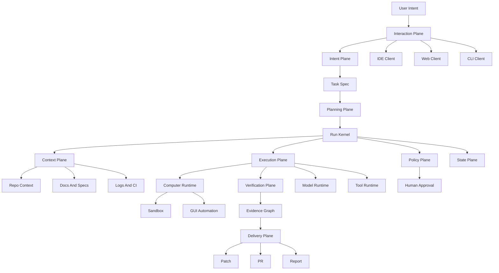

# Agentic Engineering OS 工程设计

## 1. 系统本质

这个系统不应该被定义成“多 IDE 控制器”，也不应该只是一个更大的 AI chat。它的终极形态应该更像一个面向工程任务的操作系统：

> Agentic Engineering OS：接收人的工程意图，把它转化为可调度、可审计、可恢复、可验证、可交付的任务执行系统。

这里的“操作系统”不是替代 Windows/Linux/macOS，而是像 OS 一样提供底层能力：

- 管理任务
- 管理资源
- 调度执行
- 控制权限
- 隔离环境
- 记录状态
- 处理失败
- 验证结果
- 交付产物

它真正要解决的是：

> 一个工程任务从提出、理解、执行、验证、审批、交付，到失败恢复，如何被系统化管理。

现在 IDE 里的 agentic workflow 把很多能力混在一起：

- Chat UI
- 上下文收集
- 模型规划
- 工具调用
- 文件修改
- terminal 执行
- diff 展示
- 人工确认
- 结果交付

短期看这些能力被 IDE 包住，所以我们会以为问题是“如何控制多个 IDE”。长期看，真正有价值的是中间的 workflow runtime。IDE 只是入口、展示层和部分能力提供者。

因此最终目标是：

- 任务可以从 IDE、CLI、Web、Chat、CI 进入。
- 系统能把自然语言任务变成结构化 `Run`。
- 每一步执行都有状态、事件、权限、上下文来源和输出证据。
- 失败后可以定位、重试、恢复，而不是重新开一轮 chat。
- 最后交付的是结构化 artifact，而不是一段不可追溯的回答。

一句话：把工程师每天隐式完成的工作流，显式建模成一个可执行、可观察、可恢复的系统。

## 2. 终局产品形态

终极体验不是“打开某个 IDE 再让 AI 帮忙”，而是：

```text
你表达目标
系统生成任务规格
系统规划和调度执行
系统收集上下文和证据
系统调用工具和 agent
系统验证结果
你只在关键节点审批
系统交付可追溯产物
```

例如用户说：

```text
帮我确认 Orion LSC m2b LEC regression 是否通过，并通知相关人。
```

系统应该完成：

- 找到正确 workspace、regression run、summary 和 log。
- 判断是否 all passed。
- 检查是否存在 warning、waived error、incomplete job、环境异常。
- 生成证据链。
- 生成英文汇报邮件。
- 等待用户确认。
- 发送、保存或复制交付内容。
- 保存这次任务的 run history、evidence 和 artifact。

普通 AI 助手是“你问一句，它答一句”。这个系统应该是“你交代目标，它管理完整执行周期”。

核心执行链路：

```text
Intent -> Spec -> Plan -> DAG -> Step -> ToolCall -> Observation -> Evidence -> Artifact -> Delivery
```

其中 `Spec` 和 `Evidence` 是这个系统区别于普通 agent 的关键。

## 3. 操作系统式分层

```text
Interaction Plane
IDE / CLI / Web / Slack / CI

Intent Plane
需求澄清、任务规格、成功标准、约束提取

Planning Plane
任务拆解、依赖图、执行策略、风险预估

Context Plane
代码、log、docs、issues、CI、memory、symbol graph、引用来源

Execution Plane
模型、工具、shell、browser、git、CI、workspace worker

Computer Runtime Layer
sandbox、desktop control、screen observation、GUI automation、trajectory capture

Policy Plane
权限、审批、sandbox、secret control、危险操作拦截

State Plane
event log、run state、step state、resume、replay、audit

Verification Plane
测试、lint、review、evidence check、artifact validation

Delivery Plane
patch、PR、email、ticket、report、release note

Evaluation Plane
成功率、失败原因、成本、耗时、人工介入点、改进反馈
```

## 4. 核心架构



## 5. Agentic Engineering OS 的内核能力

### 5.1 Task Kernel

管理所有工程任务的生命周期。任务不是 chat message，而是有目标、状态、步骤、证据、交付物和审批记录的系统对象。

### 5.2 Scheduler

决定任务执行顺序、并发度、资源占用和等待条件。未来多个 agent、多个 workspace、多个 regression 或 CI 任务并行时，必须有调度层。

### 5.3 Context Manager

管理代码、log、文档、issue、历史记忆、symbol graph、CI 输出。它负责把“可能相关的一切”变成“当前任务真正需要的上下文”。

### 5.4 Capability Runtime

统一调用 shell、git、IDE、browser、CI、Jira、email、CUA、sandbox 等能力。上层 workflow 不直接依赖具体工具。

### 5.5 Permission System

控制哪些操作可以自动执行，哪些需要审批，哪些必须禁止。它负责把 agent 的能力限制在安全边界内。

### 5.6 Sandbox Manager

危险任务、GUI 操作、未知脚本、批量修改、外部依赖测试应该优先在隔离环境里运行。`trycua/cua` 这类项目可以成为这一层的重要执行基座。

### 5.7 State Store

保存 run、step、tool call、approval、artifact、evidence。任务中断后可以 resume，失败后可以 replay 和 debug。

### 5.8 Evidence Graph

每个结论都必须能追溯到来源：哪个 log、哪个命令、哪个 commit、哪个测试、哪个人工审批、哪个文件片段。

### 5.9 Verifier Runtime

Agent 不能自己说完成就算完成。Verifier 负责测试、lint、review、log 检查、artifact validation 和证据一致性检查。

### 5.10 Artifact Manager

管理最终交付物：patch、PR、报告、邮件、ticket、测试结果、decision record。交付物应该独立于 chat history 长期存在。

### 5.11 Human Gate

人不应该全程盯着 agent，而是在关键节点介入：批准 patch、确认风险、选择方向、发送邮件、开 PR。

### 5.12 Learning And Evaluation Loop

记录任务成功率、失败原因、耗时、成本、人工介入点和用户修改，逐步形成个人或团队的工程偏好和工作流经验。

## 6. 五个核心内核

### 6.1 Run Kernel

Run Kernel 是系统大脑，负责管理一次任务的生命周期。

任务不是一句 prompt，而是一个 `Run`：

```typescript
type RunStatus =
  | "created"
  | "planning"
  | "waiting_context"
  | "running"
  | "waiting_approval"
  | "verifying"
  | "completed"
  | "failed";

type Run = {
  id: string;
  task: string;
  workspaceId: string;
  status: RunStatus;
  steps: Step[];
  events: RunEvent[];
  artifacts: Artifact[];
};
```

关键原则：所有事情都事件化。

- 模型生成了什么计划，记录为 event。
- 调用了什么工具，记录输入、输出、耗时、错误。
- 用户批准或拒绝了什么，记录审批事件。
- 生成了什么 diff、报告、邮件草稿，记录 artifact。

只有 event log 存在，系统才有恢复、审计、回放、debug 的基础。

### 6.2 Capability Runtime

Agent 不应该直接操作 IDE、shell、git、浏览器，而应该调用标准能力。

```typescript
type Capability = {
  name: string;
  permission: "read" | "write" | "dangerous";
  sideEffect: boolean;
  timeoutMs: number;
  inputSchema: unknown;
  outputSchema: unknown;
  execute(input: unknown, context: RunContext): Promise<unknown>;
};
```

第一批标准能力：

- `search_code`
- `read_file`
- `read_log`
- `run_command`
- `run_test`
- `get_git_status`
- `apply_patch`
- `show_diff`
- `open_file`
- `summarize_log`
- `create_email_draft`
- `request_approval`

这样 workflow 不知道底层是 Cursor、VS Code、shell、CI 还是云端 worker，它只知道自己要调用一个 capability。

### 6.3 Context Broker

很多 agentic workflow 失败，不是模型不够聪明，而是上下文错了。Context Broker 专门负责上下文选择。

它要做的事情：

- 根据任务判断需要 repo、log、docs、issue、CI 还是 terminal 输出。
- 从不同 adapter 取信息。
- 压缩成可控的 `ContextPack`。
- 保留引用来源，方便最后解释依据。
- 控制 token budget，避免无关内容污染模型。

```typescript
type ContextPack = {
  purpose: string;
  sources: {
    type: "file" | "log" | "command" | "doc" | "issue";
    uri: string;
    excerpt: string;
    relevance: number;
  }[];
};
```

专业的系统不能把“找上下文”当成 prompt 技巧，而要把它做成一层可观测、可调试的 broker。

### 6.4 Policy And Approval Engine

只要系统能执行命令、改代码、发邮件、开 PR，就必须有权限层。

每个 capability 都要声明风险等级：

- `read_file`：只读，默认允许。
- `search_code`：只读，默认允许。
- `run_test`：低风险写操作，可配置自动允许。
- `apply_patch`：写操作，需要确认。
- `delete_file`：危险操作，强制确认。
- `send_email`：外部副作用，必须人工批准。
- `git_push`：外部副作用，必须人工批准。

Control plane 和普通 agent 的区别在这里：它不只是会干活，还知道什么时候不能直接干。

### 6.5 Artifact System

最终交付物不能只是聊天文本，而应该是结构化 artifact：

- `PatchArtifact`
- `TestResultArtifact`
- `LogSummaryArtifact`
- `RegressionResultArtifact`
- `EmailDraftArtifact`
- `PRArtifact`
- `ReportArtifact`
- `DecisionRecordArtifact`

比如“Orion LSC m2b LEC regression 全部通过”这个场景，系统不应该只给一句英文邮件，而应该产出：

- `RegressionResultArtifact`：通过依据、log 来源、命令或报告来源。
- `EmailDraftArtifact`：给相关人的英文汇报邮件。
- `RunEvidenceArtifact`：这次结论引用了哪些证据。

这样交付物才可复用、可追溯、可审计。

## 7. Intent-to-Spec 是第一关键层

很多 agent 系统直接从 prompt 进入 action，这是不稳定的。专业工程系统应该先把模糊需求转成 `TaskSpec`。

```typescript
type TaskSpec = {
  goal: string;
  workspace: string;
  constraints: string[];
  allowedActions: string[];
  forbiddenActions: string[];
  successCriteria: string[];
  requiredEvidence: string[];
  approvalPoints: string[];
  expectedArtifacts: string[];
};
```

例如用户说：

```text
帮我确认 regression 是否通过，并通知相关人。
```

系统应该先形成规格：

- 目标：确认指定 regression 的完成状态和 pass/fail 结果。
- 成功标准：找到可信 summary 或 log，并确认所有 test passed。
- 必需证据：regression summary、时间戳、workspace 或 run id、失败数量。
- 禁止动作：未经批准不得发送邮件，不得删除或修改 log。
- 预期交付：结果摘要、英文邮件草稿、证据引用。
- 审批点：发送邮件前需要用户确认。

没有 `TaskSpec`，agent 很容易直接行动、跑偏、或者给出不可验证结论。

## 8. Evidence 是第二关键层

系统不能只输出“all passed”。它必须能说明：

- 结论来自哪个 log 或 summary。
- 哪个命令产生了这个结果。
- 什么时候产生的。
- 对应 workspace / git revision / regression id 是什么。
- 有没有 warning、waiver、incomplete job 被忽略。
- 是否通过 verifier 检查。

`Evidence Graph` 应该连接：

```text
Run -> Step -> ToolCall -> Observation -> Evidence -> Artifact -> Delivery
```

这样每个结论都能被复查，每个 artifact 都有来源。

## 9. 与 trycua/cua 的关系

`trycua/cua` 的定位是 open-source infrastructure for Computer-Use Agents。它提供 sandboxes、SDK、driver、benchmark，让 agent 能控制完整桌面系统，包括 macOS、Linux、Windows、Android。

它解决的是：

```text
Agent 怎么使用一台电脑
```

我们要解决的是：

```text
Agent 怎么可靠地完成一个工程工作流
```

两者不是竞争关系，而是上下层关系：

```text
CUA = Computer Runtime / Sandbox / GUI Automation / Trajectory Layer
Agentic Engineering OS = Engineering Task Kernel / Policy / State / Evidence / Verification / Delivery Layer
```

应该借鉴 `CUA` 的点：

- Sandbox-first：危险操作优先在隔离环境执行。
- Trajectory recording：agent 操作应该可回放，和 event log / evidence graph 对齐。
- Cross-OS abstraction：不要绑定某个 IDE 或 OS。
- Benchmark mindset：agentic workflow 需要评估集和成功率。
- Background operation：agent 执行不应该打断用户当前工作。

在我们的架构里，`CUA` 可以作为 `Computer Runtime Layer` 的一个 adapter：

```text
Run Kernel
  -> Capability Runtime
    -> CUA Adapter
      -> Sandbox / Desktop / GUI App / Screenshot / Mouse / Keyboard / Shell
```

也就是说，不要重做 `CUA`。应该把它作为底层 computer-use / sandbox / trajectory runtime，在它上面构建工程任务的 control plane、policy、evidence、verification 和 delivery。

## 10. 必须标准化的对象

第一批不要围绕 IDE 设计，而要围绕 workflow 设计：

- `Task`：用户想完成什么，包括目标、workspace、约束、成功标准。
- `TaskSpec`：从意图提炼出的可执行规格，包括允许动作、禁止动作、成功标准、证据要求和审批点。
- `Run`：一次任务执行实例，包括 plan、steps、状态、事件流、结果和 artifact。
- `Step`：可执行的最小动作，比如搜索代码、跑测试、改文件、请求确认。
- `RunEvent`：系统发生过什么，包括模型输出、工具调用、审批、错误、结果。
- `Capability`：系统能调用的标准能力，比如 `read_context`、`run_command`、`apply_patch`、`run_test`、`show_diff`。
- `Adapter`：把标准能力映射到真实工具，比如 IDE adapter、shell adapter、git adapter、browser adapter、CI adapter。
- `ContextPack`：给模型的一组经过筛选的上下文，而不是把整个 repo 塞进去。
- `Evidence`：支持某个结论的证据节点，包括来源、时间、命令、内容摘要和可信度。
- `Artifact`：交付物，比如 diff、log summary、PR、report、email draft。

## 11. IDE 里的功能如何迁移出来

现在 IDE 里的 agentic workflow 大概包含这些能力：读文件、搜索代码、跑 terminal、看 diagnostics、应用 patch、展示 diff、问用户确认、运行测试。

迁移方式不是“远程控制 IDE”，而是把它们变成标准能力：

- `open_file`：IDE adapter 实现，也可以由 Web UI 实现。
- `read_context`：repo index、LSP、semantic search 实现。
- `get_diagnostics`：LSP adapter 或 IDE extension 实现。
- `run_test`：shell/CI adapter 实现。
- `apply_patch`：workspace adapter 实现。
- `show_diff`：IDE/Web/Git adapter 都可以实现。
- `request_human_approval`：IDE、Web、Slack、CLI 都可以承载。

这样 IDE 不再是大脑，只是能力提供者和展示前端之一。

## 12. 分阶段实现

### Phase 1：Read-only Regression Evidence Demo

第一版不要先实现完整 `Local Workflow Daemon`，而是实现一个 read-only 证据闭环 demo：

- 输入：一个固定 regression summary/log 路径 + 用户目标。
- 流程：生成 `TaskSpec` -> 读取 log -> 提取 pass/fail/warning/incomplete -> 生成 Evidence list -> 规则验证 -> 生成英文邮件草稿 artifact。
- 输出：`run.json`、`evidence.json`、`regression_result.json`、`email_draft.md`。

建议最小组件：

- SQLite event store
- 极简 step runner
- `read_log` capability
- `extract_regression_result` capability
- `write_artifact` capability
- policy gate：禁止外部副作用，只允许读取和生成草稿
- rule verifier
- artifact writer

成功标准：不用依赖 IDE，也不用修改任何代码，就能证明“结论来自哪里、是否被验证、交付物引用了哪些证据”。

### Phase 2：Intent-to-Spec 和任务规格化

先不要让 agent 直接行动。每个自然语言任务先生成 `TaskSpec`：

- 目标
- workspace
- 约束
- 允许动作
- 禁止动作
- 成功标准
- 必需证据
- 审批点
- 预期 artifact

成功标准：同一个任务在执行前能被用户或系统审查，避免一上来就跑偏。

### Phase 3：能力接口标准化

定义统一 capability 接口：

```typescript
interface Capability<I, O> {
  name: string;
  permission: "read" | "write" | "dangerous";
  sideEffect: boolean;
  timeoutMs: number;
  inputSchema: unknown;
  outputSchema: unknown;
  execute(input: I, context: RunContext): Promise<O>;
}
```

目标 capability catalogue：

- `read_file`
- `search_code`
- `run_command`
- `get_git_status`
- `apply_patch`
- `run_test`
- `summarize_log`
- `request_approval`

MVP 只实现三个 capability：

- `read_log`
- `extract_regression_result`
- `write_artifact`

成功标准：workflow 不知道底层是 IDE、shell 还是云端 worker，只调用标准 capability；第一版先用最小 read-only 子集验证 contract 是否成立。

### Phase 4：Context Broker

把上下文收集从 prompt 里拆出来：

- repo 文件和 symbol 检索
- log 和 regression summary 检索
- docs 和 issue 检索
- terminal 和 CI 输出收集
- ContextPack 生成
- 引用来源保存

成功标准：模型拿到的是经过筛选、带来源、可解释的上下文，而不是一堆无关文件。

### Phase 5：Evidence List 和 MVP Verifier Runtime

MVP 不先实现完整图数据库或复杂 Evidence Graph，而是先实现 Evidence list：

- `LogEvidence`：来自 regression log 或 summary 的片段。
- `CommandEvidence`：来自命令输出的结果，MVP 可选。
- `HumanApprovalEvidence`：用户确认某个结论或发送动作。
- 每个 Artifact 都必须引用 evidence ids。
- 每个结论都必须经过 rule verifier 或 human verifier。

MVP verifier 只做三类检查：

- schema validation：artifact 和 evidence 字段完整。
- log rule check：能区分 `all passed`、`failed`、`incomplete`、`warning/waiver`、`unknown`。
- human approval：发送邮件或外部副作用前必须人工确认；MVP 只生成草稿，不实际发送。

成功标准：系统输出的结论能回答“你凭什么这么说”。

### Phase 6：状态、权限和恢复

加入真正的控制平面能力：

- 每个 run 都有状态机：`created`、`planning`、`waiting_context`、`running`、`waiting_approval`、`verifying`、`completed`、`failed`。
- 每个工具调用都有权限级别：只读、可写、危险操作。
- 每个 step 都有输入、输出、错误、超时和重试策略。
- 中断后可以 resume，而不是重新开始。
- 所有写操作和外部副作用都经过 approval gate。

成功标准：长任务失败后能知道卡在哪里，并能从中间恢复。

### Phase 7：Computer Runtime 和 CUA Adapter

把 GUI、桌面、VM、sandbox 这类能力作为底层执行基座，而不是系统核心：

- CUA 实际集成是 post-MVP；MVP 只定义 `computer.*` / `sandbox.*` / `trajectory.*` adapter contract。
- 研究 `CUA Sandbox`、`Cua Driver`、`CuaBot` 的能力边界。
- 抽象 `computer.screenshot`、`computer.click`、`computer.type`、`computer.run_shell`、`computer.record_trajectory`。
- 把 trajectory 归入 event log / evidence graph。
- 用 sandbox 隔离不可信操作。

成功标准：先明确 CUA 输出的是 observation / trajectory；是否可信、是否满足工程任务目标，由 OS 的 Evidence/Verifier 层判断。实际 GUI 操作不进入第一版。

### Phase 8：IDE Adapter

再把 IDE 接进来，而不是一开始绑定 IDE：

- IDE 注册自己当前 workspace。
- 暴露打开文件、当前文件、diagnostics、terminal、diff view 等能力。
- 控制平面可以把某个 run 的结果推回 IDE 展示。
- 用户可以在 IDE 里批准某一步，比如应用 patch 或运行危险命令。

成功标准：同一个 workflow 可以从 CLI 启动，在 IDE 里查看和批准，在 Web 里看历史。

### Phase 9：多 agent 和交付闭环

最后做多个 agent 的协作：

- Planner agent：拆任务和决定策略。
- Context agent：找上下文。
- Executor agent：调用工具和修改代码。
- Reviewer agent：检查 diff、测试和风险。
- Reporter agent：生成最终交付内容。

成功标准：系统不只是“回答问题”，而是能把一个开发任务推进到可交付状态。

## 13. 第一版应该证明什么

第一版只需要证明一个核心闭环：

```text
输入任务 -> 生成 TaskSpec -> 收集上下文 -> 生成计划 -> 调用工具 -> 观察结果 -> 建立证据 -> 验证 -> 交付 artifact
```

建议第一个 demo 任务选工程里真实高频场景：

- 分析 regression log 并总结失败原因。
- 找某个模块的相关代码和 owner 信息。
- 跑一个指定测试并根据结果给出下一步。
- 根据测试结果生成一封清晰的英文状态邮件。

这类任务足够真实，但不需要一开始解决复杂代码修改和 PR 自动化。

推荐第一个 demo：

```text
检查 m2b_lec_regr 是否通过，并生成英文汇报邮件。
```

期望流程：

```text
1. 创建 Run
2. 生成 regression 场景 TaskSpec
3. Planner 生成 steps
4. Capability Runtime 调 read_log / extract_regression_result / write_artifact
5. Evidence Builder 生成 Evidence list
6. Verifier 确认 all passed 是否有足够证据
7. Artifact System 生成 RegressionResultArtifact 和 EmailDraftArtifact
8. Human Approval 只确认草稿，不实际发送
```

这个 demo 能证明系统不是聊天壳，而是一个可追踪的工程 workflow。

### 13.1 MVP Verification Contract

MVP 名称：

```text
Read-only Regression Evidence Demo
```

输入：

- 一个固定 regression summary/log 路径。
- 一个用户目标，例如“确认 m2b_lec_regr 是否通过，并生成英文汇报邮件”。
- 可选 workspace/run metadata，例如日期、run id、owner。

最小输出：

- `run.json`：记录 task、TaskSpec、steps、events、状态。
- `evidence.json`：记录 log 片段、来源路径、时间戳、提取结论、可信度。
- `regression_result.json`：结构化结果，包括 passed/failed/incomplete/warning/unknown。
- `email_draft.md`：英文邮件草稿，必须引用 `regression_result.json` 的结论，而不是重新自由生成。

最小 capability：

- `read_log`
- `extract_regression_result`
- `write_artifact`

最小 verifier：

- 能指出结论来自哪些 log 片段。
- 能区分 `all passed`、`failed`、`incomplete`、`warning/waiver`、`unknown`。
- 证据不足时必须输出 `unknown` 或 `needs_human_check`，不能编造结论。
- artifact 必须引用 evidence ids。

硬性验收：

- 如果 demo 不能比普通 chat 更可复查、更少幻觉、更容易复用，就暂停扩展 OS 层。
- MVP 不执行写代码、发邮件、开 PR、控制 IDE、控制桌面或运行危险命令。

## 14. 第一版不要做什么

- 不要先做多 IDE 控制。
- 不要先做复杂 UI。
- 不要先做多个 agent 互相聊天。
- 不要先自动改大量代码。
- 不要先追求通用平台。
- 不要实际集成 CUA、Browser-use、E2B、Modal、Dagger、Temporal 或 LangGraph。
- 不要实现完整 Evidence Graph，先做 Evidence list。
- 不要实现完整 Capability Runtime，先做三个 read-only capability。
- 不要发送邮件，只生成邮件草稿 artifact。

第一版真正要证明的是：一个工程任务可以被结构化执行，而不是被一次 chat 临时完成。

## 15. 关键原则

- 先抽象 workflow，不先抽象 IDE。
- 先定义 Intent-to-Spec，不让 agent 从 prompt 直接行动。
- 先做状态和工具调用闭环，不先做漂亮 UI。
- 先支持只读和低风险操作，再支持自动修改代码。
- 所有写操作都要有 human approval。
- 所有输出都要可追溯到上下文、命令、log 或 diff。
- IDE、CLI、Web、CI 都只是同一个控制平面的不同入口。
- CUA 这类工具是底层 computer runtime，不是工程任务 OS 本身。
- 系统的护城河不是“调用模型”，而是任务状态可追踪、工具调用可审计、上下文来源可引用、失败后可恢复、结果可验证、交付物可复用。

## 16. Cursor 内的持续研究机制

这份计划需要被当成一个持续演进的研究对象，而不是一次性文档。Cursor 中的执行方式如下：

```text
读取主计划 -> 聚焦一个研究主题 -> 多 agent 并行评审 -> 汇总分歧 -> 更新主计划 -> 生成下一轮问题
```

### 16.1 Source Of Truth

主计划文件是唯一事实源：

```text
.cursor/plans/agentic-control-plane.plan.md
```

所有研究结论、删减建议、Build vs Integrate 决策、MVP 范围和 open questions 都应该回写到这份文件，而不是散落在临时 chat 里。

### 16.2 Cursor Rule

已在当前 Cursor 工作区建立持久规则：

```text
.cursor/rules/agentic-engineering-os-research.mdc
```

这条规则要求后续研究始终围绕 Agentic Engineering OS，而不是退回到多 IDE 控制器或泛泛的 agent 平台。

### 16.3 Prompt Library

已建立可复用 prompt 库：

```text
.cursor/prompts/agentic-engineering-os/research-loop-prompts.md
```

里面包含：

- 完整 Research Sprint prompt。
- Open Source Coverage Mapping prompt。
- CUA Adapter 深挖 prompt。
- Evidence Graph 和 Verifier Runtime prompt。
- Feasibility Critic Review prompt。
- 每周计划维护 prompt。

### 16.4 Agent Review Roster

后续每轮研究默认启用五类评审视角：

- Open Source Mapping Agent：研究现有项目覆盖了哪些层，避免重复造轮子。
- Architecture Agent：审查系统边界、模块依赖、状态流和 MVP 切分。
- CUA Adapter Agent：判断 trycua/cua 能接入哪些底层 capability。
- Feasibility Critic Agent：找出过大、过虚、不可验证和不该进入第一版的内容。
- Research Strategy Agent：从论文、产品原型、demo 和长期差异化角度提出路线。

主 agent 的职责不是简单拼接意见，而是做冲突归并和取舍，最后形成明确的计划修改。

### 16.5 Plan Update Protocol

每次研究结束后必须更新这些区域：

- 正式章节：把已经确定的结论写入对应设计章节。
- Research Sprint Log：记录本轮研究主题、证据、结论和下一轮问题。
- Decision Log：记录关键取舍，尤其是 Build vs Integrate。
- Open Questions：保留还没有证据支持的问题。
- Parking Lot：放入暂时不做但未来可能有价值的方向。

### 16.6 Quality Gate

每轮研究必须通过这些检查：

- 是否让计划更收敛，而不是只增加概念。
- 是否明确了至少一个可验证实验。
- 是否指出哪些东西第一版不做。
- 是否给出证据来源或开源项目对比。
- 是否能推进到一个更清楚的 MVP。

## 17. Research Backlog

推荐按以下顺序推进：

1. Open Source Coverage Mapping：已完成，结论是自研 OS 语义，集成底层 runtime 和 coding agent。
2. MVP Verification Contract：已启动，把第一版压缩成 read-only regression evidence demo。
3. Intent-to-Spec MVP：定义 regression 场景的 `TaskSpec` schema、成功标准、证据要求和审批点。
4. Evidence List + Verifier Runtime：定义 `LogEvidence`、`RegressionResultArtifact`、`EmailDraftArtifact` 和 rule verifier。
5. Local Read-only Runner：设计 SQLite event store、极简 step runner、`read_log`、`extract_regression_result`、`write_artifact`。
6. Feasibility Critic Review：在 MVP schema 明确后，再用反方视角砍掉不必要字段和流程。
7. CUA Adapter Contract：post-MVP，只定义 `computer.*` / `trajectory.*` schema，不实际集成。

每个 sprint 的交付物不是一段总结，而是对主计划的具体修改。

## 18. Open Source Coverage Mapping Sprint

本轮结论：现有开源和商业工具已经覆盖了很多底层能力，但没有一个项目完整覆盖 Agentic Engineering OS 的目标。不要重复实现 coding agent、browser automation、desktop control、sandbox、CI pipeline、通用 workflow engine。我们的差异化应集中在工程任务 OS 语义：`Intent-to-Spec`、`Run/Event`、`Evidence Graph`、`Verifier`、`Policy/Approval`、`Artifact` 和跨工具 adapter contract。

### 18.1 Coverage Matrix

成熟度标记：

- 高：已有稳定产品或广泛生产使用，可直接集成或强参考。
- 中：能力清楚，但需要二次封装、验证或只适合特定场景。
- 低：概念有价值，但不应作为 MVP 依赖。

#### LangGraph

- 覆盖层：Planning Plane、State Plane、部分 Human Gate、部分 Agent Orchestration。
- 成熟度：高。
- 可借鉴点：graph-based workflow、checkpoint、durable state、human-in-the-loop、streaming events、多 agent state 管理。
- 缺口：不理解工程任务 artifact、evidence、policy、workspace governance；不是工程 OS，本身不提供 coding execution substrate。
- 结论：可作为 planner / workflow prototyping 框架参考，MVP 不一定直接依赖。

#### AutoGen

- 覆盖层：Multi-agent communication、Agent orchestration、部分 observability。
- 成熟度：中。当前更适合作为多 agent 架构参考，新项目需关注 Microsoft 后续 Agent Framework 路线。
- 可借鉴点：异步消息、agent group chat、role-based collaboration、distributed agent pattern。
- 缺口：容易变成 agents chatting；缺少工程任务的 spec、evidence、artifact、policy-first 语义。
- 结论：参考多 agent 通信模式，不作为核心依赖。

#### CrewAI

- 覆盖层：Planning Plane、multi-agent team、role/task workflow、部分 memory。
- 成熟度：中到高。
- 可借鉴点：Crew/Flow 分层、role-based agents、任务分派、agentic RAG 和工具生态。
- 缺口：偏业务/任务自动化框架，不是工程执行 OS；缺少强 event sourcing、evidence graph、artifact governance。
- 结论：适合研究 agent roles，但 MVP 不需要引入。

#### OpenHands

- 覆盖层：Coding agent、Execution Plane、sandboxed workspace、CLI/Web UI、GitHub/CI 集成、部分 cloud agent。
- 成熟度：高。
- 可借鉴点：软件工程 agent SDK、sandboxed execution、workspace 操作、agent UI、issue/PR 自动化。
- 缺口：更像完整 coding agent 平台，不是跨工具工程任务 OS；其核心目标是让 agent 写代码，不是统一管理 evidence、policy 和 artifact lifecycle。
- 结论：不要重做 OpenHands 的 coding agent 能力；可作为 executor adapter 或对标项目。

#### SWE-agent / mini-swe-agent

- 覆盖层：coding issue solving、benchmark-driven agent loop、repo execution。
- 成熟度：中到高，mini-swe-agent 更适合作为简洁参考。
- 可借鉴点：极简 agent loop、SWE-bench 评估思维、repo problem solving 流程。
- 缺口：主要针对代码修复任务，不覆盖通用工程任务的 policy、human approval、evidence graph、delivery artifacts。
- 结论：借鉴评估和最小 agent loop，不作为 OS 内核。

#### Aider

- 覆盖层：CLI coding agent、git-based editing、diff/commit workflow、lint/test hooks。
- 成熟度：高。
- 可借鉴点：editor-agnostic、git-first、自动 diff、自动提交、代码库 map、CLI UX。
- 缺口：主要是 pair programming 工具，不管理长期任务状态、evidence、approval policy、跨系统 artifact。
- 结论：不要重做 terminal coding assistant；可借鉴 git/diff UX 和 repo map。

#### Claude Code

- 覆盖层：terminal/IDE coding agent、file/search/shell/git/web tools、MCP、plan review、diff、history、多入口。
- 成熟度：高，但不是开源 OS 内核。
- 可借鉴点：agentic loop、MCP tool ecosystem、terminal-first coding UX、plan review、human approval、IDE/terminal 多入口。
- 缺口：产品内闭环强，但不是可自定义的工程 OS；Evidence Graph、Artifact Registry、跨 agent task kernel 不是其开放核心。
- 结论：作为交互端和执行 agent 参考，不作为自研底层。

#### Cursor

- 覆盖层：IDE agent、context collection、code edit、terminal、diff、background agents、MCP、worktree isolation、multi-agent UX。
- 成熟度：高。
- 可借鉴点：IDE-integrated agent UX、background agents、worktree isolation、plan/build 分离、MCP 连接外部工具。
- 缺口：核心仍绑定 IDE/agent 产品，不是外部可控的工程任务 OS；跨工具 evidence、artifact、policy 模型需要我们定义。
- 结论：Cursor 是重要 client / execution surface，但不是 OS 本体。

#### Browser-use

- 覆盖层：Browser automation、web task execution、Playwright/CDP、browser agent。
- 成熟度：高。
- 可借鉴点：DOM/browser 操作抽象、browser task loop、web automation capabilities。
- 缺口：只覆盖 browser runtime，不覆盖工程任务 spec、state、policy、evidence、artifact。
- 结论：作为 `browser.*` capability adapter，不自研浏览器自动化内核。

#### trycua/cua

- 覆盖层：Computer Runtime Layer、sandbox、desktop control、screenshot/mouse/keyboard、trajectory、benchmark、VM。
- 成熟度：中到高，发展很快。
- 可借鉴点：sandbox-first、cross-OS computer-use API、background desktop control、trajectory recording、benchmark mindset。
- 缺口：解决“agent 如何使用电脑”，不解决“agent 如何可靠完成工程工作流”。
- 结论：作为 `computer.*` / sandbox / trajectory adapter 的首选研究对象，不重做其底层能力。

#### E2B

- 覆盖层：Sandbox Manager、secure code execution、cloud code interpreter、agent runtime。
- 成熟度：高。
- 可借鉴点：安全隔离、快速 sandbox、代码解释器、SDK、self-hosting。
- 缺口：偏代码执行环境，不管理工程任务 spec、evidence、policy、delivery artifacts。
- 结论：作为 `sandbox.run_code` / `sandbox.run_command` adapter 候选。

#### Devbox

- 覆盖层：reproducible dev environment、dependency management、workspace environment。
- 成熟度：高。
- 可借鉴点：Nix-backed reproducible shell、`devbox.json`、跨机器一致环境。
- 缺口：不是 agent runtime，不做任务执行、state、evidence、approval。
- 结论：作为 workspace environment reproducibility 层，避免自己做包管理。

#### Modal

- 覆盖层：cloud execution、serverless compute、sandbox、agent code execution、GPU/scale。
- 成熟度：高，但平台依赖较强。
- 可借鉴点：快速 sandbox、弹性并发、snapshot/resume、network controls、remote compute。
- 缺口：不是开源工程 OS；policy/evidence/artifact 需要上层定义。
- 结论：未来可作为 cloud worker / sandbox provider，MVP 不依赖。

#### Replit

- 覆盖层：cloud IDE、agent app builder、deployment、self-testing、project editor。
- 成熟度：高，但主要是商业平台。
- 可借鉴点：从 natural language 到 app 的产品体验、plan mode、preview/deploy 一体化、自测试。
- 缺口：不是开源可嵌入内核；偏应用构建平台，不是通用工程 workflow OS。
- 结论：研究产品体验，不作为技术依赖。

#### Dagger

- 覆盖层：CI/CD pipeline、containerized workflow、artifact build/test/ship、observability、local/CI/cloud 一致执行。
- 成熟度：高。
- 可借鉴点：pipeline-as-code、container sandbox、cache、OpenTelemetry、local-first CI。
- 缺口：不做 agent planning、intent/spec、evidence graph、human approval。
- 结论：作为 `ci.run_pipeline` / `build.test.ship` adapter，避免自研 CI pipeline。

#### Temporal

- 覆盖层：durable workflow、scheduler、state/retry、event history、long-running execution、monitoring UI。
- 成熟度：高。
- 可借鉴点：durable execution、workflow-as-code、activity retry、event history、resume/replay。
- 缺口：不是 agent framework，也不理解 engineering artifact/evidence/policy；引入成本对 MVP 可能偏高。
- 结论：长期可作为 State Plane / Scheduler backend；MVP 先用简单 SQLite event store 验证 OS 语义。

### 18.2 Build vs Integrate

#### 应该自研的层

- `Intent-to-Spec Engine`：这是差异化核心。现有工具大多从 prompt 直接进入 agent loop，缺少工程规格、成功标准、证据要求和审批点。
- `Run Kernel`：需要定义我们自己的 `Task`、`TaskSpec`、`Run`、`Step`、`RunEvent`、`Observation`、`Evidence`、`Artifact` 语义。
- `Evidence Graph`：现有工具有 logs、trajectory、trace，但很少把工程结论、证据、artifact 绑定成一等对象。
- `Policy/Approval Engine`：需要面向工程动作的权限等级、human gate、危险操作拦截和外部副作用控制。
- `Artifact Manager`：需要把 patch、PR、email、report、test evidence、decision record 作为长期交付物管理。
- `Capability Contract`：需要统一描述 `read_file`、`run_command`、`summarize_log`、`request_approval`、`computer.click`、`browser.open` 等能力的输入输出、权限和证据行为。
- `MVP Verifier Runtime`：第一版至少要有 log check、schema validation、command result check 和 human approval verifier。

#### 应该集成或借鉴的层

- Agent orchestration：参考 LangGraph，必要时集成；MVP 可先自研极简 DAG runner。
- Durable workflow backend：长期考虑 Temporal；MVP 先 SQLite event log。
- Coding agent：集成或调用 Cursor、Claude Code、OpenHands、Aider，不重做。
- Browser runtime：集成 Browser-use 或 Playwright adapter，不重做。
- Computer runtime：研究并集成 trycua/cua，不重做桌面控制和 VM。
- Code sandbox：集成 E2B、Modal 或本地 Docker，不自研 sandbox 基础设施。
- Reproducible environment：集成 Devbox/Nix/devcontainer，不自研环境管理。
- CI/CD pipeline：集成 Dagger 或现有 CI，不自研 pipeline engine。
- Cloud app builder：参考 Replit 体验，不作为 MVP 依赖。

### 18.3 Differentiation

我们的系统真正不同的地方不是“也能写代码”，而是：

- Spec-first：先把意图变成任务规格，再允许 agent 行动。
- Evidence-first：每个结论都要能回答“凭什么这么说”。
- Artifact-first：交付物独立于 chat history，能复用、审计、转交。
- Policy-first：工具调用不是自由执行，而是受权限、审批、sandbox 和外部副作用控制。
- Adapter-neutral：IDE、CLI、Web、CI、CUA、Browser-use、OpenHands、Cursor 都只是 adapter 或 client。
- Engineering OS semantics：系统管理的是工程任务生命周期，而不是某个 agent 对话。

### 18.4 MVP Implication

第一版应该避开这些已有项目已经解决的问题：

- 不做通用 coding agent：Cursor、Claude Code、OpenHands、Aider、SWE-agent 已经覆盖。
- 不做多 agent 聊天框架：LangGraph、AutoGen、CrewAI 已经覆盖。
- 不做浏览器自动化引擎：Browser-use / Playwright 已经覆盖。
- 不做桌面控制和 VM runtime：trycua/cua 已经覆盖。
- 不做安全代码 sandbox：E2B、Modal、本地 Docker 已经覆盖。
- 不做可复现开发环境：Devbox/Nix/devcontainer 已经覆盖。
- 不做 CI/CD pipeline 引擎：Dagger、现有 CI 已经覆盖。
- 不做商业云 IDE/app builder：Replit 已经覆盖。

第一版应该做一个薄但有差异化的 OS kernel：

```text
TaskSpec generator
SQLite event store
Run/Step/ToolCall/Observation/Evidence/Artifact schema
Minimal capability registry
read_log / extract_regression_result / write_artifact adapters
Policy gate
Rule verifier
Regression log -> evidence -> email artifact demo
```

### 18.5 Evidence Log

- LangGraph：公开文档和项目介绍强调 stateful agents、durable execution、checkpoint、human-in-the-loop 和 graph execution。
- AutoGen：公开资料显示其核心是多 agent framework、async messaging、AgentChat、observability；但工程 artifact/evidence 不是核心抽象。
- CrewAI：公开文档强调 Crews、Flows、role-based agents、multi-agent collaboration。
- OpenHands：公开资料显示其覆盖 coding agent platform、sandboxed execution、CLI/GUI/cloud、GitHub/CI/Slack/Jira 集成。
- SWE-agent / mini-swe-agent：公开资料显示其主要面向 SWE-bench 和 GitHub issue/code fixing agent loop。
- Aider：公开资料显示其是 terminal pair programming tool，强 git integration、repo map、lint/test。
- Claude Code：公开文档显示其覆盖 terminal/IDE coding agent、file/search/shell/git/web tools、MCP、plan review 和 diff。
- Cursor：公开资料显示其覆盖 IDE agent、background agents、worktree isolation、MCP、多 agent UX。
- Browser-use：公开资料显示其定位是让 AI agent 操作网站，基于 browser automation。
- trycua/cua：README 显示其定位是 computer-use agents 的 sandboxes、SDKs、benchmarks、desktop/VM control。
- E2B：公开资料显示其提供安全云 sandbox 和 code interpreter。
- Devbox：公开资料显示其提供 Nix-backed reproducible dev environments。
- Modal：公开资料显示其提供 serverless compute、sandbox、agent code execution 和 cloud worker。
- Replit：公开资料显示其是 cloud IDE + AI agent + deploy 平台。
- Dagger：公开资料显示其是 programmable CI/CD engine，覆盖 build/test/ship pipeline。
- Temporal：公开资料显示其是 durable execution workflow engine，覆盖 event history、retry、resume 和 long-running workflows。

### 18.6 下一轮问题

- 如果 MVP 不引入 LangGraph/Temporal，极简 DAG runner 和 SQLite event store 的 schema 应该怎么设计？
- `TaskSpec` 是否应该先由 LLM 生成，再由规则 verifier 检查，还是直接用表单/模板约束？
- Evidence Graph 的最小节点类型是否只需要 `CommandEvidence`、`FileEvidence`、`LogEvidence`、`HumanApprovalEvidence`？
- Regression demo 是否应该完全避开代码修改，只聚焦 read-only evidence 和 email artifact？
- CUA/E2B/Browser-use 是否都推迟到第二阶段，只先设计 adapter contract？

### 18.7 Prompt 2 Completion Checklist

本节用于确认 `Prompt 2: Open Source Coverage Mapping Sprint` 已经落到主计划中，避免后续重复执行同一轮研究。

- Coverage Matrix：已在 `18.1 Coverage Matrix` 中覆盖 LangGraph、AutoGen、CrewAI、OpenHands、SWE-agent、Aider、Claude Code、Cursor、Browser-use、trycua/cua、E2B、Devbox、Modal、Replit、Dagger、Temporal。
- Build vs Integrate：已在 `18.2 Build vs Integrate` 中明确自研层和集成层。
- Differentiation：已在 `18.3 Differentiation` 中明确差异化来自工程任务 OS 语义，而不是再做一个 coding agent。
- MVP Implication：已在 `18.4 MVP Implication` 中把第一版收敛到 read-only OS kernel demo。
- Research Sprint Log：已在 `21. Research Sprint Log` 中记录本轮目标、核心结论、Build vs Integrate 决策和下一轮建议。

## 19. Decision Log

- 2026-05-11：把研究方向固定为 Agentic Engineering OS，而不是多 IDE 控制器。
- 2026-05-11：把 trycua/cua 定位为 Computer Runtime / Sandbox / GUI Automation / Trajectory Layer 的 adapter，而不是 OS 本体。
- 2026-05-11：在 Cursor 中建立持久规则和 prompt library，用多 agent review 推动计划持续优化。
- 2026-05-11：第一轮正式研究应优先做 Open Source Coverage Mapping，因为它决定哪些层应该自研，哪些层应该集成。
- 2026-05-11：Open Source Coverage Mapping 后决定第一版不重做 coding agent、browser automation、desktop runtime、sandbox、CI pipeline 或通用 durable workflow；第一版自研重点收敛到 TaskSpec、Run/Event、Evidence、Policy、Artifact 和最小 Verifier。
- 2026-05-11：Temporal/LangGraph 暂定为长期可集成后端或参考实现，MVP 先用 SQLite event store 和极简 DAG runner 验证 OS 语义。
- 2026-05-11：CUA、Browser-use、E2B、Devbox、Dagger 均定位为 adapter/provider，不进入第一版核心内核。
- 2026-05-11：Plan Optimizer 评审后决定本轮最低分维度是 Evidence Graph / Verifier Runtime 设计成熟度和 MVP 可执行性。
- 2026-05-11：MVP 收敛为 `Read-only Regression Evidence Demo`，只做 regression log -> TaskSpec -> Evidence list -> rule verifier -> email draft artifact。
- 2026-05-11：第一版不实际集成 CUA、Browser-use、E2B、Modal、Dagger、Temporal、LangGraph；只预留 adapter contract。
- 2026-05-11：第一版不实现完整 Evidence Graph，先实现 Evidence list；不实现完整 Capability Runtime，先实现 `read_log`、`extract_regression_result`、`write_artifact`。

## 20. Open Questions

- `TaskSpec` 应该先由 LLM 生成再由规则校验，还是先用模板/表单约束生成？
- `LogEvidence` 的最小字段应该包括哪些：source path、line range、excerpt、timestamp、classification、confidence 是否足够？
- `extract_regression_result` 应该先用规则解析，还是允许 LLM 提取后再由规则校验？
- `unknown / needs_human_check` 的触发条件应该如何定义，才能避免虚假 `all passed`？
- `email_draft.md` 如何强制引用 `regression_result.json`，避免邮件生成阶段重新幻觉？
- 本地 MVP 应该用 CLI 启动，还是先用 Cursor 手动驱动一轮流程来验证 schema？

## 21. Research Sprint Log

### 2026-05-11: Cursor 持续研究机制建立

本轮目标：让 Cursor 可以围绕 Agentic Engineering OS 方向持续深挖、评审和优化计划。

完成内容：

- 建立工作区规则 `agentic-engineering-os-research.mdc`。
- 建立 prompt 库 `research-loop-prompts.md`。
- 在主计划中加入持续研究机制、agent review roster、plan update protocol 和 research backlog。

下一轮建议：

```text
执行 Open Source Coverage Mapping Sprint，先确定现有开源项目覆盖层和我们真正需要自研的层。
```

### 2026-05-11: Open Source Coverage Mapping Sprint

本轮目标：比较 LangGraph、AutoGen、CrewAI、OpenHands、SWE-agent、Aider、Claude Code、Cursor、Browser-use、trycua/cua、E2B、Devbox、Modal、Replit、Dagger、Temporal 分别覆盖 Agentic Engineering OS 的哪些层。

核心结论：

- Orchestration / durable workflow 已有 LangGraph、Temporal、AutoGen、CrewAI，MVP 不应先重做完整框架。
- Coding agent 已有 Cursor、Claude Code、OpenHands、Aider、SWE-agent，MVP 不应先做“另一个写代码 agent”。
- Execution substrate 已有 CUA、Browser-use、E2B、Modal、Devbox、Dagger，MVP 不应先做底层 runtime。
- 真正缺口是工程任务 OS 语义：`TaskSpec`、`Run/Event`、`Evidence Graph`、`Policy/Approval`、`Artifact Manager`、`Verifier Runtime`。

Build vs Integrate 决策：

- Build：Intent-to-Spec、Run Kernel、Evidence Graph、Policy/Approval、Artifact Manager、Capability Contract、MVP Verifier。
- Integrate later：LangGraph/Temporal、Cursor/Claude Code/OpenHands/Aider、Browser-use、CUA、E2B/Modal、Devbox、Dagger。

下一轮建议：

```text
执行 Feasibility Critic Review，把 MVP 压缩成一个 read-only engineering OS kernel demo：
regression log -> TaskSpec -> evidence -> verifier -> email artifact。
```

### 2026-05-11: Plan Optimizer Sprint

本轮目标：按 Plan Optimizer 流程评估主计划质量，自动选择最低分方向，并做最小范围修改。

当前质量评分：

- Vision 清晰度：5/5
- MVP 可执行性：3/5
- Open Source Mapping 完整度：4/5
- Build vs Integrate 清晰度：4/5
- Evidence Graph 设计成熟度：2/5
- Verifier Runtime 设计成熟度：2/5
- CUA Adapter 边界清晰度：4/5
- 风险控制和范围收敛度：3/5

最低分维度：

- Evidence Graph 设计成熟度
- Verifier Runtime 设计成熟度

自动选择的 sprint 类型：

```text
Evidence Graph / Verifier Runtime Sprint
```

本轮最重要结论：

- 计划已经有足够愿景和开源覆盖，不需要继续扩写平台概念。
- 当前最大风险是 MVP 仍偏大，Evidence/Verifier 仍偏概念化。
- 第一版必须收敛为 read-only demo，而不是 Local Workflow Daemon 全量雏形。
- Evidence Graph 第一版不做 graph，只做 Evidence list。
- Verifier Runtime 第一版只做 schema validation、log rule check 和 human approval。

本轮新增：

- `13.1 MVP Verification Contract`
- Phase 1 改为 `Read-only Regression Evidence Demo`
- Phase 5 改为 `Evidence List 和 MVP Verifier Runtime`
- Phase 7 明确 CUA actual integration 是 post-MVP

本轮删除或收敛：

- 把完整 Local Workflow Daemon 从 Phase 1 移出，改成 read-only regression demo。
- 把完整 Evidence Graph 收敛为 Evidence list。
- 把完整 Capability Runtime 收敛为 `read_log`、`extract_regression_result`、`write_artifact`。
- 把 CUA、Browser-use、E2B、Modal、Dagger、Temporal、LangGraph 从 MVP 依赖降级为后续 adapter/provider。

下一轮建议：

```text
执行 Intent-to-Spec MVP Sprint：
只为 regression log 场景定义 TaskSpec schema、字段约束、成功标准、证据要求、unknown/needs_human_check 触发条件。
```

## 22. Parking Lot

以下内容仍然重要，但不进入第一版 MVP：

- 多 IDE 控制和 IDE adapter。
- Web dashboard、Slack/CI 多入口。
- 多 agent 协作框架。
- CUA 实际集成、GUI 自动化、desktop control、trajectory replay。
- E2B/Modal/Docker sandbox 深集成。
- Temporal/LangGraph 作为核心依赖。
- Browser-use 浏览器自动化。
- Dagger/CI pipeline 深集成。
- 自动代码修改、PR 创建、git push、真实邮件发送。
- 完整 Evidence Graph、完整 Context Broker、完整 Learning/Evaluation loop。